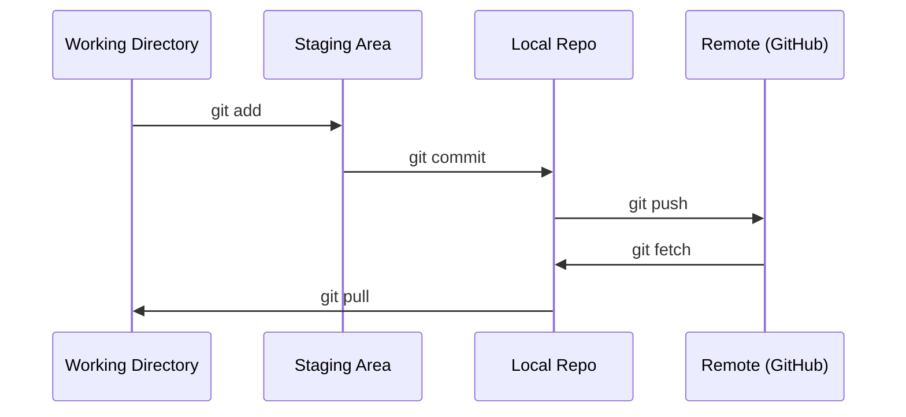

# Git 与协作

> 版本控制不是可选项。你在这里构建的每个实验、每个模型、每节课都要被追踪。

**类型：** Learn
**语言：** --
**先修：** Phase 0, Lesson 01
**时间：** ~30 分钟

## 学习目标

- 配置 git 身份，并使用 add、commit、push 的日常工作流
- 为隔离实验创建和合并 branches，避免破坏 main
- 编写 `.gitignore`，排除 model checkpoints 和大型二进制文件
- 使用 `git log` 浏览 commit history，理解项目演化

## 问题

你即将在 20 个 phase 中编写数百个代码文件。没有版本控制，你会丢失工作，破坏无法撤销的东西，也无法和其他人协作。

Git 是工具。GitHub 是代码存放的位置。本课只讲这门课程需要的内容，不多讲。

## 概念



记住三件事：
1. 经常保存（`git commit`）
2. 推送到 remote（`git push`）
3. 为实验创建 branch（`git checkout -b experiment`）

## 构建它

### 第 1 步：配置 git

```bash
git config --global user.name "Your Name"
git config --global user.email "you@example.com"
```

### 第 2 步：日常工作流

```bash
git status
git add file.py
git commit -m "Add perceptron implementation"
git push origin main
```

### 第 3 步：为实验创建分支

```bash
git checkout -b experiment/new-optimizer

# ... make changes, commit ...

git checkout main
git merge experiment/new-optimizer
```

### 第 4 步：使用这门课程的 repo

```bash
git clone https://github.com/rohitg00/ai-engineering-from-scratch.git
cd ai-engineering-from-scratch

git checkout -b my-progress
# work through lessons, commit your code
git push origin my-progress
```

## 使用它

对这门课程来说，你只需要这些命令：

| 命令 | 使用时机 |
|------|----------|
| `git clone` | 获取课程 repo |
| `git add` + `git commit` | 保存你的工作 |
| `git push` | 备份到 GitHub |
| `git checkout -b` | 尝试东西而不破坏 main |
| `git log --oneline` | 查看你做过什么 |

就这些。你不需要为这门课程掌握 rebase、cherry-pick 或 submodules。

## 练习

1. Clone 这个 repo，创建名为 `my-progress` 的 branch，创建一个文件，commit 它，然后 push
2. 创建一个 `.gitignore`，排除 model checkpoint 文件（`.pt`、`.pth`、`.safetensors`）
3. 使用 `git log --oneline` 查看这个 repo 的 commit history，阅读 lessons 是如何被添加的

## 关键术语

| 术语 | 人们常说 | 实际含义 |
|------|----------|----------|
| Commit | “保存” | 某个时间点上整个项目的快照 |
| Branch | “一个副本” | 指向某个 commit 的指针，会随着你的工作向前移动 |
| Merge | “合并代码” | 把一个 branch 中的改动应用到另一个 branch |
| Remote | “云端” | 托管在其他地方的 repo 副本（GitHub、GitLab） |
