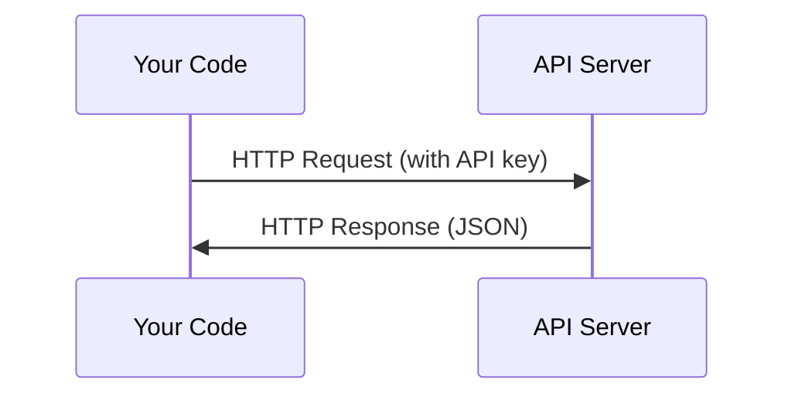

# APIs 与 Keys

> 每个 AI API 的工作方式都一样：发送请求，得到响应。细节会变，模式不变。

**类型：** Build
**语言：** Python, TypeScript
**先修：** Phase 0, Lesson 01
**时间：** ~30 分钟

## 学习目标

- 使用环境变量和 `.env` 文件安全存储 API keys
- 使用 Anthropic Python SDK 和 raw HTTP 各完成一次 LLM API 调用
- 比较 SDK 和 raw HTTP 的 request/response 格式，用于调试
- 识别并处理常见 API errors，包括 authentication 和 rate limits

## 问题

从 Phase 11 开始，你会调用 LLM APIs（Anthropic、OpenAI、Google）。在 Phase 13-16 中，你会构建在循环中使用这些 APIs 的 agents。你需要知道 API keys 如何工作、如何安全保存它们，以及如何完成第一次 API 调用。

## 概念



每次 API 调用都有：
1. endpoint（URL）
2. API key（authentication）
3. request body（你想要什么）
4. response body（你拿到什么）

## 构建它

### 第 1 步：安全存储 API keys

永远不要把 API keys 写进代码。使用环境变量。

```bash
export ANTHROPIC_API_KEY="sk-ant-..."
export OPENAI_API_KEY="sk-..."
```

或者使用 `.env` 文件，并把它加入 `.gitignore`：

```text
ANTHROPIC_API_KEY=sk-ant-...
OPENAI_API_KEY=sk-...
```

### 第 2 步：第一次 API 调用（Python）

```python
import anthropic

client = anthropic.Anthropic()

response = client.messages.create(
    model="claude-sonnet-4-20250514",
    max_tokens=256,
    messages=[{"role": "user", "content": "What is a neural network in one sentence?"}]
)

print(response.content[0].text)
```

### 第 3 步：第一次 API 调用（TypeScript）

```typescript
import Anthropic from "@anthropic-ai/sdk";

const client = new Anthropic();

const response = await client.messages.create({
  model: "claude-sonnet-4-20250514",
  max_tokens: 256,
  messages: [{ role: "user", content: "What is a neural network in one sentence?" }],
});

console.log(response.content[0].text);
```

### 第 4 步：Raw HTTP（不使用 SDK）

```python
import os
import urllib.request
import json

url = "https://api.anthropic.com/v1/messages"
headers = {
    "Content-Type": "application/json",
    "x-api-key": os.environ["ANTHROPIC_API_KEY"],
    "anthropic-version": "2023-06-01",
}
body = json.dumps({
    "model": "claude-sonnet-4-20250514",
    "max_tokens": 256,
    "messages": [{"role": "user", "content": "What is a neural network in one sentence?"}],
}).encode()

req = urllib.request.Request(url, data=body, headers=headers, method="POST")
with urllib.request.urlopen(req) as resp:
    result = json.loads(resp.read())
    print(result["content"][0]["text"])
```

这就是 SDKs 在底层做的事。理解 raw HTTP 调用有助于调试。

## 使用它

对这门课程来说：

| API | 什么时候需要 | 免费层 |
|-----|--------------|--------|
| Anthropic (Claude) | Phases 11-16（agents、tools） | 注册赠送 $5 credit |
| OpenAI | Phase 11（comparison） | 注册赠送 $5 credit |
| Hugging Face | Phases 4-10（models、datasets） | 免费 |

你现在不需要全部设置。课程需要时再设置。

## 交付它

本课产出：
- `outputs/prompt-api-troubleshooter.md`：诊断常见 API errors

## 练习

1. 获取 Anthropic API key，并完成第一次 API 调用
2. 尝试 raw HTTP 版本，并把 response format 和 SDK 版本比较
3. 故意使用错误 API key，阅读错误消息

## 关键术语

| 术语 | 人们常说 | 实际含义 |
|------|----------|----------|
| API key | “API 的密码” | 一个唯一字符串，用于识别你的账号并授权请求 |
| Rate limit | “他们在限流我” | 每分钟/每小时允许的最大请求数，用于防止滥用并保证公平使用 |
| Token | “一个词”（API 语境） | 计费单位：input 和 output tokens 会分别计数并收费 |
| Streaming | “实时响应” | 不等待完整响应，而是一段一段地接收输出 |
