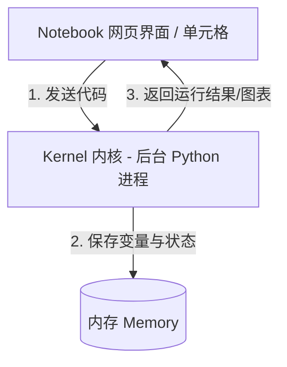
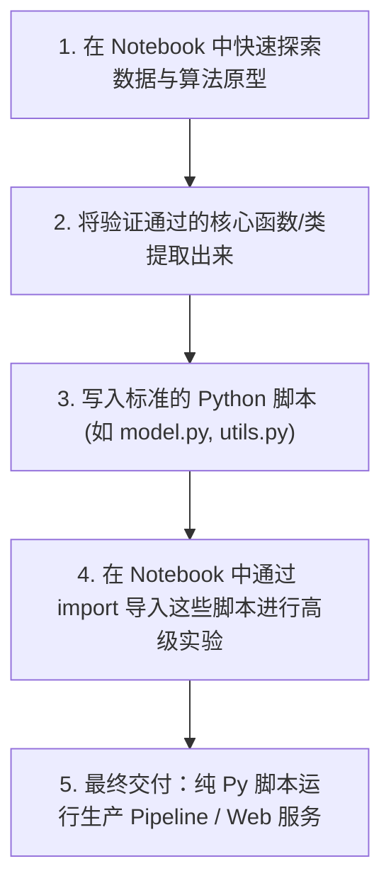

# Jupyter Notebook 深度解密与实践指南

Jupyter Notebook 是 AI/ML 工程师的“实验台”和“电子草稿纸”。本文旨在用最直观的语言、图表和实例，带你深度理解 Notebook 的底层运行逻辑、高效率操作技巧以及在 AI 工程中的最佳实践。

---

## 1. 概念解密：Notebook 到底是什么？

### 1.1 它不是编程语言
Notebook 本身**不是**一种编程语言。它是一个**交互式开发环境**，其背后的文件后缀是 `.ipynb`（IPython Notebook 的缩写）。
如果你用文本编辑器打开一个 `.ipynb` 文件，你会发现它本质上是一个 **JSON 格式的文本文件**，里面不仅记录了你写的 Python 代码，还记录了你写的所有说明文字（Markdown）、每个格子的运行状态，甚至是代码生成的图表数据。

### 1.2 核心双子星：单元格 (Cells) 与内核 (Kernel)

Notebook 的核心工作模式是由**单元格**和**内核**交互实现的：



* **单元格 (Cell)**：
  这是你在界面上看到的输入框。主要分为：
  * **Code Cell (代码单元格)**：用于编写可执行的 Python 代码。
  * **Markdown Cell (文本单元格)**：使用 Markdown 语法编写文档、公式（支持 LaTeX，如 $E=mc^2$），插入图片，用于解释实验逻辑。
* **内核 (Kernel)**：
  * 当你启动一个 Notebook 时，系统会在后台启动一个**独立的 Python 进程**（即 Kernel）。
  * 每次你运行一个代码单元格，该单元格里的代码就会被发送到 Kernel 里执行。
  * **关键点**：Kernel 会在内存中持续保留所有的变量、导入的库和定义的函数。只要你不关闭或重启 Kernel，这些状态在所有单元格之间都是共享且持续存在的。

---

## 2. 界面选择：JupyterLab vs VS Code vs Colab

尽管底层的 `.ipynb` 文件格式相同，但你可以通过不同的前端界面来打开和编辑它：

| 界面 | 适用场景 | 优势 | 劣势 |
| :--- | :--- | :--- | :--- |
| **JupyterLab** | 本地数据科学实验、独立开发 | 完整的 IDE 体验，自带文件浏览器、终端、多标签页支持。最经典，扩展性强。 | 需要本地安装并从命令行启动。 |
| **VS Code (Jupyter)** | 个人日常工程开发、Git 版本管理 | 深度集成于编辑器中，无需离开 VS Code 即可运行；完美的 Git 差异对比（Diff）与调试能力。 | 比较消耗系统资源，对超大输出的渲染有时稍慢。 |
| **Google Colab** | 算力受限、快速复现他人成果、云端协作 | **提供免费的 GPU（如 T4）**，无需任何本地环境配置，预装了绝大多数 AI 常用库，直接与 Google Drive 绑定。 | 免费版有时间限制（空闲 90 分钟断开），无法持久保存本地临时文件，需要手动挂载云盘。 |

> [!TIP]
> **黄金搭配**：在本地开发时，推荐使用 **VS Code + Jupyter Extension**；在需要临时蹭 GPU 跑深度学习模型时，使用 **Google Colab**。

---

## 3. 极速上手：两种模式与快捷键

Jupyter Notebook 设计了一套非常高效的键盘流操作。它的核心逻辑类似于 Vim 编辑器，分为两种模式：

### 3.1 模式切换
* **编辑模式 (Edit Mode)**：格子左侧显示**绿色**条（或格子里有光标闪烁）。此时你可以在格子里写代码或文字。
  * **如何进入**：点击格子内部，或在选中格子时按 `Enter`。
* **命令模式 (Command Mode)**：格子左侧显示**蓝色/灰色**条（没有光标闪烁）。此时你按下的键盘按键会被识别为快捷指令（例如删除、新建格子）。
  * **如何进入**：按键盘上的 `Escape` 键。

### 3.2 黄金快捷键秘籍

| 快捷键 | 所在模式 | 动作作用 |
| :--- | :--- | :--- |
| **`Shift + Enter`** | **任意模式** | **运行当前单元格**，并自动高亮/跳转到下一个单元格。（最常用！） |
| `Ctrl + Enter` | 任意模式 | 运行当前单元格，但光标停留在当前单元格，不向下跳转。 |
| `A` | 命令模式 | 在当前单元格**上方** (Above) 插入一个空单元格。 |
| `B` | 命令模式 | 在当前单元格**下方** (Below) 插入一个空单元格。 |
| `D + D` (连按两次) | 命令模式 | **删除** (Delete) 当前单元格。 |
| `Z` | 命令模式 | **撤销** (Undo) 刚才的单元格删除或移动操作。 |
| `M` | 命令模式 | 将当前单元格转换为 **Markdown 文本单元格**。 |
| `Y` | 命令模式 | 将当前单元格转换为 **Code 代码单元格**。 |
| `Shift + Tab` | 编辑模式 | 在写代码时，按下可弹窗**显示函数的文档和入参签名**。 |
| `Ctrl + /` | 编辑模式 | 快速**注释/取消注释**当前行代码。 |

---

## 4. 魔法命令 (Magic Commands) 与系统交互

Magic Commands 是 Jupyter 的独有增强功能。它们以 `%` 开头表示**单行魔法（Line Magic）**，以 `%%` 开头表示**整个单元格魔法（Cell Magic）**。

### 4.1 性能评测工具
在 AI 优化中，我们经常需要对比哪种实现更快：

* **`%timeit`（微观耗时测试）**：
  它会把这行代码自动运行多次（例如 10000 次），求出平均耗时和标准差，结果极其精准。
  ```python
  import numpy as np
  # 测试 numpy 创建数组的速度
  %timeit np.arange(10000)
  ```
* **`%%time`（宏观耗时测试）**：
  必须写在单元格的最第一行。它只运行一次，记录执行这个单元格一共花了多少秒。非常适合用来统计训练一个 Epoch 花了多久。
  ```python
  %%time
  # 模拟一个长时间的训练过程
  import time
  time.sleep(2)  # 睡眠 2 秒
  ```

### 4.2 绘图与系统控制
* **`%matplotlib inline`**：
  强制将 `matplotlib` 画出来的图直接嵌入在 Notebook 的网页中，而不是弹出一个新的窗口。
* **`!`（执行系统终端命令）**：
  在命令前加上 `!`，可以直接调用你电脑的终端命令。例如在 Notebook 中直接安装缺少的依赖：
  ```python
  !pip install torch torchvision
  ```
* **`%env`（管理环境变量）**：
  直接查看或设置环境变量（在设置 API Key 或指定 GPU 设备时非常有用）：
  ```python
  # 设置使用 0 号显卡
  %env CUDA_VISIBLE_DEVICES=0
  ```

---

## 5. 核心避坑指南（重点！）

Notebook 的灵活性是它的超能力，但也导致了几个灾难性的常见问题：

### 陷阱 1：乱序执行（Out-of-Order Execution）
* **现象**：你看别人的 Notebook 或者是自己以前写的，从头运行到尾会报错。这是因为你在开发时，是“先运行下面的格子，再修改上面的格子，然后又跳着运行”。
* **底层原理**：Jupyter 单元格左侧的 `In [X]:` 数字，代表了这个格子的**实际执行顺序**。如果数字不是递增的（如 `In [5]` 在 `In [12]` 下面），说明存在跳跃运行。
* **防护措施**：在把 Notebook 分享给其他人，或者提交到 Git 仓库之前，一定要执行一次 **Kernel -> Restart & Run All**。确保从上到下顺序执行能够一次性通过。

### 陷阱 2：隐藏状态（Hidden State）
* **现象**：代码里明明写着 `x = 10`，但是打印出来却是 `20`；或者你删除了某个定义 `y = 5` 的格子，后面的代码依然能跑通，但一旦重启电脑代码就崩了。
* **底层原理**：被删除的格子在内存中定义的变量依然保存在 Kernel 的进程中。这被称为“幽灵变量”。
* **防护措施**：养成定期 **Restart Kernel** 的习惯，清除内存中的历史杂质，验证当前可见的代码是否足够完整。

### 陷阱 3：内存泄漏与显存爆炸（Memory Leaks）
* **现象**：反复运行训练代码，或者不断加载大文件，导致电脑内存（RAM）或显卡显存（VRAM）越来越满，最后抛出 `Out Of Memory (OOM)` 崩溃。
* **底层原理**：因为 Kernel 一直在后台运行，除非你显式销毁，否则凡是绑定在全局变量上的大矩阵、神经网络模型都不会被 Python 回收。
* **防护措施**：
  1. 使用完毕后，手动用 `del` 删除大变量：
     ```python
     del big_dataset_dataframe
     import gc
     gc.collect()  # 强制进行垃圾回收
     ```
  2. 当一个阶段 of 实验结束，准备开始新实验时，主动点击 **Restart Kernel** 彻底释放所有资源。

---

## 6. AI 工程最佳实践：“在 Notebook 中探索，在 Script 中交付”

不要尝试把整个项目都写在 Notebook 里！Notebook 难以进行单元测试、难以进行模块化复用，也难以做严格的版本控制（Git 经常因为 `.ipynb` 里的输出二进制数据导致冲突崩溃）。

### 推荐的 AI 工程标准工作流：



1. **探索阶段 (Notebook)**：读取数据、画图、尝试各种超参数、快速看模型输出。
2. **重构阶段 (Script)**：一旦某段代码稳定了（比如数据预处理逻辑、模型结构定义），立刻把它们移入到本地项目的 `.py` 文件中，写成标准的类或函数。
3. **回流阶段**：在 Notebook 中通过 `import` 引入你刚刚写好的 `.py` 模块，继续做后续实验。
   > [!TIP]
   > 为了防止修改 `.py` 后 Notebook 无法实时同步更新，可以在 Notebook 顶部加上以下自动重新加载的魔法命令：
   > ```python
   > %load_ext autoreload
   > %autoreload 2
   > ```

---

## 7. 动手小练习

为了巩固上述内容，你可以在本地的 Jupyter 环境中尝试以下经典实验：

```python
# 练习 1：使用 %timeit 对比 Python 原生列表推导式与 NumPy 数组计算速度
import numpy as np

print("原生 Python 列表生成耗时：")
%timeit [i**2 for i in range(10000)]

print("NumPy 向量化计算耗时：")
%timeit np.arange(10000)**2
```

你会发现，NumPy 的向量化计算速度通常是原生循环的 **10倍到100倍** 级别。这就是魔法命令在性能调优中的魅力！
