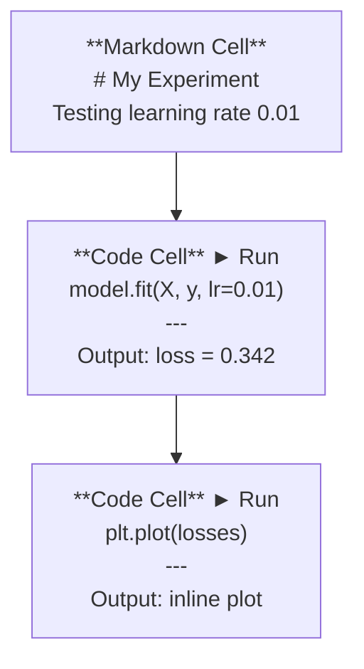
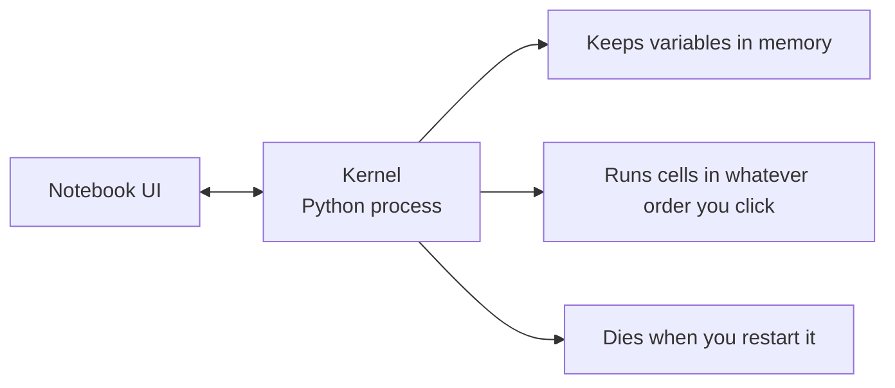

# Jupyter Notebooks

> Notebooks 是 AI 工程的实验台。你在这里做原型，然后把有效的东西移进生产代码。

**类型：** Build
**语言：** Python
**先修：** Phase 0, Lesson 01
**时间：** ~30 分钟

## 学习目标

- 安装并启动 JupyterLab、Jupyter Notebook，或带 Jupyter extension 的 VS Code
- 使用 magic commands（`%timeit`、`%%time`、`%matplotlib inline`）做 benchmark 和 inline 可视化
- 区分什么时候用 notebooks、什么时候用 scripts，并应用“在 notebooks 中探索，在 scripts 中交付”的工作流
- 识别并避免常见 notebook 陷阱：乱序执行、隐藏状态和内存泄漏

## 问题

每篇 AI paper、tutorial 和 Kaggle competition 都会用 Jupyter notebooks。它们让你分块运行代码、在同一位置看到输出、把代码和解释混在一起，并快速迭代。如果你不用 notebooks 学 AI，就像做数学作业却没有草稿纸。

但 notebooks 也有真实陷阱。很多人把它们用于所有事情，包括它们非常不擅长的事情。知道什么时候用 notebook、什么时候用 script，会让你以后少掉进很多调试噩梦。

## 概念

notebook 是一组 cells。每个 cell 要么是 code，要么是 text。



kernel 是后台运行的 Python process。当你运行一个 cell 时，notebook 会把代码发送给 kernel，kernel 执行后把结果返回。所有 cells 共享同一个 kernel，所以变量会在 cells 之间保留。



“按你点击的任意顺序运行”既是它的超能力，也是最容易踩的坑。

## 构建它

### 第 1 步：选择界面

三种界面，一个格式：

| 界面 | 安装 | 最适合 |
|------|------|--------|
| JupyterLab | `pip install jupyterlab` 然后 `jupyter lab` | 完整 IDE 体验、多 tabs、file browser、terminal |
| Jupyter Notebook | `pip install notebook` 然后 `jupyter notebook` | 简单、轻量、一次一个 notebook |
| VS Code | 安装 "Jupyter" extension | 已在编辑器中，支持 git integration 和 debugging |

三者都读写同一种 `.ipynb` 文件。选择你喜欢的即可。JupyterLab 是 AI 工作中最常见的选择。

```bash
pip install jupyterlab
jupyter lab
```

### 第 2 步：重要快捷键

你会在两种模式中操作。按 `Escape` 进入 command mode（左侧蓝条），按 `Enter` 进入 edit mode（绿条）。

**Command mode（最常用）：**

| 键 | 动作 |
|----|------|
| `Shift+Enter` | 运行 cell，移动到下一个 |
| `A` | 在上方插入 cell |
| `B` | 在下方插入 cell |
| `DD` | 删除 cell |
| `M` | 转换为 markdown |
| `Y` | 转换为 code |
| `Z` | 撤销 cell 操作 |
| `Ctrl+Shift+H` | 显示所有快捷键 |

**Edit mode：**

| 键 | 动作 |
|----|------|
| `Tab` | Autocomplete |
| `Shift+Tab` | 显示函数签名 |
| `Ctrl+/` | 切换注释 |

`Shift+Enter` 是你每天会用上千次的快捷键。先学它。

### 第 3 步：Cell 类型

**Code cells** 运行 Python 并显示输出：

```python
import numpy as np
data = np.random.randn(1000)
data.mean(), data.std()
```

输出：`(0.0032, 0.9987)`

**Markdown cells** 渲染格式化文本。用它记录你在做什么以及为什么。它支持 headers、bold、italic、LaTeX math（`$E = mc^2$`）、tables 和 images。

### 第 4 步：Magic commands

这些不是 Python，而是 Jupyter 专用命令。它们以 `%`（line magic）或 `%%`（cell magic）开头。

**计时代码：**

```python
%timeit np.random.randn(10000)
```

输出：`45.2 us +/- 1.3 us per loop`

```python
%%time
model.fit(X_train, y_train, epochs=10)
```

输出：`Wall time: 2.34 s`

`%timeit` 会运行多次并取平均。`%%time` 只运行一次。microbenchmarks 用 `%timeit`，training runs 用 `%%time`。

**启用 inline plots：**

```python
%matplotlib inline
```

之后每个 `plt.plot()` 或 `plt.show()` 都会直接在 notebook 中渲染。

**不离开 notebook 安装包：**

```python
!pip install scikit-learn
```

`!` 前缀可以运行任意 shell command。

**检查环境变量：**

```python
%env CUDA_VISIBLE_DEVICES
```

### 第 5 步：Inline 显示丰富输出

Notebooks 会自动显示 cell 中最后一个表达式。但你也可以控制它：

```python
import pandas as pd

df = pd.DataFrame({
    "model": ["Linear", "Random Forest", "Neural Net"],
    "accuracy": [0.72, 0.89, 0.94],
    "training_time": [0.1, 2.3, 45.6]
})
df
```

这会渲染一个格式化 HTML table，而不是 text dump。plots 也是如此：

```python
import matplotlib.pyplot as plt

plt.figure(figsize=(8, 4))
plt.plot([1, 2, 3, 4], [1, 4, 2, 3])
plt.title("Inline Plot")
plt.show()
```

plot 会出现在 cell 正下方。这就是 notebooks 主导 AI 工作的原因：你能同时看到数据、图和代码。

对于 images：

```python
from IPython.display import Image, display
display(Image(filename="architecture.png"))
```

### 第 6 步：Google Colab

Colab 是云端免费的 Jupyter notebook。它提供 GPU、预装 libraries 和 Google Drive integration。不需要设置。

1. 打开 [colab.research.google.com](https://colab.research.google.com)
2. 上传本课程中的任意 `.ipynb` 文件
3. Runtime > Change runtime type > T4 GPU（免费）

Colab 和本地 Jupyter 的差异：
- 文件不会跨 sessions 持久保存（保存到 Drive 或下载）
- 预装：numpy、pandas、matplotlib、torch、tensorflow、sklearn
- 使用 `from google.colab import files` 上传/下载文件
- 使用 `from google.colab import drive; drive.mount('/content/drive')` 做持久存储
- 免费层在空闲 90 分钟后 session timeout

## 使用它

### Notebooks vs Scripts：什么时候用哪个

| 用 notebooks 做 | 用 scripts 做 |
|-----------------|---------------|
| 探索数据集 | 训练 pipelines |
| 原型化模型 | 可复用 utilities |
| 可视化结果 | 任何带 `if __name__` 的东西 |
| 解释你的工作 | 定时运行的代码 |
| 快速实验 | 生产代码 |
| 课程练习 | Packages 和 libraries |

规则：**在 notebooks 中探索，在 scripts 中交付。**

AI 中常见工作流：
1. 在 notebook 中探索数据
2. 在 notebook 中原型化模型
3. 一旦可行，把代码移动到 `.py` 文件
4. 再把这些 `.py` 文件 import 回 notebook，继续实验

### 常见陷阱

**乱序执行。** 你先运行 cell 5，再运行 cell 2，然后运行 cell 7。notebook 在你机器上能工作，但别人从上到下运行时会坏。修复：分享前执行 Kernel > Restart & Run All。

**隐藏状态。** 你删除了一个 cell，但它创建的变量还在内存中。notebook 看起来干净，但依赖一个 ghost cell。修复：定期 restart kernel。

**内存泄漏。** 加载一个 4GB 数据集，训练一个模型，再加载另一个数据集。没有东西被释放。修复：`del variable_name` 和 `gc.collect()`，或者 restart kernel。

## 交付它

本课产出：
- `outputs/prompt-notebook-helper.md`：用于调试 notebook 问题

## 练习

1. 打开 JupyterLab，创建一个 notebook，并用 `%timeit` 比较 list comprehension 和 numpy 创建 100,000 个随机数数组的速度
2. 创建一个同时包含 markdown 和 code cells 的 notebook，加载 CSV，显示 dataframe，并绘制 chart。然后运行 Kernel > Restart & Run All，验证它可以从上到下正常执行
3. 把 `code/notebook_tips.py` 中的代码粘贴到 Colab notebook 中，并使用免费 GPU 运行

## 关键术语

| 术语 | 人们常说 | 实际含义 |
|------|----------|----------|
| Kernel | “运行我代码的东西” | 一个单独的 Python process，执行 cells，并把变量保存在内存中 |
| Cell | “一个代码块” | notebook 中可独立运行的单元，可以是 code 或 markdown |
| Magic command | “Jupyter tricks” | 以 `%` 或 `%%` 为前缀、控制 notebook environment 的特殊命令 |
| `.ipynb` | “Notebook file” | 一个包含 cells、outputs 和 metadata 的 JSON 文件，全称 IPython Notebook |

## 延伸阅读

- [JupyterLab Docs](https://jupyterlab.readthedocs.io/)：完整功能文档
- [Google Colab FAQ](https://research.google.com/colaboratory/faq.html)：Colab 专属限制和功能
- [28 Jupyter Notebook Tips](https://www.dataquest.io/blog/jupyter-notebook-tips-tricks-shortcuts/)：power-user 快捷技巧
