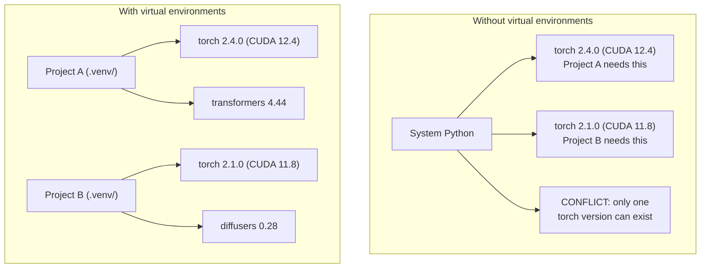

# Python 环境

> 依赖地狱是真实存在的。虚拟环境就是解药。

**类型：** Build
**语言：** Shell
**先修：** Phase 0, Lesson 01
**时间：** ~30 分钟

## 学习目标

- 使用 `uv`、`venv` 或 `conda` 创建隔离的虚拟环境
- 编写带 optional dependency groups 的 `pyproject.toml`，并生成 lockfiles 以保证可复现
- 诊断并修复常见陷阱：global installs、pip/conda 混用、CUDA version mismatches
- 为存在冲突依赖的项目实现按 phase 划分的环境策略

## 问题

你为一个 fine-tuning 项目安装了 PyTorch 2.4。下周，另一个项目需要 PyTorch 2.1，因为它的 CUDA build 被固定了。你全局升级，第一个项目坏了。你降级，第二个项目坏了。

这就是 dependency hell。它在 AI/ML 工作中经常发生，因为：

- PyTorch、JAX 和 TensorFlow 都会带自己的 CUDA bindings
- Model libraries 会 pin 特定 framework versions
- 全局 `pip install` 会覆盖之前安装的内容
- CUDA 11.8 builds 不能和 CUDA 12.x drivers 正常配合，反过来也一样

修复方式：每个项目都有自己的隔离环境和自己的 packages。

## 概念



## 构建它

### 选项 1：uv venv（推荐）

`uv` 是最快的 Python package manager，比 pip 快 10-100 倍。它在一个工具里处理 virtual environments、Python versions 和 dependency resolution。

```bash
curl -LsSf https://astral.sh/uv/install.sh | sh

uv python install 3.12

cd your-project
uv venv
source .venv/bin/activate
```

安装 packages：

```bash
uv pip install torch numpy
```

一步创建带 `pyproject.toml` 的项目：

```bash
uv init my-ai-project
cd my-ai-project
uv add torch numpy matplotlib
```

### 选项 2：venv（内置）

如果你无法安装 `uv`，Python 自带 `venv`：

```bash
python3 -m venv .venv
source .venv/bin/activate  # Linux/macOS
.venv\Scripts\activate     # Windows

pip install torch numpy
```

它比 `uv` 慢，但只要安装了 Python 就能用。

### 选项 3：conda（需要时使用）

Conda 管理 CUDA toolkits、cuDNN 和 C libraries 等非 Python 依赖。在这些情况下使用它：

- 你需要特定 CUDA toolkit version，但不想全局安装
- 你在无法安装系统包的 shared cluster 上
- 某个 library 的安装说明写着“use conda”

```bash
# Install miniconda (not the full Anaconda)
curl -LsSf https://repo.anaconda.com/miniconda/Miniconda3-latest-Linux-x86_64.sh -o miniconda.sh
bash miniconda.sh -b

conda create -n myproject python=3.12
conda activate myproject

conda install pytorch torchvision torchaudio pytorch-cuda=12.4 -c pytorch -c nvidia
```

一条规则：如果你为某个环境使用 conda，就尽量用 conda 管理这个环境中的所有 packages。在 conda env 中混用 `pip install` 会产生很难调试的依赖冲突。

### 本课程的按 Phase 策略

你可以为整门课程创建一个环境。不要这样做。不同 phases 需要不同的、有时互相冲突的依赖。

策略：

```text
ai-engineering-from-scratch/
├── .venv/                    <-- shared lightweight env for phases 0-3
├── phases/
│   ├── 04-neural-networks/
│   │   └── .venv/            <-- PyTorch env
│   ├── 05-cnns/
│   │   └── .venv/            <-- same PyTorch env (symlink or shared)
│   ├── 08-transformers/
│   │   └── .venv/            <-- might need different transformer versions
│   └── 11-llm-apis/
│       └── .venv/            <-- API SDKs, no torch needed
```

`code/env_setup.sh` 中的脚本会为本课程创建 base environment。

## pyproject.toml 基础

每个 Python 项目都应该有 `pyproject.toml`。它用一个文件替代 `setup.py`、`setup.cfg` 和 `requirements.txt`。

```toml
[project]
name = "ai-engineering-from-scratch"
version = "0.1.0"
requires-python = ">=3.11"
dependencies = [
    "numpy>=1.26",
    "matplotlib>=3.8",
    "jupyter>=1.0",
    "scikit-learn>=1.4",
]

[project.optional-dependencies]
torch = ["torch>=2.3", "torchvision>=0.18"]
llm = ["anthropic>=0.39", "openai>=1.50"]
```

然后安装：

```bash
uv pip install -e ".[torch]"    # base + PyTorch
uv pip install -e ".[llm]"     # base + LLM SDKs
uv pip install -e ".[torch,llm]" # everything
```

## Lockfiles

lockfile 会把每个 dependency（包括 transitive dependencies）固定到精确版本。这保证可复现：任何从 lockfile 安装的人都会得到完全相同的 packages。

```bash
# uv generates uv.lock automatically when using uv add
uv add numpy

# pip-tools approach
uv pip compile pyproject.toml -o requirements.lock
uv pip install -r requirements.lock
```

把 lockfile commit 到 git。别人 clone repo 后，从 lockfile 安装，就会得到相同版本。

## 常见错误

### 1. 全局安装

```bash
pip install torch  # BAD: installs to system Python

source .venv/bin/activate
pip install torch  # GOOD: installs to virtual environment
```

检查 packages 安装到了哪里：

```bash
which python       # should show .venv/bin/python, not /usr/bin/python
which pip           # should show .venv/bin/pip
```

### 2. 混用 pip 和 conda

```bash
conda create -n myenv python=3.12
conda activate myenv
conda install pytorch -c pytorch
pip install some-other-package   # BAD: can break conda's dependency tracking
conda install some-other-package # GOOD: let conda manage everything
```

如果必须在 conda 中使用 pip（某些 packages 只支持 pip），先安装所有 conda packages，最后再安装 pip packages。

### 3. 忘记 activate

```bash
python train.py           # uses system Python, missing packages
source .venv/bin/activate
python train.py           # uses project Python, packages found
```

你的 shell prompt 应该显示环境名称：

```text
(.venv) $ python train.py
```

### 4. 把 .venv commit 到 git

```bash
echo ".venv/" >> .gitignore
```

虚拟环境通常有 200MB-2GB。它们是本地的，不能在机器之间可靠移植。应该 commit `pyproject.toml` 和 lockfile。

### 5. CUDA version mismatch

```bash
nvidia-smi                # shows driver CUDA version (e.g., 12.4)
python -c "import torch; print(torch.version.cuda)"  # shows PyTorch CUDA version

# These must be compatible.
# PyTorch CUDA version must be <= driver CUDA version.
```

## 使用它

运行 setup script 创建课程环境：

```bash
bash phases/00-setup-and-tooling/06-python-environments/code/env_setup.sh
```

这会在 repo root 创建一个 `.venv`，安装并验证 core dependencies。

## 练习

1. 运行 `env_setup.sh`，并确认所有检查通过
2. 创建第二个 virtual environment，在其中安装不同版本的 numpy，并确认两个环境相互隔离
3. 为一个同时需要 PyTorch 和 Anthropic SDK 的项目编写 `pyproject.toml`
4. 故意在未激活 venv 的情况下全局安装一个 package，观察它被安装到哪里，然后卸载它

## 关键术语

| 术语 | 人们常说 | 实际含义 |
|------|----------|----------|
| Virtual environment | “一个 venv” | 一个隔离目录，包含 Python interpreter 和 packages，独立于系统 Python |
| Lockfile | “Pinned dependencies” | 列出每个 package 及其精确版本的文件，保证跨机器安装一致 |
| pyproject.toml | “新的 setup.py” | 标准 Python 项目配置文件，替代 setup.py/setup.cfg/requirements.txt |
| Transitive dependency | “依赖的依赖” | Package B 依赖 C；如果你安装依赖 B 的 A，那么 C 就是 A 的 transitive dependency |
| CUDA mismatch | “我的 GPU 不工作” | PyTorch 编译使用的 CUDA version 和 GPU driver 支持的 CUDA version 不同 |
