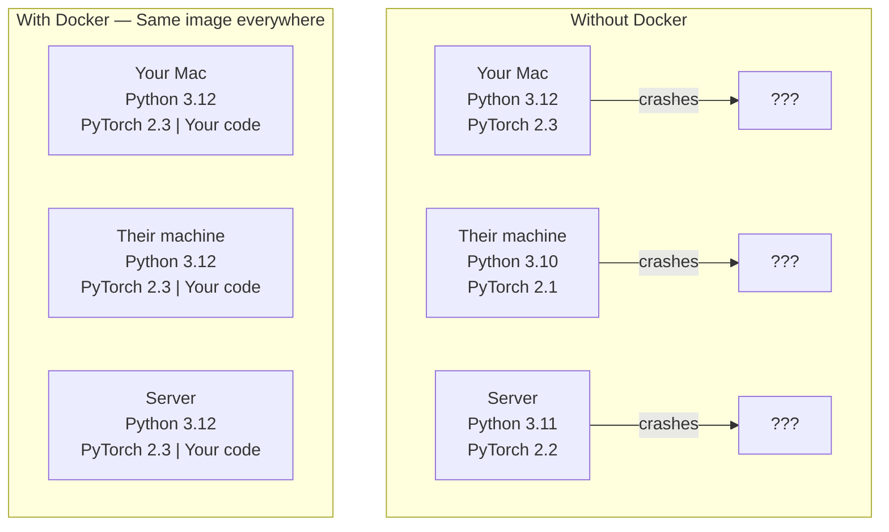
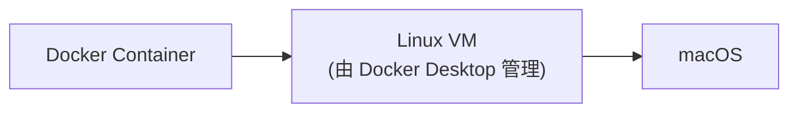

# 面向 AI 的 Docker（macOS 版）

> 容器让"在我机器上能跑"成为过去式。

**类型：** Build
**语言：** Docker
**前置知识：** Phase 0，第 01 和 03 课
**时间：** 约 45 分钟

## 学习目标

- 从 Dockerfile 构建包含 PyTorch 和 AI 库的 Docker 镜像（CPU / MPS）
- 将宿主机目录挂载为 volume，让模型、数据集和代码在容器重建后仍然保留
- 使用 Docker Compose 编排多服务 AI 应用，例如推理服务和向量数据库
- 理解 Mac 上 Docker 的架构差异和性能优化技巧

## 问题

你在自己的 Mac 上用 PyTorch 2.3 和 Python 3.12 训练了一个模型。你的同事机器上是 PyTorch 2.1 和 Python 3.10。模型在他们的机器上崩溃。但你的 Dockerfile 可以在两台机器上都正常工作。

AI 项目的依赖经常是一团乱麻。一个典型技术栈会包含 Python、PyTorch、系统级 C 库，以及像 tokenizers 这种需要编译的专用包。Docker 会把所有这些东西打包进一个镜像，让它在任何地方都以同样的方式运行。

## 核心概念

Docker 会把你的代码、运行时、库和系统工具封装进一个叫容器 (container) 的隔离单元。你可以把它想象成一个轻量虚拟机，但它共享宿主机的操作系统内核，而不是运行自己的内核，所以它的启动时间是秒级，而不是分钟级。



### Mac 上 Docker 的特殊之处

在 Mac 上，Docker Desktop 运行在一个轻量 Linux 虚拟机（VM）中，而不是直接运行在 macOS 内核上。这意味着：



1. **没有原生 NVIDIA GPU 支持。** Mac 没有 NVIDIA GPU，Docker 容器也无法直接访问 Apple 的 GPU（MPS）。容器内的 PyTorch 将以 CPU 模式运行。
2. **Apple Silicon 需要 ARM 镜像。** M1/M2/M3/M4 Mac 使用 ARM 架构。大多数 Docker 镜像已支持 `linux/arm64`，但偶尔会遇到只有 `linux/amd64` 的镜像，Docker Desktop 会通过 Rosetta 2 模拟运行，速度会变慢。
3. **文件系统性能。** Volume mount 在 Mac 上比 Linux 慢，因为要经过 VM 层。使用 `:cached` 标志或 VirtioFS（Docker Desktop 默认）可以改善。

### 为什么 AI 项目比大多数项目更需要 Docker

1. **模型权重很大。** 一个 7B 参数模型用 fp16 存储就是 14 GB。你不会想每次重建容器都重新下载它。Docker volume 可以把宿主机上的模型目录挂载进容器。

2. **多服务架构很常见。** 一个真实 AI 应用不只是一个 Python 脚本。它通常还包含推理服务、用于 RAG 的向量数据库，可能还有 Web 前端。Docker Compose 可以用一条命令编排这些服务。

3. **团队协作靠它。** 你在 Mac 上开发，同事用 Linux，服务器也是 Linux。Dockerfile 保证大家用同一套环境。

### 关键词汇

| 术语 | 含义 |
|------|------|
| Image | 只读模板。你的配方。由 Dockerfile 构建而来。 |
| Container | 镜像的运行实例。你的厨房。 |
| Dockerfile | 构建镜像的指令。逐层执行。 |
| Volume | 容器重启后仍然存在的持久化存储。 |
| docker-compose | 用 YAML 定义多容器应用的工具。 |

### AI 中常见的容器模式

```text
Dev Container
  完整工具链。编辑器支持。Jupyter。调试工具。
  用于开发和实验。

Training Container
  精简。只有训练脚本和依赖。
  在 Mac 上以 CPU 模式运行，或部署到云端 GPU 集群。

Inference Container
  为服务化优化。小镜像。冷启动快。
  在生产环境中运行在负载均衡后面。
```

## 动手构建

### 第 1 步：安装 Docker Desktop

```bash
brew install --cask docker
open /Applications/Docker.app
```

Docker Desktop 启动后，点击菜单栏的鲸鱼图标 → Settings：

- **General** → 确认 "Use Virtualization framework" 已勾选
- **Resources** → 分配足够的内存（建议至少 8 GB，AI 工作建议 12-16 GB）
- **General** → 确认 "VirtioFS" 已选中（文件共享性能更好）

验证安装：

```bash
docker --version
docker run hello-world
```

检查你的 Mac 架构（Apple Silicon 还是 Intel）：

```bash
uname -m
# arm64 = Apple Silicon (M1/M2/M3/M4)
# x86_64 = Intel Mac
```

### 第 2 步：理解基础镜像

Mac 上不需要 NVIDIA CUDA 镜像。选择轻量的 Python 基础镜像：

```text
python:3.12-slim
  轻量 Python 运行环境。Debian 基础。
  用途：AI 开发、CPU 推理、轻量工具
  大小：约 150 MB
  ✅ 支持 arm64（Apple Silicon）和 amd64（Intel）

python:3.12
  完整 Python 环境。包含构建工具。
  用途：需要编译 C 扩展的包（如 tokenizers）
  大小：约 900 MB

pytorch/pytorch:2.3.1-cuda12.4-cudnn9-runtime
  ⚠️ 这是 NVIDIA GPU 镜像。Mac 上不需要。
  在 Apple Silicon 上会通过 Rosetta 模拟运行，非常慢。
  不建议在 Mac 上使用。
```

### 第 3 步：为 Mac AI 开发编写 Dockerfile

下面是适配 Mac 的 Dockerfile。与 GPU 版本的关键区别：
- 使用 `python:3.12-slim` 代替 NVIDIA CUDA 基础镜像
- 安装 CPU 版 PyTorch（镜像更小，构建更快）
- 不需要任何 GPU 相关配置

```dockerfile
FROM python:3.12-slim

ENV PYTHONUNBUFFERED=1

RUN apt-get update && apt-get install -y --no-install-recommends \
    git \
    curl \
    build-essential \
    && rm -rf /var/lib/apt/lists/*

RUN python -m pip install --no-cache-dir --upgrade pip setuptools wheel

RUN python -m pip install --no-cache-dir \
    torch==2.3.1 \
    torchvision==0.18.1 \
    torchaudio==2.3.1 \
    --index-url https://download.pytorch.org/whl/cpu

RUN python -m pip install --no-cache-dir \
    numpy \
    pandas \
    scikit-learn \
    matplotlib \
    jupyter \
    transformers \
    datasets \
    accelerate \
    safetensors

WORKDIR /workspace

VOLUME ["/workspace", "/models"]

EXPOSE 8888

CMD ["python"]
```

> **与 GPU 版的对比：**
>
> | | GPU 版 | Mac 版 |
> |---|--------|--------|
> | 基础镜像 | `nvidia/cuda:12.4.1-devel-ubuntu22.04` (~4 GB) | `python:3.12-slim` (~150 MB) |
> | PyTorch 安装源 | `whl/cu124` | `whl/cpu` |
> | 镜像总大小 | ~8-10 GB | ~2-3 GB |
> | GPU 访问 | 需要 `--gpus all` | 不需要 |

构建它：

```bash
docker build -t ai-dev -f phases/00-setup-and-tooling/07-docker-for-ai/code/Dockerfile .
```

第一次会比较慢，因为要下载基础镜像和 PyTorch。后续构建会使用缓存层。

在 Apple Silicon Mac 上，确认镜像使用了正确的架构：

```bash
docker inspect ai-dev --format '{{.Architecture}}'
# 应该输出：arm64
```

运行它：

```bash
docker run --rm -it \
    -v $(pwd):/workspace \
    -v ~/models:/models \
    ai-dev python -c "import torch; print(f'PyTorch {torch.__version__}, CUDA: {torch.cuda.is_available()}')"
```

输出会显示 `CUDA: False`，这是正常的——Mac 上的 Docker 容器使用 CPU 模式。

在容器内运行 Jupyter：

```bash
docker run --rm -it \
    -v $(pwd):/workspace \
    -v ~/models:/models \
    -p 8888:8888 \
    ai-dev jupyter notebook --ip=0.0.0.0 --port=8888 --no-browser --allow-root
```

### 第 4 步：为数据和模型挂载 volume

Volume mount 对 AI 工作至关重要。没有它们，容器停止时你下载的 14 GB 模型也会消失。

```bash
# Mount your code
-v $(pwd):/workspace

# Mount a shared models directory
-v ~/models:/models

# Mount datasets
-v ~/datasets:/data
```

在训练脚本里，从挂载路径加载：

```python
from transformers import AutoModel

model = AutoModel.from_pretrained("/models/llama-7b")
```

模型实际存在于宿主机文件系统。你可以随意重建容器，而不用重新下载。

#### Mac 上的 volume 性能优化

Mac 上的 volume mount 需要经过 VM 层，性能比 Linux 原生挂载慢。几个优化技巧：

```bash
# 1. 使用 :cached 标志（对读多写少的目录）
-v $(pwd):/workspace:cached

# 2. 不要挂载 node_modules、.git 等大量小文件的目录
# 用 .dockerignore 排除它们

# 3. 对于大型模型文件，使用命名 volume（比 bind mount 快）
docker volume create models_vol
docker run -v models_vol:/models ai-dev
```

### 第 5 步：用 Docker Compose 构建多服务 AI 应用

一个真实的 RAG 应用需要推理服务和向量数据库。Docker Compose 可以用一条命令运行两者。

适配 Mac 的 `docker-compose.yml`（不需要 NVIDIA deploy 配置块）：

```yaml
services:
  ai-dev:
    build:
      context: .
      dockerfile: Dockerfile
    volumes:
      - ../../../:/workspace
      - ~/models:/models
      - ~/datasets:/data
    ports:
      - "8888:8888"
    stdin_open: true
    tty: true
    command: jupyter notebook --ip=0.0.0.0 --port=8888 --no-browser --allow-root

  qdrant:
    image: qdrant/qdrant:v1.12.5
    ports:
      - "6333:6333"
      - "6334:6334"
    volumes:
      - qdrant_data:/qdrant/storage

volumes:
  qdrant_data:
```

> **与 GPU 版的区别：** 仅移除了 `ai-dev` 服务中的 `deploy.resources.reservations.devices` 配置块（即 NVIDIA GPU 预留）。其他完全一致。

启动所有服务：

```bash
cd phases/00-setup-and-tooling/07-docker-for-ai/code
docker compose up -d
```

现在你的 AI 开发容器可以通过服务名访问位于 `http://qdrant:6333` 的向量数据库。Docker Compose 会自动创建一个共享网络。

从 AI 容器内部测试连接：

```python
from qdrant_client import QdrantClient

client = QdrantClient(host="qdrant", port=6333)
print(client.get_collections())
```

停止所有服务：

```bash
docker compose down
```

加上 `-v` 也会删除 qdrant volume：

```bash
docker compose down -v
```

### 第 6 步：AI 工作常用 Docker 命令

```bash
# List running containers
docker ps

# List all images and their sizes
docker images

# Remove unused images (reclaim disk space — Mac 磁盘空间宝贵)
docker system prune -a

# Copy a file from container to host
docker cp <container_id>:/workspace/results.csv ./results.csv

# View container logs
docker logs -f <container_id>

# Check Docker Desktop resource usage (Mac 特有)
# 点击菜单栏鲸鱼图标 → Dashboard
```

### 第 7 步：Mac 上的 GPU 加速选项

虽然 Docker 容器无法访问 Apple GPU（MPS），但你有几个选择：

```text
选项 1：容器内用 CPU，宿主机用 MPS（推荐）
  开发和调试在容器里进行（环境一致）。
  需要 GPU 加速时，在宿主机直接运行 PyTorch（利用 MPS）。
  训练大模型时，推送到云端 GPU 服务器。

选项 2：完全在容器内用 CPU
  对于小模型和课程练习完全够用。
  PyTorch CPU 在 Apple Silicon 上性能不错。

选项 3：云端 GPU
  本地开发，远程训练。
  用 Dockerfile 保证本地和云端环境一致。
```

在宿主机（非 Docker 容器内）使用 Apple MPS 加速：

```python
import torch

if torch.backends.mps.is_available():
    device = torch.device("mps")
    print("Using Apple MPS acceleration")
else:
    device = torch.device("cpu")
    print("Using CPU")

tensor = torch.randn(3, 3).to(device)
print(tensor)
```

## 使用它

现在你有了一个可复现的 AI 开发环境。在本课程接下来的内容里：

- 使用 `docker compose up` 同时启动开发环境和向量数据库
- 将代码、模型和数据挂载为 volume，避免在重建之间丢失内容
- 当某一课需要新的 Python 包时，把它加到 Dockerfile 然后重建
- 把 Dockerfile 分享给队友。他们会得到完全相同的环境
- 对于需要 GPU 的课程，在宿主机使用 MPS 或部署到云端

## 练习

1. 构建 Dockerfile，并在容器中运行 `python -c "import torch; print(torch.__version__)"`
2. 启动 docker-compose 栈，并确认 AI 容器可以访问 `http://qdrant:6333/collections`
3. 把 `flask` 加到 Dockerfile，重建镜像，并在 5000 端口运行一个简单 API 服务器。用 `-p 5000:5000` 映射端口
4. 用 `docker images` 比较你的 `python:3.12-slim` 镜像与 `python:3.12`（完整版）的大小差异
5. 在**宿主机**（非容器内）运行一段使用 MPS 的 PyTorch 代码，对比容器内 CPU 模式的推理速度

## 关键术语

| 术语 | 常见说法 | 实际含义 |
|------|----------|----------|
| Container | "轻量 VM" | 使用宿主机内核的隔离进程，拥有自己的文件系统和网络 |
| Image layer | "缓存步骤" | 每条 Dockerfile 指令都会创建一层。未变化的层会被缓存，所以重建很快 |
| Volume mount | "共享文件夹" | 映射进容器的宿主机目录。容器停止后，变更仍然保留 |
| Base image | "起点" | Dockerfile 基于 `FROM` 镜像继续构建。它决定了预装内容 |
| MPS | "Mac 上的 GPU" | Apple 的 Metal Performance Shaders，PyTorch 在宿主机上可用，但 Docker 容器内无法访问 |
| VirtioFS | "快速文件共享" | Docker Desktop 用于 Mac 的高性能文件系统共享方案，替代旧的 gRPC FUSE |
