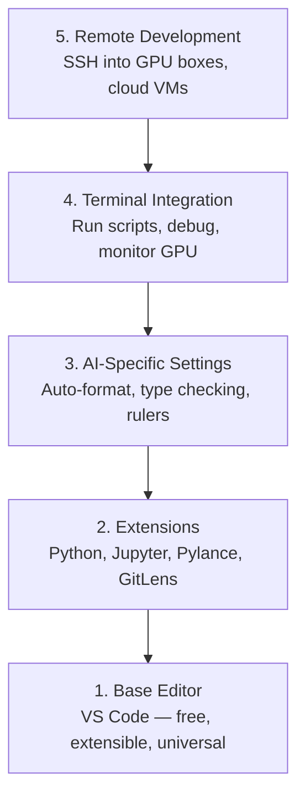

# 编辑器设置

> 你的编辑器就是你的副驾驶。一次性配置好，让它少制造阻力，多帮你分担工作。

**类型：** Build
**语言：** --
**前置知识：** Phase 0，第 01 课
**时间：** 约 20 分钟

## 学习目标

- 安装 VS Code，以及 Python、Jupyter、linting 和 remote SSH 所需的核心扩展
- 为 AI 工作流配置保存时格式化、类型检查和 notebook 输出滚动
- 设置 Remote SSH，让你像编辑本地代码一样编辑和调试远程 GPU 机器上的代码
- 评估 Cursor、Windsurf、Neovim 等编辑器替代方案，以及它们在 AI 工作中的取舍

## 问题

你会在编辑器里度过成千上万小时：写 Python、运行 notebook、调试训练循环，以及 SSH 到 GPU 机器。一套配置糟糕的编辑器会让每次工作都充满摩擦：没有自动补全，没有类型提示，没有行内错误，格式化要手动做，终端工作流也很笨重。

正确设置只需要 20 分钟。跳过它，你每天都会损失 20 分钟。

## 核心概念

一套 AI 工程编辑器配置需要五样东西：



## 动手构建

### 第 1 步：安装 VS Code

推荐使用 VS Code。它免费、跨平台、对 Jupyter notebook 有一流支持，而且扩展生态覆盖了 AI 工作需要的几乎所有东西。

从 [code.visualstudio.com](https://code.visualstudio.com/) 下载。

从终端验证：

```bash
code --version
```

如果 macOS 上找不到 `code`，打开 VS Code，按 `Cmd+Shift+P`，输入 “Shell Command”，然后选择 “Install 'code' command in PATH”。

### 第 2 步：安装核心扩展

在 VS Code 中打开集成终端（`Ctrl+`` ` 或 `` Cmd+` ``），安装 AI 工作真正需要的扩展：

```bash
code --install-extension ms-python.python
code --install-extension ms-python.vscode-pylance
code --install-extension ms-toolsai.jupyter
code --install-extension eamodio.gitlens
code --install-extension ms-vscode-remote.remote-ssh
code --install-extension ms-python.debugpy
code --install-extension ms-python.black-formatter
code --install-extension charliermarsh.ruff
```

每个扩展的作用：

| 扩展 | 用途 |
|------|------|
| Python | 语言支持、虚拟环境检测、运行和调试 |
| Pylance | 快速类型检查、自动补全、import 解析 |
| Jupyter | 在 VS Code 内运行 notebook，使用变量查看器 |
| GitLens | 查看谁改了什么，显示行内 git blame |
| Remote SSH | 像本地目录一样打开远程 GPU 机器上的文件夹 |
| Debugpy | Python 单步调试 |
| Black Formatter | 保存时自动格式化，保持风格一致 |
| Ruff | 快速 lint，捕捉常见错误 |

本课的 `code/.vscode/extensions.json` 文件包含完整推荐列表。当你打开项目文件夹时，VS Code 会提示你安装这些扩展。

### 第 3 步：配置设置

复制本课 `code/.vscode/settings.json` 中的设置，或通过 `Settings > Open Settings (JSON)` 手动应用。

AI 工作的关键设置：

```jsonc
{
    "python.analysis.typeCheckingMode": "basic",
    "editor.formatOnSave": true,
    "editor.rulers": [88, 120],
    "notebook.output.scrolling": true,
    "files.autoSave": "afterDelay"
}
```

为什么它们重要：

- **基础类型检查**：在运行前捕捉错误参数类型。能节省调试 tensor shape 不匹配和 API 参数错误的时间。
- **保存时格式化**：再也不用惦记格式问题。Black 会处理。
- **88 和 120 两条标尺**：Black 在 88 列换行。120 列标尺提示 docstring 和注释是否太长。
- **Notebook 输出滚动**：训练循环会打印成千上万行。没有滚动时，输出面板会膨胀到不可用。
- **自动保存**：你一定会忘记保存。训练脚本就会运行旧代码。自动保存能避免这件事。

### 第 4 步：终端集成

VS Code 的集成终端是你运行训练脚本、监控 GPU 和管理环境的地方。

这样配置：

```jsonc
{
    "terminal.integrated.defaultProfile.osx": "zsh",
    "terminal.integrated.defaultProfile.linux": "bash",
    "terminal.integrated.fontSize": 13,
    "terminal.integrated.scrollback": 10000
}
```

常用快捷键：

| 操作 | macOS | Linux/Windows |
|------|-------|---------------|
| 切换终端 | `` Ctrl+` `` | `` Ctrl+` `` |
| 新建终端 | `Ctrl+Shift+`` ` | `Ctrl+Shift+`` ` |
| 拆分终端 | `Cmd+\` | `Ctrl+\` |

拆分终端很有用：一个运行脚本，一个用 `nvidia-smi -l 1` 或 `watch -n 1 nvidia-smi` 监控 GPU。

### 第 5 步：远程开发（SSH 到 GPU 机器）

这是 AI 工作里最重要的扩展。你会在远程机器上训练模型，例如 cloud VM、实验室服务器、Lambda、Vast.ai。Remote SSH 让你打开远程文件系统、编辑文件、运行终端和调试，就像一切都在本地一样。

设置步骤：

1. 安装 Remote SSH 扩展（第 2 步已经完成）。
2. 按 `Ctrl+Shift+P`（或 `Cmd+Shift+P`），输入 “Remote-SSH: Connect to Host”。
3. 输入 `user@your-gpu-box-ip`。
4. VS Code 会自动在远程机器上安装 server 组件。

如果想免密码登录，设置 SSH key：

```bash
ssh-keygen -t ed25519 -C "your-email@example.com"
ssh-copy-id user@your-gpu-box-ip
```

为了方便，把主机加入 `~/.ssh/config`：

```text
Host gpu-box
    HostName 203.0.113.50
    User ubuntu
    IdentityFile ~/.ssh/id_ed25519
    ForwardAgent yes
```

现在选择 `Remote-SSH: Connect to Host > gpu-box` 就能立即连接。

## 替代方案

### Cursor

[cursor.com](https://cursor.com) 是带有内置 AI 代码生成能力的 VS Code 分支。它使用同样的扩展生态和设置格式。如果你使用 Cursor，本课内容仍然适用。导入同样的 `settings.json` 和 `extensions.json` 即可。

### Windsurf

[windsurf.com](https://windsurf.com) 是另一个 AI-first 的 VS Code 分支。结论相同：同样的扩展、同样的设置格式、同样的 Remote SSH 支持。

### Vim/Neovim

如果你已经使用 Vim 或 Neovim，而且很高效，那就继续用。AI Python 工作的最低配置：

- **pyright** 或 **pylsp** 用于类型检查（通过 Mason 或手动安装）
- **nvim-lspconfig** 用于语言服务器集成
- **jupyter-vim** 或 **molten-nvim** 用于类似 notebook 的执行体验
- **telescope.nvim** 用于文件和符号搜索
- **none-ls.nvim** 配合 black 和 ruff 做格式化与 linting

如果你还没有使用 Vim，现在不要开始。学习曲线会和学习 AI 工程抢注意力。使用 VS Code。

## 使用它

完成这套配置后，你的日常工作流会像这样：

1. 在 VS Code 中打开项目文件夹，或通过 Remote SSH 连接到 GPU 机器。
2. 在编辑器中编写 Python，享受自动补全、类型提示和行内错误。
3. 用 Jupyter 扩展在编辑器内运行 notebook。
4. 使用集成终端运行训练脚本、执行 `uv pip install` 和监控 GPU。
5. 提交前用 GitLens 检查变更。

## 练习

1. 安装 VS Code 和第 2 步列出的所有扩展
2. 把本课的 `settings.json` 复制到你的 VS Code 配置中
3. 打开一个 Python 文件，确认 Pylance 会显示类型提示，并且 Black 会在保存时格式化
4. 如果你可以访问远程机器，设置 Remote SSH 并打开远程机器上的一个文件夹

## 关键术语

| 术语 | 常见说法 | 实际含义 |
|------|----------|----------|
| LSP | “自动补全引擎” | Language Server Protocol：一种标准，让编辑器可以从特定语言的服务器获取类型信息、补全和诊断 |
| Pylance | “Python 插件” | Microsoft 的 Python language server，使用 Pyright 做类型检查和 IntelliSense |
| Remote SSH | “在服务器上工作” | VS Code 扩展，在远程机器上运行轻量 server，并把 UI 流式传到本地编辑器 |
| Format on save | “自动 prettier” | 每次保存时，编辑器都会运行格式化器（Black、Ruff），让代码风格始终一致 |
