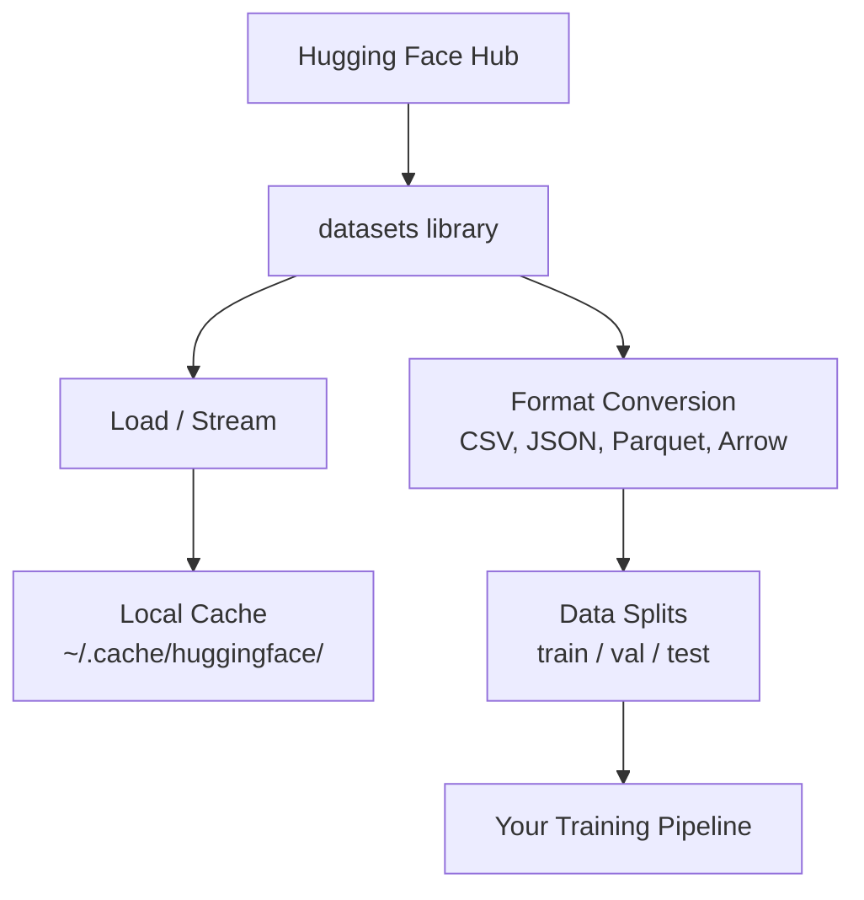

# 数据管理

> 数据是燃料。你如何管理它，决定了你能跑多快。

**类型：** Build
**语言：** Python
**前置知识：** Phase 0，第 01 课
**时间：** 约 45 分钟

## 学习目标

- 使用 Hugging Face `datasets` 库加载、流式读取和缓存数据集
- 在 CSV、JSON、Parquet 和 Arrow 格式之间转换，并解释它们的取舍
- 用固定随机种子创建可复现的 train/validation/test 划分
- 使用 `.gitignore`、Git LFS 或 DVC 管理大型模型和数据集文件

## 问题

每个 AI 项目都从数据开始。你需要寻找数据集、下载数据、在不同格式之间转换、划分训练和评估数据，并对它们做版本管理，让实验可以复现。每次都手动做这些事情既慢又容易出错。你需要一套可重复的工作流。

## 核心概念



Hugging Face `datasets` 库是 AI 工作中加载数据的标准方式。它开箱即用地处理下载、缓存、格式转换和流式读取。

## 动手构建

### 第 1 步：安装 datasets 库

```bash
pip install datasets huggingface_hub
```

### 第 2 步：加载数据集

```python
from datasets import load_dataset

dataset = load_dataset("imdb")
print(dataset)
print(dataset["train"][0])
```

这会下载 IMDB 电影评论数据集。第一次下载之后，它会从 `~/.cache/huggingface/datasets/` 缓存中加载。

### 第 3 步：流式读取大型数据集

有些数据集太大，无法完整放进磁盘。流式读取会逐行加载，而不是下载整个数据集。

```python
dataset = load_dataset("wikimedia/wikipedia", "20220301.en", split="train", streaming=True)

for i, example in enumerate(dataset):
    print(example["title"])
    if i >= 4:
        break
```

流式读取会给你一个 `IterableDataset`。数据到达时你逐行处理。无论数据集有多大，内存使用量都保持稳定。

### 第 4 步：数据集格式

`datasets` 库底层使用 Apache Arrow。你可以根据 pipeline 的需要转换到其他格式。

```python
dataset = load_dataset("imdb", split="train")

dataset.to_csv("imdb_train.csv")
dataset.to_json("imdb_train.json")
dataset.to_parquet("imdb_train.parquet")
```

格式对比：

| 格式 | 大小 | 读取速度 | 最适合 |
|------|------|----------|--------|
| CSV | 大 | 慢 | 人类可读、电子表格 |
| JSON | 大 | 慢 | API、嵌套数据 |
| Parquet | 小 | 快 | 分析、列式查询 |
| Arrow | 小 | 最快 | 内存中处理，也就是 `datasets` 内部使用的格式 |

对 AI 工作来说，Parquet 是最好的存储格式。Arrow 是你在内存中实际使用的格式。CSV 和 JSON 更适合交换数据。

### 第 5 步：数据划分

每个 ML 项目都需要三个划分：

- **Train**：模型从这里学习，通常占 80%
- **Validation**：训练过程中检查进展，通常占 10%
- **Test**：训练结束后的最终评估，通常占 10%

有些数据集已经预先划分好了。如果没有，就自己划分：

```python
dataset = load_dataset("imdb", split="train")

split = dataset.train_test_split(test_size=0.2, seed=42)
train_val = split["train"].train_test_split(test_size=0.125, seed=42)

train_ds = train_val["train"]
val_ds = train_val["test"]
test_ds = split["test"]

print(f"Train: {len(train_ds)}, Val: {len(val_ds)}, Test: {len(test_ds)}")
```

为了可复现，始终设置 seed。相同 seed 每次都会产生相同划分。

### 第 6 步：下载和缓存模型

模型是大文件。`huggingface_hub` 库会处理下载和缓存。

```python
from huggingface_hub import hf_hub_download, snapshot_download

model_path = hf_hub_download(
    repo_id="sentence-transformers/all-MiniLM-L6-v2",
    filename="config.json"
)
print(f"Cached at: {model_path}")

model_dir = snapshot_download("sentence-transformers/all-MiniLM-L6-v2")
print(f"Full model at: {model_dir}")
```

模型会缓存到 `~/.cache/huggingface/hub/`。下载一次后，后续运行会立即加载。

### 第 7 步：处理大文件

模型权重和大型数据集不应该进入 git。有三种选择：

**方案 A：.gitignore（最简单）**

```text
*.bin
*.safetensors
*.pt
*.onnx
data/*.parquet
data/*.csv
models/
```

**方案 B：Git LFS（在 git 中跟踪大文件）**

```bash
git lfs install
git lfs track "*.bin"
git lfs track "*.safetensors"
git add .gitattributes
```

Git LFS 会在你的 repo 中存储 pointer，把真实文件放在单独的服务器上。GitHub 免费提供 1 GB。

**方案 C：DVC（data version control）**

```bash
pip install dvc
dvc init
dvc add data/training_set.parquet
git add data/training_set.parquet.dvc data/.gitignore
git commit -m "Track training data with DVC"
```

DVC 会创建很小的 `.dvc` 文件，指向你的数据。数据本身存放在 S3、GCS 或其他远程存储后端。

| 方案 | 复杂度 | 最适合 |
|------|--------|--------|
| .gitignore | 低 | 个人项目、可以重新下载的数据 |
| Git LFS | 中 | 团队通过 git 共享模型权重 |
| DVC | 高 | 可复现实验、大型数据集、团队协作 |

对本课程来说，`.gitignore` 足够了。当你需要跨机器复现精确实验时，再使用 DVC。

### 第 8 步：存储模式

**本地存储**适合小于约 10 GB 的数据集。HF cache 会自动处理。

**云存储**用于更大的数据，或需要在多台机器之间共享的数据：

```python
import os

local_path = os.path.expanduser("~/.cache/huggingface/datasets/")

# s3_path = "s3://my-bucket/datasets/"
# gcs_path = "gs://my-bucket/datasets/"
```

DVC 可以直接集成 S3 和 GCS：

```bash
dvc remote add -d myremote s3://my-bucket/dvc-store
dvc push
```

对本课程来说，本地存储已经足够。当你在远程 GPU 实例上做微调时，云存储才会变得重要。

## 本课程使用的数据集

| 数据集 | 课程 | 大小 | 它教你什么 |
|--------|------|------|------------|
| IMDB | Tokenization、classification | 84 MB | 文本分类基础 |
| WikiText | Language modeling | 181 MB | Next-token prediction |
| SQuAD | QA systems | 35 MB | 问答、span |
| Common Crawl（子集） | Embeddings | 不定 | 大规模文本处理 |
| MNIST | Vision basics | 21 MB | 图像分类基础 |
| COCO（子集） | Multimodal | 不定 | 图文配对 |

你现在不需要下载所有这些数据集。每一课都会说明自己需要什么。

## 使用它

运行工具脚本，验证一切正常：

```bash
python code/data_utils.py
```

这个脚本会下载一个小数据集，转换格式，划分数据，并打印摘要。

## 交付物

本课产出：

- `code/data_utils.py`：可复用的数据加载和缓存工具
- `outputs/prompt-data-helper.md`：为任务寻找合适数据集的 prompt

## 练习

1. 使用 `mrpc` config 加载 `glue` 数据集，并查看前 5 个样本
2. 流式读取 `c4` 数据集，统计 10 秒内可以处理多少个样本
3. 将一个数据集转换为 Parquet，并和 CSV 文件大小做对比
4. 用固定 seed 创建 70/15/15 的 train/val/test 划分，并验证大小

## 关键术语

| 术语 | 常见说法 | 实际含义 |
|------|----------|----------|
| Dataset split | “训练数据” | 一个具名子集（train/val/test），用于 ML 生命周期的不同阶段 |
| Streaming | “懒加载” | 从远程来源逐行处理数据，而不是下载完整数据集 |
| Parquet | “压缩 CSV” | 一种列式文件格式，针对分析查询和存储效率优化 |
| Arrow | “快速 dataframe” | `datasets` 库内部使用的内存列式格式，支持 zero-copy 读取 |
| Git LFS | “大文件版 Git” | 一个扩展，把大文件存放在 git repo 外部，同时在版本控制中保留 pointer |
| DVC | “数据版 Git” | 面向数据集和模型的版本控制系统，可以和云存储集成 |
| Cache | “已经下载过” | 以前获取过的数据的本地副本，默认存储在 `~/.cache/huggingface/` |
