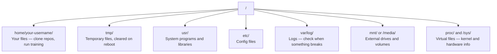

# 面向 AI 的 Linux

> 大多数 AI 都运行在 Linux 上。你需要懂到足够不会卡住。

**类型：** Learn
**语言：** --
**前置知识：** Phase 0，第 01 课
**时间：** 约 30 分钟

## 学习目标

- 在命令行中浏览 Linux 文件系统，并执行核心文件操作
- 使用 `chmod` 和 `chown` 管理文件权限，解决 “Permission denied” 错误
- 使用 `apt` 安装系统包，并为 AI 工作设置一台新的 GPU 机器
- 识别从 macOS 切到 Linux 时，远程机器开发中常见的坑

## 问题

你可能在 macOS 或 Windows 上开发。但只要你 SSH 到云 GPU 机器、租用 Lambda 实例，或启动一台 EC2，就会落到 Ubuntu 里。终端是你唯一的界面。没有 Finder，没有 Explorer，没有 GUI。如果你不能从命令行浏览文件系统、安装包和管理进程，就会一边为闲置 GPU 付费，一边搜索“Linux 怎么解压文件”。

这是一份生存指南。它只覆盖你在远程 Linux 机器上做 AI 工作需要的内容。不多讲。

## 文件系统布局

Linux 会把所有东西组织在单一根目录 `/` 下。没有 `C:\` 或 `/Volumes`。你真正会碰到的目录：



你的 home directory 是 `~` 或 `/home/your-username`。你几乎所有操作都会发生在这里。

## 核心命令

下面这 15 个命令覆盖了你在远程 GPU 机器上 95% 的操作。

### 移动位置

```bash
pwd                         # 我在哪里？
ls                          # 这里有什么？
ls -la                      # 这里有什么，包括隐藏文件及详细信息？
cd /path/to/dir             # 进入该目录
cd ~                        # 回到家目录
cd ..                       # 返回上一级目录
```

### 文件和目录

```bash
mkdir my-project            # 创建一个目录
mkdir -p a/b/c              # 一次性创建多级嵌套目录

cp file.txt backup.txt      # 复制文件
cp -r src/ src-backup/      # 递归复制目录

mv old.txt new.txt          # 重命名文件
mv file.txt /tmp/           # 移动文件

rm file.txt                 # 删除文件（不放入回收站，直接永久删除）
rm -rf my-dir/              # 删除目录及其内部的所有内容
```

`rm -rf` 是永久删除。没有撤销。按回车前再检查一遍路径。

### 读取文件

```bash
cat file.txt                # 打印整个文件内容
head -20 file.txt           # 查看前 20 行
tail -20 file.txt           # 查看后 20 行
tail -f log.txt             # 实时跟踪日志文件（按 Ctrl+C 停止）
less file.txt               # 分页滚动查看文件（按 q 退出）
```

### 搜索

```bash
grep "error" training.log           # 查找包含 "error" 的行
grep -r "learning_rate" .           # 在当前目录下的所有文件中搜索
grep -i "cuda" config.yaml          # 忽略大小写进行搜索

find . -name "*.py"                 # 查找当前目录下的所有 Python 文件
find . -name "*.ckpt" -size +1G     # 查找大于 1GB 的权重检查点文件
```

## 权限

Linux 中每个文件都有 owner 和 permission bits。当脚本不能执行，或者你无法写入目录时，就会碰到它。

```bash
ls -l train.py
# -rwxr-xr-- 1 user group 2048 Mar 19 10:00 train.py
#  ^^^             所有者权限：读、写、执行
#     ^^^          用户组权限：读、执行
#        ^^        其他所有人：只读
```

常见修复：

```bash
chmod +x train.sh           # 使脚本可执行
chmod 755 deploy.sh         # 所有者：全部权限，其他人：读+执行权限
chmod 644 config.yaml       # 所有者：读+写权限，其他人：只读权限

chown user:group file.txt   # 修改文件所有者（需要 sudo 权限）
```

当某个东西提示 “Permission denied” 时，几乎总是权限问题。`chmod +x` 或 `sudo` 可以修复大多数情况。

## 包管理 (apt)

Ubuntu 使用 `apt`。这是安装系统级软件的方式。

```bash
sudo apt update             # 刷新软件包列表（每次安装前必做）
sudo apt install -y htop    # 安装软件包（-y 参数跳过确认提示）
sudo apt install -y build-essential  # C 编译器、make 工具等。许多 Python 包构建时需要它
sudo apt install -y tmux    # 终端复用器（断开连接后保持会话存活）

apt list --installed        # 列出已安装的软件包
sudo apt remove htop        # 卸载软件包
```

一台新的 GPU 机器上常见会安装这些包：

```bash
sudo apt update && sudo apt install -y \
    build-essential \
    git \
    curl \
    wget \
    tmux \
    htop \
    unzip \
    python3-venv
```

## 用户和 sudo

你通常会以普通用户登录。有些操作需要 root（管理员）权限。

```bash
whoami                      # 我当前是哪个用户？
sudo command                # 以 root 身份运行单个命令
sudo su                     # 切换为 root 用户（输入 exit 返回普通用户，请谨慎使用）
```

在云 GPU 实例上，你通常是唯一用户，并且已经有 sudo 权限。不要把所有命令都用 root 运行。只在需要时使用 sudo。

## 进程和 systemd

当训练卡住，或你需要检查正在运行什么时：

```bash
htop                        # 交互式进程查看器（按 q 退出）
ps aux | grep python        # 查找正在运行的 Python 进程
kill 12345                  # 优雅停止 PID 为 12345 的进程
kill -9 12345               # 强制结束进程（在优雅停止无效时使用）
nvidia-smi                  # GPU 进程和显存占用情况
```

systemd 管理 services（后台 daemons）。如果你运行推理服务，会用到它：

```bash
sudo systemctl start nginx          # 启动服务
sudo systemctl stop nginx           # 停止服务
sudo systemctl restart nginx        # 重启服务
sudo systemctl status nginx         # 检查服务是否正在运行
sudo systemctl enable nginx         # 设置服务开机自启
```

## 磁盘空间

GPU 机器的磁盘空间经常有限。模型和数据集会很快把它填满。

```bash
df -h                       # 查看所有已挂载磁盘的空间使用情况
df -h /home                 # 专门查看 /home 目录的磁盘空间使用情况

du -sh *                    # 查看当前目录下每个文件/文件夹的大小
du -sh ~/.cache             # 查看缓存大小（pip、huggingface 模型会下载到这里）
du -sh /data/checkpoints/   # 检查检查点文件夹的大小

# Find the biggest space hogs
du -h --max-depth=1 / 2>/dev/null | sort -hr | head -20
```

常见节省空间方法：

```bash
# 清理 pip 缓存
pip cache purge

# 清理 apt 缓存
sudo apt clean

# 删除不需要的旧检查点
rm -rf checkpoints/epoch_01/ checkpoints/epoch_02/
```

## 网络

你会从命令行下载模型、传输文件和调用 API。

```bash
# 下载文件
wget https://example.com/model.bin                   # 下载文件
curl -O https://example.com/data.tar.gz              # 使用 curl 下载同一文件
curl -s https://api.example.com/health | python3 -m json.tool  # 请求 API 并格式化输出 JSON

# 在机器之间传输文件
scp model.bin user@remote:/data/                     # 将文件复制到远程机器
scp user@remote:/data/results.csv .                  # 从远程机器复制文件到本地
scp -r user@remote:/data/checkpoints/ ./local-dir/   # 复制目录

# 同步目录（传输大文件比 scp 快，且支持断点续传）
rsync -avz --progress ./data/ user@remote:/data/
rsync -avz --progress user@remote:/results/ ./results/
```

对任何大文件，优先使用 `rsync` 而不是 `scp`。它只传输变化的字节，并能处理连接中断。

## tmux：保持 session 存活

当你 SSH 到远程机器时，合上笔记本会 kill 掉训练运行。tmux 可以避免这件事。

```bash
tmux new -s train           # 创建并启动名为 "train" 的新会话
# ... 开始你的训练，然后：
# Ctrl+B, then D            # 分离当前会话（训练进程在后台继续运行）

tmux ls                     # 列出所有会话
tmux attach -t train        # 重新连接到会话

# 在 tmux 内部：
# Ctrl+B, then %            # 垂直分割窗格
# Ctrl+B, then "            # 水平分割窗格
# Ctrl+B, then arrow keys   # 在窗格之间切换
```

长时间训练任务一定要放在 tmux 里。一定要。

## 给 Windows 用户的 WSL2

如果你在 Windows 上，WSL2 可以在不双系统启动的情况下给你一个真正的 Linux 环境。

```bash
# 在 PowerShell (以管理员身份)
wsl --install -d Ubuntu-24.04

# 重启后，从开始菜单打开 Ubuntu
sudo apt update && sudo apt upgrade -y
```

WSL2 运行真正的 Linux kernel。本课内容在其中都适用。从 WSL 内部看，你的 Windows 文件位于 `/mnt/c/Users/YourName/`。

只要 Windows 侧安装了 NVIDIA 驱动，GPU passthrough 就能工作。安装 Windows NVIDIA driver（不是 Linux 版），CUDA 就会在 WSL2 内可用。

## 易踩坑：从 macOS 到 Linux

如果你来自 macOS，下面这些会让你踩坑：

| macOS | Linux | 说明 |
|-------|-------|------|
| `brew install` | `sudo apt install` | 包名有时不同。`brew install htop` 和 `sudo apt install htop` 效果一样，但 `brew install readline` 和 `sudo apt install libreadline-dev` 不一样。 |
| `open file.txt` | `xdg-open file.txt` | 但远程机器上不会有 GUI。使用 `cat` 或 `less`。 |
| `pbcopy` / `pbpaste` | 不可用 | SSH 中不存在到剪贴板的 pipe。 |
| `~/.zshrc` | `~/.bashrc` | macOS 默认 zsh。大多数 Linux 服务器使用 bash。 |
| `/opt/homebrew/` | `/usr/bin/`、`/usr/local/bin/` | 二进制文件位于不同位置。 |
| `sed -i '' 's/a/b/' file` | `sed -i 's/a/b/' file` | macOS sed 在 `-i` 后需要一个空字符串。Linux 不需要。 |
| 大小写不敏感文件系统 | 大小写敏感文件系统 | 在 Linux 上，`Model.py` 和 `model.py` 是两个不同文件。 |
| 行尾 `\n` | 行尾 `\n` | 相同。但 Windows 使用 `\r\n`，这会破坏 bash scripts。运行 `dos2unix` 修复。 |

## 快速参考卡

```text
导航:           pwd, ls, cd, find
文件:           cp, mv, rm, mkdir, cat, head, tail, less
搜索:           grep, find
权限:           chmod, chown, sudo
软件包:         apt update, apt install
进程:           htop, ps, kill, nvidia-smi
服务:           systemctl start/stop/restart/status
磁盘:           df -h, du -sh
网络:           curl, wget, scp, rsync
会话:           tmux new/attach/detach
```

## 练习

1. SSH 到任意 Linux 机器（或打开 WSL2），进入你的 home directory。创建一个 project 文件夹，在里面用 `touch` 创建三个空文件，然后用 `ls -la` 列出它们。
2. 用 apt 安装 `htop`，运行它，并找出哪个进程使用最多内存。
3. 启动一个 tmux session，在里面运行 `sleep 300`，detach，列出 sessions，然后 reattach。
4. 使用 `df -h` 检查可用磁盘空间，然后使用 `du -sh ~/.cache/*` 找出 cache 中哪些内容占空间。
5. 使用 `scp` 从本地机器向远程机器传输一个文件，然后用 `rsync` 做同样的传输，并比较体验。
