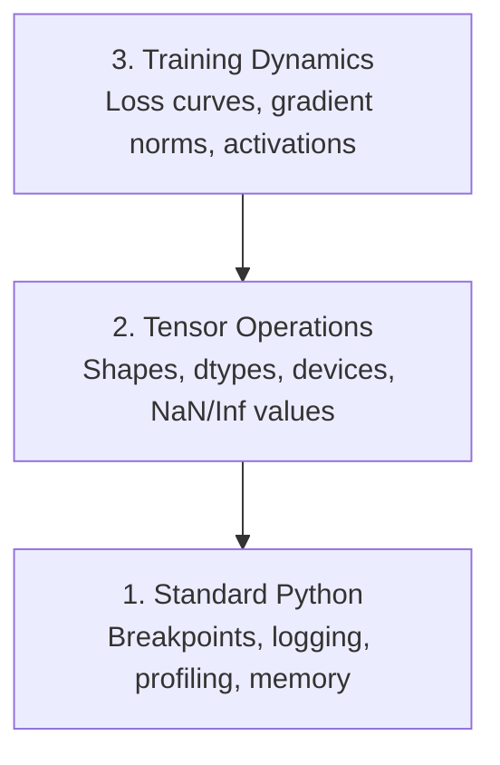

# 调试与 Profiling

> 最糟糕的 AI bug 不会崩溃。它们会在垃圾数据上安静训练，然后汇报一条漂亮的 loss curve。

**类型：** Build
**语言：** Python
**前置知识：** 第 1 课（开发环境），基础 PyTorch 熟悉度
**时间：** 约 60 分钟

## 学习目标

- 使用条件式 `breakpoint()` 和 `debug_print` 在训练中检查 tensor shape、dtype 和 NaN 值
- 使用 `cProfile`、`line_profiler` 和 `tracemalloc` profiling 训练循环，寻找瓶颈
- 检测常见 AI bug：shape mismatch、NaN loss、data leakage 和 wrong-device tensors
- 设置 TensorBoard，可视化 loss curves、weight histograms 和 gradient distributions

## 问题

AI 代码的失败方式和普通代码不同。Web app 会带着 stack trace 崩溃。而一个配置错误的训练循环可以运行 8 小时，烧掉 200 美元 GPU 费用，最后得到一个对所有输入都预测均值的模型。代码从未报错。bug 可能是 tensor 在错误设备上、忘记 `.detach()`，或 labels 泄漏进 features。

你需要能在这些静默失败浪费时间和算力前抓住它们的调试工具。

## 核心概念

AI 调试分为三个层级：



大多数人会直接跳到第 3 层，也就是盯着 TensorBoard 看。但 80% 的 AI bug 都在第 1 层和第 2 层。

## 动手构建

### 第 1 部分：Print Debugging（是的，它有用）

Print debugging 经常被轻视。它不该被轻视。对 tensor 代码来说，一个有针对性的 print statement 通常比单步 debugger 更有用，因为你需要同时看到 shape、dtype 和数值范围。

```python
def debug_print(name, tensor):
    print(f"{name}: shape={tensor.shape}, dtype={tensor.dtype}, "
          f"device={tensor.device}, "
          f"min={tensor.min().item():.4f}, max={tensor.max().item():.4f}, "
          f"mean={tensor.mean().item():.4f}, "
          f"has_nan={tensor.isnan().any().item()}")
```

在每个可疑操作后调用它。找到 bug 后，移除这些 prints。很简单。

### 第 2 部分：Python Debugger（pdb 和 breakpoint）

内置 debugger 对 AI 工作来说被低估了。把 `breakpoint()` 放进训练循环，然后交互式检查 tensors。

```python
def training_step(model, batch, criterion, optimizer):
    inputs, labels = batch
    outputs = model(inputs)
    loss = criterion(outputs, labels)

    if loss.item() > 100 or torch.isnan(loss):
        breakpoint()

    loss.backward()
    optimizer.step()
```

进入 debugger 后，常用命令：

- `p outputs.shape` 检查 shapes
- `p loss.item()` 查看 loss 值
- `p torch.isnan(outputs).sum()` 统计 NaN 数量
- `p model.fc1.weight.grad` 检查 gradients
- `c` 继续，`q` 退出

这就是条件式调试。只有看起来不对时才暂停。对一个 10,000 step 的训练来说，这很重要。

### 第 3 部分：Python Logging

当调试超过一次快速检查时，用 logging 替换 print statements。

```python
import logging

logging.basicConfig(
    level=logging.INFO,
    format="%(asctime)s [%(levelname)s] %(message)s",
    handlers=[
        logging.FileHandler("training.log"),
        logging.StreamHandler()
    ]
)
logger = logging.getLogger(__name__)

logger.info("Starting training: lr=%.4f, batch_size=%d", lr, batch_size)
logger.warning("Loss spike detected: %.4f at step %d", loss.item(), step)
logger.error("NaN loss at step %d, stopping", step)
```

Logging 给你 timestamps、severity levels 和文件输出。当训练在凌晨 3 点失败时，你想要的是日志文件，而不是已经滚出屏幕的终端输出。

### 第 4 部分：为代码片段计时

知道时间花在哪里，是优化的第一步。

```python
import time

class Timer:
    def __init__(self, name=""):
        self.name = name

    def __enter__(self):
        self.start = time.perf_counter()
        return self

    def __exit__(self, *args):
        elapsed = time.perf_counter() - self.start
        print(f"[{self.name}] {elapsed:.4f}s")

with Timer("data loading"):
    batch = next(dataloader_iter)

with Timer("forward pass"):
    outputs = model(batch)

with Timer("backward pass"):
    loss.backward()
```

常见发现：data loading 占训练时间的 60%。修复方法是在 DataLoader 中设置 `num_workers > 0`，而不是换更快的 GPU。

### 第 5 部分：cProfile 和 line_profiler

当手动 timer 不够时：

```bash
python -m cProfile -s cumtime train.py
```

它会按 cumulative time 排序显示每个函数调用。如果需要逐行 profiling：

```bash
pip install line_profiler
```

```python
@profile
def train_step(model, data, target):
    output = model(data)
    loss = F.cross_entropy(output, target)
    loss.backward()
    return loss

# Run with: kernprof -l -v train.py
```

### 第 6 部分：Memory Profiling

#### 使用 tracemalloc 查看 CPU Memory

```python
import tracemalloc

tracemalloc.start()

# your code here
model = build_model()
data = load_dataset()

snapshot = tracemalloc.take_snapshot()
top_stats = snapshot.statistics("lineno")
for stat in top_stats[:10]:
    print(stat)
```

#### 使用 memory_profiler 查看 CPU Memory

```bash
pip install memory_profiler
```

```python
from memory_profiler import profile

@profile
def load_data():
    raw = read_csv("data.csv")       # watch memory jump here
    processed = preprocess(raw)       # and here
    return processed
```

用 `python -m memory_profiler your_script.py` 运行，可以看到逐行内存使用情况。

#### 使用 PyTorch 查看 GPU Memory

```python
import torch

if torch.cuda.is_available():
    print(torch.cuda.memory_summary())

    print(f"Allocated: {torch.cuda.memory_allocated() / 1e9:.2f} GB")
    print(f"Cached: {torch.cuda.memory_reserved() / 1e9:.2f} GB")
```

遇到 OOM (Out of Memory) 时：

1. 减小 batch size（永远先试这个）
2. 使用 `torch.cuda.empty_cache()` 释放缓存内存
3. 对大型中间变量使用 `del tensor`，然后调用 `torch.cuda.empty_cache()`
4. 使用 mixed precision (`torch.cuda.amp`) 将内存占用减半
5. 对非常深的模型使用 gradient checkpointing

### 第 7 部分：常见 AI Bug 以及如何捕捉

#### Shape Mismatch

最常见的 bug。tensor 形状是 `[batch, features]`，而模型期望 `[batch, channels, height, width]`。

```python
def check_shapes(model, sample_input):
    print(f"Input: {sample_input.shape}")
    hooks = []

    def make_hook(name):
        def hook(module, inp, out):
            in_shape = inp[0].shape if isinstance(inp, tuple) else inp.shape
            out_shape = out.shape if hasattr(out, "shape") else type(out)
            print(f"  {name}: {in_shape} -> {out_shape}")
        return hook

    for name, module in model.named_modules():
        hooks.append(module.register_forward_hook(make_hook(name)))

    with torch.no_grad():
        model(sample_input)

    for h in hooks:
        h.remove()
```

用一个 sample batch 跑一次。它会映射模型中的每一次 shape transformation。

#### NaN Loss

NaN loss 意味着有东西爆了。常见原因：

- Learning rate 太高
- 自定义 loss 中除以零
- 对零或负数取 log
- RNN 中 gradients 爆炸

```python
def detect_nan(model, loss, step):
    if torch.isnan(loss):
        print(f"NaN loss at step {step}")
        for name, param in model.named_parameters():
            if param.grad is not None:
                if torch.isnan(param.grad).any():
                    print(f"  NaN gradient in {name}")
                if torch.isinf(param.grad).any():
                    print(f"  Inf gradient in {name}")
        return True
    return False
```

#### Data Leakage

你的模型在 test set 上达到 99% accuracy。听起来很好。这是 bug。

```python
def check_data_leakage(train_set, test_set, id_column="id"):
    train_ids = set(train_set[id_column].tolist())
    test_ids = set(test_set[id_column].tolist())
    overlap = train_ids & test_ids
    if overlap:
        print(f"DATA LEAKAGE: {len(overlap)} samples in both train and test")
        return True
    return False
```

还要检查 temporal leakage：用未来数据预测过去。划分前先按 timestamp 排序。

#### Wrong Device

Tensors 位于不同设备（CPU vs GPU）会导致 runtime errors。但有时一个 tensor 会静默留在 CPU 上，而其他都在 GPU 上，训练只是变慢。

```python
def check_devices(model, *tensors):
    model_device = next(model.parameters()).device
    print(f"Model device: {model_device}")
    for i, t in enumerate(tensors):
        if t.device != model_device:
            print(f"  WARNING: tensor {i} on {t.device}, model on {model_device}")
```

### 第 8 部分：TensorBoard 基础

TensorBoard 会展示训练过程中内部发生了什么。

```bash
pip install tensorboard
```

```python
from torch.utils.tensorboard import SummaryWriter

writer = SummaryWriter("runs/experiment_1")

for step in range(num_steps):
    loss = train_step(model, batch)

    writer.add_scalar("loss/train", loss.item(), step)
    writer.add_scalar("lr", optimizer.param_groups[0]["lr"], step)

    if step % 100 == 0:
        for name, param in model.named_parameters():
            writer.add_histogram(f"weights/{name}", param, step)
            if param.grad is not None:
                writer.add_histogram(f"grads/{name}", param.grad, step)

writer.close()
```

启动它：

```bash
tensorboard --logdir=runs
```

需要关注什么：

- **Loss 不下降**：Learning rate 太低，或模型架构有问题
- **Loss 剧烈震荡**：Learning rate 太高
- **Loss 变成 NaN**：数值不稳定（见上面的 NaN 部分）
- **Train loss 下降，val loss 上升**：过拟合
- **Weight histograms 塌缩到零**：Vanishing gradients
- **Gradient histograms 爆炸**：需要 gradient clipping

### 第 9 部分：VS Code Debugger

如果要交互式调试，用 `launch.json` 配置 VS Code：

```json
{
    "version": "0.2.0",
    "configurations": [
        {
            "name": "Debug Training",
            "type": "debugpy",
            "request": "launch",
            "program": "${file}",
            "console": "integratedTerminal",
            "justMyCode": false
        }
    ]
}
```

点击 gutter 设置 breakpoints。使用 Variables pane 检查 tensor 属性。Debug Console 允许你在执行中运行任意 Python expression。

这对逐步查看 data preprocessing pipeline 很有用，因为你可以看到每一次 transformation。

## 使用它

下面这套调试工作流能抓住大多数 AI bug：

1. **训练前**：用 sample batch 运行 `check_shapes`。确认输入和输出维度符合预期。
2. **前 10 个 step**：对 loss、outputs 和 gradients 使用 `debug_print`。确认没有 NaN，数值也处于合理范围。
3. **训练中**：记录 loss、learning rate 和 gradient norms。用 TensorBoard 做可视化。
4. **出问题时**：在失败点放入 `breakpoint()`。交互式检查 tensors。
5. **性能问题**：分别计时 data loading、forward 和 backward pass。如果接近 OOM，就做 memory profiling。

## 交付物

运行调试工具脚本：

```bash
python phases/00-setup-and-tooling/12-debugging-and-profiling/code/debug_tools.py
```

查看 `outputs/prompt-debug-ai-code.md`，其中有一个帮助诊断 AI-specific bugs 的 prompt。

## 练习

1. 运行 `debug_tools.py`，阅读每个 section 的输出。修改 dummy model，引入一个 NaN（提示：在 forward pass 中除以零），观察 detector 捕捉它。
2. 使用 `cProfile` profiling 一个训练循环，并找出最慢的函数。
3. 使用 `tracemalloc` 找出数据加载 pipeline 中哪一行分配最多内存。
4. 为一个简单训练运行设置 TensorBoard，并判断模型是否过拟合。
5. 在训练循环中使用 `breakpoint()`。练习从 debugger prompt 中检查 tensor shapes、devices 和 gradient values。
