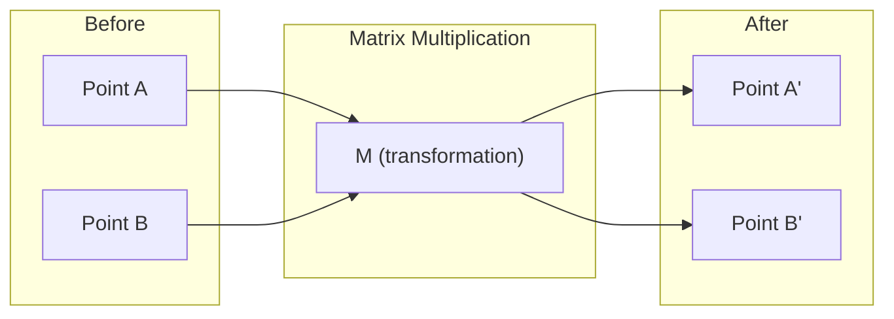
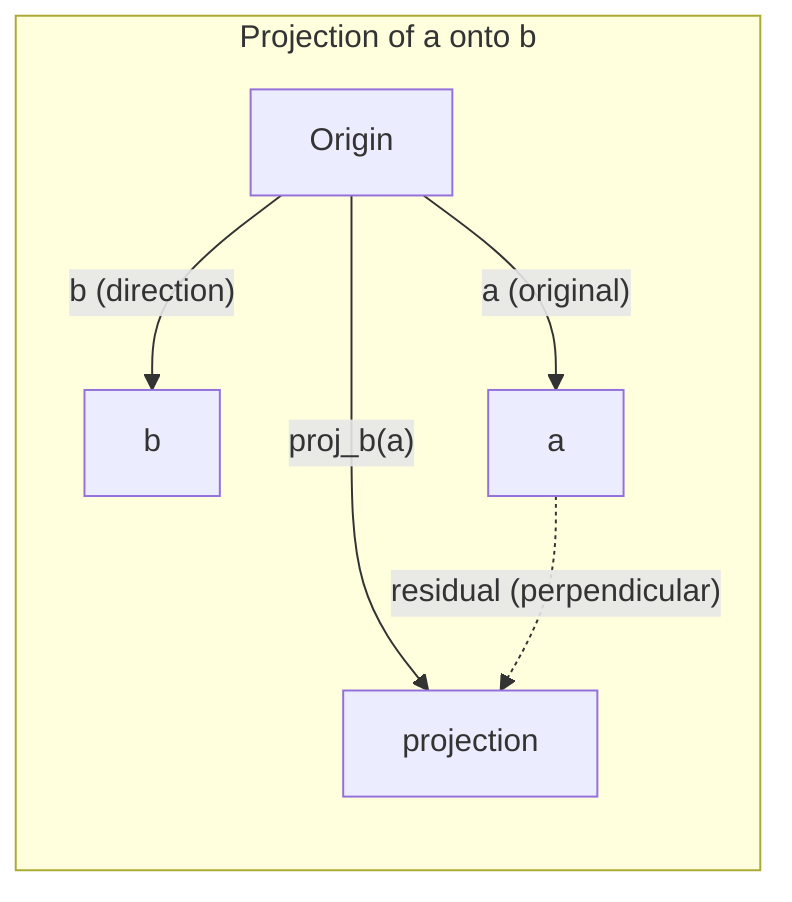

# 线性代数直觉

> 每个 AI 模型，本质上都是披着华丽外衣的矩阵数学。

**类型：** Learn  
**语言：** Python, Julia  
**前置知识：** Phase 0  
**时间：** 约 60 分钟

## 学习目标

- 向量既是点，也是方向；坐标告诉你它在空间中的位置。
- 矩阵是空间变换：旋转、缩放、投影、拉伸都可以由矩阵表达。
- 点积衡量两个向量的对齐程度，是相似度搜索和 attention score 的基础。
- 线性无关、rank 和 basis 告诉你一组特征到底包含多少独立信息。
- LoRA 用低秩矩阵表示权重更新，把大模型微调压缩到很少的可训练参数。

## 问题

本课是 Phase 1 数学基础的一部分。目标不是把数学当成孤立公式来背，而是把它连接到 AI 系统中的具体动作：数据如何被表示，模型如何变换表示，loss 如何给出方向，以及训练为什么会稳定或失稳。

学习时请把每个概念都追问三件事：它在空间中做了什么？它在代码里对应哪个运算？它在神经网络、检索、生成模型或优化中解决什么问题？

## 核心概念

1. 向量既是点，也是方向；坐标告诉你它在空间中的位置。
2. 矩阵是空间变换：旋转、缩放、投影、拉伸都可以由矩阵表达。
3. 点积衡量两个向量的对齐程度，是相似度搜索和 attention score 的基础。
4. 线性无关、rank 和 basis 告诉你一组特征到底包含多少独立信息。
5. LoRA 用低秩矩阵表示权重更新，把大模型微调压缩到很少的可训练参数。

## 动手构建

按照本课 `code/` 目录运行示例实现。优先先读从零实现版本，再对照 NumPy、PyTorch 或 Julia 中的同类操作。你应该能解释每一行 shape 如何变化，而不是只得到一个数值结果。

建议流程：

1. 先手算一个 2D 或 2x2 的小例子。
2. 运行本课代码，确认输出和手算一致。
3. 改动输入 shape 或参数，观察结果如何变化。
4. 把同一概念连接回 AI 场景，例如 embeddings、attention、loss、optimization 或 sampling。

## 关键公式与代码片段

以下片段保留自英文原文，便于直接复制运行或对照数学符号。



```text
a · b = a₁×b₁ + a₂×b₂ + ... + aₙ×bₙ

Same direction:      a · b > 0  (similar)
Perpendicular:       a · b = 0  (unrelated)
Opposite direction:  a · b < 0  (dissimilar)
```

```text
v1 = [1, 0, 0]
v2 = [0, 1, 0]
v3 = [2, 1, 0]   # v3 = 2*v1 + v2
```

```text
proj_b(a) = (a dot b / b dot b) * b
```



```text
Input:  v1, v2, v3, ... (linearly independent)

u1 = v1 / |v1|

w2 = v2 - (v2 dot u1) * u1
u2 = w2 / |w2|

w3 = v3 - (v3 dot u1) * u1 - (v3 dot u2) * u2
u3 = w3 / |w3|

Output: u1, u2, u3, ... (orthonormal basis)
```

```python
class Vector:
    def __init__(self, components):
        self.components = list(components)
        self.dim = len(self.components)

    def __add__(self, other):
        return Vector([a + b for a, b in zip(self.components, other.components)])

    def __sub__(self, other):
        return Vector([a - b for a, b in zip(self.components, other.components)])

    def dot(self, other):
        return sum(a * b for a, b in zip(self.components, other.components))

    def magnitude(self):
        return sum(x**2 for x in self.components) ** 0.5

    def normalize(self):
        mag = self.magnitude()
        return Vector([x / mag for x in self.components])

    def cosine_similarity(self, other):
        return self.dot(other) / (self.magnitude() * other.magnitude())

    def __repr__(self):
        return f"Vector({self.components})"


a = Vector([1, 2, 3])
b = Vector([4, 5, 6])

print(f"a + b = {a + b}")
print(f"a · b = {a.dot(b)}")
print(f"|a| = {a.magnitude():.4f}")
print(f"cosine similarity = {a.cosine_similarity(b):.4f}")
```

```python
class Matrix:
    def __init__(self, rows):
        self.rows = [list(row) for row in rows]
        self.shape = (len(self.rows), len(self.rows[0]))

    def __matmul__(self, other):
        if isinstance(other, Vector):
            return Vector([
                sum(self.rows[i][j] * other.components[j] for j in range(self.shape[1]))
                for i in range(self.shape[0])
            ])
        rows = []
        for i in range(self.shape[0]):
            row = []
            for j in range(other.shape[1]):
                row.append(sum(
                    self.rows[i][k] * other.rows[k][j]
                    for k in range(self.shape[1])
                ))
            rows.append(row)
        return Matrix(rows)

    def transpose(self):
        return Matrix([
            [self.rows[j][i] for j in range(self.shape[0])]
            for i in range(self.shape[1])
        ])

    def __repr__(self):
        return f"Matrix({self.rows})"


rotation_90 = Matrix([[0, -1], [1, 0]])
point = Vector([3, 1])

rotated = rotation_90 @ point
print(f"Original: {point}")
print(f"Rotated 90°: {rotated}")
```

```python
import random

random.seed(42)
weights = Matrix([[random.gauss(0, 0.1) for _ in range(3)] for _ in range(2)])
input_vector = Vector([1.0, 0.5, -0.3])

output = weights @ input_vector
print(f"Input (3D): {input_vector}")
print(f"Output (2D): {output}")
print("This is what a neural network layer does -- matrix multiplication.")
```

```julia
a = [1.0, 2.0, 3.0]
b = [4.0, 5.0, 6.0]

println("a + b = ", a + b)
println("a · b = ", a ⋅ b)       # Julia supports unicode operators
println("|a| = ", √(a ⋅ a))
println("cosine = ", (a ⋅ b) / (√(a ⋅ a) * √(b ⋅ b)))

# Matrix-vector multiplication
W = [0.1 -0.2 0.3; 0.4 0.5 -0.1]
x = [1.0, 0.5, -0.3]
println("Wx = ", W * x)
println("This is a neural network layer.")
```

```python
def is_linearly_independent(vectors):
    n = len(vectors)
    dim = len(vectors[0].components)
    mat = Matrix([v.components[:] for v in vectors])
    rows = [row[:] for row in mat.rows]
    rank = 0
    for col in range(dim):
        pivot = None
        for row in range(rank, len(rows)):
            if abs(rows[row][col]) > 1e-10:
                pivot = row
                break
        if pivot is None:
            continue
        rows[rank], rows[pivot] = rows[pivot], rows[rank]
        scale = rows[rank][col]
        rows[rank] = [x / scale for x in rows[rank]]
        for row in range(len(rows)):
            if row != rank and abs(rows[row][col]) > 1e-10:
                factor = rows[row][col]
                rows[row] = [rows[row][j] - factor * rows[rank][j] for j in range(dim)]
        rank += 1
    return rank == n


def project(a, b):
    scalar = a.dot(b) / b.dot(b)
    return Vector([scalar * x for x in b.components])


def gram_schmidt(vectors):
    orthonormal = []
    for v in vectors:
        w = v
        for u in orthonormal:
            proj = project(w, u)
            w = w - proj
        if w.magnitude() < 1e-10:
            continue
        orthonormal.append(w.normalize())
    return orthonormal


v1 = Vector([1, 0, 0])
v2 = Vector([1, 1, 0])
v3 = Vector([1, 1, 1])
basis = gram_schmidt([v1, v2, v3])
for i, u in enumerate(basis):
    print(f"u{i+1} = {u}")
    print(f"  |u{i+1}| = {u.magnitude():.6f}")

print(f"u1 · u2 = {basis[0].dot(basis[1]):.6f}")
print(f"u1 · u3 = {basis[0].dot(basis[2]):.6f}")
print(f"u2 · u3 = {basis[1].dot(basis[2]):.6f}")
```

```python
import numpy as np

a = np.array([1, 2, 3], dtype=float)
b = np.array([4, 5, 6], dtype=float)

print(f"a + b = {a + b}")
print(f"a · b = {np.dot(a, b)}")
print(f"|a| = {np.linalg.norm(a):.4f}")
print(f"cosine = {np.dot(a, b) / (np.linalg.norm(a) * np.linalg.norm(b)):.4f}")

W = np.random.randn(2, 3) * 0.1
x = np.array([1.0, 0.5, -0.3])
print(f"Wx = {W @ x}")
```

> 英文原文还包含 2 个代码/公式块；中文正文保留关键块，完整可运行代码见本课 `code/` 目录。


## 使用它

完成本课后，你应该能在真实 AI 代码中识别这个数学概念出现的位置，并用它调试问题：shape mismatch、相似度异常、loss 不下降、数值爆炸、采样过于随机或过于保守等。

## 练习

1. 用一个最小数字例子复现本课核心公式。
2. 运行本课 `code/` 中的 Python 或 Julia 文件，并记录每个中间变量的 shape。
3. 找一个 AI 应用场景，说明本课概念在其中的输入、输出和失败模式。
4. 完成 `quiz.zh-CN.json` 中的测验，并回到英文原文核对术语。

## 关键术语

| 术语 | 中文理解 | AI 中的作用 |
|------|----------|-------------|
| representation | 表示 | 把现实对象变成可计算向量或张量 |
| transformation | 变换 | 用矩阵、函数或运算改变表示 |
| gradient | 梯度 | 指示 loss 变化最快方向，用于学习 |
| stability | 稳定性 | 保证训练和数值计算不会爆炸或消失 |
| approximation | 近似 | 在可计算成本内保留最重要结构 |
