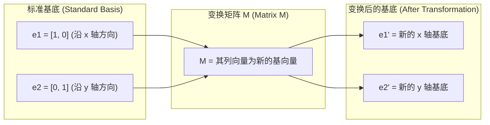
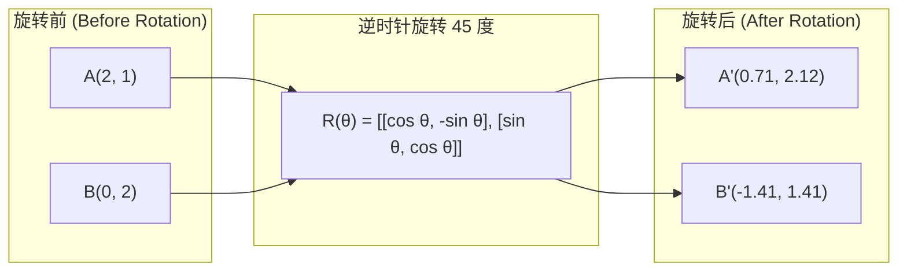
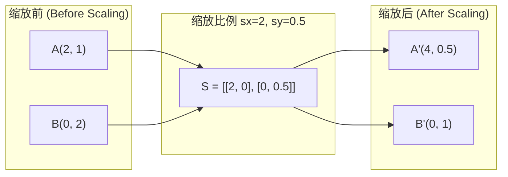
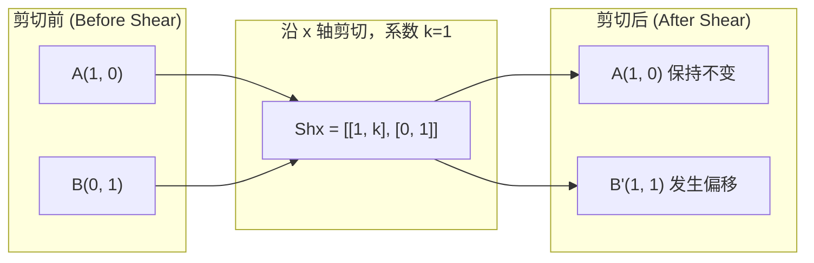
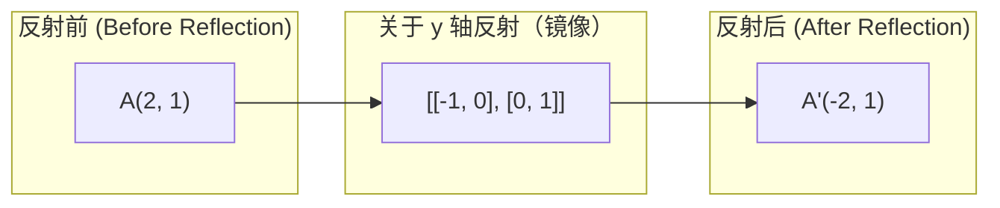
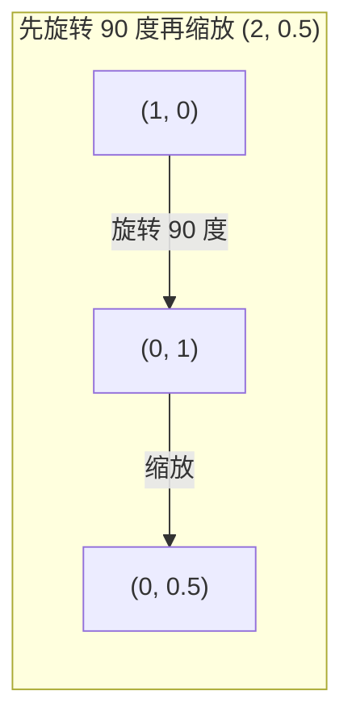
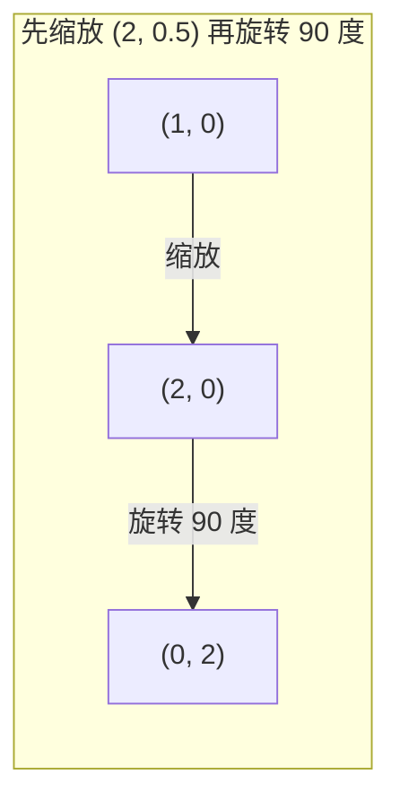

# 矩阵变换

> 矩阵是一台重塑空间的机器。理解它如何移动每个点，就理解了整个变换。

**类型：** Build  
**语言：** Python, Julia  
**前置知识：** Phase 1，第 01-02 课  
**时间：** 约 75 分钟

## 学习目标

- 二维线性变换都可以写成 2x2 矩阵；矩阵列向量告诉你 basis vectors 被送到了哪里。
- rotation 保持距离和角度，scaling 拉伸坐标轴，shearing 倾斜空间，reflection 翻转方向。
- 多个变换通过矩阵乘法组合，并且顺序很重要，因为矩阵乘法通常不可交换。
- eigenvector 是经过矩阵后方向不变、只被缩放的向量；eigenvalue 是缩放倍数。
- PCA、RNN 稳定性和 spectral clustering 都依赖 eigenvalues/eigenvectors 的几何含义。

## 问题

本课是 Phase 1 数学基础的一部分。目标不是把数学当成孤立公式来背，而是把它连接到 AI 系统中的具体动作：数据如何被表示，模型如何变换表示，loss 如何给出方向，以及训练为什么会稳定或失稳。

学习时请把每个概念都追问三件事：它在空间中做了什么？它在代码里对应哪个运算？它在神经网络、检索、生成模型或优化中解决什么问题？

## 核心概念

1. 二维线性变换都可以写成 2x2 矩阵；矩阵列向量告诉你 basis vectors 被送到了哪里。
2. rotation 保持距离和角度，scaling 拉伸坐标轴，shearing 倾斜空间，reflection 翻转方向。
3. 多个变换通过矩阵乘法组合，并且顺序很重要，因为矩阵乘法通常不可交换。
4. eigenvector 是经过矩阵后方向不变、只被缩放的向量；eigenvalue 是缩放倍数。
5. PCA、RNN 稳定性和 spectral clustering 都依赖 eigenvalues/eigenvectors 的几何含义。

## 动手构建

按照本课 `code/` 目录运行示例实现。优先先读从零实现版本，再对照 NumPy、PyTorch 或 Julia 中的同类操作。你应该能解释每一行 shape 如何变化，而不是只得到一个数值结果。

建议流程：

1. 先手算一个 2D 或 2x2 的小例子。
2. 运行本课代码，确认输出和手算一致。
3. 改动输入 shape 或参数，观察结果如何变化。
4. 把同一概念连接回 AI 场景，例如 embeddings、attention、loss、optimization 或 sampling。

## 关键公式与代码片段

以下片段为核心数学概念与代码实现，已添加详细的中文注释与说明，便于直接阅读、复制运行或对照数学符号。





```text
-- 绕 z 轴旋转（x-y 平面旋转，z 轴保持不变）
Rz(theta) = | cos  -sin  0 |
            | sin   cos  0 |
            |  0     0   1 |

-- 绕 x 轴旋转（y-z 平面旋转，x 轴保持不变）
Rx(theta) = | 1   0     0    |
            | 0  cos  -sin   |
            | 0  sin   cos   |

-- 绕 y 轴旋转（x-z 平面旋转，y 轴保持不变）
Ry(theta) = |  cos  0  sin |
            |   0   1   0  |
            | -sin  0  cos |
```











```text
-- 特征值与特征向量的基本方程：A @ v = lambda * v
A @ v = lambda * v

v 是特征向量（变换后方向保持不变的向量）
lambda 是特征值（向量在特征方向上的缩放比例）

示例：A = | 2  1 |
           | 1  2 |

特征向量 [1, 1] 对应的特征值为 3：
  A @ [1, 1] = [3, 3] = 3 * [1, 1]      -- 方向相同，长度拉伸为 3 倍

特征向量 [1, -1] 对应的特征值为 1：
  A @ [1, -1] = [1, -1] = 1 * [1, -1]   -- 方向相同，长度保持不变
```

```text
-- 特征分解（谱分解）：A = V @ D @ V^(-1)
A = V @ D @ V^(-1)

V = 以特征向量为列的矩阵
D = 对角线为特征值的对角矩阵
V^(-1) = V 的逆矩阵

物理含义：先变换到特征向量基底坐标系，沿各自对角轴进行拉伸缩放，最后再逆变换回原空间。
```

```text
det = 1:   面积/体积保持不变（如旋转变换）
det = 2:   面积/体积扩大为 2 倍（如缩放变换）
det = 0:   空间被压缩到低维，矩阵不可逆（退化/奇异变换）
det = -1:  面积/体积保持不变，但空间方向发生翻转（如镜像/反射变换）

| det(旋转变换) | = 1          -- 旋转始终保持面积不变
| det(缩放变换 sx, sy) | = sx * sy  -- 缩放使面积变为 sx * sy 倍
| det(剪切变换) | = 1          -- 剪切变换保持面积不变
| det(反射变换) | = -1         -- 反射变换翻转了手性/方向
```

```python
import math

def rotation_2d(theta):
    """生成 2D 旋转矩阵（逆时针旋转 theta 弧度）"""
    c, s = math.cos(theta), math.sin(theta)
    return [[c, -s], [s, c]]

def scaling_2d(sx, sy):
    """生成 2D 缩放矩阵"""
    return [[sx, 0], [0, sy]]

def shearing_2d(kx, ky):
    """生成 2D 剪切矩阵（kx 为 x 方向剪切系数，ky 为 y 方向剪切系数）"""
    return [[1, kx], [ky, 1]]

def reflection_x():
    """关于 x 轴（水平轴）进行镜像反射的矩阵"""
    return [[1, 0], [0, -1]]

def reflection_y():
    """关于 y 轴（垂直轴）进行镜像反射的矩阵"""
    return [[-1, 0], [0, 1]]

def mat_vec_mul(matrix, vector):
    """计算矩阵与向量的乘法（矩阵变换向量）"""
    return [
        sum(matrix[i][j] * vector[j] for j in range(len(vector)))
        for i in range(len(matrix))
    ]

def mat_mul(a, b):
    """计算两个矩阵的乘法（复合变换）"""
    rows_a, cols_b = len(a), len(b[0])
    cols_a = len(a[0])
    return [
        [sum(a[i][k] * b[k][j] for k in range(cols_a)) for j in range(cols_b)]
        for i in range(rows_a)
    ]

# 定义初始测试点 [1.0, 0.0]
point = [1.0, 0.0]
# 旋转角度（45度，即 pi/4 弧度）
angle = math.pi / 4

# 1. 旋转变换测试
rotated = mat_vec_mul(rotation_2d(angle), point)
print(f"Rotate (1,0) by 45 deg: ({rotated[0]:.4f}, {rotated[1]:.4f})")

# 2. 缩放变换测试
scaled = mat_vec_mul(scaling_2d(2, 3), [1.0, 1.0])
print(f"Scale (1,1) by (2,3): ({scaled[0]:.1f}, {scaled[1]:.1f})")

# 3. 剪切变换测试
sheared = mat_vec_mul(shearing_2d(1, 0), [1.0, 1.0])
print(f"Shear (1,1) kx=1: ({sheared[0]:.1f}, {sheared[1]:.1f})")

# 4. 反射变换测试
reflected = mat_vec_mul(reflection_y(), [2.0, 1.0])
print(f"Reflect (2,1) across y: ({reflected[0]:.1f}, {reflected[1]:.1f})")
```

> 英文原文还包含 5 个代码/公式块；中文正文保留关键块，完整可运行代码见本课 `code/` 目录。


## 使用它

完成本课后，你应该能在真实 AI 代码中识别这个数学概念出现的位置，并用它调试问题：shape mismatch、相似度异常、loss 不下降、数值爆炸、采样过于随机或过于保守等。

## 练习

1. 用一个最小数字例子复现本课核心公式。
2. 运行本课 `code/` 中的 Python 或 Julia 文件，并记录每个中间变量的 shape。
3. 找一个 AI 应用场景，说明本课概念在其中的输入、输出和失败模式。
4. 完成 `quiz.zh-CN.json` 中的测验，并回到英文原文核对术语。

## 关键术语

| 术语 | 中文理解 | AI 中的作用 |
|------|----------|-------------|
| representation | 表示 | 把现实对象变成可计算向量或张量 |
| transformation | 变换 | 用矩阵、函数或运算改变表示 |
| gradient | 梯度 | 指示 loss 变化最快方向，用于学习 |
| stability | 稳定性 | 保证训练和数值计算不会爆炸或消失 |
| approximation | 近似 | 在可计算成本内保留最重要结构 |
