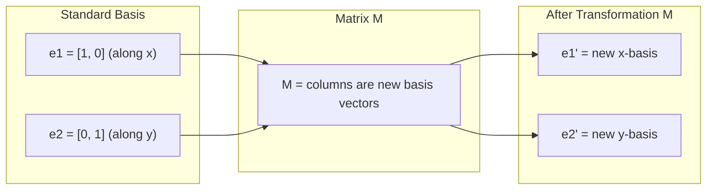
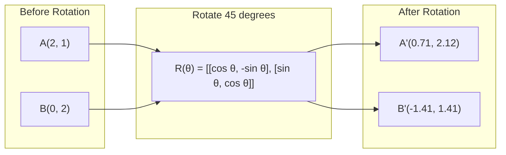
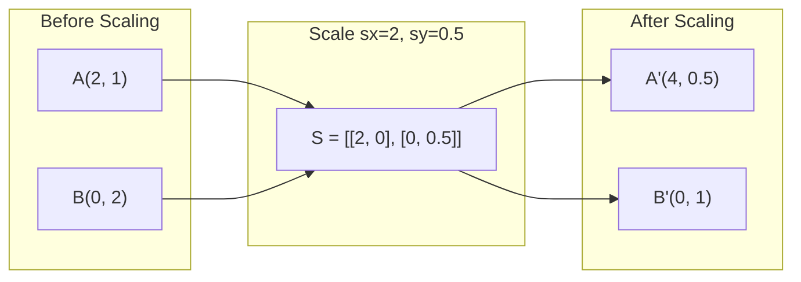
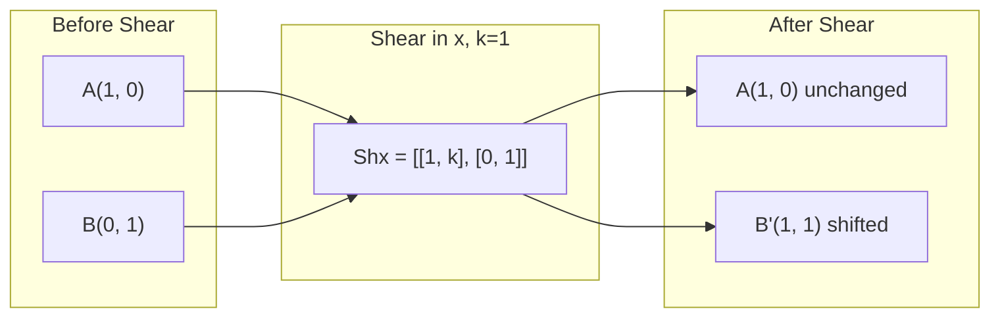
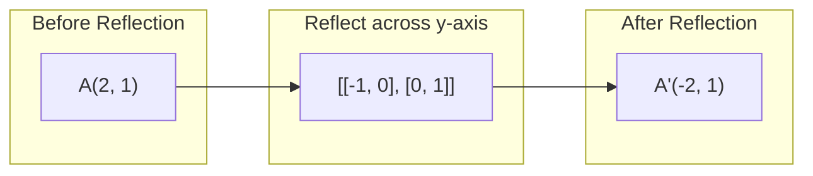
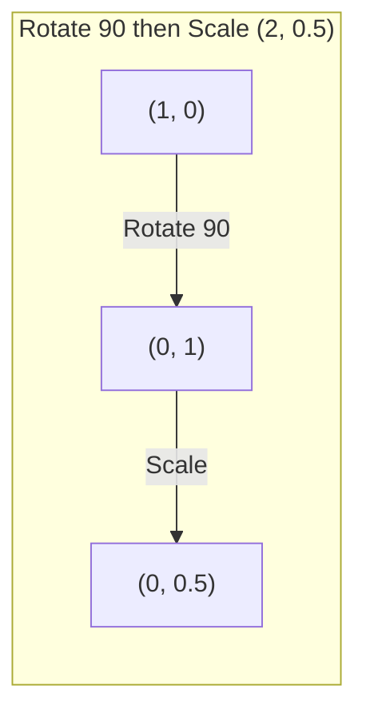
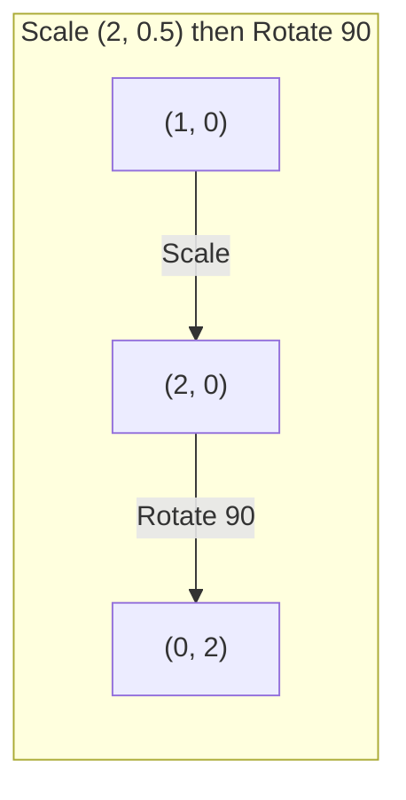

# 矩阵变换

> 矩阵是一台重塑空间的机器。理解它如何移动每个点，就理解了整个变换。

**类型：** Build  
**语言：** Python, Julia  
**前置知识：** Phase 1，第 01-02 课  
**时间：** 约 75 分钟

## 学习目标

- 二维线性变换都可以写成 2x2 矩阵；矩阵列向量告诉你 basis vectors 被送到了哪里。
- rotation 保持距离和角度，scaling 拉伸坐标轴，shearing 倾斜空间，reflection 翻转方向。
- 多个变换通过矩阵乘法组合，并且顺序很重要，因为矩阵乘法通常不可交换。
- eigenvector 是经过矩阵后方向不变、只被缩放的向量；eigenvalue 是缩放倍数。
- PCA、RNN 稳定性和 spectral clustering 都依赖 eigenvalues/eigenvectors 的几何含义。

## 问题

本课是 Phase 1 数学基础的一部分。目标不是把数学当成孤立公式来背，而是把它连接到 AI 系统中的具体动作：数据如何被表示，模型如何变换表示，loss 如何给出方向，以及训练为什么会稳定或失稳。

学习时请把每个概念都追问三件事：它在空间中做了什么？它在代码里对应哪个运算？它在神经网络、检索、生成模型或优化中解决什么问题？

## 核心概念

1. 二维线性变换都可以写成 2x2 矩阵；矩阵列向量告诉你 basis vectors 被送到了哪里。
2. rotation 保持距离和角度，scaling 拉伸坐标轴，shearing 倾斜空间，reflection 翻转方向。
3. 多个变换通过矩阵乘法组合，并且顺序很重要，因为矩阵乘法通常不可交换。
4. eigenvector 是经过矩阵后方向不变、只被缩放的向量；eigenvalue 是缩放倍数。
5. PCA、RNN 稳定性和 spectral clustering 都依赖 eigenvalues/eigenvectors 的几何含义。

## 动手构建

按照本课 `code/` 目录运行示例实现。优先先读从零实现版本，再对照 NumPy、PyTorch 或 Julia 中的同类操作。你应该能解释每一行 shape 如何变化，而不是只得到一个数值结果。

建议流程：

1. 先手算一个 2D 或 2x2 的小例子。
2. 运行本课代码，确认输出和手算一致。
3. 改动输入 shape 或参数，观察结果如何变化。
4. 把同一概念连接回 AI 场景，例如 embeddings、attention、loss、optimization 或 sampling。

## 关键公式与代码片段

以下片段保留自英文原文，便于直接复制运行或对照数学符号。





```text
Rz(theta) = | cos  -sin  0 |     Rotate around z-axis
            | sin   cos  0 |     (x-y plane spins, z stays)
            |  0     0   1 |

Rx(theta) = | 1   0     0    |   Rotate around x-axis
            | 0  cos  -sin   |   (y-z plane spins, x stays)
            | 0  sin   cos   |

Ry(theta) = |  cos  0  sin |     Rotate around y-axis
            |   0   1   0  |     (x-z plane spins, y stays)
            | -sin  0  cos |
```











```text
A @ v = lambda * v

v is the eigenvector (direction that survives)
lambda is the eigenvalue (how much it stretches)

Example: A = | 2  1 |
             | 1  2 |

Eigenvector [1, 1] with eigenvalue 3:
  A @ [1,1] = [3, 3] = 3 * [1, 1]     (same direction, scaled by 3)

Eigenvector [1, -1] with eigenvalue 1:
  A @ [1,-1] = [1, -1] = 1 * [1, -1]  (same direction, unchanged)
```

```text
A = V @ D @ V^(-1)

V = matrix whose columns are eigenvectors
D = diagonal matrix of eigenvalues
V^(-1) = inverse of V

This says: rotate into eigenvector coordinates, scale along each axis, rotate back.
```

```text
det = 1:   area preserved (rotation)
det = 2:   area doubled
det = 0:   space crushed to lower dimension (singular)
det = -1:  area preserved but orientation flipped (reflection)

| det(Rotation) | = 1        (always)
| det(Scale sx, sy) | = sx * sy
| det(Shear) | = 1           (area preserved)
| det(Reflection) | = -1     (orientation flipped)
```

```python
import math

def rotation_2d(theta):
    c, s = math.cos(theta), math.sin(theta)
    return [[c, -s], [s, c]]

def scaling_2d(sx, sy):
    return [[sx, 0], [0, sy]]

def shearing_2d(kx, ky):
    return [[1, kx], [ky, 1]]

def reflection_x():
    return [[1, 0], [0, -1]]

def reflection_y():
    return [[-1, 0], [0, 1]]

def mat_vec_mul(matrix, vector):
    return [
        sum(matrix[i][j] * vector[j] for j in range(len(vector)))
        for i in range(len(matrix))
    ]

def mat_mul(a, b):
    rows_a, cols_b = len(a), len(b[0])
    cols_a = len(a[0])
    return [
        [sum(a[i][k] * b[k][j] for k in range(cols_a)) for j in range(cols_b)]
        for i in range(rows_a)
    ]

point = [1.0, 0.0]
angle = math.pi / 4

rotated = mat_vec_mul(rotation_2d(angle), point)
print(f"Rotate (1,0) by 45 deg: ({rotated[0]:.4f}, {rotated[1]:.4f})")

scaled = mat_vec_mul(scaling_2d(2, 3), [1.0, 1.0])
print(f"Scale (1,1) by (2,3): ({scaled[0]:.1f}, {scaled[1]:.1f})")

sheared = mat_vec_mul(shearing_2d(1, 0), [1.0, 1.0])
print(f"Shear (1,1) kx=1: ({sheared[0]:.1f}, {sheared[1]:.1f})")

reflected = mat_vec_mul(reflection_y(), [2.0, 1.0])
print(f"Reflect (2,1) across y: ({reflected[0]:.1f}, {reflected[1]:.1f})")
```

> 英文原文还包含 5 个代码/公式块；中文正文保留关键块，完整可运行代码见本课 `code/` 目录。


## 使用它

完成本课后，你应该能在真实 AI 代码中识别这个数学概念出现的位置，并用它调试问题：shape mismatch、相似度异常、loss 不下降、数值爆炸、采样过于随机或过于保守等。

## 练习

1. 用一个最小数字例子复现本课核心公式。
2. 运行本课 `code/` 中的 Python 或 Julia 文件，并记录每个中间变量的 shape。
3. 找一个 AI 应用场景，说明本课概念在其中的输入、输出和失败模式。
4. 完成 `quiz.zh-CN.json` 中的测验，并回到英文原文核对术语。

## 关键术语

| 术语 | 中文理解 | AI 中的作用 |
|------|----------|-------------|
| representation | 表示 | 把现实对象变成可计算向量或张量 |
| transformation | 变换 | 用矩阵、函数或运算改变表示 |
| gradient | 梯度 | 指示 loss 变化最快方向，用于学习 |
| stability | 稳定性 | 保证训练和数值计算不会爆炸或消失 |
| approximation | 近似 | 在可计算成本内保留最重要结构 |
