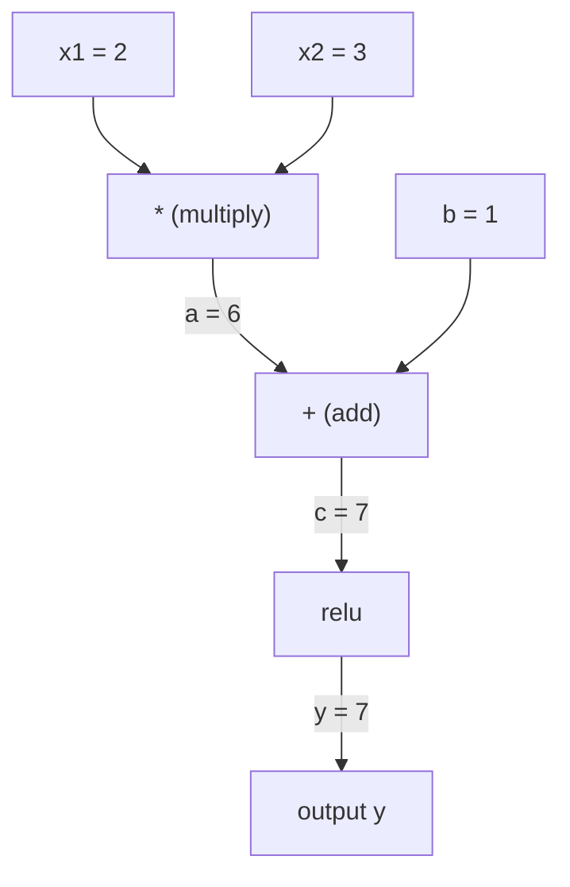
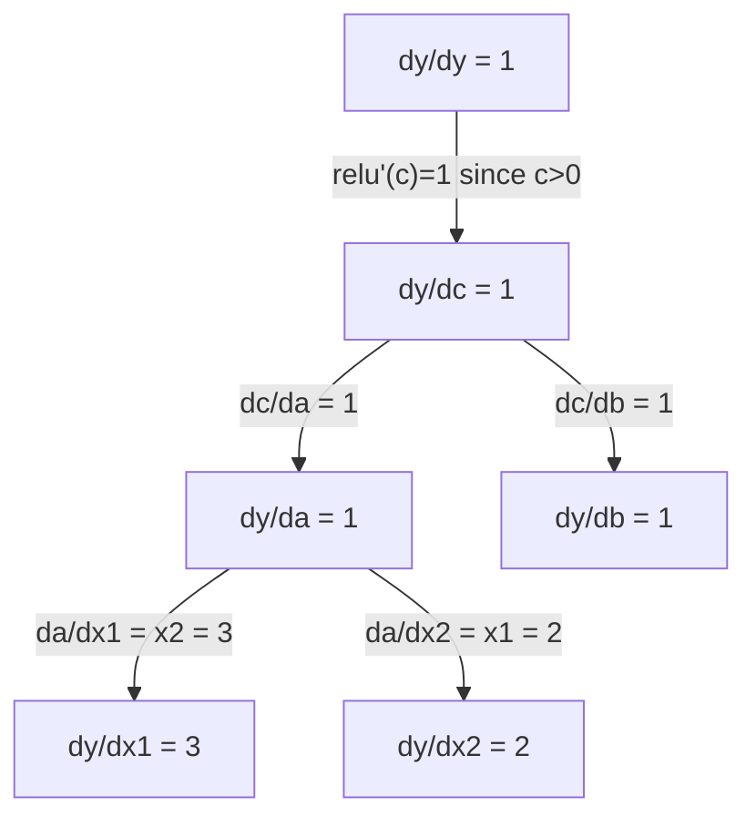

# 链式法则与自动微分

> 链式法则是每个会学习的神经网络背后的引擎。

**类型：** Build  
**语言：** Python  
**前置知识：** Phase 1，第 04 课  
**时间：** 约 90 分钟

## 学习目标

- 链式法则说明复合函数的导数等于每一层局部导数的乘积。
- computational graph 把每个操作表示为节点；值向前流动，梯度向后流动。
- reverse-mode autodiff 适合“很多参数，一个标量 loss”的神经网络。
- autograd engine 需要记录父节点、局部 backward 函数，并按拓扑顺序反向传播。
- gradient checking 用有限差分对比 autodiff 结果，是验证自定义 backward 的关键工具。

## 问题

本课是 Phase 1 数学基础的一部分。目标不是把数学当成孤立公式来背，而是把它连接到 AI 系统中的具体动作：数据如何被表示，模型如何变换表示，loss 如何给出方向，以及训练为什么会稳定或失稳。

学习时请把每个概念都追问三件事：它在空间中做了什么？它在代码里对应哪个运算？它在神经网络、检索、生成模型或优化中解决什么问题？

## 核心概念

1. 链式法则说明复合函数的导数等于每一层局部导数的乘积。
2. computational graph 把每个操作表示为节点；值向前流动，梯度向后流动。
3. reverse-mode autodiff 适合“很多参数，一个标量 loss”的神经网络。
4. autograd engine 需要记录父节点、局部 backward 函数，并按拓扑顺序反向传播。
5. gradient checking 用有限差分对比 autodiff 结果，是验证自定义 backward 的关键工具。

## 动手构建

按照本课 `code/` 目录运行示例实现。优先先读从零实现版本，再对照 NumPy、PyTorch 或 Julia 中的同类操作。你应该能解释每一行 shape 如何变化，而不是只得到一个数值结果。

建议流程：

1. 先手算一个 2D 或 2x2 的小例子。
2. 运行本课代码，确认输出和手算一致。
3. 改动输入 shape 或参数，观察结果如何变化。
4. 把同一概念连接回 AI 场景，例如 embeddings、attention、loss、optimization 或 sampling。

## 关键公式与代码片段

以下片段保留自英文原文，便于直接复制运行或对照数学符号。

```text
dy/dx = dy/dg * dg/dx = f'(g(x)) * g'(x)
```

```text
g(x) = x^2       g'(x) = 2x
f(g) = sin(g)     f'(g) = cos(g)

dy/dx = cos(x^2) * 2x
```

```text
y = f(g(h(x)))

dy/dx = f'(g(h(x))) * g'(h(x)) * h'(x)
```





```text
Forward mode: seed dx/dx = 1, propagate forward

  x = 2       (dx/dx = 1)
  a = x^2     (da/dx = 2x = 4)
  y = sin(a)  (dy/dx = cos(a) * da/dx = cos(4) * 4 = -2.615)
```

```text
Reverse mode: seed dy/dy = 1, propagate backward

  y = sin(a)  (dy/dy = 1)
  a = x^2     (dy/da = cos(a) = cos(4) = -0.654)
  x = 2       (dy/dx = dy/da * da/dx = -0.654 * 4 = -2.615)
```

```text
Dual number: (value, derivative)

(2, 1) means: value is 2, derivative w.r.t. x is 1

Arithmetic rules:
  (a, a') + (b, b') = (a+b, a'+b')
  (a, a') * (b, b') = (a*b, a'*b + a*b')
  sin(a, a')         = (sin(a), cos(a)*a')
```

```python
x = torch.tensor(2.0, requires_grad=True)
y = x ** 2 + 3 * x + 1
y.backward()
print(x.grad)  # 7.0 = 2*x + 3 = 2*2 + 3
```

```python
class Value:
    def __init__(self, data, children=(), op=''):
        self.data = data
        self.grad = 0.0
        self._backward = lambda: None
        self._prev = set(children)
        self._op = op

    def __repr__(self):
        return f"Value(data={self.data:.4f}, grad={self.grad:.4f})"
```

```python
    def __add__(self, other):
        other = other if isinstance(other, Value) else Value(other)
        out = Value(self.data + other.data, (self, other), '+')
        def _backward():
            self.grad += out.grad
            other.grad += out.grad
        out._backward = _backward
        return out

    def __mul__(self, other):
        other = other if isinstance(other, Value) else Value(other)
        out = Value(self.data * other.data, (self, other), '*')
        def _backward():
            self.grad += other.data * out.grad
            other.grad += self.data * out.grad
        out._backward = _backward
        return out

    def relu(self):
        out = Value(max(0, self.data), (self,), 'relu')
        def _backward():
            self.grad += (1.0 if out.data > 0 else 0.0) * out.grad
        out._backward = _backward
        return out
```

```python
    def backward(self):
        topo = []
        visited = set()
        def build_topo(v):
            if v not in visited:
                visited.add(v)
                for child in v._prev:
                    build_topo(child)
                topo.append(v)
        build_topo(self)

        self.grad = 1.0
        for v in reversed(topo):
            v._backward()
```

> 英文原文还包含 8 个代码/公式块；中文正文保留关键块，完整可运行代码见本课 `code/` 目录。


## 使用它

完成本课后，你应该能在真实 AI 代码中识别这个数学概念出现的位置，并用它调试问题：shape mismatch、相似度异常、loss 不下降、数值爆炸、采样过于随机或过于保守等。

## 练习

1. 用一个最小数字例子复现本课核心公式。
2. 运行本课 `code/` 中的 Python 或 Julia 文件，并记录每个中间变量的 shape。
3. 找一个 AI 应用场景，说明本课概念在其中的输入、输出和失败模式。
4. 完成 `quiz.zh-CN.json` 中的测验，并回到英文原文核对术语。

## 关键术语

| 术语 | 中文理解 | AI 中的作用 |
|------|----------|-------------|
| representation | 表示 | 把现实对象变成可计算向量或张量 |
| transformation | 变换 | 用矩阵、函数或运算改变表示 |
| gradient | 梯度 | 指示 loss 变化最快方向，用于学习 |
| stability | 稳定性 | 保证训练和数值计算不会爆炸或消失 |
| approximation | 近似 | 在可计算成本内保留最重要结构 |
