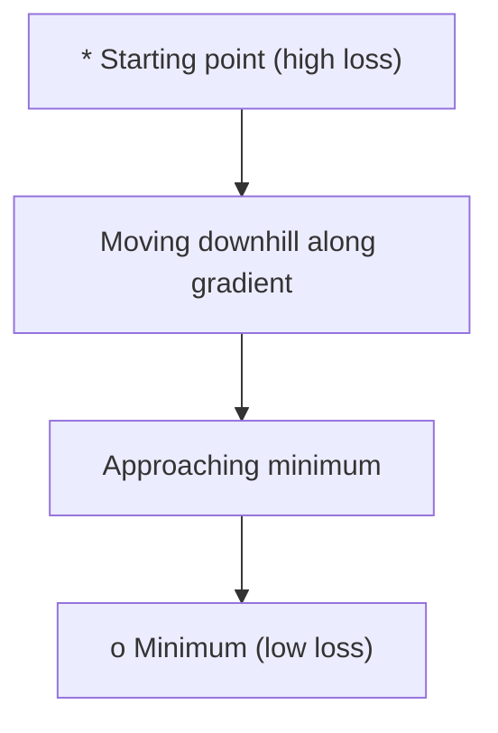
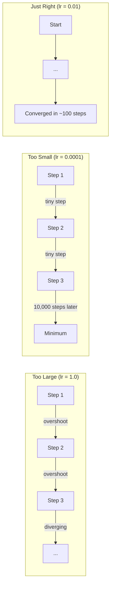
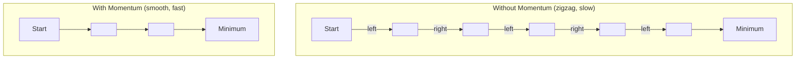
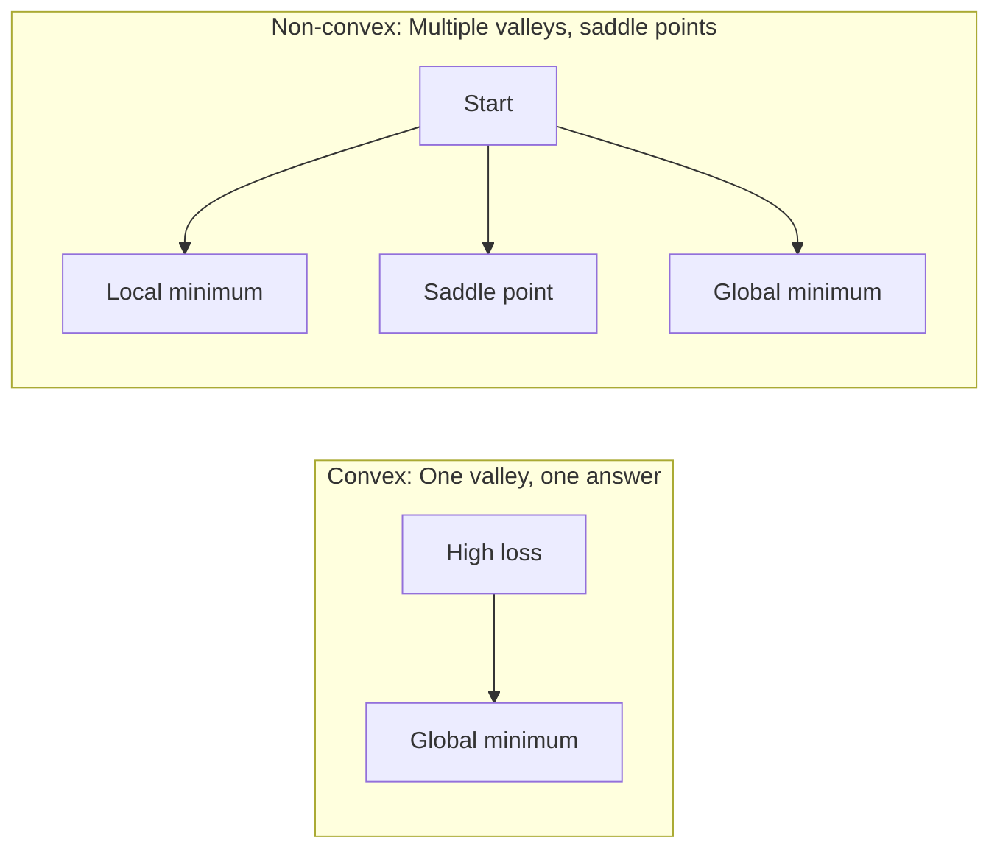
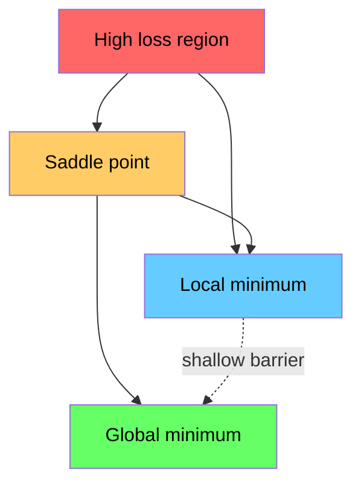

# 优化

> 训练神经网络，不过是在山谷里找最低点。

**类型：** Build  
**语言：** Python, Julia  
**前置知识：** Phase 1，第 04-05 课  
**时间：** 约 60 分钟

## 学习目标

- optimization 的目标是找到让 loss 最小的参数。
- gradient descent 沿负梯度方向移动，learning rate 决定步子大小。
- momentum 会累积历史方向，帮助穿过平坦区域并减少震荡。
- Adam 结合 momentum 和自适应学习率，是深度学习中常用默认优化器。
- learning rate 太大会发散，太小会训练缓慢；优化问题常常是调参和稳定性的平衡。

## 问题

本课是 Phase 1 数学基础的一部分。目标不是把数学当成孤立公式来背，而是把它连接到 AI 系统中的具体动作：数据如何被表示，模型如何变换表示，loss 如何给出方向，以及训练为什么会稳定或失稳。

学习时请把每个概念都追问三件事：它在空间中做了什么？它在代码里对应哪个运算？它在神经网络、检索、生成模型或优化中解决什么问题？

## 核心概念

1. optimization 的目标是找到让 loss 最小的参数。
2. gradient descent 沿负梯度方向移动，learning rate 决定步子大小。
3. momentum 会累积历史方向，帮助穿过平坦区域并减少震荡。
4. Adam 结合 momentum 和自适应学习率，是深度学习中常用默认优化器。
5. learning rate 太大会发散，太小会训练缓慢；优化问题常常是调参和稳定性的平衡。

## 动手构建

按照本课 `code/` 目录运行示例实现。优先先读从零实现版本，再对照 NumPy、PyTorch 或 Julia 中的同类操作。你应该能解释每一行 shape 如何变化，而不是只得到一个数值结果。

建议流程：

1. 先手算一个 2D 或 2x2 的小例子。
2. 运行本课代码，确认输出和手算一致。
3. 改动输入 shape 或参数，观察结果如何变化。
4. 把同一概念连接回 AI 场景，例如 embeddings、attention、loss、optimization 或 sampling。

## 关键公式与代码片段

以下片段保留自英文原文，便于直接复制运行或对照数学符号。

```text
minimize L(w) where:
  L = loss function
  w = model weights (could be millions of parameters)
```

```text
w = w - lr * gradient
```





```text
v = beta * v + gradient
w = w - lr * v
```



```text
m = beta1 * m + (1 - beta1) * gradient
v = beta2 * v + (1 - beta2) * gradient^2

m_hat = m / (1 - beta1^t)    bias correction
v_hat = v / (1 - beta2^t)    bias correction

w = w - lr * m_hat / (sqrt(v_hat) + epsilon)
```





```text
f(x, y) = (1 - x)^2 + 100 * (y - x^2)^2
```

```python
def rosenbrock(params):
    x, y = params
    return (1 - x) ** 2 + 100 * (y - x ** 2) ** 2

def rosenbrock_gradient(params):
    x, y = params
    df_dx = -2 * (1 - x) + 200 * (y - x ** 2) * (-2 * x)
    df_dy = 200 * (y - x ** 2)
    return [df_dx, df_dy]
```

```python
class GradientDescent:
    def __init__(self, lr=0.001):
        self.lr = lr

    def step(self, params, grads):
        return [p - self.lr * g for p, g in zip(params, grads)]
```

> 英文原文还包含 4 个代码/公式块；中文正文保留关键块，完整可运行代码见本课 `code/` 目录。


## 使用它

完成本课后，你应该能在真实 AI 代码中识别这个数学概念出现的位置，并用它调试问题：shape mismatch、相似度异常、loss 不下降、数值爆炸、采样过于随机或过于保守等。

## 练习

1. 用一个最小数字例子复现本课核心公式。
2. 运行本课 `code/` 中的 Python 或 Julia 文件，并记录每个中间变量的 shape。
3. 找一个 AI 应用场景，说明本课概念在其中的输入、输出和失败模式。
4. 完成 `quiz.zh-CN.json` 中的测验，并回到英文原文核对术语。

## 关键术语

| 术语 | 中文理解 | AI 中的作用 |
|------|----------|-------------|
| representation | 表示 | 把现实对象变成可计算向量或张量 |
| transformation | 变换 | 用矩阵、函数或运算改变表示 |
| gradient | 梯度 | 指示 loss 变化最快方向，用于学习 |
| stability | 稳定性 | 保证训练和数值计算不会爆炸或消失 |
| approximation | 近似 | 在可计算成本内保留最重要结构 |
