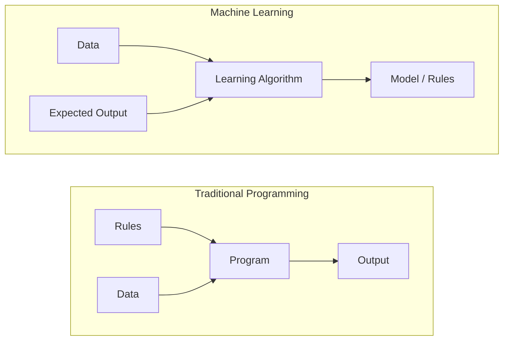
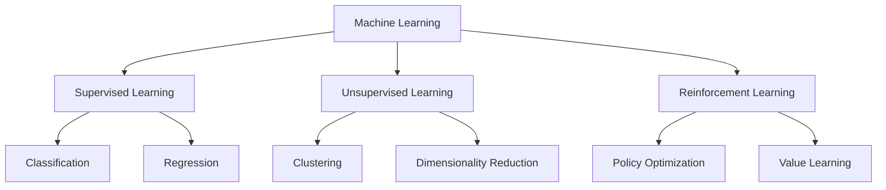
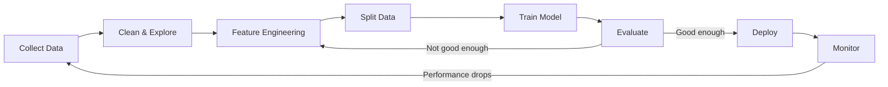
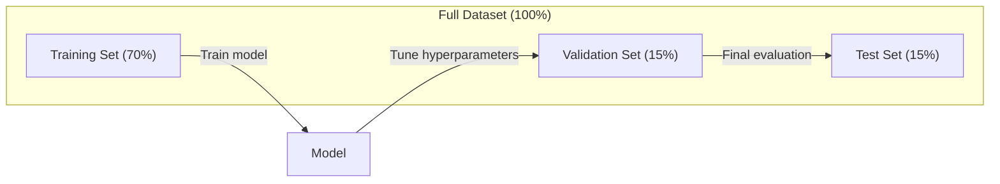
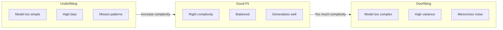
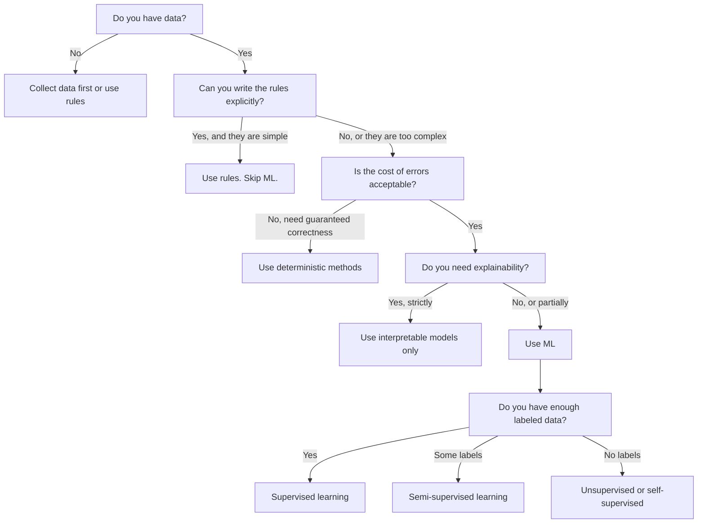

# 什么是机器学习

> 机器学习不是手写规则，而是教计算机从数据中找到模式。

**类型：** Learn  
**语言：** Python  
**前置知识：** Phase 0-1  
**时间：** 约 60 分钟

## 学习目标

- 机器学习用数据学习函数，而不是由人手写完整规则。
- 监督学习从带标签样本学习输入到输出的映射。
- 无监督学习在没有标签时发现结构，例如聚类和降维。
- 训练、验证和测试划分用于控制泛化误差。
- 机器学习项目要从问题定义开始，而不是从模型选择开始。

## 问题

本课是 Phase 2 机器学习基础的一部分。目标是把 Phase 1 的数学工具落到经典 ML 工作流里：如何定义问题，如何选择模型，如何训练、评估、诊断，并把实验变成可复现的 pipeline。

学习时不要只记算法名字。你要能回答：这个模型在假设什么？它优化什么目标？什么时候会失败？应该用什么指标判断它是否真的有效？

## 核心概念

1. 机器学习用数据学习函数，而不是由人手写完整规则。
2. 监督学习从带标签样本学习输入到输出的映射。
3. 无监督学习在没有标签时发现结构，例如聚类和降维。
4. 训练、验证和测试划分用于控制泛化误差。
5. 机器学习项目要从问题定义开始，而不是从模型选择开始。

## 动手构建

按照本课 `code/` 目录运行示例。先理解从零实现，再观察同一思想如何映射到常用 ML API。每次运行都记录输入特征、目标变量、训练配置、评估指标和错误样本。

建议流程：

1. 明确任务类型：classification、regression、clustering、ranking、forecasting 或 anomaly detection。
2. 明确 baseline：先用简单模型得到可解释的基准结果。
3. 查看数据划分方式，避免泄漏和错误评估。
4. 运行本课代码，并改动关键超参数观察指标变化。
5. 总结模型失败模式，以及下一步应该调数据、特征、模型还是指标。

## 关键公式与代码片段

以下片段保留自英文原文，便于直接复制运行或对照数学符号。













```python
class NearestCentroid:
    def fit(self, X, y):
        self.classes = np.unique(y)
        self.centroids = np.array([
            X[y == c].mean(axis=0) for c in self.classes
        ])

    def predict(self, X):
        distances = np.array([
            np.sqrt(((X - c) ** 2).sum(axis=1))
            for c in self.centroids
        ])
        return self.classes[distances.argmin(axis=0)]
```

```python
rng = np.random.RandomState(42)
X_class0 = rng.randn(100, 2) + np.array([1.0, 1.0])
X_class1 = rng.randn(100, 2) + np.array([-1.0, -1.0])
X = np.vstack([X_class0, X_class1])
y = np.array([0] * 100 + [1] * 100)
```

```python
baseline_preds = rng.choice([0, 1], size=len(y_test))
baseline_acc = np.mean(baseline_preds == y_test)
```

```python
from sklearn.neighbors import NearestCentroid
from sklearn.datasets import make_classification
from sklearn.model_selection import train_test_split

X, y = make_classification(
    n_samples=500, n_features=2, n_redundant=0,
    n_clusters_per_class=1, random_state=42
)
X_train, X_test, y_train, y_test = train_test_split(X, y, test_size=0.3)

clf = NearestCentroid()
clf.fit(X_train, y_train)
print(f"Accuracy: {clf.score(X_test, y_test):.3f}")
```

## 使用它

完成本课后，你应该能把这个算法放进真实 ML 流程：先建立 baseline，再用合适指标评估，最后根据 bias、variance、数据质量和业务成本决定下一步。

## 练习

1. 用本课算法构建一个最小 baseline。
2. 改变一个关键超参数，并解释指标变化。
3. 找出至少一个失败样本或错误分组，说明模型为什么错。
4. 完成 `quiz.zh-CN.json` 中的测验，并回到英文原文核对术语。

## 关键术语

| 术语 | 中文理解 | ML 中的作用 |
|------|----------|-------------|
| baseline | 基准模型 | 给复杂方法提供参照 |
| feature | 特征 | 模型实际看到的输入表示 |
| target | 目标 | 模型要预测或解释的变量 |
| metric | 指标 | 把模型表现转成可比较数字 |
| generalization | 泛化 | 模型在未见数据上的表现 |
| leakage | 泄漏 | 训练时意外使用了评估时不可用的信息 |
