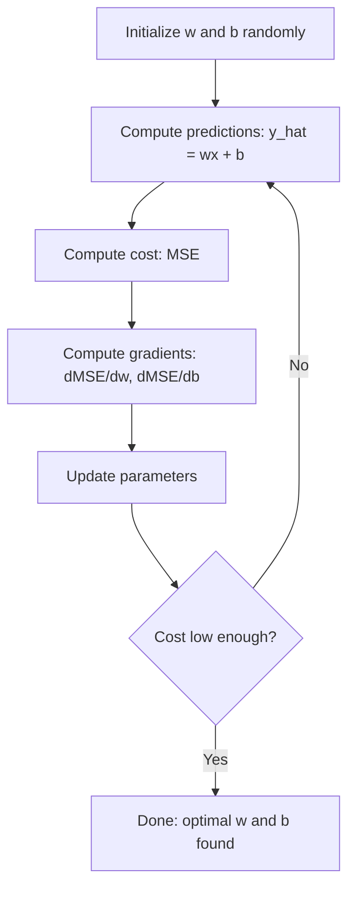

# 线性回归

> 线性回归是在数据中画出最合适的直线。它是机器学习的 hello world。

**类型：** Build  
**语言：** Python, Julia  
**前置知识：** Phase 1  
**时间：** 约 60 分钟

## 学习目标

- 线性回归假设目标值可以由特征的线性组合预测。
- MSE 衡量预测值和真实值之间的平方误差。
- gradient descent 可以从零训练 slope 和 intercept。
- 闭式解和迭代优化是求解同一目标的两种方式。
- 残差图、R² 和误差分布用于判断模型是否合适。

## 问题

本课是 Phase 2 机器学习基础的一部分。目标是把 Phase 1 的数学工具落到经典 ML 工作流里：如何定义问题，如何选择模型，如何训练、评估、诊断，并把实验变成可复现的 pipeline。

学习时不要只记算法名字。你要能回答：这个模型在假设什么？它优化什么目标？什么时候会失败？应该用什么指标判断它是否真的有效？

## 核心概念

1. 线性回归假设目标值可以由特征的线性组合预测。
2. MSE 衡量预测值和真实值之间的平方误差。
3. gradient descent 可以从零训练 slope 和 intercept。
4. 闭式解和迭代优化是求解同一目标的两种方式。
5. 残差图、R² 和误差分布用于判断模型是否合适。

## 动手构建

按照本课 `code/` 目录运行示例。先理解从零实现，再观察同一思想如何映射到常用 ML API。每次运行都记录输入特征、目标变量、训练配置、评估指标和错误样本。

建议流程：

1. 明确任务类型：classification、regression、clustering、ranking、forecasting 或 anomaly detection。
2. 明确 baseline：先用简单模型得到可解释的基准结果。
3. 查看数据划分方式，避免泄漏和错误评估。
4. 运行本课代码，并改动关键超参数观察指标变化。
5. 总结模型失败模式，以及下一步应该调数据、特征、模型还是指标。

## 关键公式与代码片段

以下片段保留自英文原文，便于直接复制运行或对照数学符号。

```text
y = wx + b
```

```text
y = w1*x1 + w2*x2 + ... + wn*xn + b
```

```text
MSE = (1/n) * sum((y_predicted - y_actual)^2)
```



```text
dMSE/dw = (2/n) * sum((y_hat - y) * x)
dMSE/db = (2/n) * sum(y_hat - y)
```

```text
w = w - learning_rate * dMSE/dw
b = b - learning_rate * dMSE/db
```

```text
w = (X^T * X)^(-1) * X^T * y
```

```text
y = w1*x1 + w2*x2 + ... + wn*xn + b
```

```text
y = w1*x + w2*x^2 + w3*x^3 + b
```

```text
R^2 = 1 - (sum of squared residuals) / (sum of squared deviations from mean)
    = 1 - SS_res / SS_tot
```

> 英文原文还包含 8 个代码/公式块；中文正文保留关键片段，完整实现见本课 `code/` 目录。


## 使用它

完成本课后，你应该能把这个算法放进真实 ML 流程：先建立 baseline，再用合适指标评估，最后根据 bias、variance、数据质量和业务成本决定下一步。

## 练习

1. 用本课算法构建一个最小 baseline。
2. 改变一个关键超参数，并解释指标变化。
3. 找出至少一个失败样本或错误分组，说明模型为什么错。
4. 完成 `quiz.zh-CN.json` 中的测验，并回到英文原文核对术语。

## 关键术语

| 术语 | 中文理解 | ML 中的作用 |
|------|----------|-------------|
| baseline | 基准模型 | 给复杂方法提供参照 |
| feature | 特征 | 模型实际看到的输入表示 |
| target | 目标 | 模型要预测或解释的变量 |
| metric | 指标 | 把模型表现转成可比较数字 |
| generalization | 泛化 | 模型在未见数据上的表现 |
| leakage | 泄漏 | 训练时意外使用了评估时不可用的信息 |
