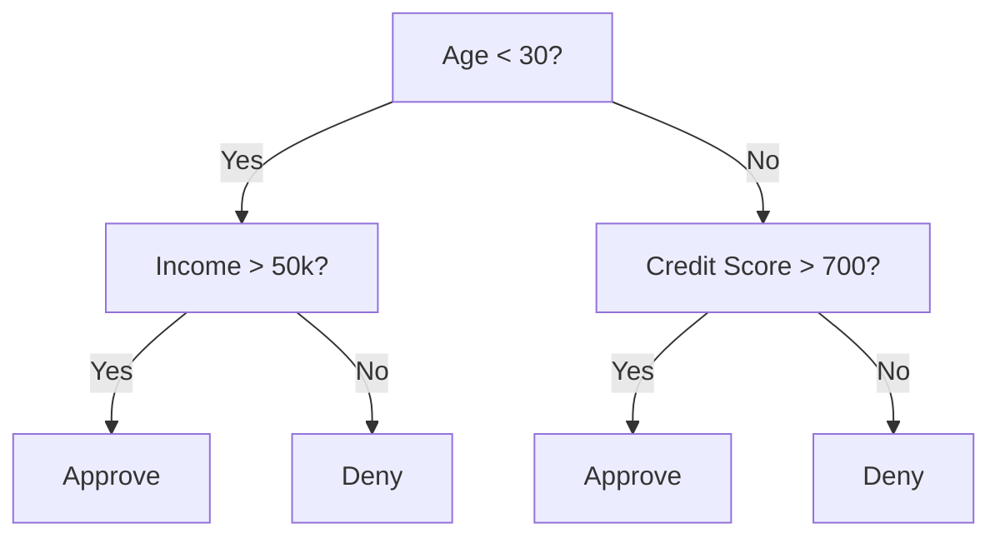
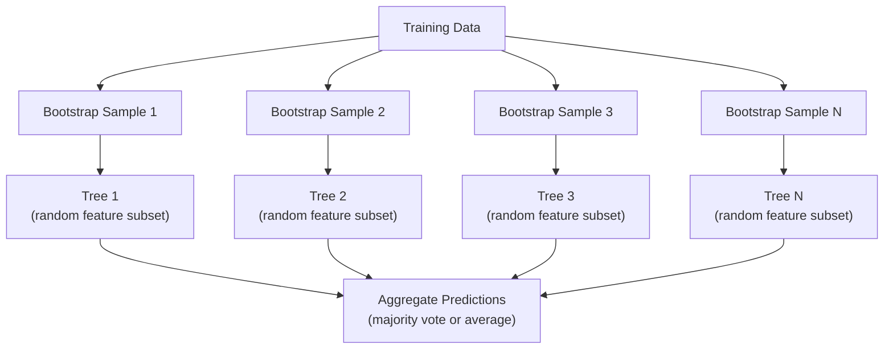

# 决策树与随机森林

> 决策树就是流程图。但一整片森林会成为 ML 中最强大的工具之一。

**类型：** Build  
**语言：** Python  
**前置知识：** Phase 2, Lessons 01-03  
**时间：** 约 60 分钟

## 学习目标

- 决策树通过一系列特征阈值分裂数据。
- impurity 衡量节点中标签混杂程度，常见指标有 Gini 和 entropy。
- 树容易过拟合，因此需要限制深度、叶子大小或剪枝。
- 随机森林通过 bagging 和特征随机性降低方差。
- 树模型可解释性强，适合表格数据和规则型业务问题。

## 问题

本课是 Phase 2 机器学习基础的一部分。目标是把 Phase 1 的数学工具落到经典 ML 工作流里：如何定义问题，如何选择模型，如何训练、评估、诊断，并把实验变成可复现的 pipeline。

学习时不要只记算法名字。你要能回答：这个模型在假设什么？它优化什么目标？什么时候会失败？应该用什么指标判断它是否真的有效？

## 核心概念

1. 决策树通过一系列特征阈值分裂数据。
2. impurity 衡量节点中标签混杂程度，常见指标有 Gini 和 entropy。
3. 树容易过拟合，因此需要限制深度、叶子大小或剪枝。
4. 随机森林通过 bagging 和特征随机性降低方差。
5. 树模型可解释性强，适合表格数据和规则型业务问题。

## 动手构建

按照本课 `code/` 目录运行示例。先理解从零实现，再观察同一思想如何映射到常用 ML API。每次运行都记录输入特征、目标变量、训练配置、评估指标和错误样本。

建议流程：

1. 明确任务类型：classification、regression、clustering、ranking、forecasting 或 anomaly detection。
2. 明确 baseline：先用简单模型得到可解释的基准结果。
3. 查看数据划分方式，避免泄漏和错误评估。
4. 运行本课代码，并改动关键超参数观察指标变化。
5. 总结模型失败模式，以及下一步应该调数据、特征、模型还是指标。

## 关键公式与代码片段

以下片段保留自英文原文，便于直接复制运行或对照数学符号。



```text
Gini(S) = 1 - sum(p_k^2)

where p_k is the proportion of class k in set S.
```

```text
Example: 6 cats, 4 dogs

Gini = 1 - (0.6^2 + 0.4^2) = 1 - (0.36 + 0.16) = 0.48
```

```text
Entropy(S) = -sum(p_k * log2(p_k))
```

```text
Example: 6 cats, 4 dogs

Entropy = -(0.6 * log2(0.6) + 0.4 * log2(0.4))
        = -(0.6 * -0.737 + 0.4 * -1.322)
        = 0.442 + 0.529
        = 0.971 bits
```

```text
IG(S, feature, threshold) = Impurity(S) - weighted_avg(Impurity(S_left), Impurity(S_right))

where the weights are the proportions of samples in each child.
```

```text
VR(S, feature, threshold) = Var(S) - weighted_avg(Var(S_left), Var(S_right))
```



```text
importance(feature_j) = sum over all nodes where feature_j is used:
    (n_samples_at_node / n_total_samples) * impurity_decrease
```

```python
import math

def gini_impurity(labels):
    n = len(labels)
    if n == 0:
        return 0.0
    counts = {}
    for label in labels:
        counts[label] = counts.get(label, 0) + 1
    return 1.0 - sum((c / n) ** 2 for c in counts.values())

def entropy(labels):
    n = len(labels)
    if n == 0:
        return 0.0
    counts = {}
    for label in labels:
        counts[label] = counts.get(label, 0) + 1
    return -sum(
        (c / n) * math.log2(c / n) for c in counts.values() if c > 0
    )
```

> 英文原文还包含 4 个代码/公式块；中文正文保留关键片段，完整实现见本课 `code/` 目录。


## 使用它

完成本课后，你应该能把这个算法放进真实 ML 流程：先建立 baseline，再用合适指标评估，最后根据 bias、variance、数据质量和业务成本决定下一步。

## 练习

1. 用本课算法构建一个最小 baseline。
2. 改变一个关键超参数，并解释指标变化。
3. 找出至少一个失败样本或错误分组，说明模型为什么错。
4. 完成 `quiz.zh-CN.json` 中的测验，并回到英文原文核对术语。

## 关键术语

| 术语 | 中文理解 | ML 中的作用 |
|------|----------|-------------|
| baseline | 基准模型 | 给复杂方法提供参照 |
| feature | 特征 | 模型实际看到的输入表示 |
| target | 目标 | 模型要预测或解释的变量 |
| metric | 指标 | 把模型表现转成可比较数字 |
| generalization | 泛化 | 模型在未见数据上的表现 |
| leakage | 泄漏 | 训练时意外使用了评估时不可用的信息 |
