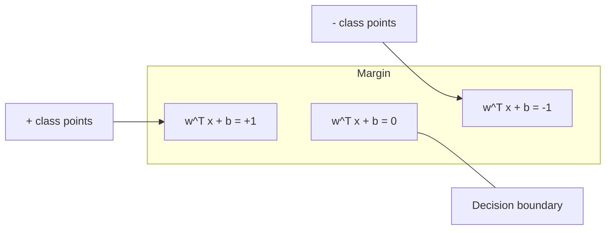
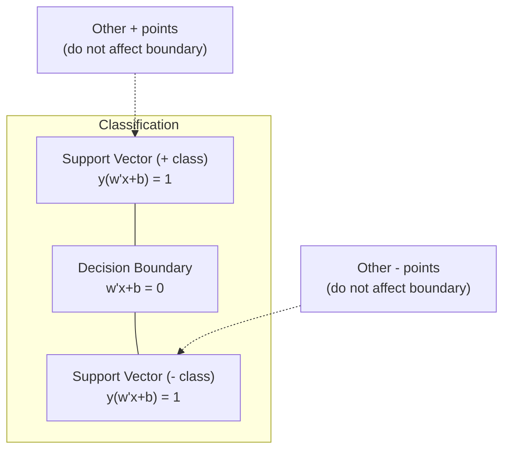

# 支持向量机

> 在两个类别之间找到最宽的街道，这就是全部思想。

**类型：** Build  
**语言：** Python, Julia  
**前置知识：** Phase 1, Lessons 01-04  
**时间：** 约 60 分钟

## 学习目标

- SVM 寻找最大 margin 的分类边界。
- support vectors 是决定边界位置的关键样本。
- hinge loss 惩罚落在 margin 内或被错分的样本。
- kernel trick 让线性分类器在高维特征空间中形成非线性边界。
- C 和 kernel 参数控制 margin 宽度、误差容忍和模型复杂度。

## 问题

本课是 Phase 2 机器学习基础的一部分。目标是把 Phase 1 的数学工具落到经典 ML 工作流里：如何定义问题，如何选择模型，如何训练、评估、诊断，并把实验变成可复现的 pipeline。

学习时不要只记算法名字。你要能回答：这个模型在假设什么？它优化什么目标？什么时候会失败？应该用什么指标判断它是否真的有效？

## 核心概念

1. SVM 寻找最大 margin 的分类边界。
2. support vectors 是决定边界位置的关键样本。
3. hinge loss 惩罚落在 margin 内或被错分的样本。
4. kernel trick 让线性分类器在高维特征空间中形成非线性边界。
5. C 和 kernel 参数控制 margin 宽度、误差容忍和模型复杂度。

## 动手构建

按照本课 `code/` 目录运行示例。先理解从零实现，再观察同一思想如何映射到常用 ML API。每次运行都记录输入特征、目标变量、训练配置、评估指标和错误样本。

建议流程：

1. 明确任务类型：classification、regression、clustering、ranking、forecasting 或 anomaly detection。
2. 明确 baseline：先用简单模型得到可解释的基准结果。
3. 查看数据划分方式，避免泄漏和错误评估。
4. 运行本课代码，并改动关键超参数观察指标变化。
5. 总结模型失败模式，以及下一步应该调数据、特征、模型还是指标。

## 关键公式与代码片段

以下片段保留自英文原文，便于直接复制运行或对照数学符号。

```text
distance = |w^T x_i + b| / ||w||
```



```text
maximize    2 / ||w||     (the margin width)
subject to  y_i * (w^T x_i + b) >= 1  for all i
```

```text
minimize    (1/2) ||w||^2
subject to  y_i * (w^T x_i + b) >= 1  for all i
```



```text
minimize    (1/2) ||w||^2 + C * sum(xi_i)
subject to  y_i * (w^T x_i + b) >= 1 - xi_i
            xi_i >= 0  for all i
```

```text
minimize    (1/2) ||w||^2 + C * sum(max(0, 1 - y_i * (w^T x_i + b)))
```

```text
Hinge loss for a single point:

loss
  |
  | \
  |  \
  |   \
  |    \
  |     \_______________
  |
  +-----|-----|-------->  y * f(x)
       0     1

Zero loss when y*f(x) >= 1 (correctly classified, outside margin).
Linear penalty when y*f(x) < 1.
```

```text
Hinge:     max(0, 1 - y*f(x))          Hard cutoff at margin
Logistic:  log(1 + exp(-y*f(x)))        Smooth, never exactly zero
```

```text
L(w, b) = (lambda/2) * ||w||^2 + (1/n) * sum(max(0, 1 - y_i * (w^T x_i + b)))

Gradient with respect to w:
  If y_i * (w^T x_i + b) >= 1:  dL/dw = lambda * w
  If y_i * (w^T x_i + b) < 1:   dL/dw = lambda * w - y_i * x_i

Gradient with respect to b:
  If y_i * (w^T x_i + b) >= 1:  dL/db = 0
  If y_i * (w^T x_i + b) < 1:   dL/db = -y_i
```

> 英文原文还包含 10 个代码/公式块；中文正文保留关键片段，完整实现见本课 `code/` 目录。


## 使用它

完成本课后，你应该能把这个算法放进真实 ML 流程：先建立 baseline，再用合适指标评估，最后根据 bias、variance、数据质量和业务成本决定下一步。

## 练习

1. 用本课算法构建一个最小 baseline。
2. 改变一个关键超参数，并解释指标变化。
3. 找出至少一个失败样本或错误分组，说明模型为什么错。
4. 完成 `quiz.zh-CN.json` 中的测验，并回到英文原文核对术语。

## 关键术语

| 术语 | 中文理解 | ML 中的作用 |
|------|----------|-------------|
| baseline | 基准模型 | 给复杂方法提供参照 |
| feature | 特征 | 模型实际看到的输入表示 |
| target | 目标 | 模型要预测或解释的变量 |
| metric | 指标 | 把模型表现转成可比较数字 |
| generalization | 泛化 | 模型在未见数据上的表现 |
| leakage | 泄漏 | 训练时意外使用了评估时不可用的信息 |
