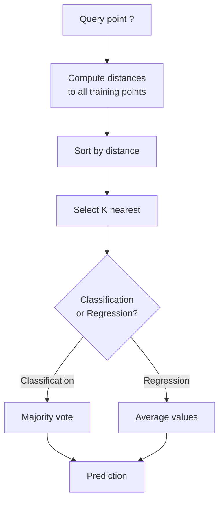
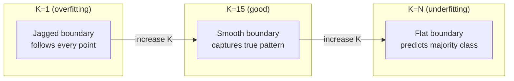
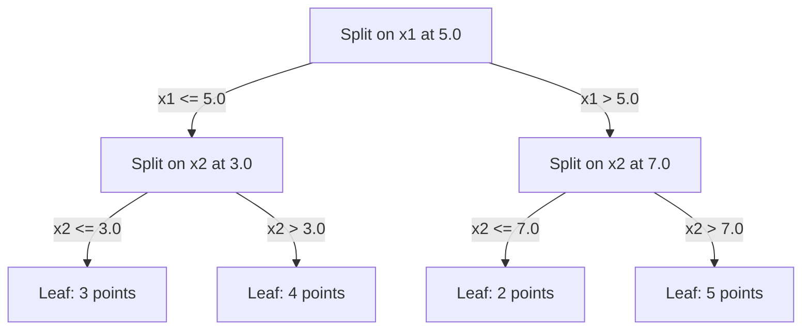

# K 近邻与距离

> 保存所有样本。预测时看邻居。最简单、但真正有效的算法。

**类型：** Build  
**语言：** Python  
**前置知识：** Phase 1, Lesson 14  
**时间：** 约 60 分钟

## 学习目标

- kNN 是 lazy learning：训练时几乎不做事，预测时计算距离。
- 距离度量定义了什么叫“相似”。
- k 值太小容易过拟合，太大容易欠拟合。
- 特征缩放对距离算法至关重要。
- kNN 可用于分类、回归、推荐和相似样本检索。

## 问题

本课是 Phase 2 机器学习基础的一部分。目标是把 Phase 1 的数学工具落到经典 ML 工作流里：如何定义问题，如何选择模型，如何训练、评估、诊断，并把实验变成可复现的 pipeline。

学习时不要只记算法名字。你要能回答：这个模型在假设什么？它优化什么目标？什么时候会失败？应该用什么指标判断它是否真的有效？

## 核心概念

1. kNN 是 lazy learning：训练时几乎不做事，预测时计算距离。
2. 距离度量定义了什么叫“相似”。
3. k 值太小容易过拟合，太大容易欠拟合。
4. 特征缩放对距离算法至关重要。
5. kNN 可用于分类、回归、推荐和相似样本检索。

## 动手构建

按照本课 `code/` 目录运行示例。先理解从零实现，再观察同一思想如何映射到常用 ML API。每次运行都记录输入特征、目标变量、训练配置、评估指标和错误样本。

建议流程：

1. 明确任务类型：classification、regression、clustering、ranking、forecasting 或 anomaly detection。
2. 明确 baseline：先用简单模型得到可解释的基准结果。
3. 查看数据划分方式，避免泄漏和错误评估。
4. 运行本课代码，并改动关键超参数观察指标变化。
5. 总结模型失败模式，以及下一步应该调数据、特征、模型还是指标。

## 关键公式与代码片段

以下片段保留自英文原文，便于直接复制运行或对照数学符号。





```text
d(a, b) = sqrt(sum((a_i - b_i)^2))
```

```text
d(a, b) = sum(|a_i - b_i|)
```

```text
d(a, b) = 1 - (a . b) / (||a|| * ||b||)
```

```text
d(a, b) = (sum(|a_i - b_i|^p))^(1/p)

p=1: Manhattan
p=2: Euclidean
p->inf: Chebyshev (max absolute difference)
```

```text
weight_i = 1 / (distance_i + epsilon)

For classification: weighted vote
For regression:     weighted average = sum(w_i * y_i) / sum(w_i)
```

```text
In d dimensions, for random uniform points:

d=2:    max_dist / min_dist = varies widely
d=100:  max_dist / min_dist ~ 1.01
d=1000: max_dist / min_dist ~ 1.001

When all distances are nearly equal, "nearest" is meaningless.
```



```text
prediction = (1/K) * sum(y_i for i in K nearest neighbors)

Or with distance weighting:
prediction = sum(w_i * y_i) / sum(w_i)
where w_i = 1 / distance_i
```

> 英文原文还包含 6 个代码/公式块；中文正文保留关键片段，完整实现见本课 `code/` 目录。


## 使用它

完成本课后，你应该能把这个算法放进真实 ML 流程：先建立 baseline，再用合适指标评估，最后根据 bias、variance、数据质量和业务成本决定下一步。

## 练习

1. 用本课算法构建一个最小 baseline。
2. 改变一个关键超参数，并解释指标变化。
3. 找出至少一个失败样本或错误分组，说明模型为什么错。
4. 完成 `quiz.zh-CN.json` 中的测验，并回到英文原文核对术语。

## 关键术语

| 术语 | 中文理解 | ML 中的作用 |
|------|----------|-------------|
| baseline | 基准模型 | 给复杂方法提供参照 |
| feature | 特征 | 模型实际看到的输入表示 |
| target | 目标 | 模型要预测或解释的变量 |
| metric | 指标 | 把模型表现转成可比较数字 |
| generalization | 泛化 | 模型在未见数据上的表现 |
| leakage | 泄漏 | 训练时意外使用了评估时不可用的信息 |
