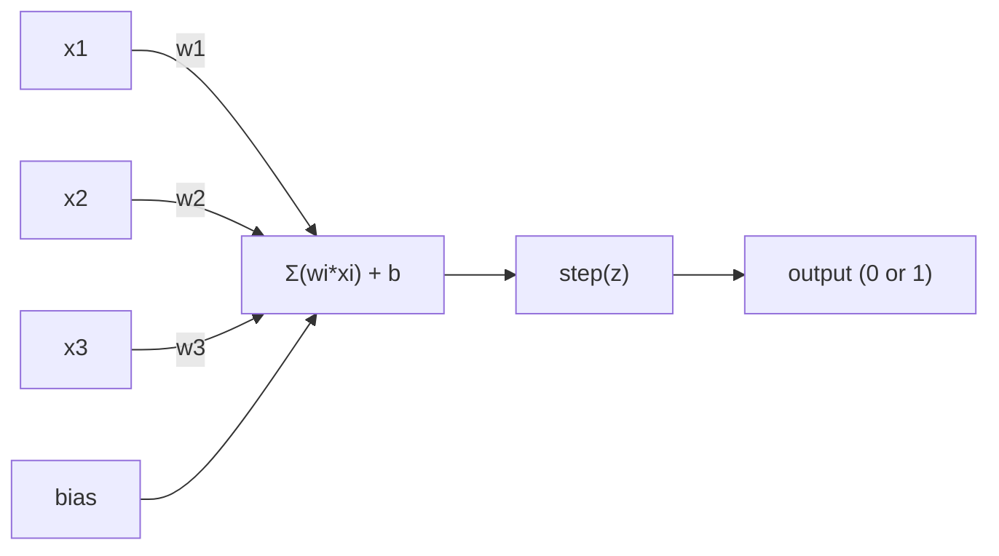
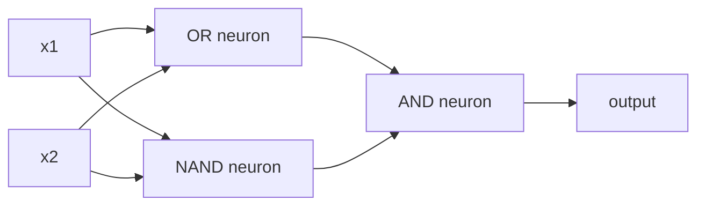

# 感知机

> 感知机是神经网络的原子。把它拆开，你会看到权重、偏置和一次决策。

**Type:** Build
**Languages:** Python
**Prerequisites:** Phase 1 (Linear Algebra Intuition)
**Time:** ~60 minutes

## 学习目标

- 用 Python 从零实现感知机，包括权重更新规则和阶跃激活函数
- 解释为什么单个感知机只能解决线性可分问题，并演示 XOR 失败案例
- 通过组合 OR、NAND 和 AND 门，构造一个多层感知机来解决 XOR
- 训练一个带 sigmoid 激活和反向传播的两层网络，让它自动学会 XOR

## 问题

你已经知道向量和点积，也知道矩阵会把输入变换成输出。但机器到底是怎么“学会”该用哪种变换的？

感知机给出了这个问题的最简答案。它是最简单的学习机器：接收一些输入，乘以权重，加上偏置，然后做出一个二分类决策。接着根据错误调整参数。就这些。后来建成的每一个神经网络，本质上都是把这个想法一层层堆起来。

理解感知机，就是理解代码里的“学习”到底是什么意思：不断调整数字，直到输出和现实相符。

## 核心概念

### 一个神经元，一次决策

感知机接收 n 个输入，把每个输入乘以一个权重，求和，加上偏置，然后把结果送进激活函数。



阶跃函数非常直接：如果加权和加偏置之后大于等于 0，就输出 1。否则输出 0。

```text
step(z) = 1  if z >= 0
           0  if z < 0
```

这就是一个线性分类器。权重和偏置定义了一条线；在更高维里，它定义的是一个超平面。这个边界把输入空间分成两个区域。

### 决策边界

对两个输入来说，感知机会在二维空间中画出一条线：

```text
  x2
  ┤
  │  Class 1        /
  │    (0)          /
  │                /
  │               / w1·x1 + w2·x2 + b = 0
  │              /
  │             /     Class 2
  │            /        (1)
  ┼───────────/──────────── x1
```

线的一侧输出 0，另一侧输出 1。训练的过程就是移动这条线，直到它能正确分开类别。

### 学习规则

感知机学习规则很简单：

```text
For each training example (x, y_true):
    y_pred = predict(x)
    error = y_true - y_pred

    For each weight:
        w_i = w_i + learning_rate * error * x_i
    bias = bias + learning_rate * error
```

如果预测正确，`error = 0`，参数不变。如果模型预测 0 但正确答案是 1，权重会增大。如果模型预测 1 但正确答案是 0，权重会减小。学习率控制每次调整的幅度。

### XOR 问题

问题出在这里。看看这些逻辑门：

```text
AND gate:           OR gate:            XOR gate:
x1  x2  out         x1  x2  out         x1  x2  out
0   0   0           0   0   0           0   0   0
0   1   0           0   1   1           0   1   1
1   0   0           1   0   1           1   0   1
1   1   1           1   1   1           1   1   0
```

AND 和 OR 是线性可分的：你可以画一条线，把 0 和 1 分开。XOR 不是。没有任何一条直线能把 `[0,1]` 和 `[1,0]` 同 `[0,0]` 和 `[1,1]` 分开。

```text
AND (separable):        XOR (not separable):

  x2                      x2
  1 ┤  0     1            1 ┤  1     0
    │     /                 │
  0 ┤  0 / 0              0 ┤  0     1
    ┼──/──────── x1         ┼──────────── x1
       line works!          no single line works!
```

这是一个根本限制。单个感知机只能解决线性可分问题。Minsky 和 Papert 在 1969 年证明了这一点，也让神经网络研究一度沉寂了近十年。

解决办法是把感知机堆成层。多层感知机可以把两个线性决策组合成一个非线性决策，从而解决 XOR。

## Build It

### 第 1 步：`Perceptron` 类

```python
class Perceptron:
    def __init__(self, n_inputs, learning_rate=0.1):
        self.weights = [0.0] * n_inputs
        self.bias = 0.0
        self.lr = learning_rate

    def predict(self, inputs):
        total = sum(w * x for w, x in zip(self.weights, inputs))
        total += self.bias
        return 1 if total >= 0 else 0

    def train(self, training_data, epochs=100):
        for epoch in range(epochs):
            errors = 0
            for inputs, target in training_data:
                prediction = self.predict(inputs)
                error = target - prediction
                if error != 0:
                    errors += 1
                    for i in range(len(self.weights)):
                        self.weights[i] += self.lr * error * inputs[i]
                    self.bias += self.lr * error
            if errors == 0:
                print(f"Converged at epoch {epoch + 1}")
                return
        print(f"Did not converge after {epochs} epochs")
```

### 第 2 步：在逻辑门上训练

```python
and_data = [
    ([0, 0], 0),
    ([0, 1], 0),
    ([1, 0], 0),
    ([1, 1], 1),
]

or_data = [
    ([0, 0], 0),
    ([0, 1], 1),
    ([1, 0], 1),
    ([1, 1], 1),
]

not_data = [
    ([0], 1),
    ([1], 0),
]

print("=== AND Gate ===")
p_and = Perceptron(2)
p_and.train(and_data)
for inputs, _ in and_data:
    print(f"  {inputs} -> {p_and.predict(inputs)}")

print("\n=== OR Gate ===")
p_or = Perceptron(2)
p_or.train(or_data)
for inputs, _ in or_data:
    print(f"  {inputs} -> {p_or.predict(inputs)}")

print("\n=== NOT Gate ===")
p_not = Perceptron(1)
p_not.train(not_data)
for inputs, _ in not_data:
    print(f"  {inputs} -> {p_not.predict(inputs)}")
```

### 第 3 步：观察 XOR 失败

```python
xor_data = [
    ([0, 0], 0),
    ([0, 1], 1),
    ([1, 0], 1),
    ([1, 1], 0),
]

print("\n=== XOR Gate (single perceptron) ===")
p_xor = Perceptron(2)
p_xor.train(xor_data, epochs=1000)
for inputs, expected in xor_data:
    result = p_xor.predict(inputs)
    status = "OK" if result == expected else "WRONG"
    print(f"  {inputs} -> {result} (expected {expected}) {status}")
```

它永远不会收敛。这就是单个感知机无法学习 XOR 的硬证据。

### 第 4 步：用两层网络解决 XOR

技巧是：`XOR = (x1 OR x2) AND NOT (x1 AND x2)`。把三个感知机组合起来：



```python
def xor_network(x1, x2):
    or_neuron = Perceptron(2)
    or_neuron.weights = [1.0, 1.0]
    or_neuron.bias = -0.5

    nand_neuron = Perceptron(2)
    nand_neuron.weights = [-1.0, -1.0]
    nand_neuron.bias = 1.5

    and_neuron = Perceptron(2)
    and_neuron.weights = [1.0, 1.0]
    and_neuron.bias = -1.5

    hidden1 = or_neuron.predict([x1, x2])
    hidden2 = nand_neuron.predict([x1, x2])
    output = and_neuron.predict([hidden1, hidden2])
    return output


print("\n=== XOR Gate (multi-layer network) ===")
for inputs, expected in xor_data:
    result = xor_network(inputs[0], inputs[1])
    print(f"  {inputs} -> {result} (expected {expected})")
```

四种情况都会正确。把感知机堆成多层，就能创造单个感知机无法产生的决策边界。

### 第 5 步：训练一个两层网络

第 4 步是手工写死权重。它能解决 XOR，但真实问题里你不会提前知道正确权重。修复方法是把阶跃函数换成 sigmoid，然后用反向传播自动学习权重。

```python
class TwoLayerNetwork:
    def __init__(self, learning_rate=0.5):
        import random
        random.seed(0)
        self.w_hidden = [[random.uniform(-1, 1), random.uniform(-1, 1)] for _ in range(2)]
        self.b_hidden = [random.uniform(-1, 1), random.uniform(-1, 1)]
        self.w_output = [random.uniform(-1, 1), random.uniform(-1, 1)]
        self.b_output = random.uniform(-1, 1)
        self.lr = learning_rate

    def sigmoid(self, x):
        import math
        x = max(-500, min(500, x))
        return 1.0 / (1.0 + math.exp(-x))

    def forward(self, inputs):
        self.inputs = inputs
        self.hidden_outputs = []
        for i in range(2):
            z = sum(w * x for w, x in zip(self.w_hidden[i], inputs)) + self.b_hidden[i]
            self.hidden_outputs.append(self.sigmoid(z))
        z_out = sum(w * h for w, h in zip(self.w_output, self.hidden_outputs)) + self.b_output
        self.output = self.sigmoid(z_out)
        return self.output

    def train(self, training_data, epochs=10000):
        for epoch in range(epochs):
            total_error = 0
            for inputs, target in training_data:
                output = self.forward(inputs)
                error = target - output
                total_error += error ** 2

                d_output = error * output * (1 - output)

                saved_w_output = self.w_output[:]
                hidden_deltas = []
                for i in range(2):
                    h = self.hidden_outputs[i]
                    hd = d_output * saved_w_output[i] * h * (1 - h)
                    hidden_deltas.append(hd)

                for i in range(2):
                    self.w_output[i] += self.lr * d_output * self.hidden_outputs[i]
                self.b_output += self.lr * d_output

                for i in range(2):
                    for j in range(len(inputs)):
                        self.w_hidden[i][j] += self.lr * hidden_deltas[i] * inputs[j]
                    self.b_hidden[i] += self.lr * hidden_deltas[i]
```

```python
net = TwoLayerNetwork(learning_rate=2.0)
net.train(xor_data, epochs=10000)
for inputs, expected in xor_data:
    result = net.forward(inputs)
    predicted = 1 if result >= 0.5 else 0
    print(f"  {inputs} -> {result:.4f} (rounded: {predicted}, expected {expected})")
```

和第 4 步相比，这里有两个关键差异。第一，sigmoid 替代了阶跃函数；它是平滑的，所以梯度存在。第二，`train` 方法把误差从输出层向隐藏层反向传播，并按每个权重对误差的贡献来调整它。这就是 20 行代码里的反向传播。

这是通往第 3 课的桥。`d_output` 和 `hidden_deltas` 背后的数学，就是把链式法则应用到网络计算图上。我们会在那一课正式推导。

## Use It

你刚刚从零实现的东西，在库里只需要一次 import：

```python
from sklearn.linear_model import Perceptron as SkPerceptron
import numpy as np

X = np.array([[0,0],[0,1],[1,0],[1,1]])
y = np.array([0, 0, 0, 1])

clf = SkPerceptron(max_iter=100, tol=1e-3)
clf.fit(X, y)
print([clf.predict([x])[0] for x in X])
```

五行代码。你写的 30 行 `Perceptron` 类做的是同一件事。sklearn 版本加了收敛检查、多种损失函数和稀疏输入支持，但核心循环完全一样：加权和、阶跃函数、出错时更新权重。

真正的差距会在规模变大时出现。生产级网络会发生这些变化：

- 阶跃函数会变成 sigmoid、ReLU 或其他平滑激活函数
- 权重会通过反向传播自动学习，第 3 课会讲
- 层会变得更深：3 层、10 层、100 多层
- 同一个原则仍然成立：每一层都从上一层输出中创造新特征

单个感知机只能画直线。把它们堆起来，你就能画出任何形状。

## Ship It

本课产出：

- `outputs/skill-perceptron.md`：一个帮助判断何时需要单层架构、何时需要多层架构的 skill

## 练习

1. 在 NAND 门上训练一个感知机。验证它的权重和偏置确实形成了有效的决策边界。NAND 是通用门，任何逻辑电路都可以由 NAND 构造。
2. 修改 `Perceptron` 类，让它在每个 epoch 记录决策边界 `w1*x1 + w2*x2 + b = 0`。打印它在 AND 门训练过程中如何移动。
3. 构建一个 3 输入感知机：只有当 3 个输入中至少 2 个为 1 时才输出 1，也就是多数投票函数。它是线性可分的吗？为什么？

## 关键术语

| Term | 常见说法 | 实际含义 |
|------|----------|----------|
| Perceptron | “假的神经元” | 一个线性分类器：输入和权重点积，加上偏置，再通过阶跃函数 |
| Weight | “某个输入有多重要” | 缩放每个输入对决策贡献的乘数 |
| Bias | “阈值” | 平移决策边界的常数，让感知机即使在输入为零时也能触发 |
| Activation function | “压缩数值的东西” | 加权和之后应用的函数；感知机用阶跃函数，现代网络常用 sigmoid 或 ReLU |
| Linearly separable | “能画一条线分开” | 存在单个超平面，可以把不同类别完全分开的数据集 |
| XOR problem | “感知机做不了的东西” | 单层网络无法学习非线性可分函数的证明 |
| Decision boundary | “分类器切换判断的位置” | 把输入空间分成两个类别的超平面 `w*x + b = 0` |
| Multi-layer perceptron | “真正的神经网络” | 按层堆叠的感知机，前一层输出作为后一层输入 |

## 延伸阅读

- Frank Rosenblatt, "The Perceptron: A Probabilistic Model for Information Storage and Organization in the Brain" (1958)：开启感知机研究的原始论文
- Minsky & Papert, "Perceptrons" (1969)：证明单层网络无法解决 XOR、并让感知机研究沉寂近十年的书
- Michael Nielsen, "Neural Networks and Deep Learning", Chapter 1 (http://neuralnetworksanddeeplearning.com/)：免费在线书籍，对感知机如何组合成网络有很好的可视化解释
