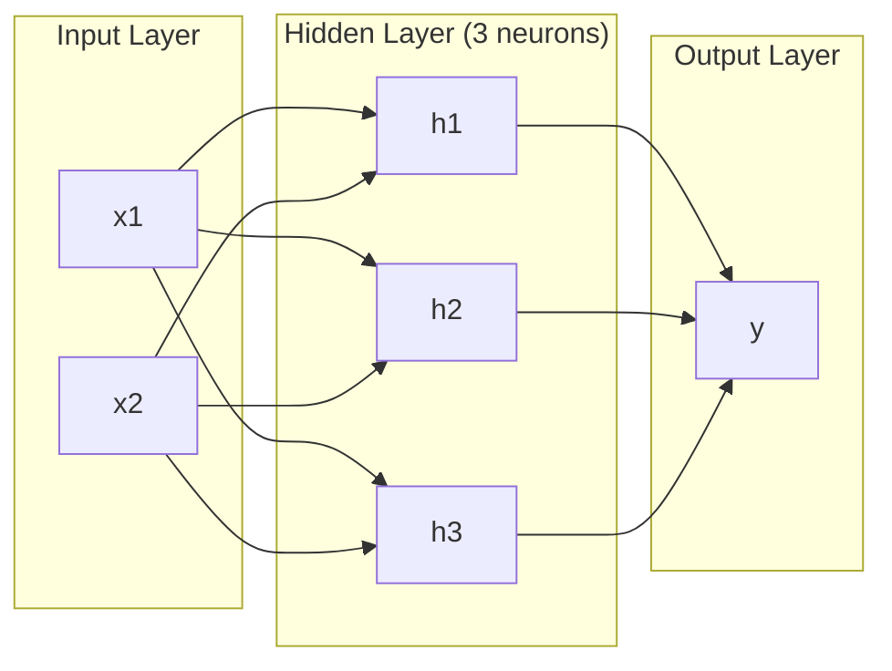
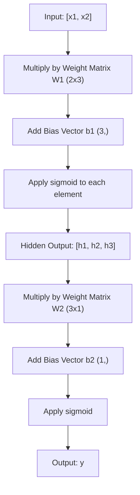
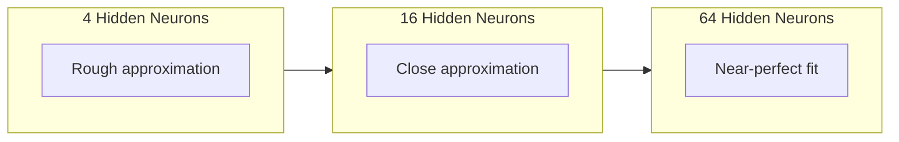

# 多层网络与前向传播

> 一个神经元只能画一条线。把它们堆起来，你就能画出任何形状。

**Type:** Build
**Languages:** Python
**Prerequisites:** Phase 01 (Math Foundations), Lesson 03.01 (The Perceptron)
**Time:** ~90 minutes

## 学习目标

- 从零构建一个多层网络，用 `Layer` 和 `Network` 类完成完整前向传播
- 跟踪网络每一层的矩阵维度，并识别形状不匹配问题
- 解释为什么堆叠非线性激活函数能让网络学习弯曲的决策边界
- 使用手工调好的 sigmoid 权重，用 2-2-1 架构解决 XOR 问题

## 问题

单个神经元只会画线。就是这样。它只能在数据中画出一条直线。AI 里的真实问题，比如图像识别、语言理解、下围棋，都需要曲线。把神经元堆成层，就是得到曲线的方法。

1969 年，Minsky 和 Papert 证明这个限制是致命的：单层网络无法学习 XOR。不是“学得很吃力”，而是数学上不可能。XOR 真值表把 `[0,1]` 和 `[1,0]` 放在一侧，把 `[0,0]` 和 `[1,1]` 放在另一侧。没有一条直线能分开它们。

这让神经网络的资助沉寂了十多年。现在回头看，修复方法很明显：不要只用一层。把神经元堆成多层。让第一层把输入空间切成新的特征，再让第二层把这些特征组合成单条直线做不到的决策。

这个堆叠结构就是多层网络。它是今天所有生产级深度学习模型的基础。前向传播，也就是数据从输入经过隐藏层流向输出，是你必须先搭起来的第一件东西；没有它，后面的训练都无从谈起。

## 核心概念

### 层：输入层、隐藏层、输出层

多层网络有三类层：

**输入层**：严格说不算真正的层。它保存原始数据。两个特征意味着两个输入节点。这里不发生计算。

**隐藏层**：真正干活的地方。每个神经元接收上一层的所有输出，应用权重和偏置，再把结果传入激活函数。之所以叫“隐藏”，是因为训练数据里不会直接观察到这些值。

**输出层**：最终答案。二分类通常用一个带 sigmoid 的神经元。多分类则通常每个类别一个神经元。



这是一个 2-3-1 网络。两个输入，三个隐藏神经元，一个输出。每条连接都有一个权重。除输入层外，每个神经元都有一个偏置。

每一层都会产生一个数字向量，叫作隐藏状态。对文本来说，隐藏状态通常会提高维度，例如把一个词编码成 768 个数字来捕捉语义。对图像来说，隐藏状态通常会降低维度，例如把数百万个像素压缩成可处理的表示。学习真正发生在隐藏状态里。

### 神经元与激活函数

每个神经元做三件事：

1. 把每个输入乘以对应权重
2. 把所有乘积求和，再加上偏置
3. 把这个和传入激活函数

现在先使用 sigmoid 作为激活函数：

```text
sigmoid(z) = 1 / (1 + e^(-z))
```

Sigmoid 会把任意数字压缩到 `(0, 1)` 区间。很大的正数会接近 1，很大的负数会接近 0，0 会映射到 0.5。这个平滑曲线让学习成为可能；不同于感知机的硬阶跃，sigmoid 在每个位置都有梯度。

### 前向传播：数据如何流动

前向传播把输入数据一层层推过网络，直到到达输出。前向传播期间不会发生学习。它只是纯计算：乘、加、激活，然后重复。



每一层都会按顺序执行三个操作：

```text
z = W * input + b       (linear transformation)
a = sigmoid(z)           (activation)
```

一层的输出会成为下一层的输入。这就是完整的前向传播。

### 矩阵维度

跟踪维度是深度学习里最重要的调试技能。下面是 2-3-1 网络：

| Step | Operation | Dimensions | Result Shape |
|------|-----------|------------|--------------|
| Input | x | -- | (2,) |
| Hidden linear | W1 * x + b1 | W1: (3, 2), b1: (3,) | (3,) |
| Hidden activation | sigmoid(z1) | -- | (3,) |
| Output linear | W2 * h + b2 | W2: (1, 3), b2: (1,) | (1,) |
| Output activation | sigmoid(z2) | -- | (1,) |

规则是：第 k 层的权重矩阵 `W` 形状为 `(当前层神经元数, 前一层神经元数)`。行对应当前层，列对应前一层。如果形状对不上，就是 bug。

### 通用近似定理

1989 年，George Cybenko 证明了一件很惊人的事：只要一个神经网络有单个隐藏层，并且隐藏神经元足够多，它就能以任意想要的精度近似任何连续函数。

这并不意味着单隐藏层总是最好。它的意思是，这种架构在理论上具备表达能力。实践中，更深的网络，也就是更多层、每层更少神经元，通常能用远少于浅而宽网络的总参数学到同样的函数。这就是深度学习有效的原因。

直觉是：隐藏层中的每个神经元学会一个“小凸起”或特征。只要把足够多的小凸起放在合适位置，就能近似任何平滑曲线。神经元越多，小凸起越多，近似越好。



### 可组合性

神经网络是可组合的。你可以堆叠它们、串联它们、并行运行它们。Whisper 模型用一个编码器网络处理音频，再用一个独立的解码器网络生成文本。现代 LLM 通常是 decoder-only。BERT 是 encoder-only。T5 是 encoder-decoder。架构选择决定了模型能做什么。

## Build It

纯 Python，不用 numpy。每个矩阵操作都从零写。

### 第 1 步：Sigmoid 激活函数

```python
import math

def sigmoid(x):
    x = max(-500.0, min(500.0, x))
    return 1.0 / (1.0 + math.exp(-x))
```

把输入限制在 `[-500, 500]` 可以防止溢出。`math.exp(500)` 很大，但仍然是有限值。`math.exp(1000)` 会变成无穷大。

### 第 2 步：`Layer` 类

整个深度学习里最重要的操作是矩阵乘法。每一层、每一个注意力头、每一次前向传播，本质上都绕不开矩阵乘法。线性层接收一个输入向量，把它乘以权重矩阵，再加上偏置向量：`y = Wx + b`。这一个方程占了神经网络 90% 的计算。

一层保存一个权重矩阵和一个偏置向量。它的 `forward` 方法接收输入向量，并返回激活后的输出。

```python
class Layer:
    def __init__(self, n_inputs, n_neurons, weights=None, biases=None):
        if weights is not None:
            self.weights = weights
        else:
            import random
            self.weights = [
                [random.uniform(-1, 1) for _ in range(n_inputs)]
                for _ in range(n_neurons)
            ]
        if biases is not None:
            self.biases = biases
        else:
            self.biases = [0.0] * n_neurons

    def forward(self, inputs):
        self.last_input = inputs
        self.last_output = []
        for neuron_idx in range(len(self.weights)):
            z = sum(
                w * x for w, x in zip(self.weights[neuron_idx], inputs)
            )
            z += self.biases[neuron_idx]
            self.last_output.append(sigmoid(z))
        return self.last_output
```

权重矩阵的形状是 `(n_neurons, n_inputs)`。每一行是一名神经元连接所有输入的权重。`forward` 方法遍历神经元，计算加权和加偏置，应用 sigmoid，然后收集结果。

### 第 3 步：`Network` 类

网络就是层的列表。前向传播把它们串起来：第 k 层的输出会喂给第 k+1 层。

```python
class Network:
    def __init__(self, layers):
        self.layers = layers

    def forward(self, inputs):
        current = inputs
        for layer in self.layers:
            current = layer.forward(current)
        return current
```

这就是完整的前向传播。四行逻辑。数据进去，流过每一层，从另一端出来。

### 第 4 步：用手工调好的权重解决 XOR

第 1 课里，我们通过组合 OR、NAND 和 AND 感知机解决了 XOR。现在用 `Layer` 和 `Network` 类做同一件事。2-2-1 架构表示：两个输入、两个隐藏神经元、一个输出。

```python
hidden = Layer(
    n_inputs=2,
    n_neurons=2,
    weights=[[20.0, 20.0], [-20.0, -20.0]],
    biases=[-10.0, 30.0],
)

output = Layer(
    n_inputs=2,
    n_neurons=1,
    weights=[[20.0, 20.0]],
    biases=[-30.0],
)

xor_net = Network([hidden, output])

xor_data = [
    ([0, 0], 0),
    ([0, 1], 1),
    ([1, 0], 1),
    ([1, 1], 0),
]

for inputs, expected in xor_data:
    result = xor_net.forward(inputs)
    predicted = 1 if result[0] >= 0.5 else 0
    print(f"  {inputs} -> {result[0]:.6f} (rounded: {predicted}, expected: {expected})")
```

很大的权重，例如 20 和 -20，会让 sigmoid 表现得像阶跃函数。第一个隐藏神经元近似 OR，第二个近似 NAND。输出神经元把它们组合成 AND，这就是 XOR。

### 第 5 步：圆形分类

更难一点的问题：判断二维点是在以原点为中心、半径为 0.5 的圆内还是圆外。这需要弯曲的决策边界，单个感知机不可能做到。

```python
import random
import math

random.seed(42)

data = []
for _ in range(200):
    x = random.uniform(-1, 1)
    y = random.uniform(-1, 1)
    label = 1 if (x * x + y * y) < 0.25 else 0
    data.append(([x, y], label))

circle_net = Network([
    Layer(n_inputs=2, n_neurons=8),
    Layer(n_inputs=8, n_neurons=1),
])
```

使用随机权重时，网络分类效果不会好。但前向传播仍然能跑。这就是重点：前向传播只是计算。学习正确权重要靠反向传播，它会在第 3 课出现。

```python
correct = 0
for inputs, expected in data:
    result = circle_net.forward(inputs)
    predicted = 1 if result[0] >= 0.5 else 0
    if predicted == expected:
        correct += 1

print(f"Accuracy with random weights: {correct}/{len(data)} ({100*correct/len(data):.1f}%)")
```

随机权重通常准确率很差，甚至经常不如总是猜多数类。训练之后，也就是第 3 课之后，这个带 8 个隐藏神经元的同一架构就能画出一条弯曲边界，把圆内和圆外分开。

## Use It

PyTorch 用四行代码完成上面所有事情：

```python
import torch
import torch.nn as nn

model = nn.Sequential(
    nn.Linear(2, 8),
    nn.Sigmoid(),
    nn.Linear(8, 1),
    nn.Sigmoid(),
)

x = torch.tensor([[0.0, 0.0], [0.0, 1.0], [1.0, 0.0], [1.0, 1.0]])
output = model(x)
print(output)
```

`nn.Linear(2, 8)` 就是你的 `Layer` 类：形状为 `(8, 2)` 的权重矩阵，形状为 `(8,)` 的偏置向量。`nn.Sigmoid()` 就是你的 sigmoid 函数逐元素应用。`nn.Sequential` 就是你的 `Network` 类：按顺序串起各层。

差别在速度和规模。PyTorch 可以在 GPU 上运行，可以处理数百万样本的批次，还会自动计算反向传播所需梯度。但前向传播逻辑和你刚刚从零实现的完全一样。

## Ship It

本课产出一个可复用的网络架构设计 prompt：

- `outputs/prompt-network-architect.md`

当你需要决定某个问题应该用多少层、每层多少神经元、使用哪些激活函数时，可以使用它。

## 练习

1. 构建一个 2-4-2-1 网络，也就是两个隐藏层，并在 XOR 数据上用随机权重运行前向传播。打印中间隐藏层输出，观察表示如何在每一层发生变化。

2. 把圆形分类器的隐藏层大小从 8 改成 2，再改成 32。每次都用随机权重运行前向传播。隐藏神经元数量会改变输出范围或分布吗？为什么？

3. 在 `Network` 类上实现一个 `count_parameters` 方法，返回可训练权重和偏置的总数。在 784-256-128-10 网络上测试它，这是经典 MNIST 架构。它有多少参数？

4. 为一个 3-4-4-2 网络构建前向传播。输入归一化到 0-1 的 RGB 颜色值，观察两个输出。这是一个简单二分类颜色分类器的架构。

5. 把 sigmoid 替换成一个 “leaky step” 函数：如果 `z < 0`，返回 `0.01 * z`，否则返回 `1.0`。用第 4 步同样的手工权重在 XOR 上运行前向传播。它还能工作吗？为什么平滑的 sigmoid 比硬阈值更适合？

## 关键术语

| Term | 常见说法 | 实际含义 |
|------|----------|----------|
| Forward pass | “运行模型” | 把输入推过每一层：乘以权重、加上偏置、应用激活函数，最后产生输出 |
| Hidden layer | “中间部分” | 输入和输出之间的任何层，它的值不会在数据中被直接观察到 |
| Multi-layer network | “深度神经网络” | 按顺序堆叠的神经元层，前一层输出会喂给后一层输入 |
| Activation function | “非线性” | 在线性变换之后应用的函数，用来给决策边界引入曲线 |
| Sigmoid | “S 形曲线” | `sigma(z) = 1/(1+e^(-z))`，把任意实数压缩到 `(0,1)`，平滑且处处可微 |
| Weight matrix | “参数” | 形状为 `(当前层神经元数, 前一层神经元数)` 的矩阵，保存可学习的连接强度 |
| Bias vector | “偏移量” | 矩阵乘法之后加上的向量，让神经元即使在所有输入为零时也能激活 |
| Universal approximation | “神经网络什么都能学” | 一个拥有足够神经元的单隐藏层网络可以近似任何连续函数，但“足够”可能意味着数十亿 |
| Linear transformation | “矩阵乘法那一步” | `z = W * x + b`，激活前的计算，把输入映射到新空间 |
| Decision boundary | “分类器切换判断的位置” | 输入空间中网络输出跨过分类阈值的曲面 |

## 延伸阅读

- Michael Nielsen, "Neural Networks and Deep Learning", Chapter 1-2 (http://neuralnetworksanddeeplearning.com/)：关于前向传播和网络结构最清楚的免费解释之一，包含交互式可视化
- Cybenko, "Approximation by Superpositions of a Sigmoidal Function" (1989)：通用近似定理的原始论文，出人意料地易读
- 3Blue1Brown, "But what is a neural network?" (https://www.youtube.com/watch?v=aircAruvnKk)：20 分钟可视化讲解层、权重和前向传播，能建立很好的心智模型
- Goodfellow, Bengio, Courville, "Deep Learning", Chapter 6 (https://www.deeplearningbook.org/)：多层网络的标准参考，免费在线
