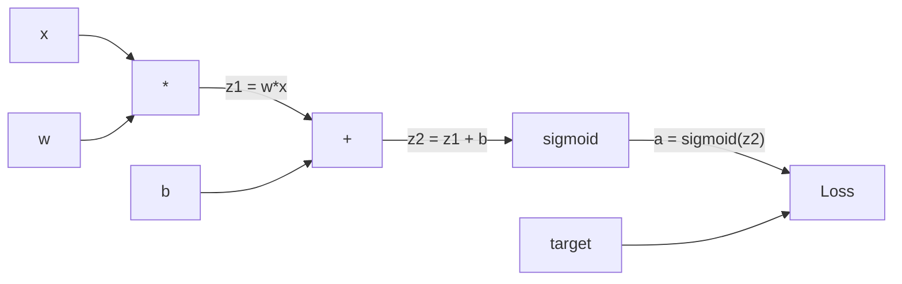
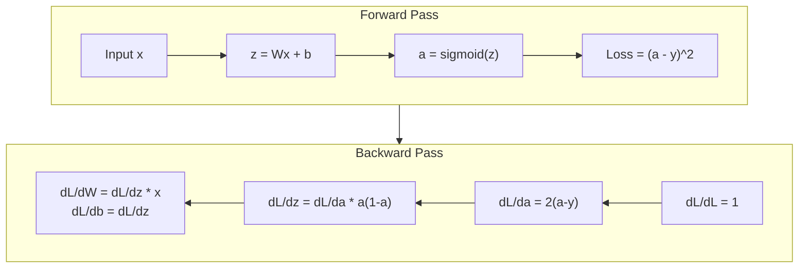
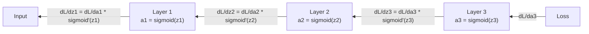

# 从零实现反向传播

> 反向传播是让学习成为可能的算法。没有它，神经网络只是昂贵的随机数生成器。

**Type:** Build
**Languages:** Python
**Prerequisites:** Lesson 03.02 (Multi-Layer Networks)
**Time:** ~120 minutes

## 学习目标

- 实现一个基于 `Value` 的自动求导引擎，它会构建计算图，并通过拓扑排序计算梯度
- 使用链式法则推导加法、乘法和 sigmoid 的反向传播过程
- 只用你从零实现的反向传播引擎，在 XOR 和圆形分类任务上训练多层网络
- 识别深层 sigmoid 网络中的梯度消失问题，并解释为什么梯度会指数级缩小

## 问题

你的网络有一个隐藏层，768 个输入，3072 个输出。这里有 2,359,296 个权重。它做错了一次预测。到底哪些权重导致了错误？如果逐个测试每个权重，就意味着要跑 230 多万次前向传播。反向传播只用一次反向传播就能算出全部 230 多万个梯度。这不是简单优化，而是“能训练”和“不可能训练”之间的区别。

朴素做法是：拿一个权重，把它轻轻改动一点，再跑一次前向传播，观察损失变大还是变小。这样可以得到这个权重的梯度。然后对网络中的每一个权重都重复一遍。再乘上成千上万步训练和数百万数据点。你需要地质年代级别的时间才能训练出任何有用的东西。

反向传播解决了这个问题。一次前向传播，一次反向传播，所有梯度都算出来。诀窍是把微积分中的链式法则系统地应用到计算图上。正是这个算法让深度学习变得可行。没有它，我们还会困在玩具问题里。

## 核心概念

### 应用于网络的链式法则

你在 Phase 01 的第 05 课见过链式法则。快速回顾一下：如果 `y = f(g(x))`，那么 `dy/dx = f'(g(x)) * g'(x)`。也就是沿着链条把导数乘起来。

在神经网络中，这条“链”就是从输入到损失的一系列操作。每一层应用权重、加上偏置、通过激活函数。损失函数把最终输出和目标值进行比较。反向传播沿着这条链反向追踪，计算每个操作对误差的贡献。

### 计算图

每次前向传播都会构建一张图。每个节点是一个操作，例如乘法、加法、sigmoid。每条边向前传递数值，向后传递梯度。



前向传播时，数值从左向右流动。`x` 和 `w` 产生 `z1 = w*x`。加上 `b` 得到 `z2`。Sigmoid 给出激活值 `a`。然后用损失函数把 `a` 和目标 `y` 进行比较。

反向传播时，梯度从右向左流动。从 `dL/da` 开始，也就是损失如何随激活值变化。乘上 `da/dz2`，也就是 sigmoid 的导数，得到 `dL/dz2`。然后拆成 `dL/db` 和 `dL/dz1`；因为 `z2 = z1 + b`，所以 `dL/db` 等于 `dL/dz2`。接着 `dL/dw = dL/dz1 * x`，`dL/dx = dL/dz1 * w`。

计算图中的每个节点在反向传播时只有一个任务：接收上游梯度，乘上自己的局部导数，再把结果向下传。

### 前向与反向



前向传播会保存每个中间值：`z`、`a`、每一层的输入。反向传播需要这些已保存的值来计算梯度。这就是反向传播核心的内存与计算权衡：用内存保存激活值，换来一次反向传播完成计算，而不是运行数百万次前向传播。

### 梯度如何穿过网络

对一个 3 层网络来说，梯度会链式穿过每一层：



每经过一层，梯度都会乘上 sigmoid 的导数。Sigmoid 的导数是 `a * (1 - a)`，最大值是 0.25，也就是 `a = 0.5` 时。经过 3 层后，梯度最多已经乘上 `0.25^3 = 0.0156`。经过 10 层后，最多是 `0.25^10 = 0.000001`。

### 梯度消失

这就是梯度消失问题。Sigmoid 把输出压缩到 0 和 1 之间。它的导数永远小于 0.25。堆叠足够多的 sigmoid 层后，梯度会缩小到接近零。早期层几乎学不到东西，因为它们收到的是近乎为零的梯度。

```text
sigmoid(z):     Output range [0, 1]
sigmoid'(z):    Max value 0.25 (at z = 0)

After 5 layers:   gradient * 0.25^5 = 0.001x original
After 10 layers:  gradient * 0.25^10 = 0.000001x original
```

这就是为什么深层 sigmoid 网络几乎无法训练。修复办法是 ReLU 及其变体，这是第 4 课的主题。现在你只需要理解：反向传播本身运作得很好。问题出在它要穿过的函数上。

### 推导两层网络的梯度

下面是一组具体数学：输入为 `x`，隐藏层使用 sigmoid，输出层也使用 sigmoid，损失函数是 MSE。

前向传播：

```text
z1 = W1 * x + b1
a1 = sigmoid(z1)
z2 = W2 * a1 + b2
a2 = sigmoid(z2)
L = (a2 - y)^2
```

反向传播，也就是一步步应用链式法则：

```text
dL/da2 = 2(a2 - y)
da2/dz2 = a2 * (1 - a2)
dL/dz2 = dL/da2 * da2/dz2 = 2(a2 - y) * a2 * (1 - a2)

dL/dW2 = dL/dz2 * a1
dL/db2 = dL/dz2

dL/da1 = dL/dz2 * W2
da1/dz1 = a1 * (1 - a1)
dL/dz1 = dL/da1 * da1/dz1

dL/dW1 = dL/dz1 * x
dL/db1 = dL/dz1
```

每个梯度都是从损失开始、沿路径回溯得到的一串局部导数乘积。反向传播的全部本质就是这个。

## Build It

### 第 1 步：`Value` 节点

我们计算中的每个数字都会变成一个 `Value`。它保存自己的数值、梯度，以及自己是如何被创建出来的；这样它才知道如何向后计算梯度。

```python
class Value:
    def __init__(self, data, children=(), op=''):
        self.data = data
        self.grad = 0.0
        self._backward = lambda: None
        self._children = set(children)
        self._op = op

    def __repr__(self):
        return f"Value(data={self.data:.4f}, grad={self.grad:.4f})"
```

一开始没有梯度，所以是 `0.0`。一开始也没有反向函数，所以是 no-op。`_children` 记录哪些 `Value` 生成了当前节点，后面我们会用它对图做拓扑排序。

### 第 2 步：带反向函数的操作

每个操作都会创建一个新的 `Value`，并定义梯度如何穿过这个操作向后流动。

```python
def __add__(self, other):
    other = other if isinstance(other, Value) else Value(other)
    out = Value(self.data + other.data, (self, other), '+')

    def _backward():
        self.grad += out.grad
        other.grad += out.grad

    out._backward = _backward
    return out

def __mul__(self, other):
    other = other if isinstance(other, Value) else Value(other)
    out = Value(self.data * other.data, (self, other), '*')

    def _backward():
        self.grad += other.data * out.grad
        other.grad += self.data * out.grad

    out._backward = _backward
    return out
```

对加法来说，`d(a+b)/da = 1`，`d(a+b)/db = 1`。所以两个输入都会直接收到输出梯度。

对乘法来说，`d(a*b)/da = b`，`d(a*b)/db = a`。每个输入都会收到“另一个输入的值乘以输出梯度”。

这里的 `+=` 非常关键。一个 `Value` 可能会被多个操作使用。它的总梯度是所有路径传回来的梯度之和。

### 第 3 步：Sigmoid 和损失

```python
import math

def sigmoid(self):
    x = self.data
    x = max(-500, min(500, x))
    s = 1.0 / (1.0 + math.exp(-x))
    out = Value(s, (self,), 'sigmoid')

    def _backward():
        self.grad += (s * (1 - s)) * out.grad

    out._backward = _backward
    return out
```

Sigmoid 的导数是 `sigmoid(x) * (1 - sigmoid(x))`。我们在前向传播中已经算出了 `sigmoid(x) = s`，所以直接复用它，不需要额外计算。

```python
def mse_loss(predicted, target):
    diff = predicted + Value(-target)
    return diff * diff
```

单输出 MSE 是 `(predicted - target)^2`。这里把减法写成加上一个取负的 `Value`。

### 第 4 步：反向传播

拓扑排序能保证我们按正确顺序处理节点，也就是某个节点的梯度已经完全累积之后，才通过它继续向下传播。

```python
def backward(self):
    topo = []
    visited = set()

    def build_topo(v):
        if v not in visited:
            visited.add(v)
            for child in v._children:
                build_topo(child)
            topo.append(v)

    build_topo(self)
    self.grad = 1.0
    for v in reversed(topo):
        v._backward()
```

从损失开始，梯度设为 `1.0`，因为 `dL/dL = 1`。然后沿着排好序的图反向走。每个节点的 `_backward` 会把梯度推给自己的子节点。

### 第 5 步：`Layer` 和 `Network`

```python
import random

class Neuron:
    def __init__(self, n_inputs):
        scale = (2.0 / n_inputs) ** 0.5
        self.weights = [Value(random.uniform(-scale, scale)) for _ in range(n_inputs)]
        self.bias = Value(0.0)

    def __call__(self, x):
        act = sum((wi * xi for wi, xi in zip(self.weights, x)), self.bias)
        return act.sigmoid()

    def parameters(self):
        return self.weights + [self.bias]


class Layer:
    def __init__(self, n_inputs, n_outputs):
        self.neurons = [Neuron(n_inputs) for _ in range(n_outputs)]

    def __call__(self, x):
        out = [n(x) for n in self.neurons]
        return out[0] if len(out) == 1 else out

    def parameters(self):
        params = []
        for n in self.neurons:
            params.extend(n.parameters())
        return params


class Network:
    def __init__(self, sizes):
        self.layers = []
        for i in range(len(sizes) - 1):
            self.layers.append(Layer(sizes[i], sizes[i + 1]))

    def __call__(self, x):
        for layer in self.layers:
            x = layer(x)
            if not isinstance(x, list):
                x = [x]
        return x[0] if len(x) == 1 else x

    def parameters(self):
        params = []
        for layer in self.layers:
            params.extend(layer.parameters())
        return params

    def zero_grad(self):
        for p in self.parameters():
            p.grad = 0.0
```

一个 `Neuron` 接收输入，计算加权和加偏置，然后应用 sigmoid。权重初始化按 `sqrt(2/n_inputs)` 缩放，目的是防止更深网络中的 sigmoid 过早饱和。一个 `Layer` 是一组 `Neuron`。一个 `Network` 是一组 `Layer`。`parameters()` 方法会收集所有可学习的 `Value`，这样我们才能更新它们。

### 第 6 步：在 XOR 上训练

```python
random.seed(42)
net = Network([2, 4, 1])

xor_data = [
    ([0.0, 0.0], 0.0),
    ([0.0, 1.0], 1.0),
    ([1.0, 0.0], 1.0),
    ([1.0, 1.0], 0.0),
]

learning_rate = 1.0

for epoch in range(1000):
    total_loss = Value(0.0)
    for inputs, target in xor_data:
        x = [Value(i) for i in inputs]
        pred = net(x)
        loss = mse_loss(pred, target)
        total_loss = total_loss + loss

    net.zero_grad()
    total_loss.backward()

    for p in net.parameters():
        p.data -= learning_rate * p.grad

    if epoch % 100 == 0:
        print(f"Epoch {epoch:4d} | Loss: {total_loss.data:.6f}")

print("\nXOR Results:")
for inputs, target in xor_data:
    x = [Value(i) for i in inputs]
    pred = net(x)
    print(f"  {inputs} -> {pred.data:.4f} (expected {target})")
```

观察损失下降。模型会从随机预测走向正确的 XOR 输出，整个过程完全由反向传播计算梯度，并把权重朝正确方向轻轻推动。

### 第 7 步：圆形分类

第 2 课里，你为圆形分类手工调了权重。现在让网络自己学出来。

```python
random.seed(7)

def generate_circle_data(n=100):
    data = []
    for _ in range(n):
        x1 = random.uniform(-1.5, 1.5)
        x2 = random.uniform(-1.5, 1.5)
        label = 1.0 if x1 * x1 + x2 * x2 < 1.0 else 0.0
        data.append(([x1, x2], label))
    return data

circle_data = generate_circle_data(80)

circle_net = Network([2, 8, 1])
learning_rate = 0.5

for epoch in range(2000):
    random.shuffle(circle_data)
    total_loss_val = 0.0
    for inputs, target in circle_data:
        x = [Value(i) for i in inputs]
        pred = circle_net(x)
        loss = mse_loss(pred, target)
        circle_net.zero_grad()
        loss.backward()
        for p in circle_net.parameters():
            p.data -= learning_rate * p.grad
        total_loss_val += loss.data

    if epoch % 200 == 0:
        correct = 0
        for inputs, target in circle_data:
            x = [Value(i) for i in inputs]
            pred = circle_net(x)
            predicted_class = 1.0 if pred.data > 0.5 else 0.0
            if predicted_class == target:
                correct += 1
        accuracy = correct / len(circle_data) * 100
        print(f"Epoch {epoch:4d} | Loss: {total_loss_val:.4f} | Accuracy: {accuracy:.1f}%")
```

这里使用在线 SGD，也就是每个样本之后就更新权重，而不是累积完整批次。这样可以更快打破对称性，也能避免在完整损失地形上让 sigmoid 饱和。每个 epoch 打乱数据，可以防止网络记住样本顺序。

没有手工调权重。网络自己发现了圆形决策边界。这就是反向传播的力量：你定义架构、损失函数和数据，算法会找出权重。

## Use It

PyTorch 用几行代码完成上面所有事情。核心思想完全一样：autograd 在前向传播期间构建计算图，然后反向追踪它来计算梯度。

```python
import torch
import torch.nn as nn

model = nn.Sequential(
    nn.Linear(2, 4),
    nn.Sigmoid(),
    nn.Linear(4, 1),
    nn.Sigmoid(),
)
optimizer = torch.optim.SGD(model.parameters(), lr=1.0)
criterion = nn.MSELoss()

X = torch.tensor([[0,0],[0,1],[1,0],[1,1]], dtype=torch.float32)
y = torch.tensor([[0],[1],[1],[0]], dtype=torch.float32)

for epoch in range(1000):
    pred = model(X)
    loss = criterion(pred, y)
    optimizer.zero_grad()
    loss.backward()
    optimizer.step()

print("PyTorch XOR Results:")
with torch.no_grad():
    for i in range(4):
        pred = model(X[i])
        print(f"  {X[i].tolist()} -> {pred.item():.4f} (expected {y[i].item()})")
```

`loss.backward()` 就是你的 `total_loss.backward()`。`optimizer.step()` 就是你手写的 `p.data -= lr * p.grad`。`optimizer.zero_grad()` 就是你的 `net.zero_grad()`。同一个算法，只是工业级实现。PyTorch 处理 GPU 加速、混合精度、梯度检查点和数百种层类型。但反向传播仍然是把链式法则应用到同一类计算图上。

训练会运行前向传播，然后运行反向传播，然后更新权重。推理只运行前向传播。没有梯度，没有更新。这个区别很重要，因为生产环境中发生的是推理。当你调用 Claude 或 GPT 这样的 API 时，你是在运行推理：你的 prompt 向前流过网络，token 从另一端出来。权重不会改变。理解反向传播很重要，因为它塑造了那个网络里的每一个权重。

## Ship It

本课产出：

- `outputs/prompt-gradient-debugger.md`：一个可复用 prompt，用于诊断任意神经网络中的梯度问题，包括梯度消失、梯度爆炸和 NaN

## 练习

1. 给 `Value` 类添加 `__sub__` 方法，`a - b = a + (-1 * b)`。然后实现 `__neg__` 方法。用一个简单表达式，例如 `(a - b)^2`，和手工计算结果对比，验证梯度正确。

2. 给 `Value` 添加 `relu` 方法：输出 `max(0, x)`，导数在 `x > 0` 时为 1，否则为 0。把隐藏层里的 sigmoid 换成 relu，再训练 XOR。比较收敛速度。你应该会看到更快训练，这会提前预览第 4 课。

3. 在 `Value` 上实现整数幂的 `__pow__` 方法。用它把 `mse_loss` 替换成真正的 `(predicted - target) ** 2` 表达式。验证梯度和原实现一致。

4. 给训练循环添加梯度裁剪：调用 `backward()` 之后，把所有梯度裁剪到 `[-1, 1]`。训练一个更深的网络，也就是 4 层以上并使用 sigmoid，对比有无梯度裁剪时的损失曲线。这是你对抗梯度爆炸的第一道防线。

5. 构建一个可视化：在 XOR 训练完成后，打印网络中每个参数的梯度。找出哪一层梯度最小。这会演示你在核心概念部分读到的梯度消失问题。

## 关键术语

| Term | 常见说法 | 实际含义 |
|------|----------|----------|
| Backpropagation | “网络在学习” | 一种通过计算图反向应用链式法则，为每个权重计算 `dL/dw` 的算法 |
| Computational graph | “网络结构” | 有向无环图，节点是操作，边向前传值、向后传梯度 |
| Chain rule | “把导数乘起来” | 如果 `y = f(g(x))`，那么 `dy/dx = f'(g(x)) * g'(x)`，这是反向传播的数学基础 |
| Gradient | “最陡上升方向” | 损失对某个参数的偏导数，告诉你该如何改变这个参数以降低损失 |
| Vanishing gradient | “深层网络学不动” | 梯度穿过 sigmoid 这类饱和激活函数时指数级缩小 |
| Forward pass | “运行网络” | 通过逐层应用操作从输入计算输出，并保存中间值 |
| Backward pass | “计算梯度” | 反向遍历计算图，在每个节点上用链式法则累积梯度 |
| Learning rate | “学得多快” | 控制权重更新步长的标量：`w_new = w_old - lr * gradient` |
| Topological sort | “正确顺序” | 图节点的一种排序方式，每个节点都出现在它依赖的节点之后，确保传播前梯度已经完全累积 |
| Autograd | “自动微分” | 在前向计算时构建计算图，并自动计算梯度的系统，也就是 PyTorch 引擎做的事 |

## 延伸阅读

- Rumelhart, Hinton & Williams, "Learning representations by back-propagating errors" (1986)：让反向传播成为主流、开启多层网络训练的论文
- 3Blue1Brown, "Neural Networks" series (https://www.youtube.com/playlist?list=PLZHQObOWTQDNU6R1_67000Dx_ZCJB-3pi)：关于反向传播和梯度如何流过网络的最佳可视化讲解之一
