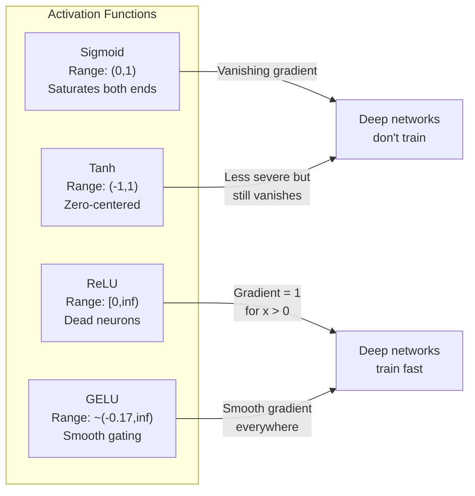
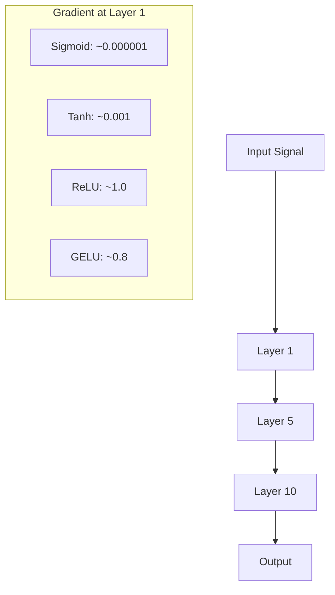
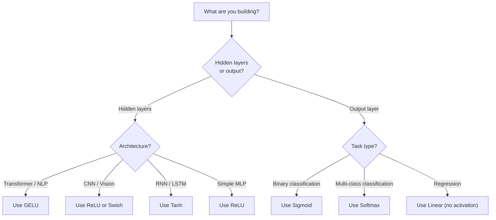

# 激活函数

> 没有非线性，你的 100 层网络只是一个华丽的矩阵乘法。激活函数是让神经网络能用曲线思考的门。

**Type:** Build
**Languages:** Python
**Prerequisites:** Lesson 03.03 (Backpropagation)
**Time:** ~75 minutes

## 学习目标

- 从零实现 sigmoid、tanh、ReLU、Leaky ReLU、GELU、Swish 和 softmax 及其导数
- 通过测量不同激活函数在 10 层以上网络中的激活幅度，诊断梯度消失问题
- 检测 ReLU 网络中的死亡神经元，并解释为什么 GELU 可以避免这种失败模式
- 针对给定架构选择正确的激活函数，例如 transformer、CNN、RNN 和输出层

## 问题

堆叠两个线性变换：`y = W2(W1x + b1) + b2`。展开它：`y = W2W1x + W2b1 + b2`。这其实只是 `y = Ax + c`，也就是一个线性变换。不管你堆多少个线性层，最终都会坍缩成一次矩阵乘法。你的 100 层网络和单层网络有同样的表示能力。

这不是理论上的小趣味。它意味着一个深层线性网络真的无法学习 XOR，无法分类螺旋数据集，也无法识别人脸。没有激活函数，深度只是幻觉。

激活函数打破线性。它们把每一层的输出扭曲到一个非线性函数中，让网络能够弯折决策边界、近似任意函数，并真正学习。但如果选错激活函数，梯度会消失到零，例如深层网络里的 sigmoid；也可能爆炸到无穷大，例如无界激活配合糟糕初始化；还可能让神经元永久死亡，例如带大负偏置的 ReLU。激活函数的选择会直接决定你的网络到底能不能学。

## 核心概念

### 为什么非线性是必要的

矩阵乘法可以组合。先把向量乘以矩阵 A，再乘以矩阵 B，等价于直接乘以 AB。这意味着堆叠十个线性层，在数学上等价于一个带大矩阵的线性层。所有参数、所有深度，全都浪费了。你需要某种东西打断这条链。激活函数做的就是这件事。

证明如下。线性层计算 `f(x) = Wx + b`。堆叠两层：

```text
Layer 1: h = W1 * x + b1
Layer 2: y = W2 * h + b2
```

代入：

```text
y = W2 * (W1 * x + b1) + b2
y = (W2 * W1) * x + (W2 * b1 + b2)
y = A * x + c
```

还是一层。在线性层之间插入一个非线性激活 `g()`：

```text
h = g(W1 * x + b1)
y = W2 * h + b2
```

这时代入就断了。`W2 * g(W1 * x + b1) + b2` 无法再化简成单个线性变换。网络可以表示非线性函数。每增加一层带激活的层，都会增加表示能力。

### Sigmoid

神经网络最早使用的激活函数。

```text
sigmoid(x) = 1 / (1 + e^(-x))
```

输出范围是 `(0, 1)`。它平滑、可微，会把任意实数映射成类似概率的值。

导数是：

```text
sigmoid'(x) = sigmoid(x) * (1 - sigmoid(x))
```

这个导数的最大值是 0.25，出现在 `x = 0`。在反向传播中，梯度会逐层相乘。十层 sigmoid 意味着梯度最多会乘上十次 0.25：

```text
0.25^10 = 0.000000953674
```

不到原始信号的一百万分之一。这就是梯度消失问题。早期层的梯度会小到权重几乎不更新。网络看起来在学习，因为后面几层的损失在下降，但最前面的层其实被冻结了。深层 sigmoid 网络基本训练不起来。

另一个问题是：sigmoid 输出永远是正数，也就是 0 到 1，这意味着权重上的梯度总是同号。这会让梯度下降出现来回折返。

### Tanh

Tanh 是居中版本的 sigmoid。

```text
tanh(x) = (e^x - e^(-x)) / (e^x + e^(-x))
```

输出范围是 `(-1, 1)`。它以 0 为中心，因此消除了 sigmoid 的折返问题。

导数是：

```text
tanh'(x) = 1 - tanh(x)^2
```

最大导数在 `x = 0` 时是 1.0，比 sigmoid 好四倍。但梯度消失问题仍然存在。当输入很大或很小时，导数会接近零。十层之后梯度仍会被压扁，只是没有 sigmoid 那么严重。

### ReLU：突破点

Rectified Linear Unit。Nair 和 Hinton 在 2010 年把它推广到深度学习中；函数本身可以追溯到 Fukushima 1969 年的工作。它改变了一切。

```text
relu(x) = max(0, x)
```

输出范围是 `[0, infinity)`。导数极其简单：

```text
relu'(x) = 1  if x > 0
            0  if x <= 0
```

对正输入来说没有梯度消失。梯度恰好是 1，会直接传过去。这就是深层网络开始变得可训练的原因：ReLU 会保留跨层的梯度幅度。

但它有一个失败模式：死亡神经元。如果一个神经元的加权输入永远为负，例如因为大负偏置或糟糕初始化，它的输出永远是零，梯度永远是零，也就永远不会更新。它永久死亡了。实践中，ReLU 网络里 10% 到 40% 的神经元可能会在训练中死亡。

### Leaky ReLU

解决死亡神经元的最简单办法。

```text
leaky_relu(x) = x        if x > 0
                alpha * x if x <= 0
```

其中 `alpha` 是一个很小的常数，通常是 0.01。负半轴不再是零斜率，而是有一个很小的斜率，所以死亡神经元仍然能收到梯度信号，并有机会恢复。

### GELU：现代默认选择

Gaussian Error Linear Unit。Hendrycks 和 Gimpel 在 2016 年提出。它是 BERT、GPT 和大多数现代 transformer 的默认激活函数。

```text
gelu(x) = x * Phi(x)
```

其中 `Phi(x)` 是标准正态分布的累积分布函数。实践中常用的近似式是：

```text
gelu(x) ~= 0.5 * x * (1 + tanh(sqrt(2/pi) * (x + 0.044715 * x^3)))
```

GELU 处处平滑，允许小的负值通过；这不同于 ReLU 把负值硬截断为零。它还有一个概率解释：根据输入在高斯分布下为正的概率来给输入加权。这种平滑门控在 transformer 架构中通常优于 ReLU，因为它提供更好的梯度流，并且完全避免死亡神经元问题。

### Swish / SiLU

Swish 是 Ramachandran 等人在 2017 年通过自动搜索发现的自门控激活函数。

```text
swish(x) = x * sigmoid(x)
```

形式上，Swish 就是 `x * sigmoid(x)`。Google 通过在激活函数空间里自动搜索发现了它，相当于让神经网络设计神经网络的一部分。

和 GELU 一样，它平滑、非单调，并允许小的负值通过。区别很微妙：Swish 用 sigmoid 做门控，而 GELU 用高斯 CDF 做门控。实践中二者表现几乎一样。Swish 用在 EfficientNet 和一些视觉模型里，GELU 则主导语言模型。

### Softmax：输出层激活

Softmax 不用于隐藏层。它把一组原始分数，也就是 logits，转换成概率分布。

```text
softmax(x_i) = e^(x_i) / sum(e^(x_j) for all j)
```

每个输出都在 0 到 1 之间，所有输出之和为 1。这让它成为多分类任务的标准最终激活。最大的 logit 会得到最高概率，但不同于 argmax，softmax 是可微的，并且保留了相对置信度信息。

### 形状对比



### 梯度流对比



### 什么时候用哪个激活函数



## Build It

### 第 1 步：实现所有激活函数及其导数

每个函数接收一个浮点数并返回一个浮点数。每个导数函数接收相同输入，并返回梯度。

```python
import math

def sigmoid(x):
    x = max(-500, min(500, x))
    return 1.0 / (1.0 + math.exp(-x))

def sigmoid_derivative(x):
    s = sigmoid(x)
    return s * (1 - s)

def tanh_act(x):
    return math.tanh(x)

def tanh_derivative(x):
    t = math.tanh(x)
    return 1 - t * t

def relu(x):
    return max(0.0, x)

def relu_derivative(x):
    return 1.0 if x > 0 else 0.0

def leaky_relu(x, alpha=0.01):
    return x if x > 0 else alpha * x

def leaky_relu_derivative(x, alpha=0.01):
    return 1.0 if x > 0 else alpha

def gelu(x):
    return 0.5 * x * (1 + math.tanh(math.sqrt(2 / math.pi) * (x + 0.044715 * x ** 3)))

def gelu_derivative(x):
    phi = 0.5 * (1 + math.erf(x / math.sqrt(2)))
    pdf = math.exp(-0.5 * x * x) / math.sqrt(2 * math.pi)
    return phi + x * pdf

def swish(x):
    return x * sigmoid(x)

def swish_derivative(x):
    s = sigmoid(x)
    return s + x * s * (1 - s)

def softmax(xs):
    max_x = max(xs)
    exps = [math.exp(x - max_x) for x in xs]
    total = sum(exps)
    return [e / total for e in exps]
```

### 第 2 步：可视化梯度在哪里死亡

在 -5 到 5 之间取 100 个均匀间隔点，计算每个点的梯度。打印一个文本直方图，显示每种激活函数的梯度在哪里接近零。

```python
def gradient_scan(name, derivative_fn, start=-5, end=5, n=100):
    step = (end - start) / n
    near_zero = 0
    healthy = 0
    for i in range(n):
        x = start + i * step
        g = derivative_fn(x)
        if abs(g) < 0.01:
            near_zero += 1
        else:
            healthy += 1
    pct_dead = near_zero / n * 100
    print(f"{name:15s}: {healthy:3d} healthy, {near_zero:3d} near-zero ({pct_dead:.0f}% dead zone)")

gradient_scan("Sigmoid", sigmoid_derivative)
gradient_scan("Tanh", tanh_derivative)
gradient_scan("ReLU", relu_derivative)
gradient_scan("Leaky ReLU", leaky_relu_derivative)
gradient_scan("GELU", gelu_derivative)
gradient_scan("Swish", swish_derivative)
```

### 第 3 步：梯度消失实验

用 sigmoid 和 ReLU 分别让信号前向穿过 N 层。测量激活幅度如何变化。

```python
import random

def vanishing_gradient_experiment(activation_fn, name, n_layers=10, n_inputs=5):
    random.seed(42)
    values = [random.gauss(0, 1) for _ in range(n_inputs)]

    print(f"\n{name} through {n_layers} layers:")
    for layer in range(n_layers):
        weights = [random.gauss(0, 1) for _ in range(n_inputs)]
        z = sum(w * v for w, v in zip(weights, values))
        activated = activation_fn(z)
        magnitude = abs(activated)
        bar = "#" * int(magnitude * 20)
        print(f"  Layer {layer+1:2d}: magnitude = {magnitude:.6f} {bar}")
        values = [activated] * n_inputs

vanishing_gradient_experiment(sigmoid, "Sigmoid")
vanishing_gradient_experiment(relu, "ReLU")
vanishing_gradient_experiment(gelu, "GELU")
```

### 第 4 步：死亡神经元检测器

创建一个 ReLU 网络，让随机输入穿过它，统计有多少神经元从不触发。

```python
def dead_neuron_detector(n_inputs=5, hidden_size=20, n_samples=1000):
    random.seed(0)
    weights = [[random.gauss(0, 1) for _ in range(n_inputs)] for _ in range(hidden_size)]
    biases = [random.gauss(0, 1) for _ in range(hidden_size)]

    fire_counts = [0] * hidden_size

    for _ in range(n_samples):
        inputs = [random.gauss(0, 1) for _ in range(n_inputs)]
        for neuron_idx in range(hidden_size):
            z = sum(w * x for w, x in zip(weights[neuron_idx], inputs)) + biases[neuron_idx]
            if relu(z) > 0:
                fire_counts[neuron_idx] += 1

    dead = sum(1 for c in fire_counts if c == 0)
    rarely_fire = sum(1 for c in fire_counts if 0 < c < n_samples * 0.05)
    healthy = hidden_size - dead - rarely_fire

    print(f"\nDead Neuron Report ({hidden_size} neurons, {n_samples} samples):")
    print(f"  Dead (never fired):     {dead}")
    print(f"  Barely alive (<5%):     {rarely_fire}")
    print(f"  Healthy:                {healthy}")
    print(f"  Dead neuron rate:       {dead/hidden_size*100:.1f}%")

    for i, c in enumerate(fire_counts):
        status = "DEAD" if c == 0 else "WEAK" if c < n_samples * 0.05 else "OK"
        bar = "#" * (c * 40 // n_samples)
        print(f"  Neuron {i:2d}: {c:4d}/{n_samples} fires [{status:4s}] {bar}")

dead_neuron_detector()
```

### 第 5 步：训练对比：Sigmoid vs ReLU vs GELU

在圆形数据集上训练同一个两层网络，也就是圆内点为 class 1、圆外点为 class 0，只替换三种不同激活函数。比较收敛速度。

```python
def make_circle_data(n=200, seed=42):
    random.seed(seed)
    data = []
    for _ in range(n):
        x = random.uniform(-2, 2)
        y = random.uniform(-2, 2)
        label = 1.0 if x * x + y * y < 1.5 else 0.0
        data.append(([x, y], label))
    return data


class ActivationNetwork:
    def __init__(self, activation_fn, activation_deriv, hidden_size=8, lr=0.1):
        random.seed(0)
        self.act = activation_fn
        self.act_d = activation_deriv
        self.lr = lr
        self.hidden_size = hidden_size

        self.w1 = [[random.gauss(0, 0.5) for _ in range(2)] for _ in range(hidden_size)]
        self.b1 = [0.0] * hidden_size
        self.w2 = [random.gauss(0, 0.5) for _ in range(hidden_size)]
        self.b2 = 0.0

    def forward(self, x):
        self.x = x
        self.z1 = []
        self.h = []
        for i in range(self.hidden_size):
            z = self.w1[i][0] * x[0] + self.w1[i][1] * x[1] + self.b1[i]
            self.z1.append(z)
            self.h.append(self.act(z))

        self.z2 = sum(self.w2[i] * self.h[i] for i in range(self.hidden_size)) + self.b2
        self.out = sigmoid(self.z2)
        return self.out

    def backward(self, target):
        error = self.out - target
        d_out = error * self.out * (1 - self.out)

        for i in range(self.hidden_size):
            d_h = d_out * self.w2[i] * self.act_d(self.z1[i])
            self.w2[i] -= self.lr * d_out * self.h[i]
            for j in range(2):
                self.w1[i][j] -= self.lr * d_h * self.x[j]
            self.b1[i] -= self.lr * d_h
        self.b2 -= self.lr * d_out

    def train(self, data, epochs=200):
        losses = []
        for epoch in range(epochs):
            total_loss = 0
            correct = 0
            for x, y in data:
                pred = self.forward(x)
                self.backward(y)
                total_loss += (pred - y) ** 2
                if (pred >= 0.5) == (y >= 0.5):
                    correct += 1
            avg_loss = total_loss / len(data)
            accuracy = correct / len(data) * 100
            losses.append(avg_loss)
            if epoch % 50 == 0 or epoch == epochs - 1:
                print(f"    Epoch {epoch:3d}: loss={avg_loss:.4f}, accuracy={accuracy:.1f}%")
        return losses


data = make_circle_data()

configs = [
    ("Sigmoid", sigmoid, sigmoid_derivative),
    ("ReLU", relu, relu_derivative),
    ("GELU", gelu, gelu_derivative),
]

results = {}
for name, act_fn, act_d_fn in configs:
    print(f"\n=== Training with {name} ===")
    net = ActivationNetwork(act_fn, act_d_fn, hidden_size=8, lr=0.1)
    losses = net.train(data, epochs=200)
    results[name] = losses

print("\n=== Final Loss Comparison ===")
for name, losses in results.items():
    print(f"  {name:10s}: start={losses[0]:.4f} -> end={losses[-1]:.4f} (improvement: {(1 - losses[-1]/losses[0])*100:.1f}%)")
```

## Use It

PyTorch 同时提供这些激活函数的函数形式和模块形式：

```python
import torch
import torch.nn as nn
import torch.nn.functional as F

x = torch.randn(4, 10)

relu_out = F.relu(x)
gelu_out = F.gelu(x)
sigmoid_out = torch.sigmoid(x)
swish_out = F.silu(x)

logits = torch.randn(4, 5)
probs = F.softmax(logits, dim=1)

model = nn.Sequential(
    nn.Linear(10, 64),
    nn.GELU(),
    nn.Linear(64, 32),
    nn.GELU(),
    nn.Linear(32, 5),
)
```

Transformer 的隐藏层用 GELU。CNN 的隐藏层用 ReLU。分类输出层用 softmax。回归输出层不用激活函数，也就是线性输出。概率输出层用 sigmoid。就这些。先从这些默认值开始，只有在有证据时才改变。

RNN 和 LSTM 会用 tanh 表示隐藏状态，用 sigmoid 表示门控。但如果你今天从零构建模型，大概率不会用 RNN。如果 ReLU 网络里的神经元正在死亡，切换到 GELU。不要除非有具体理由就急着用 Leaky ReLU；GELU 解决死亡神经元问题，并提供更好的梯度流。

## Ship It

本课产出：

- `outputs/prompt-activation-selector.md`：一个可复用 prompt，帮助你为任意架构选择正确激活函数

## 练习

1. 实现 Parametric ReLU (PReLU)，其中负半轴斜率 `alpha` 是一个可学习参数。在圆形数据集上训练它，并和固定斜率的 Leaky ReLU 对比。

2. 把梯度消失实验从 10 层改成 50 层。画出 sigmoid、tanh、ReLU 和 GELU 在每一层的幅度。每种激活函数的信号在哪一层接近归零？

3. 实现 ELU (Exponential Linear Unit)：`elu(x) = x if x > 0, alpha * (e^x - 1) if x <= 0`。在同一个网络上比较它和 ReLU 的死亡神经元比例。

4. 构建一个“梯度健康监视器”，在训练期间运行：每个 epoch 计算每层的平均梯度幅度。当任何一层的梯度低于 0.001 或超过 100 时打印警告。

5. 修改训练对比实验，使用第 1 课的 XOR 数据集，而不是圆形数据集。哪种激活函数在 XOR 上收敛最快？为什么这和圆形数据结果不同？

## 关键术语

| Term | 常见说法 | 实际含义 |
|------|----------|----------|
| Activation function | “非线性部分” | 应用于每个神经元输出的函数，用来打破线性，让网络学习非线性映射 |
| Vanishing gradient | “深层网络里梯度消失” | 当激活函数导数小于 1 时，梯度穿过多层会指数级缩小，让早期层无法训练 |
| Exploding gradient | “梯度爆炸” | 当有效乘数大于 1 时，梯度穿过多层会指数级增长，导致训练不稳定 |
| Dead neuron | “停止学习的神经元” | 输入永久为负的 ReLU 神经元，输出为零，梯度也为零 |
| Sigmoid | “把值压到 0-1” | Logistic 函数 `1/(1+e^-x)`，历史上很重要，但会在深层网络中导致梯度消失 |
| ReLU | “把负数截成零” | `max(0, x)`，通过保留梯度幅度让深度学习变得实用的激活函数 |
| GELU | “Transformer 激活函数” | Gaussian Error Linear Unit，一种平滑激活函数，根据输入为正的概率给输入加权 |
| Swish/SiLU | “自门控 ReLU” | `x * sigmoid(x)`，通过自动搜索发现，用于 EfficientNet |
| Softmax | “把分数变成概率” | 把 logits 向量归一化为概率分布，所有值在 `(0,1)` 内且总和为 1 |
| Leaky ReLU | “不会死亡的 ReLU” | `max(alpha*x, x)`，其中 `alpha` 很小，例如 0.01，通过允许小负梯度防止死亡神经元 |
| Saturation | “Sigmoid 的平坦区域” | 激活函数导数接近零的区域，会阻塞梯度流 |
| Logit | “Softmax 之前的原始分数” | 应用 softmax 或 sigmoid 之前，最终层输出的未归一化值 |

## 延伸阅读

- Nair & Hinton, "Rectified Linear Units Improve Restricted Boltzmann Machines" (2010)：介绍 ReLU 并帮助开启深层网络训练的论文
- Hendrycks & Gimpel, "Gaussian Error Linear Units (GELUs)" (2016)：提出后来成为 transformer 默认选择的激活函数
- Ramachandran et al., "Searching for Activation Functions" (2017)：用自动搜索发现 Swish，说明激活函数设计也可以被自动化
- Glorot & Bengio, "Understanding the difficulty of training deep feedforward neural networks" (2010)：诊断梯度消失和梯度爆炸，并提出 Xavier 初始化的论文
- Goodfellow, Bengio, Courville, "Deep Learning" Chapter 6.3 (https://www.deeplearningbook.org/)：关于隐藏单元和激活函数的严谨讲解
