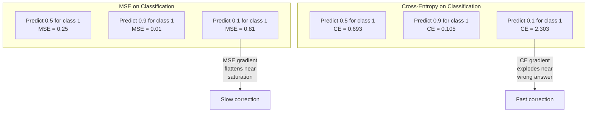
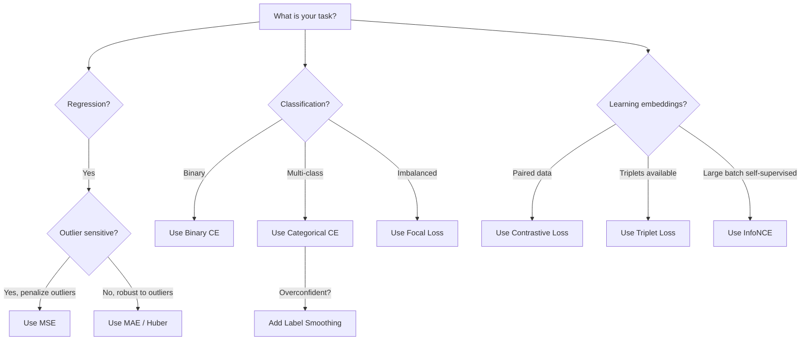
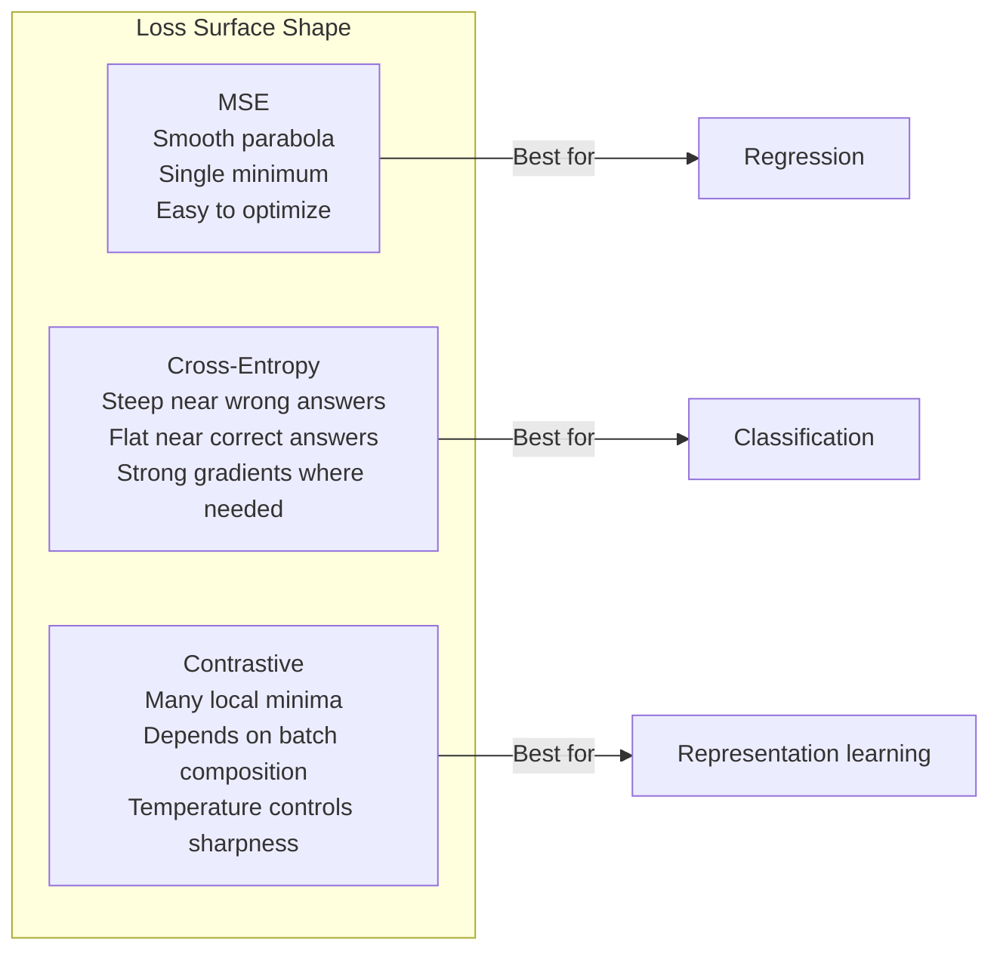

# 损失函数

> 网络给出一个预测，真实答案说它错了。到底错了多少？这个数字就是损失。选错损失函数，模型就会优化完全错误的目标。

**Type:** Build
**Languages:** Python
**Prerequisites:** Lesson 03.04 (Activation Functions)
**Time:** ~75 minutes

## 学习目标

- 从零实现 MSE、二元交叉熵、分类交叉熵和对比损失 (InfoNCE) 及其梯度
- 通过演示“所有输入都预测 0.5”的失败模式，解释为什么 MSE 不适合分类
- 将标签平滑应用到交叉熵，并说明它如何防止过度自信预测
- 为回归、二分类、多分类和嵌入学习任务选择正确的损失函数

## 问题

如果在分类问题上最小化 MSE，模型可能会非常自信地对所有输入都预测 0.5。它确实在最小化损失。但它也完全没用。

损失函数是模型真正优化的唯一东西。不是准确率，不是 F1，不是你汇报给经理的任何指标。优化器拿到损失函数的梯度，然后调整权重，让这个数字变小。如果损失函数没有捕捉你真正关心的目标，模型就会找到数学上最便宜的方式来满足它，而那几乎从来不是你想要的东西。

看一个具体例子。你有一个二分类任务，两个类别，比例 50/50。你用 MSE 作为损失。模型对每个输入都预测 0.5。平均 MSE 是 0.25，这是不真正学习任何东西时能达到的最小值。模型没有任何判别能力，但从技术上讲，它已经最小化了你的损失函数。换成交叉熵之后，同一个模型会被迫把预测推向 0 或 1，因为 `-log(0.5) = 0.693` 是很糟的损失，而 `-log(0.99) = 0.01` 会奖励自信且正确的预测。损失函数的选择，就是“模型在学习”和“模型在钻指标空子”之间的差别。

情况还会更糟。在自监督学习中，你甚至没有标签。对比损失会完全定义学习信号：什么算相似，什么算不同，模型应该多用力把它们推开。如果对比损失写错，嵌入会坍缩到同一个点，也就是每个输入都映射成同一个向量。从技术上说损失可能很低，但表示完全没价值。

## 核心概念

### 均方误差 (MSE)

MSE 是回归任务的默认选择。它计算预测和目标之间差值的平方，再对所有样本取平均。

```text
MSE = (1/n) * sum((y_pred - y_true)^2)
```

为什么要平方：它会二次惩罚大错误。误差为 2 的代价是误差为 1 的 4 倍。误差为 10 的代价是 100 倍。这让 MSE 对离群点非常敏感，一个极端错误的预测会主导整个损失。

真实数字：如果模型预测房价，对大多数房子都错了 10,000 美元，但对一栋豪宅错了 200,000 美元，MSE 会非常激进地尝试修复这栋豪宅，甚至可能伤害另外 99 栋房子的表现。

MSE 对预测值的梯度是：

```text
dMSE/dy_pred = (2/n) * (y_pred - y_true)
```

它和误差呈线性关系。错误越大，梯度越大。对回归来说这是特性，因为大错误需要大修正；对分类来说这是缺陷，因为你希望对自信但错误的答案进行指数级惩罚，而不是线性惩罚。

### 交叉熵损失

交叉熵是分类任务的损失函数。它源于信息论，用来衡量预测概率分布和真实分布之间的差异。

**二元交叉熵 (BCE)：**

```text
BCE = -(y * log(p) + (1 - y) * log(1 - p))
```

其中 `y` 是真实标签，取 0 或 1；`p` 是预测概率。

为什么 `-log(p)` 有效：当真实标签是 1，而你预测 `p = 0.99` 时，损失是 `-log(0.99) = 0.01`。当你预测 `p = 0.01` 时，损失是 `-log(0.01) = 4.6`。460 倍的差距就是交叉熵有效的原因。它会严厉惩罚自信但错误的预测，同时几乎不惩罚自信且正确的预测。

梯度讲的是同一个故事：

```text
dBCE/dp = -(y/p) + (1-y)/(1-p)
```

当 `y = 1` 且 `p` 接近 0 时，梯度是 `-1/p`，会趋近负无穷。模型会收到巨大的信号去修复错误。当 `p` 接近 1 时，梯度很小。已经正确了，没有什么可修。

**分类交叉熵：**

用于 one-hot 目标的多分类任务。

```text
CCE = -sum(y_i * log(p_i))
```

只有真实类别会贡献损失，因为其他 `y_i` 都是零。如果有 10 个类别，正确类别的概率是 0.1，也就是随机猜测，损失为 `-log(0.1) = 2.3`。如果正确类别概率为 0.9，损失为 `-log(0.9) = 0.105`。模型会学会把概率质量集中到正确答案上。

### 为什么 MSE 不适合分类



当预测接近 0 或 1 时，MSE 梯度会因为 sigmoid 饱和而变平。交叉熵梯度会补偿这一点，`-log` 会抵消 sigmoid 的平坦区域，从而在最需要强梯度的地方给出强信号。

### 标签平滑

标准 one-hot 标签在说：“这 100% 是 class 3，其他类别 0%。”这是一个很强的断言。标签平滑会把它软化：

```text
smooth_label = (1 - alpha) * one_hot + alpha / num_classes
```

当 `alpha = 0.1` 且有 10 个类别时，目标不再是 `[0, 0, 1, 0, ...]`，而是 `[0.01, 0.01, 0.91, 0.01, ...]`。模型目标从 1.0 变成 0.91。

为什么这有效：如果模型想通过 softmax 输出恰好 1.0，就需要把 logits 推向无穷大。这会导致过度自信、伤害泛化，并让模型对分布漂移更脆弱。标签平滑把目标限制在 0.9 附近，假设 `alpha=0.1`，让 logits 保持在合理范围。GPT 和大多数现代模型都会使用标签平滑或等价技巧。

### 对比损失

没有标签，没有类别。只有输入对，以及一个问题：它们相似还是不同？

**SimCLR 风格对比损失 (NT-Xent / InfoNCE)：**

取一张图像，创建两个增强视图，例如裁剪、旋转、颜色扰动。它们是“正样本对”，应该有相似嵌入。批次里的其他图像都是“负样本对”，应该有不同嵌入。

```text
L = -log(exp(sim(z_i, z_j) / tau) / sum(exp(sim(z_i, z_k) / tau)))
```

其中 `sim()` 是余弦相似度，`z_i` 和 `z_j` 是正样本对，求和覆盖所有负样本，`tau` 也就是 temperature，控制分布有多尖锐。更低的 temperature 意味着更困难的负样本和更激进的分离。

真实数字：批大小 256 意味着每个正样本对有 255 个负样本。Temperature `tau = 0.07` 是 SimCLR 默认值。这个损失看起来像对相似度做 softmax，它希望正样本对的相似度在所有 256 个选项里最高。

**Triplet Loss：**

输入三元组：anchor、positive，也就是同类样本，negative，也就是不同类样本。

```text
L = max(0, d(anchor, positive) - d(anchor, negative) + margin)
```

Margin 通常是 0.2 到 1.0，用来强制正样本和负样本距离之间至少有一个间隔。如果负样本已经足够远，损失就是零，也就是没有梯度、没有更新。这让训练高效，但需要小心做 triplet mining，也就是选择靠近 anchor 的困难负样本。

### Focal Loss

Focal loss 用于不平衡数据集。标准交叉熵会同等对待所有已正确分类样本。Focal loss 会降低简单样本的权重：

```text
FL = -alpha * (1 - p_t)^gamma * log(p_t)
```

其中 `p_t` 是真实类别的预测概率，`gamma` 控制聚焦程度。当 `gamma = 0` 时，它就是标准交叉熵。当 `gamma = 2`，也就是默认值时：

- 简单样本，`p_t = 0.9`：权重是 `(0.1)^2 = 0.01`，基本被忽略。
- 困难样本，`p_t = 0.1`：权重是 `(0.9)^2 = 0.81`，保留完整梯度信号。

Focal loss 由 Lin 等人为目标检测提出。在目标检测里，99% 的候选区域都是背景，也就是简单负样本。没有 focal loss，模型会被简单背景样本淹没，学不会检测物体。有了它，模型会把能力集中到真正重要的困难和模糊样本上。

### 损失函数决策树



### 损失地形



## Build It

### 第 1 步：MSE 及其梯度

```python
def mse(predictions, targets):
    n = len(predictions)
    total = 0.0
    for p, t in zip(predictions, targets):
        total += (p - t) ** 2
    return total / n

def mse_gradient(predictions, targets):
    n = len(predictions)
    grads = []
    for p, t in zip(predictions, targets):
        grads.append(2.0 * (p - t) / n)
    return grads
```

### 第 2 步：二元交叉熵

`log(0)` 问题是真实存在的。如果模型对正样本恰好预测 0，`log(0)` 就是负无穷。裁剪可以防止这个问题。

```python
import math

def binary_cross_entropy(predictions, targets, eps=1e-15):
    n = len(predictions)
    total = 0.0
    for p, t in zip(predictions, targets):
        p_clipped = max(eps, min(1 - eps, p))
        total += -(t * math.log(p_clipped) + (1 - t) * math.log(1 - p_clipped))
    return total / n

def bce_gradient(predictions, targets, eps=1e-15):
    grads = []
    for p, t in zip(predictions, targets):
        p_clipped = max(eps, min(1 - eps, p))
        grads.append(-(t / p_clipped) + (1 - t) / (1 - p_clipped))
    return grads
```

### 第 3 步：带 Softmax 的分类交叉熵

Softmax 把原始 logits 转换成概率。然后我们计算它和 one-hot 目标之间的交叉熵。

```python
def softmax(logits):
    max_val = max(logits)
    exps = [math.exp(x - max_val) for x in logits]
    total = sum(exps)
    return [e / total for e in exps]

def categorical_cross_entropy(logits, target_index, eps=1e-15):
    probs = softmax(logits)
    p = max(eps, probs[target_index])
    return -math.log(p)

def cce_gradient(logits, target_index):
    probs = softmax(logits)
    grads = list(probs)
    grads[target_index] -= 1.0
    return grads
```

Softmax 加交叉熵的梯度会漂亮地化简：对真实类别来说，就是预测概率减 1；对其他类别来说，就是预测概率本身。这个优雅化简不是巧合，这正是 softmax 和交叉熵总是配对使用的原因。

### 第 4 步：标签平滑

```python
def label_smoothed_cce(logits, target_index, num_classes, alpha=0.1, eps=1e-15):
    probs = softmax(logits)
    loss = 0.0
    for i in range(num_classes):
        if i == target_index:
            smooth_target = 1.0 - alpha + alpha / num_classes
        else:
            smooth_target = alpha / num_classes
        p = max(eps, probs[i])
        loss += -smooth_target * math.log(p)
    return loss
```

### 第 5 步：对比损失，简化版 InfoNCE

```python
def cosine_similarity(a, b):
    dot = sum(x * y for x, y in zip(a, b))
    norm_a = math.sqrt(sum(x * x for x in a))
    norm_b = math.sqrt(sum(x * x for x in b))
    if norm_a < 1e-10 or norm_b < 1e-10:
        return 0.0
    return dot / (norm_a * norm_b)

def contrastive_loss(anchor, positive, negatives, temperature=0.07):
    sim_pos = cosine_similarity(anchor, positive) / temperature
    sim_negs = [cosine_similarity(anchor, neg) / temperature for neg in negatives]

    max_sim = max(sim_pos, max(sim_negs)) if sim_negs else sim_pos
    exp_pos = math.exp(sim_pos - max_sim)
    exp_negs = [math.exp(s - max_sim) for s in sim_negs]
    total_exp = exp_pos + sum(exp_negs)

    return -math.log(max(1e-15, exp_pos / total_exp))
```

### 第 6 步：分类任务上的 MSE vs 交叉熵

使用第 4 课的同一个网络和圆形数据集，分别用两种损失函数训练。观察交叉熵更快收敛。

```python
import random

def sigmoid(x):
    x = max(-500, min(500, x))
    return 1.0 / (1.0 + math.exp(-x))

def make_circle_data(n=200, seed=42):
    random.seed(seed)
    data = []
    for _ in range(n):
        x = random.uniform(-2, 2)
        y = random.uniform(-2, 2)
        label = 1.0 if x * x + y * y < 1.5 else 0.0
        data.append(([x, y], label))
    return data


class LossComparisonNetwork:
    def __init__(self, loss_type="bce", hidden_size=8, lr=0.1):
        random.seed(0)
        self.loss_type = loss_type
        self.lr = lr
        self.hidden_size = hidden_size

        self.w1 = [[random.gauss(0, 0.5) for _ in range(2)] for _ in range(hidden_size)]
        self.b1 = [0.0] * hidden_size
        self.w2 = [random.gauss(0, 0.5) for _ in range(hidden_size)]
        self.b2 = 0.0

    def forward(self, x):
        self.x = x
        self.z1 = []
        self.h = []
        for i in range(self.hidden_size):
            z = self.w1[i][0] * x[0] + self.w1[i][1] * x[1] + self.b1[i]
            self.z1.append(z)
            self.h.append(max(0.0, z))

        self.z2 = sum(self.w2[i] * self.h[i] for i in range(self.hidden_size)) + self.b2
        self.out = sigmoid(self.z2)
        return self.out

    def backward(self, target):
        if self.loss_type == "mse":
            d_loss = 2.0 * (self.out - target)
        else:
            eps = 1e-15
            p = max(eps, min(1 - eps, self.out))
            d_loss = -(target / p) + (1 - target) / (1 - p)

        d_sigmoid = self.out * (1 - self.out)
        d_out = d_loss * d_sigmoid

        for i in range(self.hidden_size):
            d_relu = 1.0 if self.z1[i] > 0 else 0.0
            d_h = d_out * self.w2[i] * d_relu
            self.w2[i] -= self.lr * d_out * self.h[i]
            for j in range(2):
                self.w1[i][j] -= self.lr * d_h * self.x[j]
            self.b1[i] -= self.lr * d_h
        self.b2 -= self.lr * d_out

    def compute_loss(self, pred, target):
        if self.loss_type == "mse":
            return (pred - target) ** 2
        else:
            eps = 1e-15
            p = max(eps, min(1 - eps, pred))
            return -(target * math.log(p) + (1 - target) * math.log(1 - p))

    def train(self, data, epochs=200):
        losses = []
        for epoch in range(epochs):
            total_loss = 0.0
            correct = 0
            for x, y in data:
                pred = self.forward(x)
                self.backward(y)
                total_loss += self.compute_loss(pred, y)
                if (pred >= 0.5) == (y >= 0.5):
                    correct += 1
            avg_loss = total_loss / len(data)
            accuracy = correct / len(data) * 100
            losses.append((avg_loss, accuracy))
            if epoch % 50 == 0 or epoch == epochs - 1:
                print(f"    Epoch {epoch:3d}: loss={avg_loss:.4f}, accuracy={accuracy:.1f}%")
        return losses
```

## Use It

PyTorch 提供所有标准损失函数，并内置数值稳定处理：

```python
import torch
import torch.nn as nn
import torch.nn.functional as F

predictions = torch.tensor([0.9, 0.1, 0.7], requires_grad=True)
targets = torch.tensor([1.0, 0.0, 1.0])

mse_loss = F.mse_loss(predictions, targets)
bce_loss = F.binary_cross_entropy(predictions, targets)

logits = torch.randn(4, 10)
labels = torch.tensor([3, 7, 1, 9])
ce_loss = F.cross_entropy(logits, labels)
ce_smooth = F.cross_entropy(logits, labels, label_smoothing=0.1)
```

使用 `F.cross_entropy`，不要手动 softmax 后再用 `F.nll_loss`。它会把 log-softmax 和负对数似然组合成一个数值稳定操作。先单独应用 softmax 再取 log 更不稳定，因为大指数相减会损失精度。

对比学习里，大多数团队会使用自定义实现，或使用 `lightly`、`pytorch-metric-learning` 这类库。核心循环始终相同：计算成对相似度，构造正样本和负样本上的 softmax，然后反向传播。

## Ship It

本课产出：

- `outputs/prompt-loss-function-selector.md`：一个用于选择正确损失函数的可复用 prompt
- `outputs/prompt-loss-debugger.md`：一个当损失曲线看起来不对时使用的诊断 prompt

## 练习

1. 实现 Huber loss，也叫 smooth L1 loss。它对小误差使用 MSE，对大误差使用 MAE。在预测 `y = sin(x)` 的回归网络上训练，当 5% 的训练目标加入随机噪声，也就是离群点时，比较 MSE 和 Huber 的最终测试误差。

2. 在二分类训练循环中添加 focal loss。创建一个不平衡数据集，90% 是 class 0，10% 是 class 1。训练 200 个 epoch 后，比较标准 BCE 和 focal loss，`gamma=2`，在少数类召回率上的表现。

3. 实现带 semi-hard negative mining 的 triplet loss。为 5 个类别生成二维嵌入数据。对每个 anchor，找到仍然比 positive 更远、但距离最近的 hard negative。比较它和随机 triplet 选择的收敛情况。

4. 运行 MSE 和交叉熵对比实验，但在训练期间跟踪每一层的梯度幅度。画出每个 epoch 的平均梯度范数。验证当模型最不确定的早期阶段，交叉熵会产生更大的梯度。

5. 实现 KL divergence loss，并验证当真实分布是 one-hot 时，最小化 `KL(true || predicted)` 会给出和交叉熵相同的梯度。然后尝试软目标，例如知识蒸馏中来自教师模型 softmax 输出的“真实”分布。

## 关键术语

| Term | 常见说法 | 实际含义 |
|------|----------|----------|
| Loss function | “模型错得有多离谱” | 一个可微函数，把预测和目标映射成优化器要最小化的标量 |
| MSE | “平均平方误差” | 预测和目标差值平方的平均值，会二次惩罚大错误 |
| Cross-entropy | “分类损失” | 使用 `-log(p)` 衡量预测概率分布和真实分布之间的差异 |
| Binary cross-entropy | “BCE” | 二分类交叉熵：`-(y*log(p) + (1-y)*log(1-p))` |
| Label smoothing | “软化目标” | 用软值替代硬 0/1 目标，例如 0.1/0.9，防止过度自信并改善泛化 |
| Contrastive loss | “拉近相似，推远不同” | 通过让相似样本在嵌入空间接近、不同样本远离来学习表示的损失 |
| InfoNCE | “CLIP/SimCLR 损失” | 对相似度分数做 temperature 缩放后的归一化交叉熵，把对比学习视作分类 |
| Focal loss | “不平衡数据修复器” | 用 `(1-p_t)^gamma` 加权交叉熵，降低简单样本权重，聚焦困难样本 |
| Triplet loss | “Anchor-positive-negative” | 让 anchor 到 positive 的距离比到 negative 的距离至少小一个 margin |
| Temperature | “尖锐度旋钮” | 对 logits 或相似度的标量除数，控制分布有多尖锐；越低越尖锐 |

## 延伸阅读

- Lin et al., "Focal Loss for Dense Object Detection" (2017)：提出 focal loss，用于处理目标检测中的极端类别不平衡
- Chen et al., "A Simple Framework for Contrastive Learning of Visual Representations" (SimCLR, 2020)：用 NT-Xent loss 定义现代对比学习流程
- Szegedy et al., "Rethinking the Inception Architecture" (2016)：提出标签平滑作为正则化技术，现在已是许多大模型的标准做法
- Hinton et al., "Distilling the Knowledge in a Neural Network" (2015)：使用软目标和 KL 散度做知识蒸馏，是模型压缩的基础论文
