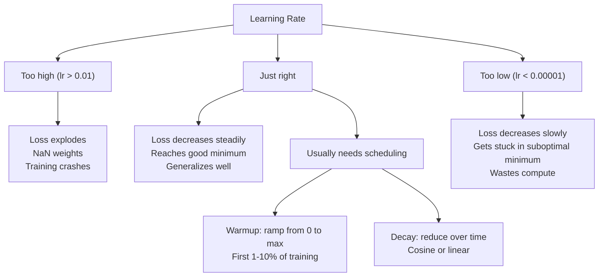
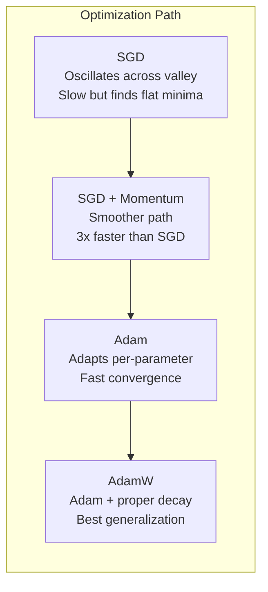
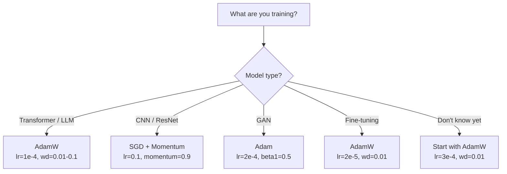

# 优化器

> 梯度下降告诉你该往哪个方向走，但它不告诉你走多远、走多快。SGD 是指南针，Adam 是带实时路况的 GPS。

**Type:** Build
**Languages:** Python
**Prerequisites:** Lesson 03.05 (Loss Functions)
**Time:** ~75 minutes

## 学习目标

- 用 Python 从零实现 SGD、带动量的 SGD、Adam 和 AdamW 优化器
- 解释 Adam 的偏差修正如何补偿训练早期从零初始化的动量估计
- 在同一任务上演示为什么 AdamW 比带 L2 正则的 Adam 泛化更好
- 为 transformer、CNN、GAN 和微调任务选择合适优化器和默认超参数

## 问题

你已经算出了梯度。你知道第 4,721 个权重应该减少 0.003 才能降低损失。但 0.003 是什么单位？按什么比例缩放？第 1 步和第 1,000 步应该移动同样的量吗？

普通梯度下降会在每一步对每个参数使用同一个学习率：`w = w - lr * gradient`。这在训练神经网络时会带来三个实际问题。

第一，震荡。损失地形很少像光滑碗面，更像狭长山谷。梯度指向山谷横向，也就是陡峭方向，而不是沿着山谷前进的浅方向。梯度下降会在狭窄维度上来回弹跳，同时在真正有用的方向上进展很慢。你见过这种现象：损失一开始快速下降，然后进入平台期；不是因为模型收敛了，而是因为它在震荡。

第二，所有参数使用同一个学习率是错的。有些权重需要大更新，因为它们还处在早期欠拟合阶段。另一些权重只需要很小更新，因为它们接近最优值。适合前者的学习率会毁掉后者，反过来也一样。

第三，鞍点。在高维空间中，损失地形有大量平坦区域，梯度接近零。普通 SGD 会以梯度大小的速度爬过这些区域，而这个速度几乎为零。模型看起来卡住了。它其实没卡住，只是在一个平坦区域，另一侧还有有用的下降方向。但 SGD 没有机制把它推出去。

Adam 同时解决这三个问题。它为每个参数维护两个运行平均值：平均梯度，也就是动量，用来处理震荡；平方梯度平均值，也就是自适应学习率，用来处理不同尺度。再加上前几步的偏差修正，它给了你一个默认超参数就能解决 80% 问题的优化器。本课会从零实现它，让你清楚另外 20% 情况下它什么时候、为什么会失败。

## 核心概念

### 随机梯度下降 (SGD)

最简单的优化器。在一个 mini-batch 上计算梯度，然后朝反方向走一步。

```text
w = w - lr * gradient
```

“随机”指的是你用数据的随机子集，也就是 mini-batch，来估计梯度，而不是使用完整数据集。这种噪声其实有用，它能帮助逃离尖锐局部最小值。但噪声也会导致震荡。

学习率是唯一旋钮。太高，损失会发散。太低，训练会慢到离谱。最优值取决于架构、数据、batch size 和当前训练阶段。对现代网络里的普通 SGD，典型值在 0.01 到 0.1 之间。但即使在同一次训练中，理想学习率也会变化。

### 动量

“小球沿坡滚下去”的类比被用烂了，但很准确。不要只按当前梯度走，而是维护一个速度，它会累积过去的梯度。

```text
m_t = beta * m_{t-1} + gradient
w = w - lr * m_t
```

`beta` 通常是 0.9，控制保留多少历史。`beta = 0.9` 时，动量大约是最近 10 个梯度的平均值，因为 `1 / (1 - 0.9) = 10`。

为什么它能修复震荡：方向一致的梯度会累积，方向来回翻转的梯度会相互抵消。在狭长山谷里，“横向”分量每一步都变号，因此被削弱；“沿谷”分量保持一致，因此被放大。结果是在有用方向上平滑加速。

真实数字：在病态损失地形上，单独使用 SGD 可能需要 10,000 步。带动量的 SGD，`beta=0.9`，通常在同一问题上只需要 3,000 到 5,000 步。这个加速不是边角收益。

### RMSProp

第一个真正可用的逐参数自适应学习率方法。Hinton 在 Coursera 课上提出，但没有正式发表论文。

```text
s_t = beta * s_{t-1} + (1 - beta) * gradient^2
w = w - lr * gradient / (sqrt(s_t) + epsilon)
```

`s_t` 跟踪平方梯度的运行平均值。梯度一直很大的参数，会被一个较大的数除，也就是有效学习率变小。梯度很小的参数，会被一个较小的数除，也就是有效学习率变大。

这解决了“所有参数一个学习率”的问题。一个一直收到大更新的权重可能已经接近目标，应该放慢。一个一直收到很小更新的权重可能还没训练够，应该加速。

`epsilon` 通常是 `1e-8`，用于防止某个参数还没有更新时除以零。

### Adam：动量 + RMSProp

Adam 把两个想法结合起来。它为每个参数维护两个指数移动平均：

```text
m_t = beta1 * m_{t-1} + (1 - beta1) * gradient        (first moment: mean)
v_t = beta2 * v_{t-1} + (1 - beta2) * gradient^2       (second moment: variance)
```

**偏差修正**是很多解释会跳过的关键细节。在第 1 步，`m_1 = (1 - beta1) * gradient`。当 `beta1 = 0.9` 时，它只是 `0.1 * gradient`，小了十倍。移动平均还没热身。偏差修正会补偿这一点：

```text
m_hat = m_t / (1 - beta1^t)
v_hat = v_t / (1 - beta2^t)
```

第 1 步且 `beta1 = 0.9` 时，`m_hat = m_1 / (1 - 0.9) = m_1 / 0.1`，正好恢复成真实梯度。第 100 步时，`(1 - 0.9^100)` 约等于 1.0，修正就消失了。偏差修正主要影响前 10 步左右，50 步之后基本无关紧要。

更新公式是：

```text
w = w - lr * m_hat / (sqrt(v_hat) + epsilon)
```

Adam 默认值：`lr = 0.001`，`beta1 = 0.9`，`beta2 = 0.999`，`epsilon = 1e-8`。这些默认值能解决 80% 的问题。当它们不行时，先改学习率，再改 `beta2`。几乎不要改 `beta1` 或 `epsilon`。

### AdamW：正确的权重衰减

L2 正则会把 `lambda * w^2` 加到损失上。在普通 SGD 中，这等价于权重衰减，也就是每一步从权重中减去 `lambda * w`。但在 Adam 中，这种等价关系会断掉。

Loshchilov 和 Hutter 的洞察是：当你把 L2 加进损失，再让 Adam 处理梯度时，自适应学习率也会缩放正则项。梯度方差大的参数得到更少正则，方差小的参数得到更多正则。这不是你想要的；你想要的是不受梯度统计影响的统一正则。

AdamW 通过在 Adam 更新之后直接对权重应用衰减来修复这一点：

```text
w = w - lr * m_hat / (sqrt(v_hat) + epsilon) - lr * lambda * w
```

权重衰减项 `lr * lambda * w` 不会被 Adam 的自适应因子缩放。每个参数都会得到相同比例的收缩。

这看起来像小细节，但不是。几乎所有任务上，AdamW 都比 Adam + L2 正则收敛到更好的解。它是 PyTorch 中训练 transformer、扩散模型和大多数现代架构的默认优化器。BERT、GPT、LLaMA、Stable Diffusion 都用 AdamW 训练。

### 学习率：最重要的超参数



如果只调一个超参数，就调学习率。学习率改变 10 倍，影响通常超过你会做的大多数架构选择。常见默认值：

- SGD：`lr = 0.01` 到 `0.1`
- Adam/AdamW：`lr = 1e-4` 到 `3e-4`
- 微调预训练模型：`lr = 1e-5` 到 `5e-5`
- 学习率 warmup：前 1% 到 10% 步数线性升高

### 优化器对比



### 每种优化器什么时候赢



## Build It

### 第 1 步：普通 SGD

```python
class SGD:
    def __init__(self, lr=0.01):
        self.lr = lr

    def step(self, params, grads):
        for i in range(len(params)):
            params[i] -= self.lr * grads[i]
```

### 第 2 步：带动量的 SGD

```python
class SGDMomentum:
    def __init__(self, lr=0.01, beta=0.9):
        self.lr = lr
        self.beta = beta
        self.velocities = None

    def step(self, params, grads):
        if self.velocities is None:
            self.velocities = [0.0] * len(params)
        for i in range(len(params)):
            self.velocities[i] = self.beta * self.velocities[i] + grads[i]
            params[i] -= self.lr * self.velocities[i]
```

### 第 3 步：Adam

```python
import math

class Adam:
    def __init__(self, lr=0.001, beta1=0.9, beta2=0.999, epsilon=1e-8):
        self.lr = lr
        self.beta1 = beta1
        self.beta2 = beta2
        self.epsilon = epsilon
        self.m = None
        self.v = None
        self.t = 0

    def step(self, params, grads):
        if self.m is None:
            self.m = [0.0] * len(params)
            self.v = [0.0] * len(params)

        self.t += 1

        for i in range(len(params)):
            self.m[i] = self.beta1 * self.m[i] + (1 - self.beta1) * grads[i]
            self.v[i] = self.beta2 * self.v[i] + (1 - self.beta2) * grads[i] ** 2

            m_hat = self.m[i] / (1 - self.beta1 ** self.t)
            v_hat = self.v[i] / (1 - self.beta2 ** self.t)

            params[i] -= self.lr * m_hat / (math.sqrt(v_hat) + self.epsilon)
```

### 第 4 步：AdamW

```python
class AdamW:
    def __init__(self, lr=0.001, beta1=0.9, beta2=0.999, epsilon=1e-8, weight_decay=0.01):
        self.lr = lr
        self.beta1 = beta1
        self.beta2 = beta2
        self.epsilon = epsilon
        self.weight_decay = weight_decay
        self.m = None
        self.v = None
        self.t = 0

    def step(self, params, grads):
        if self.m is None:
            self.m = [0.0] * len(params)
            self.v = [0.0] * len(params)

        self.t += 1

        for i in range(len(params)):
            self.m[i] = self.beta1 * self.m[i] + (1 - self.beta1) * grads[i]
            self.v[i] = self.beta2 * self.v[i] + (1 - self.beta2) * grads[i] ** 2

            m_hat = self.m[i] / (1 - self.beta1 ** self.t)
            v_hat = self.v[i] / (1 - self.beta2 ** self.t)

            params[i] -= self.lr * m_hat / (math.sqrt(v_hat) + self.epsilon)
            params[i] -= self.lr * self.weight_decay * params[i]
```

### 第 5 步：训练对比

使用第 5 课的圆形数据集，用四种优化器训练同一个两层网络。比较收敛速度。

```python
import random

def sigmoid(x):
    x = max(-500, min(500, x))
    return 1.0 / (1.0 + math.exp(-x))

def make_circle_data(n=200, seed=42):
    random.seed(seed)
    data = []
    for _ in range(n):
        x = random.uniform(-2, 2)
        y = random.uniform(-2, 2)
        label = 1.0 if x * x + y * y < 1.5 else 0.0
        data.append(([x, y], label))
    return data


class OptimizerTestNetwork:
    def __init__(self, optimizer, hidden_size=8):
        random.seed(0)
        self.hidden_size = hidden_size
        self.optimizer = optimizer

        self.w1 = [[random.gauss(0, 0.5) for _ in range(2)] for _ in range(hidden_size)]
        self.b1 = [0.0] * hidden_size
        self.w2 = [random.gauss(0, 0.5) for _ in range(hidden_size)]
        self.b2 = 0.0

    def get_params(self):
        params = []
        for row in self.w1:
            params.extend(row)
        params.extend(self.b1)
        params.extend(self.w2)
        params.append(self.b2)
        return params

    def set_params(self, params):
        idx = 0
        for i in range(self.hidden_size):
            for j in range(2):
                self.w1[i][j] = params[idx]
                idx += 1
        for i in range(self.hidden_size):
            self.b1[i] = params[idx]
            idx += 1
        for i in range(self.hidden_size):
            self.w2[i] = params[idx]
            idx += 1
        self.b2 = params[idx]

    def forward(self, x):
        self.x = x
        self.z1 = []
        self.h = []
        for i in range(self.hidden_size):
            z = self.w1[i][0] * x[0] + self.w1[i][1] * x[1] + self.b1[i]
            self.z1.append(z)
            self.h.append(max(0.0, z))

        self.z2 = sum(self.w2[i] * self.h[i] for i in range(self.hidden_size)) + self.b2
        self.out = sigmoid(self.z2)
        return self.out

    def compute_grads(self, target):
        eps = 1e-15
        p = max(eps, min(1 - eps, self.out))
        d_loss = -(target / p) + (1 - target) / (1 - p)
        d_sigmoid = self.out * (1 - self.out)
        d_out = d_loss * d_sigmoid

        grads = [0.0] * (self.hidden_size * 2 + self.hidden_size + self.hidden_size + 1)
        idx = 0
        for i in range(self.hidden_size):
            d_relu = 1.0 if self.z1[i] > 0 else 0.0
            d_h = d_out * self.w2[i] * d_relu
            grads[idx] = d_h * self.x[0]
            grads[idx + 1] = d_h * self.x[1]
            idx += 2

        for i in range(self.hidden_size):
            d_relu = 1.0 if self.z1[i] > 0 else 0.0
            grads[idx] = d_out * self.w2[i] * d_relu
            idx += 1

        for i in range(self.hidden_size):
            grads[idx] = d_out * self.h[i]
            idx += 1

        grads[idx] = d_out
        return grads

    def train(self, data, epochs=300):
        losses = []
        for epoch in range(epochs):
            total_loss = 0.0
            correct = 0
            for x, y in data:
                pred = self.forward(x)
                grads = self.compute_grads(y)
                params = self.get_params()
                self.optimizer.step(params, grads)
                self.set_params(params)

                eps = 1e-15
                p = max(eps, min(1 - eps, pred))
                total_loss += -(y * math.log(p) + (1 - y) * math.log(1 - p))
                if (pred >= 0.5) == (y >= 0.5):
                    correct += 1
            avg_loss = total_loss / len(data)
            accuracy = correct / len(data) * 100
            losses.append((avg_loss, accuracy))
            if epoch % 75 == 0 or epoch == epochs - 1:
                print(f"    Epoch {epoch:3d}: loss={avg_loss:.4f}, accuracy={accuracy:.1f}%")
        return losses
```

## Use It

PyTorch 优化器会处理参数组、梯度裁剪和学习率调度：

```python
import torch
import torch.optim as optim

model = torch.nn.Sequential(
    torch.nn.Linear(784, 256),
    torch.nn.ReLU(),
    torch.nn.Linear(256, 10),
)

optimizer = optim.AdamW(model.parameters(), lr=3e-4, weight_decay=0.01)

scheduler = optim.lr_scheduler.CosineAnnealingLR(optimizer, T_max=100)

for epoch in range(100):
    optimizer.zero_grad()
    output = model(torch.randn(32, 784))
    loss = torch.nn.functional.cross_entropy(output, torch.randint(0, 10, (32,)))
    loss.backward()
    torch.nn.utils.clip_grad_norm_(model.parameters(), max_norm=1.0)
    optimizer.step()
    scheduler.step()
```

顺序永远是：`zero_grad`、forward、loss、backward、可选 clip、step、可选 schedule。记住这个顺序。弄错顺序，例如在 `optimizer.step()` 之前调用 `scheduler.step()`，是很常见的隐蔽 bug 来源。

对 CNN 来说，很多实践者仍然偏好 SGD + momentum，`lr=0.1`、`momentum=0.9`、`weight_decay=1e-4`，再配合 step 或 cosine 调度。SGD 会找到更平坦的最小值，往往泛化更好。对 transformer 和 LLM 来说，AdamW 加 warmup 和 cosine decay 是通用默认值。没有测量依据，不要轻易对抗共识。

## Ship It

本课产出：

- `outputs/prompt-optimizer-selector.md`：一个用于为任意架构选择正确优化器和学习率的决策 prompt

## 练习

1. 实现 Nesterov momentum：在“向前看”的位置 `w - lr * beta * v` 计算梯度，而不是在当前位置计算。把它和标准 momentum 在圆形数据集上的收敛情况对比。

2. 实现学习率 warmup 调度：在前 10% 训练步数中从 0 线性升高到 `max_lr`，然后 cosine decay 到 0。比较 Adam + warmup 和没有 warmup 的 Adam。测量在圆形数据集上达到 90% 准确率需要多少 epoch。

3. 在 Adam 训练期间跟踪每个参数的有效学习率。有效学习率是 `lr * m_hat / (sqrt(v_hat) + eps)`。画出第 10、50 和 200 步后的有效学习率分布。所有参数都以同样速度更新吗？

4. 实现梯度裁剪，按全局范数裁剪。把最大梯度范数设为 1.0。使用较高学习率训练，例如 Adam 的 `lr=0.01`，比较有无裁剪的情况。在 10 个随机种子上统计多少次训练发散，也就是损失变成 NaN。

5. 比较 Adam 和 AdamW 在大权重网络上的表现。把所有权重初始化为 `[-5, 5]` 中的随机值，远大于正常范围。使用 `weight_decay=0.1` 训练 200 个 epoch。画出两个优化器训练期间权重 L2 范数的变化。AdamW 应该显示更快的权重收缩。

## 关键术语

| Term | 常见说法 | 实际含义 |
|------|----------|----------|
| Learning rate | “步长” | 梯度更新上的标量乘数，是训练中影响最大的单个超参数 |
| SGD | “基础梯度下降” | 随机梯度下降：用 mini-batch 计算梯度，并减去 `lr * gradient` 来更新权重 |
| Momentum | “滚动小球类比” | 过去梯度的指数移动平均，用来削弱震荡并加速一致方向 |
| RMSProp | “自适应学习率” | 用近期梯度的运行 RMS 除以每个参数的梯度，从而均衡学习率 |
| Adam | “默认优化器” | 结合动量，也就是一阶矩，和 RMSProp，也就是二阶矩，并对早期步骤做偏差修正 |
| AdamW | “正确版本的 Adam” | 带解耦权重衰减的 Adam，直接对权重施加正则，而不是通过梯度施加 |
| Bias correction | “运行平均的热身” | 除以 `(1 - beta^t)`，补偿 Adam 动量估计从零初始化导致的偏差 |
| Weight decay | “收缩权重” | 每一步减去权重值的一部分，是惩罚大权重的正则化方法 |
| Learning rate schedule | “随时间改变 lr” | 训练期间调整学习率的函数；warmup + cosine decay 是现代默认值 |
| Gradient clipping | “限制梯度范数” | 当梯度向量范数超过阈值时把它缩小，防止梯度更新爆炸 |

## 延伸阅读

- Kingma & Ba, "Adam: A Method for Stochastic Optimization" (2014)：Adam 原始论文，包含收敛分析和偏差修正推导
- Loshchilov & Hutter, "Decoupled Weight Decay Regularization" (2017)：证明 L2 正则和权重衰减在 Adam 中不等价，并提出 AdamW
- Smith, "Cyclical Learning Rates for Training Neural Networks" (2017)：提出 LR range test 和循环调度，减少固定学习率调参需求
- Ruder, "An Overview of Gradient Descent Optimization Algorithms" (2016)：关于各种优化器变体的优秀综述，比较和直觉都很清楚
