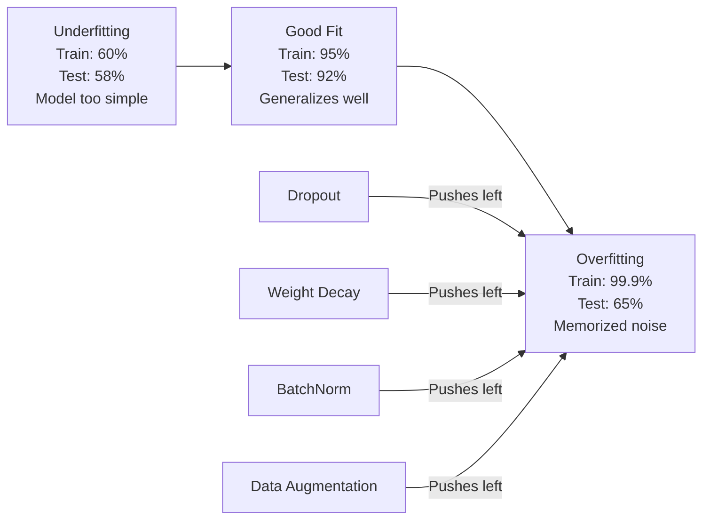
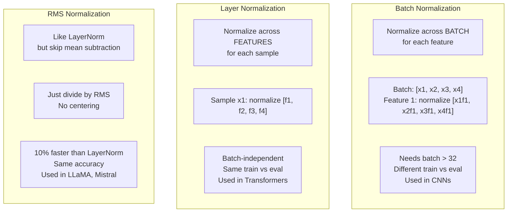
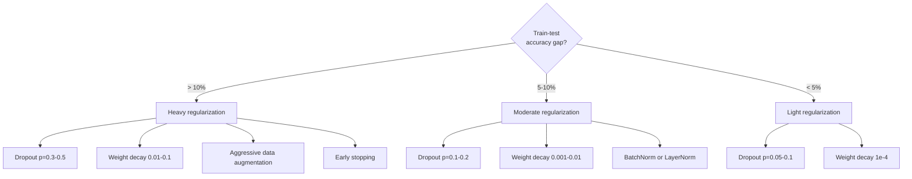

# 正则化

> 模型在训练集上 99%，测试集上 60%。它记住了答案，而不是学会了规律。正则化就是你对复杂度征收的税，用来逼模型泛化。

**Type:** Build
**Languages:** Python
**Prerequisites:** Lesson 03.06 (Optimizers)
**Time:** ~75 minutes

## 学习目标

- 从零实现带 inverted scaling 的 dropout、L2 权重衰减、批归一化、层归一化和 RMSNorm
- 测量训练准确率与测试准确率之间的差距，并通过正则化实验诊断过拟合
- 解释为什么 transformer 使用 LayerNorm 而不是 BatchNorm，以及为什么现代 LLM 更偏好 RMSNorm
- 根据过拟合严重程度，应用正确的正则化技术组合

## 问题

一个参数足够多的神经网络可以记住任何数据集。这不是假设，Zhang 等人在 2017 年通过在随机标签版 ImageNet 上训练标准网络证明了这一点。网络在完全随机的标签分配上达到了接近零的训练损失。它记住了一百万个没有任何可学习规律的随机输入输出对。训练损失完美，测试准确率为零。

这就是过拟合问题，而且模型越大越严重。GPT-3 有 1750 亿参数，训练集大约有 5000 亿 token。有这么多参数时，模型有足够能力逐字记住训练数据中的大块内容。没有正则化，它会复述训练样本，而不是学习可以泛化的模式。

训练表现和测试表现之间的差距就是过拟合差距。本课中的每一种技术都从不同角度攻击这个差距。Dropout 强迫网络不要依赖任何单个神经元。权重衰减防止单个权重变得过大。BatchNorm 平滑损失地形，让优化器找到更平坦、更能泛化的最小值。LayerNorm 做类似的事，但能在 BatchNorm 失败的地方工作，例如小 batch 和变长序列。RMSNorm 去掉均值计算，以大约 10% 的速度优势完成类似归一化。每种技术都很简单，组合起来就是“会记忆的模型”和“会泛化的模型”的区别。

## 核心概念

### 过拟合光谱

每个模型都位于一条光谱上：一端是欠拟合，模型太简单，抓不住规律；另一端是过拟合，模型复杂到把噪声也学进去。最佳点在中间，而正则化会把模型从过拟合一侧往中间推。



### Dropout

Dropout 是最简单的正则化技术之一，而且解释非常优雅。训练期间，以概率 `p` 随机把每个神经元输出设为零。

```text
output = activation(z) * mask    where mask[i] ~ Bernoulli(1 - p)
```

当 `p = 0.5` 时，每次前向传播都会把一半神经元置零。网络必须学习冗余表示，因为它无法预测哪些神经元可用。这会防止共适应，也就是某些神经元学会依赖特定其他神经元一定存在。

集成解释是：一个有 N 个神经元并使用 dropout 的网络，会产生 `2^N` 个可能子网络，也就是每种神经元开关组合。使用 dropout 训练近似于同时训练全部 `2^N` 个子网络，每个子网络看到不同 mini-batch。测试时使用所有神经元，不再 dropout，并按 `(1 - p)` 缩放输出，使其匹配训练期望值。这等价于平均 `2^N` 个子网络的预测，也就是用一个模型得到一个巨大集成。

实践中，缩放通常放在训练期间，而不是测试期间，这叫 inverted dropout：

```text
During training:  output = activation(z) * mask / (1 - p)
During testing:   output = activation(z)   (no change needed)
```

这样更干净，因为测试代码完全不需要知道 dropout。

默认概率：transformer 常用 `p = 0.1`，MLP 常用 `p = 0.5`，CNN 常用 `p = 0.2-0.3`。更高 dropout 意味着更强正则化，也意味着更高欠拟合风险。

### 权重衰减 (L2 正则化)

把所有权重大小的平方加到损失上：

```text
total_loss = task_loss + (lambda / 2) * sum(w_i^2)
```

正则项的梯度是 `lambda * w`。这意味着每一步都会把每个权重按其大小成比例拉向零。大权重受到更大惩罚。模型会被推向没有单个权重占主导的解。

为什么这有助于泛化：过拟合模型往往有大权重，它们会放大训练数据中的噪声。权重衰减让权重保持较小，从而限制模型有效容量，迫使它依赖稳健、可泛化的特征，而不是记住训练集里的怪癖。

`lambda` 超参数控制强度。典型值：

- Transformer 上 AdamW：`0.01`
- CNN 上 SGD：`1e-4`
- 严重过拟合模型：`0.1`

第 6 课已经讲过：权重衰减和 L2 正则在 SGD 中等价，但在 Adam 中不等价。使用 Adam 训练时，总是使用 AdamW，也就是解耦权重衰减。

### 批归一化

在把每层输出传给下一层之前，先在 mini-batch 维度上归一化。

对于某层的一批激活值：

```text
mu = (1/B) * sum(x_i)           (batch mean)
sigma^2 = (1/B) * sum((x_i - mu)^2)   (batch variance)
x_hat = (x_i - mu) / sqrt(sigma^2 + eps)   (normalize)
y = gamma * x_hat + beta        (scale and shift)
```

`gamma` 和 `beta` 是可学习参数，让网络在最优时可以撤销归一化。如果没有它们，你就强迫每层输出都保持零均值、单位方差，而这未必是网络想要的。

**训练和推理的区别：** 训练期间，`mu` 和 `sigma` 来自当前 mini-batch。推理期间，使用训练时累积的运行平均值，也就是带 `momentum = 0.1` 的指数移动平均，含义是 90% 旧值加 10% 新值。

BatchNorm 为什么有效仍有争议。原论文说它减少了“内部协变量偏移”，也就是前面层更新导致后面层输入分布变化。Santurkar 等人在 2018 年说明这个解释并不正确。更准确的原因是：BatchNorm 让损失地形更平滑。梯度更可预测，Lipschitz 常数更小，优化器可以安全地迈更大的步。这就是 BatchNorm 允许使用更高学习率并更快收敛的原因。

BatchNorm 有一个根本限制：它依赖 batch 统计。当 batch size 为 1 时，均值和方差没有意义。当 batch 很小，例如小于 32 时，统计量噪声大，会伤害性能。这对目标检测和语言建模尤其重要，因为前者常被显存限制 batch size，后者序列长度会变化。

### 层归一化

LayerNorm 不在 batch 维度上归一化，而是在特征维度上归一化。对单个样本：

```text
mu = (1/D) * sum(x_j)           (feature mean)
sigma^2 = (1/D) * sum((x_j - mu)^2)   (feature variance)
x_hat = (x_j - mu) / sqrt(sigma^2 + eps)
y = gamma * x_hat + beta
```

`D` 是特征维度。每个样本独立归一化，不依赖 batch size。这就是 transformer 使用 LayerNorm 而不是 BatchNorm 的原因。序列长度会变化，batch size 常常很小，生成时甚至是 1，而且训练和推理计算完全一致。

Transformer 中的 LayerNorm 会应用在每个 self-attention block 和 feed-forward block 之后，也就是 Post-LN；或者应用在它们之前，也就是 Pre-LN。Pre-LN 对训练更稳定。

### RMSNorm

RMSNorm 是去掉均值减法的 LayerNorm，由 Zhang 和 Sennrich 在 2019 年提出。

```text
rms = sqrt((1/D) * sum(x_j^2))
y = gamma * x / rms
```

就是这样。不计算均值，也没有 `beta` 参数。观察结论是：LayerNorm 中的重新居中，也就是减均值，对模型性能贡献很小，但会消耗计算。去掉它之后，准确率基本相同，开销减少大约 10%。

LLaMA、LLaMA 2、LLaMA 3、Mistral 和大多数现代 LLM 都使用 RMSNorm 而不是 LayerNorm。在数十亿参数和数万亿 token 的规模上，这 10% 节省非常可观。

### 归一化对比



### 作为正则化的数据增强

数据增强不是修改模型，而是修改数据。在保持标签不变的前提下变换训练输入：

- 图像：随机裁剪、翻转、旋转、颜色扰动、cutout
- 文本：同义词替换、回译、随机删除
- 音频：时间拉伸、音高变化、添加噪声

效果和正则化一致：它增加了训练集的有效大小，让模型更难记住具体样本。一个只看过每张原始图像一次的模型可以记住它。一个看过每张图像 50 个增强版本的模型，会被迫学习不变结构。

### Early Stopping

最简单的正则化器：当验证损失开始上升时停止训练。此时模型还没有继续过拟合。实践中，你每个 epoch 跟踪验证损失，保存最佳模型，并继续训练一个 patience 窗口，通常是 5 到 20 个 epoch。如果验证损失在 patience 窗口内没有改善，就停止并加载保存的最佳模型。

### 什么时候用什么



## Build It

### 第 1 步：Dropout，训练模式和评估模式

```python
import random
import math


class Dropout:
    def __init__(self, p=0.5):
        self.p = p
        self.training = True
        self.mask = None

    def forward(self, x):
        if not self.training:
            return list(x)
        self.mask = []
        output = []
        for val in x:
            if random.random() < self.p:
                self.mask.append(0)
                output.append(0.0)
            else:
                self.mask.append(1)
                output.append(val / (1 - self.p))
        return output

    def backward(self, grad_output):
        grads = []
        for g, m in zip(grad_output, self.mask):
            if m == 0:
                grads.append(0.0)
            else:
                grads.append(g / (1 - self.p))
        return grads
```

### 第 2 步：L2 权重衰减

```python
def l2_regularization(weights, lambda_reg):
    penalty = 0.0
    for w in weights:
        penalty += w * w
    return lambda_reg * 0.5 * penalty

def l2_gradient(weights, lambda_reg):
    return [lambda_reg * w for w in weights]
```

### 第 3 步：Batch Normalization

```python
class BatchNorm:
    def __init__(self, num_features, momentum=0.1, eps=1e-5):
        self.gamma = [1.0] * num_features
        self.beta = [0.0] * num_features
        self.eps = eps
        self.momentum = momentum
        self.running_mean = [0.0] * num_features
        self.running_var = [1.0] * num_features
        self.training = True
        self.num_features = num_features

    def forward(self, batch):
        batch_size = len(batch)
        if self.training:
            mean = [0.0] * self.num_features
            for sample in batch:
                for j in range(self.num_features):
                    mean[j] += sample[j]
            mean = [m / batch_size for m in mean]

            var = [0.0] * self.num_features
            for sample in batch:
                for j in range(self.num_features):
                    var[j] += (sample[j] - mean[j]) ** 2
            var = [v / batch_size for v in var]

            for j in range(self.num_features):
                self.running_mean[j] = (1 - self.momentum) * self.running_mean[j] + self.momentum * mean[j]
                self.running_var[j] = (1 - self.momentum) * self.running_var[j] + self.momentum * var[j]
        else:
            mean = list(self.running_mean)
            var = list(self.running_var)

        self.x_hat = []
        output = []
        for sample in batch:
            normalized = []
            out_sample = []
            for j in range(self.num_features):
                x_h = (sample[j] - mean[j]) / math.sqrt(var[j] + self.eps)
                normalized.append(x_h)
                out_sample.append(self.gamma[j] * x_h + self.beta[j])
            self.x_hat.append(normalized)
            output.append(out_sample)
        return output
```

### 第 4 步：Layer Normalization

```python
class LayerNorm:
    def __init__(self, num_features, eps=1e-5):
        self.gamma = [1.0] * num_features
        self.beta = [0.0] * num_features
        self.eps = eps
        self.num_features = num_features

    def forward(self, x):
        mean = sum(x) / len(x)
        var = sum((xi - mean) ** 2 for xi in x) / len(x)

        self.x_hat = []
        output = []
        for j in range(self.num_features):
            x_h = (x[j] - mean) / math.sqrt(var + self.eps)
            self.x_hat.append(x_h)
            output.append(self.gamma[j] * x_h + self.beta[j])
        return output
```

### 第 5 步：RMSNorm

```python
class RMSNorm:
    def __init__(self, num_features, eps=1e-6):
        self.gamma = [1.0] * num_features
        self.eps = eps
        self.num_features = num_features

    def forward(self, x):
        rms = math.sqrt(sum(xi * xi for xi in x) / len(x) + self.eps)
        output = []
        for j in range(self.num_features):
            output.append(self.gamma[j] * x[j] / rms)
        return output
```

### 第 6 步：有无正则化的训练

```python
def sigmoid(x):
    x = max(-500, min(500, x))
    return 1.0 / (1.0 + math.exp(-x))


def make_circle_data(n=200, seed=42):
    random.seed(seed)
    data = []
    for _ in range(n):
        x = random.uniform(-2, 2)
        y = random.uniform(-2, 2)
        label = 1.0 if x * x + y * y < 1.5 else 0.0
        data.append(([x, y], label))
    return data


class RegularizedNetwork:
    def __init__(self, hidden_size=16, lr=0.05, dropout_p=0.0, weight_decay=0.0):
        random.seed(0)
        self.hidden_size = hidden_size
        self.lr = lr
        self.dropout_p = dropout_p
        self.weight_decay = weight_decay
        self.dropout = Dropout(p=dropout_p) if dropout_p > 0 else None

        self.w1 = [[random.gauss(0, 0.5) for _ in range(2)] for _ in range(hidden_size)]
        self.b1 = [0.0] * hidden_size
        self.w2 = [random.gauss(0, 0.5) for _ in range(hidden_size)]
        self.b2 = 0.0

    def forward(self, x, training=True):
        self.x = x
        self.z1 = []
        self.h = []
        for i in range(self.hidden_size):
            z = self.w1[i][0] * x[0] + self.w1[i][1] * x[1] + self.b1[i]
            self.z1.append(z)
            self.h.append(max(0.0, z))

        if self.dropout and training:
            self.dropout.training = True
            self.h = self.dropout.forward(self.h)
        elif self.dropout:
            self.dropout.training = False
            self.h = self.dropout.forward(self.h)

        self.z2 = sum(self.w2[i] * self.h[i] for i in range(self.hidden_size)) + self.b2
        self.out = sigmoid(self.z2)
        return self.out

    def backward(self, target):
        eps = 1e-15
        p = max(eps, min(1 - eps, self.out))
        d_loss = -(target / p) + (1 - target) / (1 - p)
        d_sigmoid = self.out * (1 - self.out)
        d_out = d_loss * d_sigmoid

        for i in range(self.hidden_size):
            d_relu = 1.0 if self.z1[i] > 0 else 0.0
            d_h = d_out * self.w2[i] * d_relu
            self.w2[i] -= self.lr * (d_out * self.h[i] + self.weight_decay * self.w2[i])
            for j in range(2):
                self.w1[i][j] -= self.lr * (d_h * self.x[j] + self.weight_decay * self.w1[i][j])
            self.b1[i] -= self.lr * d_h
        self.b2 -= self.lr * d_out

    def evaluate(self, data):
        correct = 0
        total_loss = 0.0
        for x, y in data:
            pred = self.forward(x, training=False)
            eps = 1e-15
            p = max(eps, min(1 - eps, pred))
            total_loss += -(y * math.log(p) + (1 - y) * math.log(1 - p))
            if (pred >= 0.5) == (y >= 0.5):
                correct += 1
        return total_loss / len(data), correct / len(data) * 100

    def train_model(self, train_data, test_data, epochs=300):
        history = []
        for epoch in range(epochs):
            total_loss = 0.0
            correct = 0
            for x, y in train_data:
                pred = self.forward(x, training=True)
                self.backward(y)
                eps = 1e-15
                p = max(eps, min(1 - eps, pred))
                total_loss += -(y * math.log(p) + (1 - y) * math.log(1 - p))
                if (pred >= 0.5) == (y >= 0.5):
                    correct += 1
            train_loss = total_loss / len(train_data)
            train_acc = correct / len(train_data) * 100
            test_loss, test_acc = self.evaluate(test_data)
            history.append((train_loss, train_acc, test_loss, test_acc))
            if epoch % 75 == 0 or epoch == epochs - 1:
                gap = train_acc - test_acc
                print(f"    Epoch {epoch:3d}: train_acc={train_acc:.1f}%, test_acc={test_acc:.1f}%, gap={gap:.1f}%")
        return history
```

## Use It

PyTorch 把所有归一化和正则化都提供成模块：

```python
import torch
import torch.nn as nn

model = nn.Sequential(
    nn.Linear(784, 256),
    nn.BatchNorm1d(256),
    nn.ReLU(),
    nn.Dropout(0.3),
    nn.Linear(256, 128),
    nn.BatchNorm1d(128),
    nn.ReLU(),
    nn.Dropout(0.3),
    nn.Linear(128, 10),
)

model.train()
out_train = model(torch.randn(32, 784))

model.eval()
out_test = model(torch.randn(1, 784))
```

`model.train()` 和 `model.eval()` 这个切换非常关键。它会打开或关闭 dropout，并告诉 BatchNorm 使用 batch 统计还是运行统计。推理前忘记调用 `model.eval()` 是深度学习中最常见的 bug 之一。你的测试准确率会随机波动，因为 dropout 仍然在工作，BatchNorm 也还在使用 mini-batch 统计。

Transformer 的模式不同：

```python
class TransformerBlock(nn.Module):
    def __init__(self, d_model=512, nhead=8, dropout=0.1):
        super().__init__()
        self.attention = nn.MultiheadAttention(d_model, nhead, dropout=dropout)
        self.norm1 = nn.LayerNorm(d_model)
        self.ff = nn.Sequential(
            nn.Linear(d_model, d_model * 4),
            nn.GELU(),
            nn.Linear(d_model * 4, d_model),
            nn.Dropout(dropout),
        )
        self.norm2 = nn.LayerNorm(d_model)
        self.dropout = nn.Dropout(dropout)

    def forward(self, x):
        attended, _ = self.attention(x, x, x)
        x = self.norm1(x + self.dropout(attended))
        x = self.norm2(x + self.ff(x))
        return x
```

用 LayerNorm，不用 BatchNorm。Dropout 用 `p=0.1`，不是 `p=0.5`。这些就是 transformer 默认设置。

## Ship It

本课产出：

- `outputs/prompt-regularization-advisor.md`：一个诊断过拟合并推荐正确正则化策略的 prompt

## 练习

1. 为二维数据实现 spatial dropout：不要丢弃单个神经元，而是丢弃整个特征通道。可以把连续特征组视为通道，并丢弃整组。在 `hidden_size=32` 的圆形数据集上，把它和标准 dropout 的训练测试差距进行比较。

2. 组合第 5 课的标签平滑和本课的 dropout。训练四种配置：都不用，只用 dropout，只用标签平滑，两者都用。测量每种配置最终的训练测试准确率差距。哪种组合差距最小？

3. 在圆形数据集网络中，在隐藏层和激活函数之间添加 BatchNorm。分别用学习率 0.01、0.05、0.1 训练有无 BatchNorm 的网络。BatchNorm 应该允许网络在普通网络会发散的较高学习率下稳定训练。

4. 实现 early stopping：每个 epoch 跟踪测试损失，保存最佳权重；如果测试损失 20 个 epoch 没有改善，就停止。让正则化网络最多跑 1000 个 epoch。报告哪个 epoch 的测试准确率最好，以及节省了多少 epoch 的计算。

5. 在 4 层网络上比较 LayerNorm 和 RMSNorm，而不只是 2 层。用相同权重初始化二者。训练 200 个 epoch，比较最终准确率、训练速度，也就是每个 epoch 用时，以及第一层梯度幅度。验证 RMSNorm 在准确率相同的情况下更快。

## 关键术语

| Term | 常见说法 | 实际含义 |
|------|----------|----------|
| Overfitting | “模型记住了数据” | 模型训练表现明显高于测试表现，说明它学到了噪声而不是信号 |
| Regularization | “防止过拟合” | 任何约束模型复杂度以改善泛化的技术，例如 dropout、权重衰减、归一化、数据增强 |
| Dropout | “随机删除神经元” | 训练期间以概率 p 把随机神经元置零，迫使冗余表示；等价于训练一个集成 |
| Weight decay | “L2 惩罚” | 每一步减去 `lambda * w`，把所有权重拉向零，用权重大小惩罚复杂度 |
| Batch normalization | “按 batch 归一化” | 在训练期间用 batch 统计归一化层输出，在推理期间使用运行平均值 |
| Layer normalization | “按样本归一化” | 在每个样本内部跨特征归一化；不依赖 batch，用于 transformer |
| RMSNorm | “没有均值的 LayerNorm” | 均方根归一化；去掉 LayerNorm 的均值减法，以相同准确率获得约 10% 加速 |
| Early stopping | “过拟合前停止” | 当验证损失停止改善时停止训练；最简单的正则化器，常和其他方法一起使用 |
| Data augmentation | “用少量数据造更多数据” | 变换训练输入，例如翻转、裁剪、加噪，扩大有效数据集并迫使模型学习不变性 |
| Generalization gap | “训练测试差距” | 训练表现和测试表现之间的差；正则化目标是缩小这个差距 |

## 延伸阅读

- Srivastava et al., "Dropout: A Simple Way to Prevent Neural Networks from Overfitting" (2014)：Dropout 原始论文，包含集成解释和大量实验
- Ioffe & Szegedy, "Batch Normalization: Accelerating Deep Network Training by Reducing Internal Covariate Shift" (2015)：提出 BatchNorm 和训练流程，是引用最多的深度学习论文之一
- Zhang & Sennrich, "Root Mean Square Layer Normalization" (2019)：说明 RMSNorm 能以更少计算匹配 LayerNorm 准确率，后来被 LLaMA 和 Mistral 采用
- Zhang et al., "Understanding Deep Learning Requires Rethinking Generalization" (2017)：里程碑论文，展示神经网络可以记住随机标签，挑战了传统泛化观念
