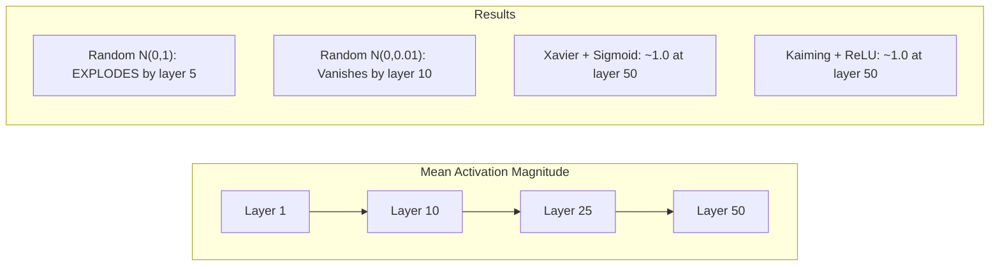
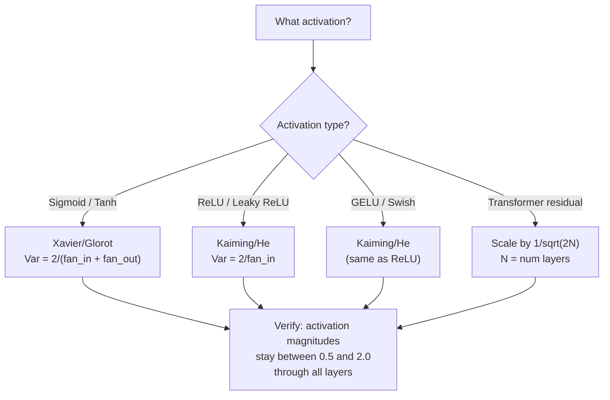

# 权重初始化与训练稳定性

> 初始化错了，训练根本开始不了。初始化对了，50 层网络也能像 3 层一样顺滑训练。

**Type:** Build
**Languages:** Python
**Prerequisites:** Lesson 03.04 (Activation Functions), Lesson 03.07 (Regularization)
**Time:** ~90 minutes

## 学习目标

- 实现零初始化、随机初始化、Xavier/Glorot 初始化和 Kaiming/He 初始化，并测量它们对 50 层网络激活幅度的影响
- 推导为什么 Xavier 使用 `Var(w) = 2/(fan_in + fan_out)`，而 Kaiming 使用 `Var(w) = 2/fan_in`
- 演示零初始化的对称性问题，并解释为什么“随机”本身还不够
- 把正确初始化策略匹配到激活函数：sigmoid/tanh 用 Xavier，ReLU/GELU 用 Kaiming

## 问题

把所有权重初始化为零。什么都学不到。每个神经元计算同一个函数，收到同一个梯度，并以同样方式更新。训练 10,000 个 epoch 之后，你的 512 神经元隐藏层仍然是同一个神经元的 512 份拷贝。你为 512 个参数付出了代价，却只得到了 1 个有效参数。

把它们初始化得太大。激活值会在网络中爆炸。到第 10 层，数值达到 `1e15`。到第 20 层，溢出成无穷大。梯度会沿反方向走同样轨迹。

从标准正态分布随机初始化。3 层时可能能工作。到 50 层时，信号会坍缩到零，或者爆炸到无穷大，取决于随机尺度是略小还是略大。“能工作”和“彻底坏掉”之间的边界薄得像刀刃。

权重初始化是深度学习里最被低估的决定。架构会有论文，优化器会有博客，初始化常常只是脚注。但如果初始化错了，其他一切都不重要：网络在训练开始之前就已经死了。

## 核心概念

### 对称性问题

一层中的每个神经元结构相同：输入乘以权重，加上偏置，应用激活函数。如果所有权重从同一个值开始，零初始化是极端例子，那么每个神经元都会计算同一个输出。反向传播期间，每个神经元都会收到同一个梯度。更新时，每个神经元也会改变同样的量。

你被困住了。网络有数百个参数，但它们步调完全一致。这叫对称性，而随机初始化是打破它的直接办法。每个神经元从权重空间中的不同点开始，因此会学习不同特征。

但“随机”还不够。随机性的**尺度**决定网络能不能训练。

### 方差如何穿过层传播

考虑一个有 `fan_in` 个输入的单层：

```text
z = w1*x1 + w2*x2 + ... + w_n*x_n
```

如果每个权重 `wi` 都来自方差为 `Var(w)` 的分布，每个输入 `xi` 的方差为 `Var(x)`，那么输出方差是：

```text
Var(z) = fan_in * Var(w) * Var(x)
```

如果 `Var(w) = 1` 且 `fan_in = 512`，输出方差就是输入方差的 512 倍。经过 10 层：`512^10 = 1.2e27`。信号爆炸了。

如果 `Var(w) = 0.001`，每层输出方差会乘以 `0.001 * 512 = 0.512`。经过 10 层：`0.512^10 = 0.00013`。信号消失了。

目标是选择 `Var(w)`，使 `Var(z) = Var(x)`。也就是让信号幅度跨层保持稳定。

### Xavier/Glorot 初始化

Glorot 和 Bengio 在 2010 年为 sigmoid 和 tanh 激活推导了解法。为了在前向和反向传播中都保持方差稳定：

```text
Var(w) = 2 / (fan_in + fan_out)
```

实践中，权重通常来自：

```text
w ~ Uniform(-limit, limit)  where limit = sqrt(6 / (fan_in + fan_out))
```

或：

```text
w ~ Normal(0, sqrt(2 / (fan_in + fan_out)))
```

它能工作，是因为 sigmoid 和 tanh 在零附近大致线性，而正确初始化后的激活值会停留在这个区域。方差可以稳定穿过几十层。

### Kaiming/He 初始化

ReLU 会杀掉一半输出，也就是所有负值都变成零。有效 `fan_in` 被减半，因为平均来说一半输入会被置零。Xavier 初始化没有考虑这一点，所以会低估需要的方差。

He 等人在 2015 年调整了公式：

```text
Var(w) = 2 / fan_in
```

权重来自：

```text
w ~ Normal(0, sqrt(2 / fan_in))
```

系数 2 用来补偿 ReLU 把一半激活置零。如果没有它，信号每层会缩小约 0.5 倍。50 层之后：`0.5^50 = 8.8e-16`。Kaiming 初始化会防止这一点。

### Transformer 初始化

GPT-2 引入了一种不同模式。残差连接会把每个子层输出加到输入上：

```text
x = x + sublayer(x)
```

每次相加都会增加方差。有 N 个残差层时，方差大致按 N 增长。GPT-2 会把残差层权重按 `1/sqrt(2N)` 缩放，其中 N 是层数。这样可以保持累积信号幅度稳定。

Llama 3 有 405B 参数和 126 层，也使用类似方案。没有这种缩放，残差流会在 126 层 attention 和 feedforward block 中无界增长。

```mermaid
flowchart TD
    subgraph "Zero Init"
        Z1["Layer 1<br/>All weights = 0"] --> Z2["Layer 2<br/>All neurons identical"]
        Z2 --> Z3["Layer 3<br/>Still identical"]
        Z3 --> ZR["Result: 1 effective neuron<br/>regardless of width"]
    end

    subgraph "Xavier Init"
        X1["Layer 1<br/>Var = 2/(fan_in+fan_out)"] --> X2["Layer 2<br/>Signal stable"]
        X2 --> X3["Layer 50<br/>Signal stable"]
        X3 --> XR["Result: Trains with<br/>sigmoid/tanh"]
    end

    subgraph "Kaiming Init"
        K1["Layer 1<br/>Var = 2/fan_in"] --> K2["Layer 2<br/>Signal stable"]
        K2 --> K3["Layer 50<br/>Signal stable"]
        K3 --> KR["Result: Trains with<br/>ReLU/GELU"]
    end
```



### 50 层中的激活幅度



### 选择正确初始化



## Build It

### 第 1 步：初始化策略

四种初始化权重矩阵的方式。每个函数都返回列表的列表，也就是二维矩阵，包含 `fan_in` 列和 `fan_out` 行。

```python
import math
import random


def zero_init(fan_in, fan_out):
    return [[0.0 for _ in range(fan_in)] for _ in range(fan_out)]


def random_init(fan_in, fan_out, scale=1.0):
    return [[random.gauss(0, scale) for _ in range(fan_in)] for _ in range(fan_out)]


def xavier_init(fan_in, fan_out):
    std = math.sqrt(2.0 / (fan_in + fan_out))
    return [[random.gauss(0, std) for _ in range(fan_in)] for _ in range(fan_out)]


def kaiming_init(fan_in, fan_out):
    std = math.sqrt(2.0 / fan_in)
    return [[random.gauss(0, std) for _ in range(fan_in)] for _ in range(fan_out)]
```

### 第 2 步：激活函数

我们需要 sigmoid、tanh 和 ReLU，用来测试每种初始化策略和它对应的激活函数。

```python
def sigmoid(x):
    x = max(-500, min(500, x))
    return 1.0 / (1.0 + math.exp(-x))


def tanh_act(x):
    return math.tanh(x)


def relu(x):
    return max(0.0, x)
```

### 第 3 步：穿过 50 层的前向传播

让随机数据穿过深层网络，并测量每一层的平均激活幅度。

```python
def forward_deep(init_fn, activation_fn, n_layers=50, width=64, n_samples=100):
    random.seed(42)
    layer_magnitudes = []

    inputs = [[random.gauss(0, 1) for _ in range(width)] for _ in range(n_samples)]

    for layer_idx in range(n_layers):
        weights = init_fn(width, width)
        biases = [0.0] * width

        new_inputs = []
        for sample in inputs:
            output = []
            for neuron_idx in range(width):
                z = sum(weights[neuron_idx][j] * sample[j] for j in range(width)) + biases[neuron_idx]
                output.append(activation_fn(z))
            new_inputs.append(output)
        inputs = new_inputs

        magnitudes = []
        for sample in inputs:
            magnitudes.append(sum(abs(v) for v in sample) / width)
        mean_mag = sum(magnitudes) / len(magnitudes)
        layer_magnitudes.append(mean_mag)

    return layer_magnitudes
```

### 第 4 步：实验

运行所有组合：零初始化、随机 `N(0,1)`、随机 `N(0,0.01)`、Xavier + sigmoid、Xavier + tanh、Kaiming + ReLU。打印关键层的幅度。

```python
def run_experiment():
    configs = [
        ("Zero init + Sigmoid", lambda fi, fo: zero_init(fi, fo), sigmoid),
        ("Random N(0,1) + ReLU", lambda fi, fo: random_init(fi, fo, 1.0), relu),
        ("Random N(0,0.01) + ReLU", lambda fi, fo: random_init(fi, fo, 0.01), relu),
        ("Xavier + Sigmoid", xavier_init, sigmoid),
        ("Xavier + Tanh", xavier_init, tanh_act),
        ("Kaiming + ReLU", kaiming_init, relu),
    ]

    print(f"{'Strategy':<30} {'L1':>10} {'L5':>10} {'L10':>10} {'L25':>10} {'L50':>10}")
    print("-" * 80)

    for name, init_fn, act_fn in configs:
        mags = forward_deep(init_fn, act_fn)
        row = f"{name:<30}"
        for idx in [0, 4, 9, 24, 49]:
            val = mags[idx]
            if val > 1e6:
                row += f" {'EXPLODED':>10}"
            elif val < 1e-6:
                row += f" {'VANISHED':>10}"
            else:
                row += f" {val:>10.4f}"
        print(row)
```

### 第 5 步：对称性演示

展示零初始化会产生完全相同的神经元。

```python
def symmetry_demo():
    random.seed(42)
    weights = zero_init(2, 4)
    biases = [0.0] * 4

    inputs = [0.5, -0.3]
    outputs = []
    for neuron_idx in range(4):
        z = sum(weights[neuron_idx][j] * inputs[j] for j in range(2)) + biases[neuron_idx]
        outputs.append(sigmoid(z))

    print("\nSymmetry Demo (4 neurons, zero init):")
    for i, out in enumerate(outputs):
        print(f"  Neuron {i}: output = {out:.6f}")
    all_same = all(abs(outputs[i] - outputs[0]) < 1e-10 for i in range(len(outputs)))
    print(f"  All identical: {all_same}")
    print(f"  Effective parameters: 1 (not {len(weights) * len(weights[0])})")
```

### 第 6 步：逐层幅度报告

打印穿过 50 层的激活幅度可视化条形图。

```python
def magnitude_report(name, magnitudes):
    print(f"\n{name}:")
    for i, mag in enumerate(magnitudes):
        if i % 5 == 0 or i == len(magnitudes) - 1:
            if mag > 1e6:
                bar = "X" * 50 + " EXPLODED"
            elif mag < 1e-6:
                bar = "." + " VANISHED"
            else:
                bar_len = min(50, max(1, int(mag * 10)))
                bar = "#" * bar_len
            print(f"  Layer {i+1:3d}: {bar} ({mag:.6f})")
```

## Use It

PyTorch 提供内置初始化函数：

```python
import torch
import torch.nn as nn

layer = nn.Linear(512, 256)

nn.init.xavier_uniform_(layer.weight)
nn.init.xavier_normal_(layer.weight)

nn.init.kaiming_uniform_(layer.weight, nonlinearity='relu')
nn.init.kaiming_normal_(layer.weight, nonlinearity='relu')

nn.init.zeros_(layer.bias)
```

当你调用 `nn.Linear(512, 256)` 时，PyTorch 默认使用 Kaiming uniform 初始化。这就是为什么大多数简单网络“直接能跑”：PyTorch 已经帮你做了正确选择。但当你构建自定义架构，或者网络深度超过 20 层时，你需要理解发生了什么，并可能覆盖默认初始化。

对 transformer 来说，HuggingFace 模型通常会在 `_init_weights` 方法里处理初始化。GPT-2 的实现会按 `1/sqrt(N)` 缩放残差投影。如果你从零构建 transformer，需要自己加上这一点。

## Ship It

本课产出：

- `outputs/prompt-init-strategy.md`：一个诊断权重初始化问题并推荐正确策略的 prompt

## 练习

1. 添加 LeCun 初始化，`Var = 1/fan_in`，它是为 SELU 激活设计的。用 LeCun init + tanh 运行 50 层实验，并和 Xavier + tanh 比较。

2. 实现 GPT-2 残差缩放：在加到 residual stream 之前，把每层输出乘以 `1/sqrt(2*N)`。运行 50 层，比较有无缩放时 residual 幅度增长速度。

3. 创建一个 “init health check” 函数，接收网络层维度和激活类型，然后推荐正确初始化，并在当前初始化会造成问题时发出警告。

4. 用 `fan_in = 16` 和 `fan_in = 1024` 分别运行实验。Xavier 和 Kaiming 会适配 `fan_in`，但普通随机初始化不会。展示层越大时，“能工作”和“会坏掉”之间的差距如何扩大。

5. 实现正交初始化：生成随机矩阵，计算 SVD，使用正交矩阵 `U`。在 50 层 ReLU 网络中，把它和 Kaiming 比较。

## 关键术语

| Term | 常见说法 | 实际含义 |
|------|----------|----------|
| Weight initialization | “随机设置初始权重” | 选择初始权重值的策略，决定网络到底能不能开始训练 |
| Symmetry breaking | “让神经元变得不同” | 使用随机初始化确保神经元学习不同特征，而不是计算完全相同的函数 |
| Fan-in | “神经元输入数量” | 进入某个神经元的连接数，决定输入方差如何在加权和中累积 |
| Fan-out | “神经元输出数量” | 离开某个神经元的连接数，与反向传播期间保持梯度方差有关 |
| Xavier/Glorot init | “Sigmoid 初始化” | `Var(w) = 2/(fan_in + fan_out)`，设计用于保持 sigmoid 和 tanh 激活中的方差 |
| Kaiming/He init | “ReLU 初始化” | `Var(w) = 2/fan_in`，考虑到 ReLU 会把一半激活置零 |
| Variance propagation | “信号如何跨层变大或变小” | 根据权重尺度分析激活方差如何逐层变化的数学方法 |
| Residual scaling | “GPT-2 初始化技巧” | 把残差连接权重按 `1/sqrt(2N)` 缩放，防止信号方差穿过 N 个 transformer 层时增长 |
| Dead network | “什么都训不动” | 糟糕初始化导致所有梯度为零，或所有激活饱和的网络 |
| Exploding activations | “数值变成无穷大” | 权重方差太高，导致激活幅度跨层指数级增长 |

## 延伸阅读

- Glorot & Bengio, "Understanding the difficulty of training deep feedforward neural networks" (2010)：Xavier 初始化原始论文，包含方差分析
- He et al., "Delving Deep into Rectifiers" (2015)：为 ReLU 网络提出 Kaiming 初始化
- Radford et al., "Language Models are Unsupervised Multitask Learners" (2019)：GPT-2 论文，包含残差缩放初始化
- Mishkin & Matas, "All You Need is a Good Init" (2016)：逐层单位方差初始化，是分析公式之外的一种经验替代方案
