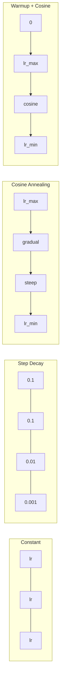
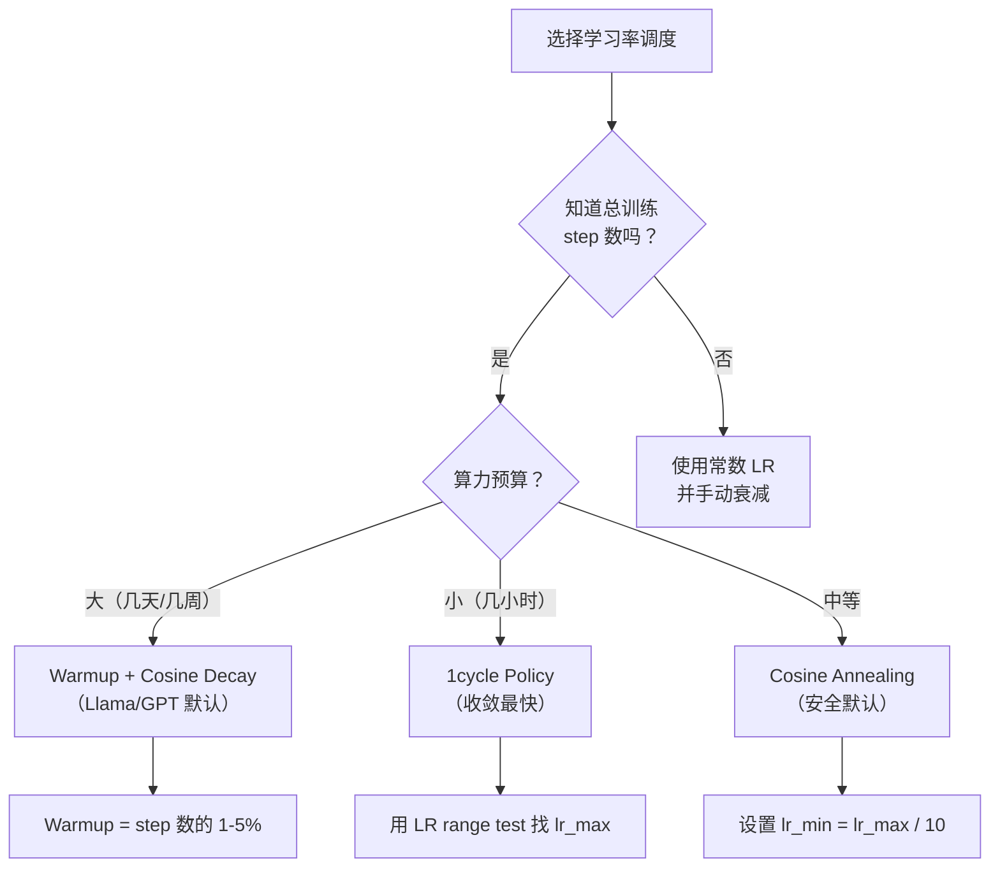
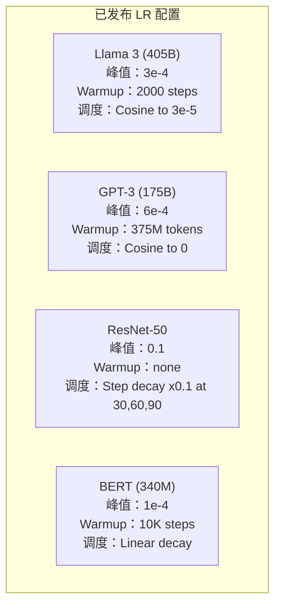

# 学习率调度与 Warmup

> 学习率是最重要的单个超参数。不是架构。不是数据集规模。不是激活函数。是学习率。如果你什么都不调，至少要调它。

**类型：** Build
**语言：** Python
**先修：** Lesson 03.06 (Optimizers), Lesson 03.08 (Weight Initialization)
**时间：** ~90 分钟

## 学习目标

- 从零实现 constant、step decay、cosine annealing、warmup + cosine 和 1cycle 学习率调度
- 演示学习率选择的三种失败模式：发散（太高）、停滞（太低）和振荡（没有衰减）
- 解释为什么基于 Adam 的优化器需要 warmup，以及它如何稳定早期训练
- 在同一个任务上比较五种调度的收敛速度，并为给定训练预算选择合适方案

## 问题

把学习率设成 0.1。训练发散，loss 在 3 步内跳到无穷大。把它设成 0.0001。训练像爬一样慢，100 个 epoch 后模型几乎还停在随机初始化附近。把它设成 0.01。训练前 50 个 epoch 有效，随后 loss 在一个永远到不了的最小值附近振荡，因为步子太大了。

最优学习率不是常数。它会在训练过程中变化。训练早期，你希望步子大一点，快速跨过大范围空间。训练后期，你希望步子很小，让模型落进清晰的最小值。一个 90% 准确率模型和一个 95% 准确率模型之间，差别往往只是调度方案。

过去三年发布的几乎所有重要模型都使用学习率调度。Llama 3 使用峰值 lr=3e-4、2000 个 warmup step，并用 cosine decay 衰减到 3e-5。GPT-3 使用 lr=6e-4，并在 3.75 亿 token 上 warmup。这些不是随意选择，而是花费数百万美元做大量超参数搜索后的结果。

你需要理解调度，因为默认值不会刚好适合你的问题。微调预训练模型时，合适的调度不同于从零训练。增大 batch size 时，warmup 时长也需要变化。训练在第 10,000 步崩掉时，你要能判断这是调度问题还是别的东西。

## 概念

### 常数学习率

最简单的方法。选一个数字，每一步都用它。

```text
lr(t) = lr_0
```

它很少是最优选择。它要么对训练末期太高，导致在最小值附近振荡；要么对训练初期太低，把算力浪费在过小的步子上。它适合小模型和调试。对任何训练时间超过一小时的任务来说，它都是很差的选择。

### 阶梯衰减

ResNet 时代的老派做法。在固定 epoch 把学习率按某个倍数降低，通常降低 10 倍。

```text
lr(t) = lr_0 * gamma^(floor(epoch / step_size))
```

其中 gamma = 0.1 且 step_size = 30 表示：每 30 个 epoch，lr 降低 10 倍。ResNet-50 用过这种方案：lr=0.1，并在第 30、60、90 个 epoch 降低 10 倍。

问题在于：最优衰减点依赖数据集和架构。换一个问题，就得重新调什么时候下降。转换也很突兀，学习率突然变化时 loss 可能会尖峰上升。

### 余弦退火

沿着余弦曲线，从最大学习率平滑衰减到最小值：

```text
lr(t) = lr_min + 0.5 * (lr_max - lr_min) * (1 + cos(pi * t / T))
```

其中 t 是当前 step，T 是总 step 数。

在 t=0 时，余弦项为 1，所以 lr = lr_max。在 t=T 时，余弦项为 -1，所以 lr = lr_min。衰减一开始很缓，中间加速，接近末尾时再次变缓。

这是大多数现代训练运行的默认方案。除了 lr_max 和 lr_min 外，没有额外需要调的超参数。余弦形状也符合经验观察：大多数学习发生在训练中段，所以你希望关键阶段保持合理的步长。

### Warmup：为什么从小开始

Adam 和其他自适应优化器会维护梯度均值和方差的运行估计。在第 0 步，这些估计初始化为零。前几次梯度更新基于很差的统计量。如果这段时间学习率很大，模型会迈出巨大且方向很差的步子。

Warmup 解决这个问题。先使用很小的学习率，通常是 lr_max / warmup_steps，甚至从零开始，然后在前 N 步线性升到 lr_max。当你到达完整学习率时，Adam 的统计量已经稳定下来。

```text
lr(t) = lr_max * (t / warmup_steps)     for t < warmup_steps
```

典型 warmup：总训练 step 的 1-5%。Llama 3 训练约 1.8 万亿 token，并 warmup 了 2000 步。GPT-3 在 3.75 亿 token 上 warmup。

### 线性 Warmup + 余弦衰减

现代默认方案。先线性升高，再用余弦衰减：

```text
if t < warmup_steps:
    lr(t) = lr_max * (t / warmup_steps)
else:
    progress = (t - warmup_steps) / (total_steps - warmup_steps)
    lr(t) = lr_min + 0.5 * (lr_max - lr_min) * (1 + cos(pi * progress))
```

Llama、GPT、PaLM 和大多数现代 Transformer 都使用这种方案。warmup 防止早期不稳定。余弦衰减让模型落入好的最小值。

### 1cycle 策略

Leslie Smith 在 2018 年的发现：训练前半段把学习率从低值升到高值，后半段再降下来。这有点反直觉，为什么要在训练中途增加学习率？

理论是：高学习率会给优化轨迹加入噪声，从而起到正则化作用。模型在上升阶段探索更多 loss landscape，找到更好的 basin。下降阶段再在找到的最佳 basin 内细化。

```text
Phase 1 (0 to T/2):    lr ramps from lr_max/25 to lr_max
Phase 2 (T/2 to T):    lr ramps from lr_max to lr_max/10000
```

在固定算力预算下，1cycle 通常比 cosine annealing 训练得更快。代价是：你必须提前知道总 step 数。

### 调度形状



### 决策流程图



### 已发布模型中的真实数字



## 构建它

### 第 1 步：调度函数

每个函数接收当前 step，并返回该 step 的学习率。

```python
import math


def constant_schedule(step, lr=0.01, **kwargs):
    return lr


def step_decay_schedule(step, lr=0.1, step_size=100, gamma=0.1, **kwargs):
    return lr * (gamma ** (step // step_size))


def cosine_schedule(step, lr=0.01, total_steps=1000, lr_min=1e-5, **kwargs):
    if step >= total_steps:
        return lr_min
    return lr_min + 0.5 * (lr - lr_min) * (1 + math.cos(math.pi * step / total_steps))


def warmup_cosine_schedule(step, lr=0.01, total_steps=1000, warmup_steps=100, lr_min=1e-5, **kwargs):
    if total_steps <= warmup_steps:
        return lr * (step / max(warmup_steps, 1))
    if step < warmup_steps:
        return lr * step / warmup_steps
    progress = (step - warmup_steps) / (total_steps - warmup_steps)
    return lr_min + 0.5 * (lr - lr_min) * (1 + math.cos(math.pi * progress))


def one_cycle_schedule(step, lr=0.01, total_steps=1000, **kwargs):
    mid = max(total_steps // 2, 1)
    if step < mid:
        return (lr / 25) + (lr - lr / 25) * step / mid
    else:
        progress = (step - mid) / max(total_steps - mid, 1)
        return lr * (1 - progress) + (lr / 10000) * progress
```

### 第 2 步：可视化所有调度

打印一个基于文本的图，展示每种调度如何随训练演化。

```python
def visualize_schedule(name, schedule_fn, total_steps=500, **kwargs):
    steps = list(range(0, total_steps, total_steps // 20))
    if total_steps - 1 not in steps:
        steps.append(total_steps - 1)

    lrs = [schedule_fn(s, total_steps=total_steps, **kwargs) for s in steps]
    max_lr = max(lrs) if max(lrs) > 0 else 1.0

    print(f"\n{name}:")
    for s, lr_val in zip(steps, lrs):
        bar_len = int(lr_val / max_lr * 40)
        bar = "#" * bar_len
        print(f"  Step {s:4d}: lr={lr_val:.6f} {bar}")
```

### 第 3 步：训练网络

在 circle 数据集上训练一个简单的两层网络，和前几课一样，只是这次我们改变调度方案。

```python
import random


def sigmoid(x):
    x = max(-500, min(500, x))
    return 1.0 / (1.0 + math.exp(-x))


def relu(x):
    return max(0.0, x)


def relu_deriv(x):
    return 1.0 if x > 0 else 0.0


def make_circle_data(n=200, seed=42):
    random.seed(seed)
    data = []
    for _ in range(n):
        x = random.uniform(-2, 2)
        y = random.uniform(-2, 2)
        label = 1.0 if x * x + y * y < 1.5 else 0.0
        data.append(([x, y], label))
    return data


def train_with_schedule(schedule_fn, schedule_name, data, epochs=300, base_lr=0.05, **kwargs):
    random.seed(0)
    hidden_size = 8
    total_steps = epochs * len(data)

    std = math.sqrt(2.0 / 2)
    w1 = [[random.gauss(0, std) for _ in range(2)] for _ in range(hidden_size)]
    b1 = [0.0] * hidden_size
    w2 = [random.gauss(0, std) for _ in range(hidden_size)]
    b2 = 0.0

    step = 0
    epoch_losses = []

    for epoch in range(epochs):
        total_loss = 0
        correct = 0

        for x, target in data:
            lr = schedule_fn(step, lr=base_lr, total_steps=total_steps, **kwargs)

            z1 = []
            h = []
            for i in range(hidden_size):
                z = w1[i][0] * x[0] + w1[i][1] * x[1] + b1[i]
                z1.append(z)
                h.append(relu(z))

            z2 = sum(w2[i] * h[i] for i in range(hidden_size)) + b2
            out = sigmoid(z2)

            error = out - target
            d_out = error * out * (1 - out)

            for i in range(hidden_size):
                d_h = d_out * w2[i] * relu_deriv(z1[i])
                w2[i] -= lr * d_out * h[i]
                for j in range(2):
                    w1[i][j] -= lr * d_h * x[j]
                b1[i] -= lr * d_h
            b2 -= lr * d_out

            total_loss += (out - target) ** 2
            if (out >= 0.5) == (target >= 0.5):
                correct += 1
            step += 1

        avg_loss = total_loss / len(data)
        accuracy = correct / len(data) * 100
        epoch_losses.append(avg_loss)

    return epoch_losses
```

### 第 4 步：比较所有调度

用每种调度训练同一个网络，并比较最终 loss 和收敛行为。

```python
def compare_schedules(data):
    configs = [
        ("Constant", constant_schedule, {}),
        ("Step Decay", step_decay_schedule, {"step_size": 15000, "gamma": 0.1}),
        ("Cosine", cosine_schedule, {"lr_min": 1e-5}),
        ("Warmup+Cosine", warmup_cosine_schedule, {"warmup_steps": 3000, "lr_min": 1e-5}),
        ("1cycle", one_cycle_schedule, {}),
    ]

    print(f"\n{'Schedule':<20} {'Start Loss':>12} {'Mid Loss':>12} {'End Loss':>12} {'Best Loss':>12}")
    print("-" * 70)

    for name, schedule_fn, extra_kwargs in configs:
        losses = train_with_schedule(schedule_fn, name, data, epochs=300, base_lr=0.05, **extra_kwargs)
        mid_idx = len(losses) // 2
        best = min(losses)
        print(f"{name:<20} {losses[0]:>12.6f} {losses[mid_idx]:>12.6f} {losses[-1]:>12.6f} {best:>12.6f}")
```

### 第 5 步：学习率太高与太低

演示三种失败模式：太高（发散）、太低（爬行）和刚刚好。

```python
def lr_sensitivity(data):
    learning_rates = [1.0, 0.1, 0.01, 0.001, 0.0001]

    print("\nLR Sensitivity (constant schedule, 100 epochs):")
    print(f"  {'LR':>10} {'Start Loss':>12} {'End Loss':>12} {'Status':>15}")
    print("  " + "-" * 52)

    for lr in learning_rates:
        losses = train_with_schedule(constant_schedule, f"lr={lr}", data, epochs=100, base_lr=lr)
        start = losses[0]
        end = losses[-1]

        if end > start or math.isnan(end) or end > 1.0:
            status = "DIVERGED"
        elif end > start * 0.9:
            status = "BARELY MOVED"
        elif end < 0.15:
            status = "CONVERGED"
        else:
            status = "LEARNING"

        end_str = f"{end:.6f}" if not math.isnan(end) else "NaN"
        print(f"  {lr:>10.4f} {start:>12.6f} {end_str:>12} {status:>15}")
```

## 使用它

PyTorch 在 `torch.optim.lr_scheduler` 中提供调度器：

```python
import torch
import torch.optim as optim
from torch.optim.lr_scheduler import CosineAnnealingLR, OneCycleLR, StepLR

model = nn.Sequential(nn.Linear(10, 64), nn.ReLU(), nn.Linear(64, 1))
optimizer = optim.Adam(model.parameters(), lr=3e-4)

scheduler = CosineAnnealingLR(optimizer, T_max=1000, eta_min=1e-5)

for step in range(1000):
    loss = train_step(model, optimizer)
    scheduler.step()
```

对于 warmup + cosine，可以使用 lambda scheduler，或者 HuggingFace 的 `get_cosine_schedule_with_warmup`：

```python
from transformers import get_cosine_schedule_with_warmup

scheduler = get_cosine_schedule_with_warmup(
    optimizer,
    num_warmup_steps=2000,
    num_training_steps=100000,
)
```

HuggingFace 函数是大多数 Llama 和 GPT 微调脚本使用的东西。拿不准时，就用 warmup + cosine，并把 warmup 设为总 step 的 3-5%。它几乎适用于所有场景。

## 交付它

本课产出：
- `outputs/prompt-lr-schedule-advisor.md`：一个提示词，用于根据你的训练设置推荐合适的学习率调度和超参数

## 练习

1. 实现指数衰减：lr(t) = lr_0 * gamma^t，其中 gamma = 0.999。在 circle 数据集上和 cosine annealing 比较。

2. 实现学习率范围测试（Leslie Smith）：训练几百步，同时把 LR 从 1e-7 指数升高到 1。绘制 loss vs LR。最优 max LR 位于 loss 开始上升之前。

3. 使用 warmup + cosine 训练，但改变 warmup 长度：总 step 的 0%、1%、5%、10%、20%。找到训练最稳定的甜点区。

4. 实现带 warm restarts 的 cosine annealing（SGDR）：每 T 步把学习率重置为 lr_max，然后再次衰减。在更长训练运行中和标准 cosine 比较。

5. 构建一个“schedule surgeon”：监控训练 loss，在 loss 稳定时自动从 warmup 切换到 cosine，并在 loss plateau 太久时降低 lr。

## 关键术语

| 术语 | 人们常说 | 实际含义 |
|------|----------|----------|
| 学习率 | “模型学得有多快” | 乘在梯度上的标量，用于决定参数更新大小 |
| 调度 | “随时间改变 LR” | 一个从训练 step 映射到学习率的函数，用来优化收敛 |
| Warmup | “从小 LR 开始” | 在前 N 步把 LR 从接近零线性升到目标值，以稳定优化器统计量 |
| 余弦退火 | “平滑 LR 衰减” | 训练过程中让 LR 沿余弦曲线从 lr_max 降到 lr_min |
| 阶梯衰减 | “在里程碑降低 LR” | 在固定 epoch 间隔把 LR 乘以某个因子，通常是 0.1 |
| 1cycle 策略 | “先上再下” | Leslie Smith 的方法：在一个周期内先升高 LR 再降低，以更快收敛 |
| LR 范围测试 | “找到最佳学习率” | 短暂训练并逐步提高 LR，找到 loss 开始发散的值 |
| 带 warm restarts 的 cosine | “重置并重复” | 周期性把 LR 重置为 lr_max 并再次衰减（SGDR） |
| Eta min | “LR 的地板” | 调度最终衰减到的最小学习率 |
| 峰值学习率 | “最大 LR” | 训练中达到的最高 LR，通常出现在 warmup 之后 |

## 延伸阅读

- Loshchilov & Hutter, "SGDR: Stochastic Gradient Descent with Warm Restarts" (2017)：提出 cosine annealing 和 warm restarts
- Smith, "Super-Convergence: Very Fast Training of Neural Networks Using Large Learning Rates" (2018)：1cycle 策略论文
- Touvron et al., "Llama 2: Open Foundation and Fine-Tuned Chat Models" (2023)：记录大规模 warmup + cosine 调度
- Goyal et al., "Accurate, Large Minibatch SGD: Training ImageNet in 1 Hour" (2017)：大 batch 训练的线性缩放规则和 warmup
