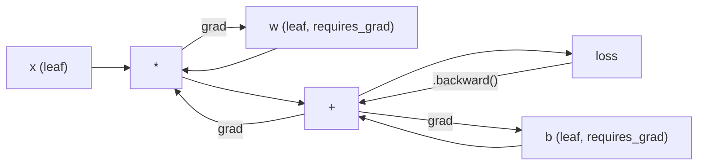
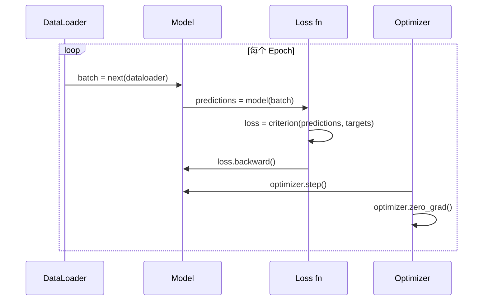

# PyTorch 入门

> 你已经用活塞和曲轴造出了引擎。现在学习那台大家真正会开的车。

**类型：** Build
**语言：** Python
**先修：** Lesson 03.10 (Build Your Own Mini Framework)
**时间：** ~75 分钟

## 学习目标

- 使用 PyTorch 的 nn.Module、nn.Sequential 和 autograd 构建并训练神经网络
- 使用 PyTorch tensors、GPU 加速和标准训练循环（zero_grad、forward、loss、backward、step）
- 把你从零构建的 mini framework 组件转换为 PyTorch 等价物
- 在同一任务上分析并比较纯 Python 框架和 PyTorch 的训练速度

## 问题

你已经有一个可工作的 mini framework。Linear 层、ReLU、dropout、batch norm、Adam、DataLoader、训练循环。它能用纯 Python 在圆形分类问题上训练一个 4 层网络。

它也比 PyTorch 在同一问题上慢 500 倍。

你的 mini framework 用嵌套 Python 循环一次处理一个样本。PyTorch 会把同样的操作分发给优化过的 C++/CUDA kernel，并在 GPU 上运行。在单张 NVIDIA A100 上，PyTorch 大约 6 小时就能在 ImageNet（128 万张图片）上训练 ResNet-50（2560 万参数）。你的框架在同一任务上大约需要 3000 小时，如果它没有先耗尽内存的话。

速度不是唯一差距。你的框架没有 GPU 支持。没有自动微分，每个 module 的 backward() 都是你手写的。没有序列化。没有分布式训练。没有混合精度。没有不用 print 语句就能调试梯度流的方法。

PyTorch 填上了所有这些空缺。而且它保留了你已经构建过的同一个心智模型：Module、forward()、parameters()、backward()、optimizer.step()。概念是一一迁移的。语法几乎相同。区别在于，PyTorch 把十年的系统工程封装在你从零设计过的同一个接口后面。

## 概念

### 为什么 PyTorch 赢了

2015 年，TensorFlow 要求你先定义静态计算图，然后才能运行任何东西。你先构建 graph，编译它，再把数据喂进去。调试意味着盯着 graph 可视化。改变架构意味着从头重建 graph。

PyTorch 在 2017 年发布时采用了不同哲学：eager execution。你写 Python。它立刻运行。`y = model(x)` 真的会现在计算 y，而不是“往稍后才会计算 y 的 graph 里加一个节点”。这意味着标准 Python 调试工具能用。print() 能用。pdb 能用。forward pass 里的 if/else 能用。

到 2020 年，市场已经给出答案。PyTorch 在 ML 研究论文中的占比从 2017 年的 7% 上升到 2022 年的 75% 以上。Meta、Google DeepMind、OpenAI、Anthropic 和 Hugging Face 都把 PyTorch 作为主要框架。TensorFlow 2.x 也采用 eager execution 作为回应，这等于默认承认 PyTorch 的设计是正确的。

教训是：开发者体验会复利增长。一个慢 10% 但调试快 50% 的框架，每次都会赢。

### Tensors

tensor 是一个多维数组，有三个关键属性：shape、dtype 和 device。

```python
import torch

x = torch.zeros(3, 4)           # shape: (3, 4), dtype: float32, device: cpu
x = torch.randn(2, 3, 224, 224) # batch of 2 RGB images, 224x224
x = torch.tensor([1, 2, 3])     # from a Python list
```

**Shape** 是维度。标量的 shape 是 ()，向量是 (n,)，矩阵是 (m, n)，一批图像是 (batch, channels, height, width)。

**Dtype** 控制精度和内存。

| dtype | 位数 | 范围 | 使用场景 |
|-------|------|------|----------|
| float32 | 32 | 约 7 位十进制数字 | 默认训练 |
| float16 | 16 | 约 3.3 位十进制数字 | 混合精度 |
| bfloat16 | 16 | 和 float32 范围相同，精度更低 | LLM 训练 |
| int8 | 8 | -128 到 127 | 量化推理 |

**Device** 决定计算在哪里发生。

```python
device = torch.device("cuda" if torch.cuda.is_available() else "cpu")
x = torch.randn(3, 4, device=device)
x = x.to("cuda")
x = x.cpu()
```

每个操作都要求所有 tensor 在同一个 device 上。这是初学者最常遇到的 PyTorch 错误：`RuntimeError: Expected all tensors to be on the same device`。修复方式是在计算前把所有东西都移动到同一个 device。

**Reshaping** 是常数时间操作，它改变的是元数据，不是数据本身。

```python
x = torch.randn(2, 3, 4)
x.view(2, 12)      # reshape to (2, 12) -- must be contiguous
x.reshape(6, 4)    # reshape to (6, 4) -- works always
x.permute(2, 0, 1) # reorder dimensions
x.unsqueeze(0)     # add dimension: (1, 2, 3, 4)
x.squeeze()        # remove size-1 dimensions
```

### Autograd

你的 mini framework 要求你为每个 module 实现 backward()。PyTorch 不需要。它会把 tensor 上的每个操作记录到一个有向无环图（computational graph）中，然后反向遍历这个 graph 自动计算梯度。



和你的框架相比，关键差异是：PyTorch 使用基于 tape 的自动微分。前向传播期间，每个操作都会追加到一条 “tape” 上。调用 `.backward()` 时，PyTorch 会反向重放这条 tape。

```python
x = torch.randn(3, requires_grad=True)
y = x ** 2 + 3 * x
z = y.sum()
z.backward()
print(x.grad)  # dz/dx = 2x + 3
```

autograd 有三条规则：

1. 只有带 `requires_grad=True` 的 leaf tensors 会累积梯度
2. 梯度默认会累积，所以每次 backward pass 前要调用 `optimizer.zero_grad()`
3. `torch.no_grad()` 会关闭梯度追踪，评估时使用

### nn.Module

`nn.Module` 是 PyTorch 中每个神经网络组件的基类。你已经在 Lesson 10 构建过这个抽象。PyTorch 版本额外提供自动参数注册、递归 module 发现、device 管理和 state dict 序列化。

```python
import torch.nn as nn

class MLP(nn.Module):
    def __init__(self, input_dim, hidden_dim, output_dim):
        super().__init__()
        self.layer1 = nn.Linear(input_dim, hidden_dim)
        self.relu = nn.ReLU()
        self.layer2 = nn.Linear(hidden_dim, output_dim)

    def forward(self, x):
        x = self.layer1(x)
        x = self.relu(x)
        x = self.layer2(x)
        return x
```

当你在 `__init__` 中把一个 `nn.Module` 或 `nn.Parameter` 赋值为属性时，PyTorch 会自动注册它。`model.parameters()` 会递归收集每个已注册参数。这就是为什么你不再需要像 mini framework 那样手动收集权重。

关键构建块：

| Module | 作用 | 参数量 |
|--------|------|--------|
| nn.Linear(in, out) | Wx + b | in*out + out |
| nn.Conv2d(in_ch, out_ch, k) | 2D 卷积 | in_ch*out_ch*k*k + out_ch |
| nn.BatchNorm1d(features) | 标准化激活 | 2 * features |
| nn.Dropout(p) | 随机置零 | 0 |
| nn.ReLU() | max(0, x) | 0 |
| nn.GELU() | Gaussian error linear | 0 |
| nn.Embedding(vocab, dim) | 查表 | vocab * dim |
| nn.LayerNorm(dim) | 按样本归一化 | 2 * dim |

### 损失函数和优化器

PyTorch 提供了你构建过的所有东西的生产级版本。

**损失函数**（来自 `torch.nn`）：

| Loss | 任务 | 输入 |
|------|------|------|
| nn.MSELoss() | 回归 | 任意 shape |
| nn.CrossEntropyLoss() | 多分类 | Logits（不是 softmax） |
| nn.BCEWithLogitsLoss() | 二分类 | Logits（不是 sigmoid） |
| nn.L1Loss() | 回归（鲁棒） | 任意 shape |
| nn.CTCLoss() | 序列对齐 | Log probabilities |

注意：`CrossEntropyLoss` 内部组合了 `LogSoftmax` + `NLLLoss`。传入 raw logits，不要传 softmax 输出。这是一个常见错误，会悄悄产生错误梯度。

**优化器**（来自 `torch.optim`）：

| Optimizer | 使用场景 | 典型 LR |
|-----------|----------|---------|
| SGD(params, lr, momentum) | CNN、充分调优的 pipeline | 0.01--0.1 |
| Adam(params, lr) | 默认起点 | 1e-3 |
| AdamW(params, lr, weight_decay) | Transformers、微调 | 1e-4--1e-3 |
| LBFGS(params) | 小规模、二阶方法 | 1.0 |

### 训练循环

每个 PyTorch 训练循环都遵循同一个 5 步模式。你已经在 Lesson 10 学过它。



标准模式：

```python
for epoch in range(num_epochs):
    model.train()
    for inputs, targets in train_loader:
        inputs, targets = inputs.to(device), targets.to(device)
        optimizer.zero_grad()
        outputs = model(inputs)
        loss = criterion(outputs, targets)
        loss.backward()
        optimizer.step()
```

batch 循环里只有五行。训练 GPT-4、Stable Diffusion 和 LLaMA 的也是这五行。架构会变。数据会变。这五行不变。

### Dataset 和 DataLoader

PyTorch 的 `Dataset` 是一个抽象类，有两个方法：`__len__` 和 `__getitem__`。`DataLoader` 包装它，提供 batching、shuffling 和多进程数据加载。

```python
from torch.utils.data import Dataset, DataLoader

class MNISTDataset(Dataset):
    def __init__(self, images, labels):
        self.images = images
        self.labels = labels

    def __len__(self):
        return len(self.labels)

    def __getitem__(self, idx):
        return self.images[idx], self.labels[idx]

loader = DataLoader(dataset, batch_size=64, shuffle=True, num_workers=4)
```

`num_workers=4` 会启动 4 个进程并行加载数据，同时 GPU 在当前 batch 上训练。对磁盘受限的工作负载（大图像、音频）来说，单这一项就可能让训练速度翻倍。

### GPU 训练

把模型移动到 GPU：

```python
device = torch.device("cuda" if torch.cuda.is_available() else "cpu")
model = model.to(device)
```

这会递归地把每个参数和 buffer 移到 GPU。然后在训练时移动每个 batch：

```python
inputs, targets = inputs.to(device), targets.to(device)
```

**混合精度** 会在现代 GPU（A100、H100、RTX 4090）上把内存占用减半、吞吐翻倍：前向/反向使用 float16 运行，同时保留 float32 master weights。

```python
from torch.amp import autocast, GradScaler

scaler = GradScaler()
for inputs, targets in loader:
    with autocast(device_type="cuda"):
        outputs = model(inputs)
        loss = criterion(outputs, targets)
    scaler.scale(loss).backward()
    scaler.step(optimizer)
    scaler.update()
    optimizer.zero_grad()
```

### 对比：Mini Framework vs PyTorch vs JAX

| Feature | Mini Framework (L10) | PyTorch | JAX |
|---------|----------------------|---------|-----|
| Autodiff | 手写 backward() | 基于 tape 的 autograd | 函数式 transforms |
| Execution | Eager（Python 循环） | Eager（C++ kernels） | Traced + JIT compiled |
| GPU support | 无 | 有（CUDA、ROCm、MPS） | 有（CUDA、TPU） |
| Speed (MNIST MLP) | ~300s/epoch | ~0.5s/epoch | ~0.3s/epoch |
| Module system | 自定义 Module class | nn.Module | 无状态函数（Flax/Equinox） |
| Debugging | print() | print()、pdb、breakpoint() | 更难（JIT tracing 会破坏 print） |
| Ecosystem | 无 | Hugging Face、Lightning、timm | Flax、Optax、Orbax |
| Learning curve | 你已经构建过 | 中等 | 陡峭（函数式范式） |
| Production use | 玩具问题 | Meta、OpenAI、Anthropic、HF | Google DeepMind、Midjourney |

## 构建它

一个只使用 PyTorch 基础组件的 3 层 MLP，用于训练 MNIST。不使用高层封装。不用 `torchvision.datasets`。我们自己下载并解析原始数据。

### 第 1 步：从原始文件加载 MNIST

MNIST 由 4 个 gzip 文件组成：训练图像（60,000 x 28 x 28）、训练标签、测试图像（10,000 x 28 x 28）、测试标签。我们下载它们，并解析二进制格式。

```python
import torch
import torch.nn as nn
import struct
import gzip
import urllib.request
import os

def download_mnist(path="./mnist_data"):
    base_url = "https://storage.googleapis.com/cvdf-datasets/mnist/"
    files = [
        "train-images-idx3-ubyte.gz",
        "train-labels-idx1-ubyte.gz",
        "t10k-images-idx3-ubyte.gz",
        "t10k-labels-idx1-ubyte.gz",
    ]
    os.makedirs(path, exist_ok=True)
    for f in files:
        filepath = os.path.join(path, f)
        if not os.path.exists(filepath):
            urllib.request.urlretrieve(base_url + f, filepath)

def load_images(filepath):
    with gzip.open(filepath, "rb") as f:
        magic, num, rows, cols = struct.unpack(">IIII", f.read(16))
        data = f.read()
        images = torch.frombuffer(bytearray(data), dtype=torch.uint8)
        images = images.reshape(num, rows * cols).float() / 255.0
    return images

def load_labels(filepath):
    with gzip.open(filepath, "rb") as f:
        magic, num = struct.unpack(">II", f.read(8))
        data = f.read()
        labels = torch.frombuffer(bytearray(data), dtype=torch.uint8).long()
    return labels
```

### 第 2 步：定义模型

一个 3 层 MLP：784 -> 256 -> 128 -> 10。使用 ReLU 激活。使用 Dropout 正则化。为了保持简单，不使用 batch norm。

```python
class MNISTModel(nn.Module):
    def __init__(self):
        super().__init__()
        self.net = nn.Sequential(
            nn.Linear(784, 256),
            nn.ReLU(),
            nn.Dropout(0.2),
            nn.Linear(256, 128),
            nn.ReLU(),
            nn.Dropout(0.2),
            nn.Linear(128, 10),
        )

    def forward(self, x):
        return self.net(x)
```

输出层产生 10 个 raw logits，每个数字一个。不要 softmax，`CrossEntropyLoss` 会在内部处理它。

参数量：784*256 + 256 + 256*128 + 128 + 128*10 + 10 = 235,146。按现代标准非常小。GPT-2 small 有 124M 参数。这个模型几秒就能训练完。

### 第 3 步：训练循环

标准的 forward-loss-backward-step 模式。

```python
def train_one_epoch(model, loader, criterion, optimizer, device):
    model.train()
    total_loss = 0
    correct = 0
    total = 0
    for images, labels in loader:
        images, labels = images.to(device), labels.to(device)
        optimizer.zero_grad()
        outputs = model(images)
        loss = criterion(outputs, labels)
        loss.backward()
        optimizer.step()
        total_loss += loss.item() * images.size(0)
        _, predicted = outputs.max(1)
        correct += predicted.eq(labels).sum().item()
        total += labels.size(0)
    return total_loss / total, correct / total


def evaluate(model, loader, criterion, device):
    model.eval()
    total_loss = 0
    correct = 0
    total = 0
    with torch.no_grad():
        for images, labels in loader:
            images, labels = images.to(device), labels.to(device)
            outputs = model(images)
            loss = criterion(outputs, labels)
            total_loss += loss.item() * images.size(0)
            _, predicted = outputs.max(1)
            correct += predicted.eq(labels).sum().item()
            total += labels.size(0)
    return total_loss / total, correct / total
```

注意评估期间的 `torch.no_grad()`。它会关闭 autograd，减少内存使用并加速推理。没有它，PyTorch 会构建一个你永远不会使用的 computational graph。

### 第 4 步：把所有东西接起来

```python
def main():
    device = torch.device("cuda" if torch.cuda.is_available() else "cpu")

    download_mnist()
    train_images = load_images("./mnist_data/train-images-idx3-ubyte.gz")
    train_labels = load_labels("./mnist_data/train-labels-idx1-ubyte.gz")
    test_images = load_images("./mnist_data/t10k-images-idx3-ubyte.gz")
    test_labels = load_labels("./mnist_data/t10k-labels-idx1-ubyte.gz")

    train_dataset = torch.utils.data.TensorDataset(train_images, train_labels)
    test_dataset = torch.utils.data.TensorDataset(test_images, test_labels)
    train_loader = torch.utils.data.DataLoader(
        train_dataset, batch_size=64, shuffle=True
    )
    test_loader = torch.utils.data.DataLoader(
        test_dataset, batch_size=256, shuffle=False
    )

    model = MNISTModel().to(device)
    criterion = nn.CrossEntropyLoss()
    optimizer = torch.optim.Adam(model.parameters(), lr=1e-3)

    num_params = sum(p.numel() for p in model.parameters())
    print(f"Device: {device}")
    print(f"Parameters: {num_params:,}")
    print(f"Train samples: {len(train_dataset):,}")
    print(f"Test samples: {len(test_dataset):,}")
    print()

    for epoch in range(10):
        train_loss, train_acc = train_one_epoch(
            model, train_loader, criterion, optimizer, device
        )
        test_loss, test_acc = evaluate(
            model, test_loader, criterion, device
        )
        print(
            f"Epoch {epoch+1:2d} | "
            f"Train Loss: {train_loss:.4f} | Train Acc: {train_acc:.4f} | "
            f"Test Loss: {test_loss:.4f} | Test Acc: {test_acc:.4f}"
        )

    torch.save(model.state_dict(), "mnist_mlp.pt")
    print(f"\nModel saved to mnist_mlp.pt")
    print(f"Final test accuracy: {test_acc:.4f}")
```

10 个 epoch 后的预期输出：约 97.8% 测试准确率。CPU 训练时间：约 30 秒。GPU：约 5 秒。你的 mini framework 使用相同架构：约 45 分钟。

## 使用它

### 快速对比：Mini Framework vs PyTorch

| Mini Framework (Lesson 10) | PyTorch |
|----------------------------|---------|
| `model = Sequential(Linear(784, 256), ReLU(), ...)` | `model = nn.Sequential(nn.Linear(784, 256), nn.ReLU(), ...)` |
| `pred = model.forward(x)` | `pred = model(x)` |
| `optimizer.zero_grad()` | `optimizer.zero_grad()` |
| `grad = criterion.backward()` then `model.backward(grad)` | `loss.backward()` |
| `optimizer.step()` | `optimizer.step()` |
| 无 GPU | `model.to("cuda")` |
| 每个 module 都要手写 backward | Autograd 处理一切 |

接口几乎相同。差别都在底层。

### 保存和加载模型

```python
torch.save(model.state_dict(), "model.pt")

model = MNISTModel()
model.load_state_dict(torch.load("model.pt", weights_only=True))
model.eval()
```

始终保存 `state_dict()`（参数字典），不要保存模型对象。保存模型对象会使用 pickle，代码重构后容易损坏。State dict 是可移植的。

### 学习率调度

```python
scheduler = torch.optim.lr_scheduler.CosineAnnealingLR(
    optimizer, T_max=10
)
for epoch in range(10):
    train_one_epoch(model, train_loader, criterion, optimizer, device)
    scheduler.step()
```

PyTorch 内置 15+ 个调度器：StepLR、ExponentialLR、CosineAnnealingLR、OneCycleLR、ReduceLROnPlateau。它们都接入同一个 optimizer 接口。

## 交付它

本课产出两个 artifact：

- `outputs/prompt-pytorch-debugger.md`：一个用于诊断常见 PyTorch 训练失败的提示词
- `outputs/skill-pytorch-patterns.md`：一个 PyTorch 训练模式技能参考

## 练习

1. **添加 batch normalization。** 在每个 linear 层之后、激活之前插入 `nn.BatchNorm1d`。比较它和只使用 dropout 版本的测试准确率与训练速度。Batch norm 应该能在更少 epoch 内达到 98%+。

2. **实现学习率查找器。** 用指数增长的学习率（从 1e-7 到 1.0）训练一个 epoch。绘制 loss vs LR。最优 LR 位于 loss 开始上升之前。用它为 MNIST 模型选择更好的 LR。

3. **移植到 GPU 并使用混合精度。** 在训练循环中添加 `torch.amp.autocast` 和 `GradScaler`。在 GPU 上测量使用与不使用混合精度的吞吐量（samples/second）。在 A100 上，预期约 2 倍加速。

4. **构建自定义 Dataset。** 下载 Fashion-MNIST（格式和 MNIST 相同，但内容是服饰）。实现一个带 `__getitem__` 和 `__len__` 的 `FashionMNISTDataset(Dataset)` 类。训练同一个 MLP 并比较准确率。Fashion-MNIST 更难，预期约 88%，而不是约 98%。

5. **把 Adam 换成 SGD + momentum。** 使用 `SGD(params, lr=0.01, momentum=0.9)` 训练。比较收敛曲线。然后添加 `CosineAnnealingLR` 调度器，看看 SGD 到第 10 个 epoch 时是否追上 Adam。

## 关键术语

| 术语 | 人们常说 | 实际含义 |
|------|----------|----------|
| Tensor | “多维数组” | 一个有类型、感知 device 的数组，每个操作都内置自动微分支持 |
| Autograd | “自动反向传播” | 基于 tape 的系统，在前向传播期间记录操作，再反向重放以计算精确梯度 |
| nn.Module | “一层” | 任意可微计算块的基类：注册参数、支持嵌套、处理 train/eval 模式 |
| state_dict | “模型权重” | 从参数名映射到 tensors 的 OrderedDict，是训练后模型的可移植、可序列化表示 |
| .backward() | “计算梯度” | 反向遍历 computational graph，为每个带 requires_grad=True 的 leaf tensor 计算并累积梯度 |
| .to(device) | “移动到 GPU” | 把所有参数和 buffers 递归转移到指定 device（CPU、CUDA、MPS） |
| DataLoader | “数据管线” | 一个迭代器，从 Dataset 中批处理、打乱并可选地并行加载数据 |
| Mixed precision | “使用 float16” | 用 float16 做前向/反向以提速，同时保留 float32 master weights 以保证数值稳定 |
| Eager execution | “现在就运行” | 操作在调用时立即执行，而不是推迟到之后的编译步骤；这是 PyTorch 区别于 TF 1.x 的核心设计 |
| zero_grad | “重置梯度” | 在下一次 backward pass 前把所有参数梯度设为零，因为 PyTorch 默认会累积梯度 |

## 延伸阅读

- Paszke et al., "PyTorch: An Imperative Style, High-Performance Deep Learning Library" (2019)：解释 PyTorch 设计取舍的原始论文
- PyTorch Tutorials: "Learning PyTorch with Examples" (https://pytorch.org/tutorials/beginner/pytorch_with_examples.html)：官方从 tensors 到 nn.Module 的学习路径
- PyTorch Performance Tuning Guide (https://pytorch.org/tutorials/recipes/recipes/tuning_guide.html)：mixed precision、DataLoader workers、pinned memory 和其他生产优化
- Horace He, "Making Deep Learning Go Brrrr" (https://horace.io/brrr_intro.html)：解释为什么 GPU 训练很快，并给出 PyTorch 专属优化策略
