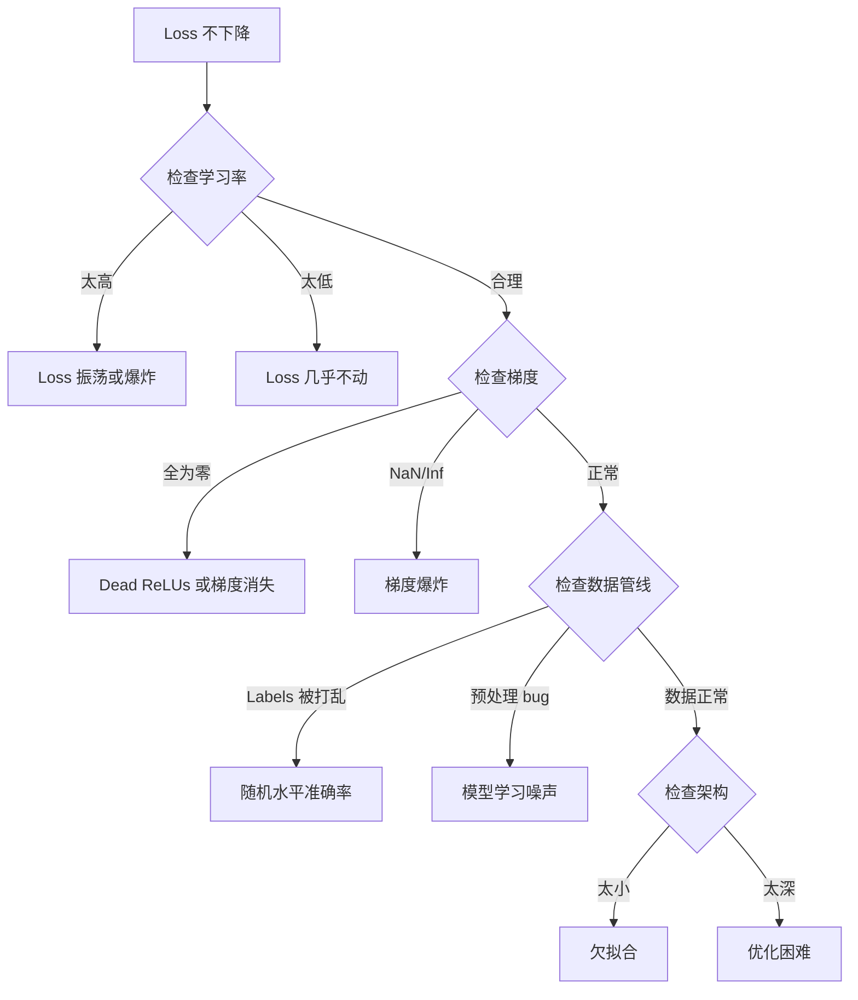
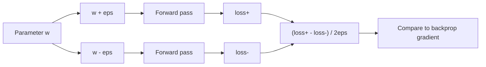
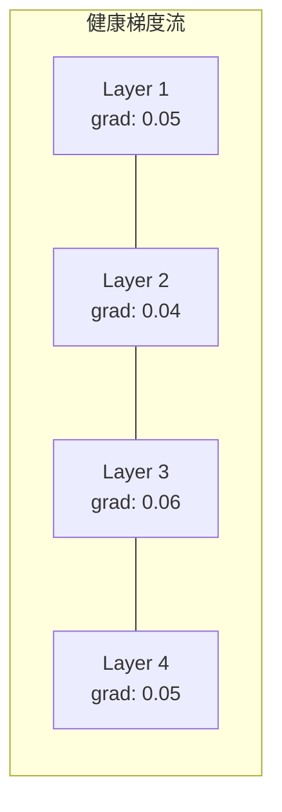
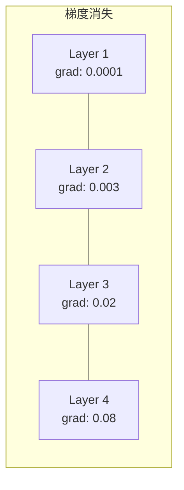
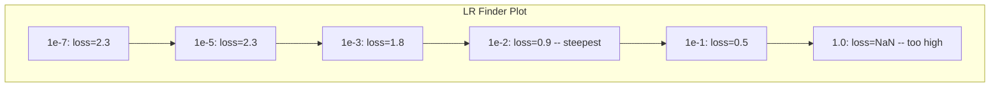

# 调试神经网络

> 你的网络编译通过了。它运行了。它产生了一个数字。这个数字是错的，而且什么都没崩。欢迎来到最难的一类调试：没有错误消息的调试。

**类型：** Practice
**语言：** Python, PyTorch
**先修：** Phase 03 Lessons 01-10（尤其是 backpropagation、loss functions、optimizers）
**时间：** ~90 分钟

## 学习目标

- 使用系统化调试策略诊断常见神经网络失败（NaN loss、平坦 loss 曲线、过拟合、振荡）
- 应用 “overfit one batch” 技术，验证模型架构和训练循环是否正确
- 检查梯度量级、激活分布和权重范数，识别梯度消失/爆炸问题
- 构建覆盖数据管线、模型架构、损失函数、优化器和学习率问题的调试清单

## 问题

传统软件坏掉时会崩溃。空指针会抛异常。类型不匹配会在编译期失败。off-by-one 错误会产生明显错误的输出。

神经网络不会给你这种奢侈。

坏掉的神经网络会运行到结束，打印一个 loss 值，并输出预测。loss 可能下降。预测可能看起来合理。但模型是静默错误的：它可能学到捷径、记住噪声，或者收敛到无用的局部最小值。Google 研究者估计，60-70% 的 ML 调试时间都花在这类“静默” bug 上：它们不产生错误，但会降低模型质量。

工作模型和坏模型之间的差异，常常只是一行放错位置的代码：漏掉的 `zero_grad()`、转置错的维度、差了 10 倍的学习率。经典文章 "Recipe for Training Neural Networks" (2019) 开头就说：“最常见的神经网络错误，是不会崩溃的 bug。”

这一课教你找到这些 bug。

## 概念

### 调试心态

忘掉 print-and-pray 式调试。神经网络调试需要系统化方法，因为反馈循环很慢（一次训练要几分钟到几小时），而症状很模糊（bad loss 可能意味着 20 种不同问题）。

黄金规则：**从简单开始，一次只增加一个复杂度，并独立验证每一块。**



### 症状 1：Loss 不下降

这是最常见的抱怨。训练循环运行，epoch 一个个过去，loss 保持平坦或剧烈振荡。

**学习率错误。** 太高：loss 振荡或跳到 NaN。太低：loss 下降得太慢，看起来像没动。Adam 从 1e-3 开始。SGD 从 1e-1 或 1e-2 开始。在断定是别的问题之前，始终先试 3 个相差 10 倍的学习率（例如 1e-2、1e-3、1e-4）。

**Dead ReLUs。** 如果 ReLU 神经元收到很大的负输入，它输出 0，梯度也是 0。它之后再也不会激活。如果足够多神经元死亡，网络就无法学习。检查方法：打印每个 ReLU 层之后激活值恰好为 0 的比例。如果 >50% 都死了，切换到 LeakyReLU 或降低学习率。

**梯度消失。** 在使用 sigmoid 或 tanh 激活的深层网络中，梯度会在反向传播时指数级缩小。等到到达第一层时，它们约等于 0。前几层停止学习。修复：使用 ReLU/GELU，添加 residual connections，或使用 batch normalization。

**梯度爆炸。** 相反的问题：梯度指数级增长。常见于 RNN 和很深的网络。loss 跳到 NaN。修复：gradient clipping（`torch.nn.utils.clip_grad_norm_`）、降低学习率，或添加 normalization。

### 症状 2：Loss 下降但模型很差

loss 在下降。训练准确率达到 99%。但测试准确率是 55%。或者模型在真实数据上产生荒谬输出。

**过拟合。** 模型记住训练数据，而不是学习模式。训练 loss 和验证 loss 之间的差距随时间扩大。修复：更多数据、dropout、weight decay、early stopping、data augmentation。

**数据泄漏。** 测试数据泄漏进训练。准确率高得可疑。常见原因：切分前 shuffle、用全数据集统计量做预处理、不同 split 中有重复样本。修复：先切分，再预处理，检查重复。

**标签错误。** 大多数真实数据集中有 5-10% 的标签是错的（Northcutt et al., 2021，"Pervasive Label Errors in Test Sets"）。模型会学习这些噪声。修复：使用 confident learning 找出并修复错标样本，或用 loss truncation 忽略高 loss 样本。

### 症状 3：Loss 中出现 NaN 或 Inf

loss 值变成 `nan` 或 `inf`。训练已经死了。

**学习率太高。** 梯度更新越过太远，导致权重爆炸。修复：降低 10 倍。

**log(0) 或 log(负数)。** Cross-entropy loss 会计算 `log(p)`。如果模型输出恰好为 0 或负概率，log 会爆炸。修复：把预测值 clamp 到 `[eps, 1-eps]`，其中 `eps=1e-7`。

**除以零。** Batch normalization 会除以标准差。常数 batch 的 std=0。修复：在分母加 epsilon（PyTorch 默认这样做，但自定义实现可能没有）。

**数值溢出。** 大激活输入 `exp()` 会产生 Inf。Softmax 尤其容易出问题。修复：指数化前减去最大值（log-sum-exp trick）。

### 技术 1：梯度检查

把你的解析梯度（来自 backprop）和数值梯度（来自有限差分）比较。如果它们不一致，backward pass 有 bug。

参数 `w` 的数值梯度：

```text
grad_numerical = (loss(w + eps) - loss(w - eps)) / (2 * eps)
```

一致性度量（相对差异）：

```text
rel_diff = |grad_analytical - grad_numerical| / max(|grad_analytical|, |grad_numerical|, 1e-8)
```

如果 `rel_diff < 1e-5`：正确。如果 `rel_diff > 1e-3`：几乎一定有 bug。



### 技术 2：激活统计

训练期间监控每层之后激活值的均值和标准差。健康网络会维持均值接近 0、标准差接近 1（经过 normalization 后），或者至少保持有界。

| 健康指标 | 均值 | 标准差 | 诊断 |
|----------|------|--------|------|
| 健康 | ~0 | ~1 | 网络正常学习 |
| 饱和 | >>0 或 <<0 | ~0 | 激活卡在极端值 |
| 死亡 | 0 | 0 | 神经元已死亡（全零） |
| 爆炸 | >>10 | >>10 | 激活无界增长 |

### 技术 3：梯度流可视化

绘制每一层的平均梯度量级。健康网络中，各层梯度量级应该大致相似。如果早期层梯度比后期层小 1000 倍，你就遇到了梯度消失。





### 技术 4：Overfit-One-Batch 测试

这是深度学习中最重要的单个调试技术。

取一个小 batch（8-32 个样本）。在它上面训练 100+ 次迭代。loss 应该接近 0，训练准确率应该达到 100%。如果没有做到，你的模型或训练循环有根本 bug，不要继续完整训练。

这个测试能抓出：
- 损坏的损失函数
- 损坏的 backward pass
- 架构太小，无法表示数据
- 优化器没有连接到模型参数
- 数据和标签错位

它 30 秒就能跑完，却能节省数小时完整训练调试时间。

### 技术 5：学习率查找器

Leslie Smith (2017) 提出：在一个 epoch 内把学习率从很小（1e-7）扫到很大（10），同时记录 loss。绘制 loss vs learning rate。最优学习率大约比 loss 开始最快下降的学习率小 10 倍。



这个例子中的最佳 LR：约 1e-3，也就是最陡点前一个数量级。

### 常见 PyTorch Bugs

这些 bug 浪费了 PyTorch 社区最多的集体时间：

| Bug | 症状 | 修复 |
|-----|------|------|
| 忘记 `optimizer.zero_grad()` | 梯度跨 batch 累积，loss 振荡 | 在 `loss.backward()` 前添加 `optimizer.zero_grad()` |
| 测试时忘记 `model.eval()` | Dropout 和 batch norm 行为不同，test accuracy 每次不同 | 添加 `model.eval()` 和 `torch.no_grad()` |
| Tensor shapes 错误 | 静默 broadcasting 产生错误结果，没有报错 | 调试时在每个操作后打印 shapes |
| CPU/GPU 不匹配 | `RuntimeError: expected CUDA tensor` | 对 model 和 data 都使用 `.to(device)` |
| 没有 detach tensors | Computation graph 永远增长，OOM | 使用 `.detach()` 或 `with torch.no_grad()` |
| In-place operations 破坏 autograd | `RuntimeError: modified by in-place operation` | 用 `x = x + 1` 替换 `x += 1` |
| 数据未 normalized | Loss 卡在随机水平 | 把输入 normalize 到 mean=0、std=1 |
| Labels dtype 错误 | Cross-entropy 期望 `Long`，却收到 `Float` | 转换标签：`labels.long()` |

### 总调试表

| 症状 | 可能原因 | 第一件要尝试的事 |
|------|----------|------------------|
| Loss 卡在 -log(1/num_classes) | 模型预测均匀分布 | 检查数据管线，验证 labels 和 inputs 匹配 |
| Loss 几步后 NaN | 学习率太高 | LR 降低 10 倍 |
| Loss 立刻 NaN | log(0) 或除以零 | 给 log/division 操作添加 epsilon |
| Loss 剧烈振荡 | LR 太高或 batch size 太小 | 降低 LR，增大 batch size |
| Loss 下降后 plateau | LR 对微调阶段太高 | 添加 LR schedule（cosine 或 step decay） |
| Training acc 高、test acc 低 | 过拟合 | 添加 dropout、weight decay、更多数据 |
| Training acc = test acc = chance | 模型什么都没学到 | 运行 overfit-one-batch 测试 |
| Training acc = test acc 但都很低 | 欠拟合 | 更大模型、更多层、更多特征 |
| 梯度全为零 | Dead ReLUs 或 detached computation graph | 切换到 LeakyReLU，检查 `.requires_grad` |
| 训练时内存不足 | Batch 太大或 graph 没释放 | 减小 batch size，eval 时使用 `torch.no_grad()` |

## 构建它

一个诊断工具包，用于监控激活、梯度和 loss 曲线。你会故意破坏一个网络，并使用工具包诊断每个问题。

### 第 1 步：NetworkDebugger 类

挂接到 PyTorch 模型中，记录每层的激活和梯度统计。

```python
import torch
import torch.nn as nn
import math


class NetworkDebugger:
    def __init__(self, model):
        self.model = model
        self.activation_stats = {}
        self.gradient_stats = {}
        self.loss_history = []
        self.lr_losses = []
        self.hooks = []
        self._register_hooks()

    def _register_hooks(self):
        for name, module in self.model.named_modules():
            if isinstance(module, (nn.Linear, nn.Conv2d, nn.ReLU, nn.LeakyReLU)):
                hook = module.register_forward_hook(self._make_activation_hook(name))
                self.hooks.append(hook)
                hook = module.register_full_backward_hook(self._make_gradient_hook(name))
                self.hooks.append(hook)

    def _make_activation_hook(self, name):
        def hook(module, input, output):
            with torch.no_grad():
                out = output.detach().float()
                self.activation_stats[name] = {
                    "mean": out.mean().item(),
                    "std": out.std().item(),
                    "fraction_zero": (out == 0).float().mean().item(),
                    "min": out.min().item(),
                    "max": out.max().item(),
                }
        return hook

    def _make_gradient_hook(self, name):
        def hook(module, grad_input, grad_output):
            if grad_output[0] is not None:
                with torch.no_grad():
                    grad = grad_output[0].detach().float()
                    self.gradient_stats[name] = {
                        "mean": grad.mean().item(),
                        "std": grad.std().item(),
                        "abs_mean": grad.abs().mean().item(),
                        "max": grad.abs().max().item(),
                    }
        return hook

    def record_loss(self, loss_value):
        self.loss_history.append(loss_value)

    def check_loss_health(self):
        if len(self.loss_history) < 2:
            return "NOT_ENOUGH_DATA"
        recent = self.loss_history[-10:]
        if any(math.isnan(v) or math.isinf(v) for v in recent):
            return "NAN_OR_INF"
        if len(self.loss_history) >= 20:
            first_half = sum(self.loss_history[:10]) / 10
            second_half = sum(self.loss_history[-10:]) / 10
            if second_half >= first_half * 0.99:
                return "NOT_DECREASING"
        if len(recent) >= 5:
            diffs = [recent[i+1] - recent[i] for i in range(len(recent)-1)]
            if max(diffs) - min(diffs) > 2 * abs(sum(diffs) / len(diffs)):
                return "OSCILLATING"
        return "HEALTHY"

    def check_activations(self):
        issues = []
        for name, stats in self.activation_stats.items():
            if stats["fraction_zero"] > 0.5:
                issues.append(f"DEAD_NEURONS: {name} has {stats['fraction_zero']:.0%} zero activations")
            if abs(stats["mean"]) > 10:
                issues.append(f"EXPLODING_ACTIVATIONS: {name} mean={stats['mean']:.2f}")
            if stats["std"] < 1e-6:
                issues.append(f"COLLAPSED_ACTIVATIONS: {name} std={stats['std']:.2e}")
        return issues if issues else ["HEALTHY"]

    def check_gradients(self):
        issues = []
        grad_magnitudes = []
        for name, stats in self.gradient_stats.items():
            grad_magnitudes.append((name, stats["abs_mean"]))
            if stats["abs_mean"] < 1e-7:
                issues.append(f"VANISHING_GRADIENT: {name} abs_mean={stats['abs_mean']:.2e}")
            if stats["abs_mean"] > 100:
                issues.append(f"EXPLODING_GRADIENT: {name} abs_mean={stats['abs_mean']:.2e}")
        if len(grad_magnitudes) >= 2:
            first_mag = grad_magnitudes[0][1]
            last_mag = grad_magnitudes[-1][1]
            if last_mag > 0 and first_mag / last_mag > 100:
                issues.append(f"GRADIENT_RATIO: first/last = {first_mag/last_mag:.0f}x (vanishing)")
        return issues if issues else ["HEALTHY"]

    def print_report(self):
        print("\n=== NETWORK DEBUGGER REPORT ===")
        print(f"\nLoss health: {self.check_loss_health()}")
        if self.loss_history:
            print(f"  Last 5 losses: {[f'{v:.4f}' for v in self.loss_history[-5:]]}")
        print("\nActivation diagnostics:")
        for item in self.check_activations():
            print(f"  {item}")
        print("\nGradient diagnostics:")
        for item in self.check_gradients():
            print(f"  {item}")
        print("\nPer-layer activation stats:")
        for name, stats in self.activation_stats.items():
            print(f"  {name}: mean={stats['mean']:.4f} std={stats['std']:.4f} zero={stats['fraction_zero']:.1%}")
        print("\nPer-layer gradient stats:")
        for name, stats in self.gradient_stats.items():
            print(f"  {name}: abs_mean={stats['abs_mean']:.2e} max={stats['max']:.2e}")

    def remove_hooks(self):
        for hook in self.hooks:
            hook.remove()
        self.hooks.clear()
```

### 第 2 步：Overfit-One-Batch 测试

```python
def overfit_one_batch(model, x_batch, y_batch, criterion, lr=0.01, steps=200):
    optimizer = torch.optim.Adam(model.parameters(), lr=lr)
    model.train()
    print("\n=== OVERFIT ONE BATCH TEST ===")
    print(f"Batch size: {x_batch.shape[0]}, Steps: {steps}")

    for step in range(steps):
        optimizer.zero_grad()
        output = model(x_batch)
        loss = criterion(output, y_batch)
        loss.backward()
        optimizer.step()

        if step % 50 == 0 or step == steps - 1:
            with torch.no_grad():
                preds = (output > 0).float() if output.shape[-1] == 1 else output.argmax(dim=1)
                targets = y_batch if y_batch.dim() == 1 else y_batch.squeeze()
                acc = (preds.squeeze() == targets).float().mean().item()
            print(f"  Step {step:3d} | Loss: {loss.item():.6f} | Accuracy: {acc:.1%}")

    final_loss = loss.item()
    if final_loss > 0.1:
        print(f"\n  FAIL: Loss did not converge ({final_loss:.4f}). Model or training loop is broken.")
        return False
    print(f"\n  PASS: Loss converged to {final_loss:.6f}")
    return True
```

### 第 3 步：学习率查找器

```python
def find_learning_rate(model, x_data, y_data, criterion, start_lr=1e-7, end_lr=10, steps=100):
    import copy
    original_state = copy.deepcopy(model.state_dict())
    optimizer = torch.optim.SGD(model.parameters(), lr=start_lr)
    lr_mult = (end_lr / start_lr) ** (1 / steps)

    model.train()
    results = []
    best_loss = float("inf")
    current_lr = start_lr

    print("\n=== LEARNING RATE FINDER ===")

    for step in range(steps):
        optimizer.zero_grad()
        output = model(x_data)
        loss = criterion(output, y_data)

        if math.isnan(loss.item()) or loss.item() > best_loss * 10:
            break

        best_loss = min(best_loss, loss.item())
        results.append((current_lr, loss.item()))

        loss.backward()
        optimizer.step()

        current_lr *= lr_mult
        for param_group in optimizer.param_groups:
            param_group["lr"] = current_lr

    model.load_state_dict(original_state)

    if len(results) < 10:
        print("  Could not complete LR sweep -- loss diverged too quickly")
        return results

    min_loss_idx = min(range(len(results)), key=lambda i: results[i][1])
    suggested_lr = results[max(0, min_loss_idx - 10)][0]

    print(f"  Swept {len(results)} steps from {start_lr:.0e} to {results[-1][0]:.0e}")
    print(f"  Minimum loss {results[min_loss_idx][1]:.4f} at lr={results[min_loss_idx][0]:.2e}")
    print(f"  Suggested learning rate: {suggested_lr:.2e}")

    return results
```

### 第 4 步：梯度检查器

```python
def _flat_to_multi_index(flat_idx, shape):
    multi_idx = []
    remaining = flat_idx
    for dim in reversed(shape):
        multi_idx.insert(0, remaining % dim)
        remaining //= dim
    return tuple(multi_idx)


def gradient_check(model, x, y, criterion, eps=1e-4):
    model.train()
    x_double = x.double()
    y_double = y.double()
    model_double = model.double()

    print("\n=== GRADIENT CHECK ===")
    overall_max_diff = 0
    checked = 0

    for name, param in model_double.named_parameters():
        if not param.requires_grad:
            continue

        layer_max_diff = 0

        model_double.zero_grad()
        output = model_double(x_double)
        loss = criterion(output, y_double)
        loss.backward()
        analytical_grad = param.grad.clone()

        num_checks = min(5, param.numel())
        for i in range(num_checks):
            idx = _flat_to_multi_index(i, param.shape)
            original = param.data[idx].item()

            param.data[idx] = original + eps
            with torch.no_grad():
                loss_plus = criterion(model_double(x_double), y_double).item()

            param.data[idx] = original - eps
            with torch.no_grad():
                loss_minus = criterion(model_double(x_double), y_double).item()

            param.data[idx] = original

            numerical = (loss_plus - loss_minus) / (2 * eps)
            analytical = analytical_grad[idx].item()

            denom = max(abs(numerical), abs(analytical), 1e-8)
            rel_diff = abs(numerical - analytical) / denom

            layer_max_diff = max(layer_max_diff, rel_diff)
            checked += 1

        overall_max_diff = max(overall_max_diff, layer_max_diff)
        status = "OK" if layer_max_diff < 1e-5 else "MISMATCH"
        print(f"  {name}: max_rel_diff={layer_max_diff:.2e} [{status}]")

    model.float()

    print(f"\n  Checked {checked} parameters")
    if overall_max_diff < 1e-5:
        print("  PASS: Gradients match (rel_diff < 1e-5)")
    elif overall_max_diff < 1e-3:
        print("  WARN: Small differences (1e-5 < rel_diff < 1e-3)")
    else:
        print("  FAIL: Gradient mismatch detected (rel_diff > 1e-3)")
    return overall_max_diff
```

### 第 5 步：故意破坏的网络

现在把工具包应用到坏网络上，诊断每一个问题。

```python
def demo_broken_networks():
    torch.manual_seed(42)
    x = torch.randn(64, 10)
    y = (x[:, 0] > 0).long()

    print("\n" + "=" * 60)
    print("BUG 1: Learning rate too high (lr=10)")
    print("=" * 60)
    model1 = nn.Sequential(nn.Linear(10, 32), nn.ReLU(), nn.Linear(32, 2))
    debugger1 = NetworkDebugger(model1)
    optimizer1 = torch.optim.SGD(model1.parameters(), lr=10.0)
    criterion = nn.CrossEntropyLoss()
    for step in range(20):
        optimizer1.zero_grad()
        out = model1(x)
        loss = criterion(out, y)
        debugger1.record_loss(loss.item())
        loss.backward()
        optimizer1.step()
    debugger1.print_report()
    debugger1.remove_hooks()

    print("\n" + "=" * 60)
    print("BUG 2: Dead ReLUs from bad initialization")
    print("=" * 60)
    model2 = nn.Sequential(nn.Linear(10, 32), nn.ReLU(), nn.Linear(32, 32), nn.ReLU(), nn.Linear(32, 2))
    with torch.no_grad():
        for m in model2.modules():
            if isinstance(m, nn.Linear):
                m.weight.fill_(-1.0)
                m.bias.fill_(-5.0)
    debugger2 = NetworkDebugger(model2)
    optimizer2 = torch.optim.Adam(model2.parameters(), lr=1e-3)
    for step in range(50):
        optimizer2.zero_grad()
        out = model2(x)
        loss = criterion(out, y)
        debugger2.record_loss(loss.item())
        loss.backward()
        optimizer2.step()
    debugger2.print_report()
    debugger2.remove_hooks()

    print("\n" + "=" * 60)
    print("BUG 3: Missing zero_grad (gradients accumulate)")
    print("=" * 60)
    model3 = nn.Sequential(nn.Linear(10, 32), nn.ReLU(), nn.Linear(32, 2))
    debugger3 = NetworkDebugger(model3)
    optimizer3 = torch.optim.SGD(model3.parameters(), lr=0.01)
    for step in range(50):
        out = model3(x)
        loss = criterion(out, y)
        debugger3.record_loss(loss.item())
        loss.backward()
        optimizer3.step()
    debugger3.print_report()
    debugger3.remove_hooks()

    print("\n" + "=" * 60)
    print("HEALTHY NETWORK: Correct setup for comparison")
    print("=" * 60)
    model_good = nn.Sequential(nn.Linear(10, 32), nn.ReLU(), nn.Linear(32, 2))
    debugger_good = NetworkDebugger(model_good)
    optimizer_good = torch.optim.Adam(model_good.parameters(), lr=1e-3)
    for step in range(50):
        optimizer_good.zero_grad()
        out = model_good(x)
        loss = criterion(out, y)
        debugger_good.record_loss(loss.item())
        loss.backward()
        optimizer_good.step()
    debugger_good.print_report()
    debugger_good.remove_hooks()

    print("\n" + "=" * 60)
    print("OVERFIT-ONE-BATCH TEST (healthy model)")
    print("=" * 60)
    model_test = nn.Sequential(nn.Linear(10, 32), nn.ReLU(), nn.Linear(32, 2))
    overfit_one_batch(model_test, x[:8], y[:8], criterion)

    print("\n" + "=" * 60)
    print("LEARNING RATE FINDER")
    print("=" * 60)
    model_lr = nn.Sequential(nn.Linear(10, 32), nn.ReLU(), nn.Linear(32, 2))
    find_learning_rate(model_lr, x, y, criterion)

    print("\n" + "=" * 60)
    print("GRADIENT CHECK")
    print("=" * 60)
    model_grad = nn.Sequential(nn.Linear(10, 8), nn.ReLU(), nn.Linear(8, 2))
    gradient_check(model_grad, x[:4], y[:4], criterion)
```

## 使用它

### PyTorch 内置工具

```python
import torch
import torch.nn as nn

model = nn.Sequential(
    nn.Linear(768, 256),
    nn.ReLU(),
    nn.Linear(256, 10),
)

with torch.autograd.detect_anomaly():
    output = model(input_tensor)
    loss = criterion(output, target)
    loss.backward()

for name, param in model.named_parameters():
    if param.grad is not None:
        print(f"{name}: grad_mean={param.grad.abs().mean():.2e}")
```

### Weights & Biases 集成

```python
import wandb

wandb.init(project="debug-training")

for epoch in range(100):
    loss = train_one_epoch()
    wandb.log({
        "loss": loss,
        "lr": optimizer.param_groups[0]["lr"],
        "grad_norm": torch.nn.utils.clip_grad_norm_(model.parameters(), float("inf")),
    })

    for name, param in model.named_parameters():
        if param.grad is not None:
            wandb.log({f"grad/{name}": wandb.Histogram(param.grad.cpu().numpy())})
```

### TensorBoard

```python
from torch.utils.tensorboard import SummaryWriter

writer = SummaryWriter("runs/debug_experiment")

for epoch in range(100):
    loss = train_one_epoch()
    writer.add_scalar("Loss/train", loss, epoch)

    for name, param in model.named_parameters():
        writer.add_histogram(f"weights/{name}", param, epoch)
        if param.grad is not None:
            writer.add_histogram(f"gradients/{name}", param.grad, epoch)
```

### 调试清单（完整训练之前）

1. 运行 overfit-one-batch 测试。如果失败，停止。
2. 打印模型摘要，验证参数量合理。
3. 用随机数据运行一次 forward pass，检查输出 shape。
4. 训练 5 个 epoch，验证 loss 下降。
5. 检查激活统计：没有死层，没有爆炸。
6. 检查梯度流：没有消失，没有爆炸。
7. 验证数据管线：打印 5 个随机样本和标签。

## 交付它

本课产出：
- `outputs/prompt-nn-debugger.md`：一个用于诊断神经网络训练失败的提示词
- `outputs/skill-debug-checklist.md`：一个用于调试训练问题的决策树清单

调试部署的关键模式：
- 给生产训练脚本添加 monitoring hooks
- 每 N step 把激活和梯度统计记录到 W&B 或 TensorBoard
- 为 NaN loss、死神经元（>80% 为零）或梯度爆炸实现自动告警
- 每次更改架构或数据管线时，都运行 overfit-one-batch 测试

## 练习

1. **添加梯度爆炸检测器。** 修改 `NetworkDebugger`，让它检测梯度超过阈值的情况，并自动建议 gradient clipping 值。在一个没有 normalization 的 20 层网络上测试。

2. **构建 dead neuron resurrector。** 写一个函数，识别已经死亡的 ReLU 神经元（总是输出 0），并用 Kaiming initialization 重新初始化它们的 incoming weights。展示它如何恢复一个 >70% 神经元死亡的网络。

3. **实现带绘图的学习率查找器。** 扩展 `find_learning_rate`，把结果保存为 CSV，并写一个单独脚本读取 CSV，用 matplotlib 展示 LR vs loss 曲线。找出 CIFAR-10 上 ResNet-18 的最优 LR。

4. **创建数据管线验证器。** 写一个函数检查：train/test split 间是否有重复样本、标签分布是否不平衡（>10:1 比例）、输入 normalization（mean 接近 0、std 接近 1），以及数据中的 NaN/Inf。用一个故意破坏的数据集运行它。

5. **调试真实失败。** 拿 Lesson 10 的 mini-framework，引入一个微妙 bug（例如在 backward 中转置权重矩阵），并用 gradient checking 精确定位哪个参数梯度错误。记录调试过程。

## 关键术语

| 术语 | 人们常说 | 实际含义 |
|------|----------|----------|
| 静默 bug | “它能跑但结果不好” | 不产生错误但降低模型质量的 bug，是 ML 中最主要的失败模式 |
| Dead ReLU | “神经元死了” | 输入总为负的 ReLU 神经元，因此输出 0，并永久收到 0 梯度 |
| 梯度消失 | “早期层停止学习” | 梯度穿过层时指数级缩小，让早期层权重几乎冻结 |
| 梯度爆炸 | “Loss 变成 NaN” | 梯度穿过层时指数级增长，导致权重更新大到溢出 |
| 梯度检查 | “验证 backprop 是否正确” | 比较 backprop 得到的解析梯度和有限差分得到的数值梯度 |
| Overfit-one-batch | “最重要的调试测试” | 在单个小 batch 上训练，验证模型是否有能力学习；如果不能，说明有根本问题 |
| LR finder | “扫一遍找到合适学习率” | 在一个 epoch 内指数增加学习率，并选择 loss 发散前的学习率 |
| 数据泄漏 | “测试数据泄漏进训练” | 测试集信息污染训练，产生虚高准确率 |
| 激活统计 | “监控层健康” | 跟踪每层输出的 mean、std 和 zero-fraction，检测死亡、饱和或爆炸神经元 |
| Gradient clipping | “限制梯度量级” | 当梯度范数超过阈值时缩小梯度，防止梯度爆炸更新 |

## 延伸阅读

- Smith, "Cyclical Learning Rates for Training Neural Networks" (2017)：提出 learning rate range test（LR finder）的论文
- Northcutt et al., "Pervasive Label Errors in Test Sets Destabilize Machine Learning Benchmarks" (2021)：证明 ImageNet、CIFAR-10 和其他主要 benchmark 中有 3-6% 标签是错的
- Zhang et al., "Understanding Deep Learning Requires Rethinking Generalization" (2017)：展示神经网络可以记住随机标签的论文，这也是 overfit-one-batch 测试有效的原因
- PyTorch 关于 `torch.autograd.detect_anomaly` 和 `torch.autograd.set_detect_anomaly` 的文档：内置 NaN/Inf 检测
