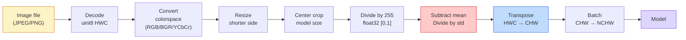
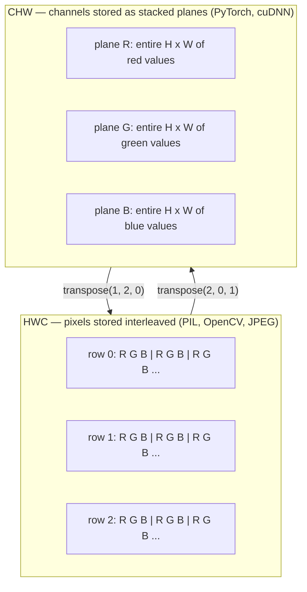

# 图像基础：像素、通道与色彩空间

> 图像是光采样组成的张量。你以后用到的每个视觉模型，都从这个事实开始。

**类型：** Vision  
**语言：** Python  
**前置知识：** Phase 0-3  
**时间：** 约 60-90 分钟

## 学习目标

- 图像在模型中通常表示为 `H x W x C` 或 `C x H x W` tensor。
- 像素值范围、dtype、归一化和色彩空间会直接影响模型表现。
- RGB、grayscale、HSV 等色彩空间适合不同视觉任务。
- resize、crop、padding 和 interpolation 会改变空间信息。
- 视觉 pipeline 的第一类 bug 往往来自通道顺序、归一化或 shape 不一致。

## 问题

本课是 Phase 4 计算机视觉的一部分。目标是把图像、视频和三维场景都看成可以被模型处理的张量、序列或几何结构，并理解每个视觉系统从输入、预处理、模型、后处理到评估的完整链路。

学习时请始终追踪四件事：输入 shape 是什么，空间信息如何变化，模型输出如何解释，指标是否真的对应任务目标。

## 核心概念

1. 图像在模型中通常表示为 `H x W x C` 或 `C x H x W` tensor。
2. 像素值范围、dtype、归一化和色彩空间会直接影响模型表现。
3. RGB、grayscale、HSV 等色彩空间适合不同视觉任务。
4. resize、crop、padding 和 interpolation 会改变空间信息。
5. 视觉 pipeline 的第一类 bug 往往来自通道顺序、归一化或 shape 不一致。

## 动手构建

按照本课 `code/` 目录运行示例。先用小图像、小 batch 或小 feature map 验证 shape，再扩展到真实数据。视觉模型的很多错误不是算法错，而是通道顺序、归一化、坐标系、mask 对齐、box 格式或后处理阈值错。

建议流程：

1. 打印输入 image/tensor 的 shape、dtype、value range 和 channel order。
2. 跟踪每个 stage 的空间尺寸变化。
3. 可视化中间结果，例如 feature map、box、mask、heatmap、depth 或 retrieval neighbors。
4. 使用任务对应指标评估，不只看 loss。
5. 做错误样本分析，确认失败来自数据、模型、后处理还是指标。

## 关键代码与公式片段

以下片段保留自英文原文，便于直接复制运行或对照数学符号。



```text
Continuous scene                 Sensor grid                     Digital image
(infinite detail)                (H x W detectors)               (H x W integers)

    ~~~~~                        +--+--+--+--+--+                 210 198 180 155 120
   ~   ~   ~                     |  |  |  |  |  |                 205 195 178 152 118
  ~ light ~      ---->           +--+--+--+--+--+     ---->       200 190 175 150 115
   ~~~~~                         |  |  |  |  |  |                 195 185 170 148 112
                                 +--+--+--+--+--+                 188 180 165 145 108
```

```text
One pixel in memory:

    (R, G, B) = (210, 140, 30)   <- reddish-orange

An H x W RGB image:

    shape (H, W, 3)     stored as   H rows of W pixels of 3 values
                                    each in [0, 255] for uint8
```

```text
HWC (height, width, channels)           CHW (channels, height, width)

   W ->                                    H ->
  +-----+-----+-----+                     +-----+-----+
H |R G B|R G B|R G B|                   C |R R R R R R|
| +-----+-----+-----+                   | +-----+-----+
v |R G B|R G B|R G B|                   v |G G G G G G|
  +-----+-----+-----+                     +-----+-----+
                                          |B B B B B B|
                                          +-----+-----+

   PIL, OpenCV, matplotlib,              PyTorch, most deep learning
   almost every image file on disk       frameworks, cuDNN kernels
```

```text
img_chw = img_hwc.transpose(2, 0, 1)      # NumPy
img_chw = img_hwc.permute(2, 0, 1)        # PyTorch tensor
```



```text
 RGB               HSV                       YCbCr / YUV

 R red             H hue (angle 0-360)       Y luminance (brightness)
 G green           S saturation (0-1)        Cb chroma blue-yellow
 B blue            V value/brightness (0-1)  Cr chroma red-green

 Linear to         Separates color from      Separates brightness from
 sensor output     brightness. Useful for    color. JPEG and most video
                   color thresholding, UI    codecs compress the chroma
                   sliders, simple filters   channels harder because the
                                             human eye is less sensitive
                                             to chroma detail than to Y.
```

```text
Y = 0.299 R + 0.587 G + 0.114 B       (ITU-R BT.601, the classic weights)
```

```text
Nearest neighbour     fastest, blocky, only choice for masks/labels
Bilinear              fast, smooth, default for most image resizing
Bicubic               slower, sharper on upscaling
Lanczos               slowest, best quality, used for final display
```

```python
import numpy as np
from PIL import Image

def synthetic_rgb(h=128, w=192, seed=0):
    rng = np.random.default_rng(seed)
    yy, xx = np.meshgrid(np.linspace(0, 1, h), np.linspace(0, 1, w), indexing="ij")
    r = (np.sin(xx * 6) * 0.5 + 0.5) * 255
    g = yy * 255
    b = (1 - yy) * xx * 255
    rgb = np.stack([r, g, b], axis=-1) + rng.normal(0, 6, (h, w, 3))
    return np.clip(rgb, 0, 255).astype(np.uint8)

arr = synthetic_rgb()
# Or load from disk:
# arr = np.asarray(Image.open("your_image.jpg").convert("RGB"))

print(f"type:   {type(arr).__name__}")
print(f"dtype:  {arr.dtype}")
print(f"shape:  {arr.shape}     # (H, W, C)")
print(f"min:    {arr.min()}")
print(f"max:    {arr.max()}")
print(f"pixel at (0, 0): {arr[0, 0]}")
```

> 英文原文还包含 5 个代码/公式块；中文正文保留关键片段，完整实现见本课 `code/` 目录。


## 使用它

完成本课后，你应该能把相关视觉算法放进真实 pipeline，并用 shape、可视化和指标定位问题。对于生产系统，还要同时考虑 latency、memory、数据漂移、标注质量和后处理稳定性。

## 练习

1. 用一张小图或一个小 tensor 复现本课核心运算。
2. 打印并解释每个中间结果的 shape。
3. 可视化至少一个模型输出或中间表示。
4. 完成 `quiz.zh-CN.json` 中的测验，并回到英文原文核对术语。

## 关键术语

| 术语 | 中文理解 | 视觉任务中的作用 |
|------|----------|------------------|
| pixel | 像素 | 图像的基本采样单位 |
| channel | 通道 | RGB、mask、depth 或 feature map 的维度 |
| feature map | 特征图 | CNN/ViT 中间空间表示 |
| annotation | 标注 | 类别、box、mask、keypoint 或 depth ground truth |
| postprocessing | 后处理 | NMS、threshold、decode、resize、tracking 等输出整理步骤 |
| metric | 指标 | 衡量分类、检测、分割、检索或生成质量 |
