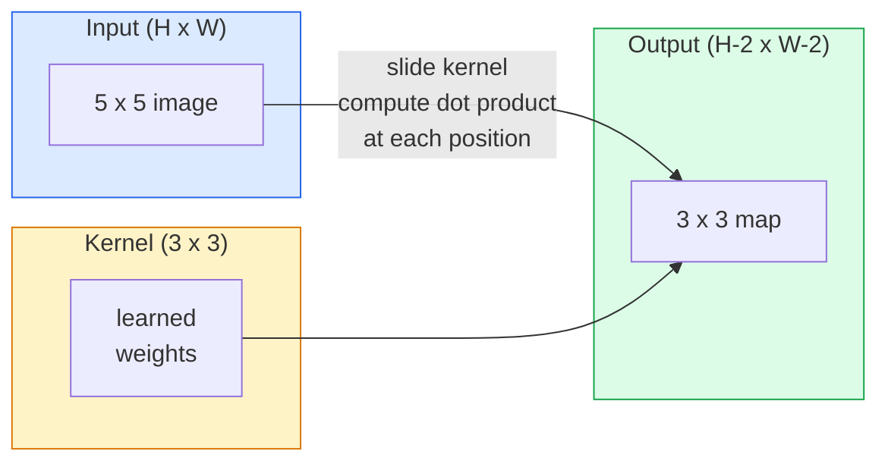
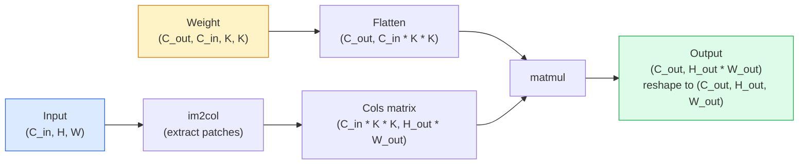

# 从零实现卷积

> 卷积就是在图像上滑动的小型 dense layer，并在每个位置共享同一组权重。

**类型：** Vision  
**语言：** Python  
**前置知识：** Phase 0-3  
**时间：** 约 60-90 分钟

## 学习目标

- convolution 用局部 receptive field 提取空间模式。
- kernel、stride、padding 和 dilation 决定输出 feature map shape。
- 权重共享让卷积比全连接层更适合图像。
- 多通道卷积会同时聚合空间和通道信息。
- 从零实现卷积可以帮助调试 CNN 中的 shape mismatch。

## 问题

本课是 Phase 4 计算机视觉的一部分。目标是把图像、视频和三维场景都看成可以被模型处理的张量、序列或几何结构，并理解每个视觉系统从输入、预处理、模型、后处理到评估的完整链路。

学习时请始终追踪四件事：输入 shape 是什么，空间信息如何变化，模型输出如何解释，指标是否真的对应任务目标。

## 核心概念

1. convolution 用局部 receptive field 提取空间模式。
2. kernel、stride、padding 和 dilation 决定输出 feature map shape。
3. 权重共享让卷积比全连接层更适合图像。
4. 多通道卷积会同时聚合空间和通道信息。
5. 从零实现卷积可以帮助调试 CNN 中的 shape mismatch。

## 动手构建

按照本课 `code/` 目录运行示例。先用小图像、小 batch 或小 feature map 验证 shape，再扩展到真实数据。视觉模型的很多错误不是算法错，而是通道顺序、归一化、坐标系、mask 对齐、box 格式或后处理阈值错。

建议流程：

1. 打印输入 image/tensor 的 shape、dtype、value range 和 channel order。
2. 跟踪每个 stage 的空间尺寸变化。
3. 可视化中间结果，例如 feature map、box、mask、heatmap、depth 或 retrieval neighbors。
4. 使用任务对应指标评估，不只看 loss。
5. 做错误样本分析，确认失败来自数据、模型、后处理还是指标。

## 关键代码与公式片段

以下片段保留自英文原文，便于直接复制运行或对照数学符号。



```text
Input X (5 x 5):                Kernel W (3 x 3):

  1  2  0  1  2                   1  0 -1
  0  1  3  1  0                   2  0 -2
  2  1  0  2  1                   1  0 -1
  1  0  2  1  3
  2  1  1  0  1

The kernel slides across every valid 3 x 3 window. Output Y is 3 x 3:

 Y[0,0] = sum( W * X[0:3, 0:3] )
 Y[0,1] = sum( W * X[0:3, 1:4] )
 Y[0,2] = sum( W * X[0:3, 2:5] )
 Y[1,0] = sum( W * X[1:4, 0:3] )
 ... and so on
```

```text
H_out = floor( (H - K + 2P) / S ) + 1
```

```text
Zero padding (P = 1) on a 5 x 5 input:

  0  0  0  0  0  0  0
  0  1  2  0  1  2  0
  0  0  1  3  1  0  0
  0  2  1  0  2  1  0       Now the kernel can centre on pixel
  0  1  0  2  1  3  0       (0, 0) and still have three rows and
  0  2  1  1  0  1  0       three columns of values to multiply.
  0  0  0  0  0  0  0
```

```text
Stride 1 on a 5 x 5 input, 3 x 3 kernel:

  starts: (0,0) (0,1) (0,2)        -> output row 0
          (1,0) (1,1) (1,2)        -> output row 1
          (2,0) (2,1) (2,2)        -> output row 2

  Output: 3 x 3

Stride 2 on the same input:

  starts: (0,0) (0,2)              -> output row 0
          (2,0) (2,2)              -> output row 1

  Output: 2 x 2
```

```text
Input:   (C_in,  H,  W)        3 x 5 x 5
Kernel:  (C_in,  K,  K)        3 x 3 x 3 (one kernel)
Output:  (1,     H', W')       2D map

For a layer that produces C_out output channels, you stack C_out kernels:

Weight:  (C_out, C_in, K, K)   e.g. 64 x 3 x 3 x 3
Output:  (C_out, H', W')       64 x 3 x 3

Parameter count: C_out * C_in * K * K + C_out   (the + C_out is biases)
```



```text
RF after L stacked K x K convs (stride 1) = 1 + L * (K - 1)

With strides:   RF grows multiplicatively with stride along each layer.
```

```python
import numpy as np

def pad2d(x, p):
    if p == 0:
        return x
    h, w = x.shape[-2:]
    out = np.zeros(x.shape[:-2] + (h + 2 * p, w + 2 * p), dtype=x.dtype)
    out[..., p:p + h, p:p + w] = x
    return out

x = np.arange(9).reshape(3, 3)
print(x)
print()
print(pad2d(x, 1))
```

```python
def conv2d_naive(x, w, b=None, stride=1, padding=0):
    c_in, h, w_in = x.shape
    c_out, c_in_w, kh, kw = w.shape
    assert c_in == c_in_w

    x_pad = pad2d(x, padding)
    h_out = (h + 2 * padding - kh) // stride + 1
    w_out = (w_in + 2 * padding - kw) // stride + 1

    out = np.zeros((c_out, h_out, w_out), dtype=np.float32)
    for oc in range(c_out):
        for i in range(h_out):
            for j in range(w_out):
                hs = i * stride
                ws = j * stride
                patch = x_pad[:, hs:hs + kh, ws:ws + kw]
                out[oc, i, j] = np.sum(patch * w[oc])
        if b is not None:
            out[oc] += b[oc]
    return out
```

> 英文原文还包含 6 个代码/公式块；中文正文保留关键片段，完整实现见本课 `code/` 目录。


## 使用它

完成本课后，你应该能把相关视觉算法放进真实 pipeline，并用 shape、可视化和指标定位问题。对于生产系统，还要同时考虑 latency、memory、数据漂移、标注质量和后处理稳定性。

## 练习

1. 用一张小图或一个小 tensor 复现本课核心运算。
2. 打印并解释每个中间结果的 shape。
3. 可视化至少一个模型输出或中间表示。
4. 完成 `quiz.zh-CN.json` 中的测验，并回到英文原文核对术语。

## 关键术语

| 术语 | 中文理解 | 视觉任务中的作用 |
|------|----------|------------------|
| pixel | 像素 | 图像的基本采样单位 |
| channel | 通道 | RGB、mask、depth 或 feature map 的维度 |
| feature map | 特征图 | CNN/ViT 中间空间表示 |
| annotation | 标注 | 类别、box、mask、keypoint 或 depth ground truth |
| postprocessing | 后处理 | NMS、threshold、decode、resize、tracking 等输出整理步骤 |
| metric | 指标 | 衡量分类、检测、分割、检索或生成质量 |
