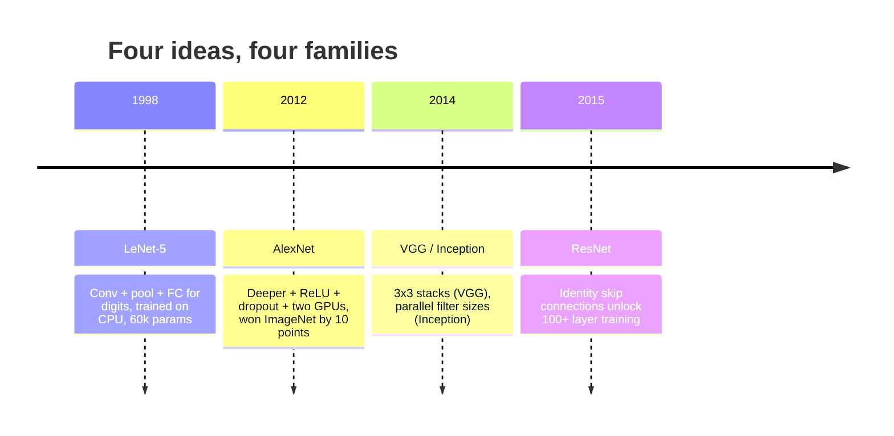
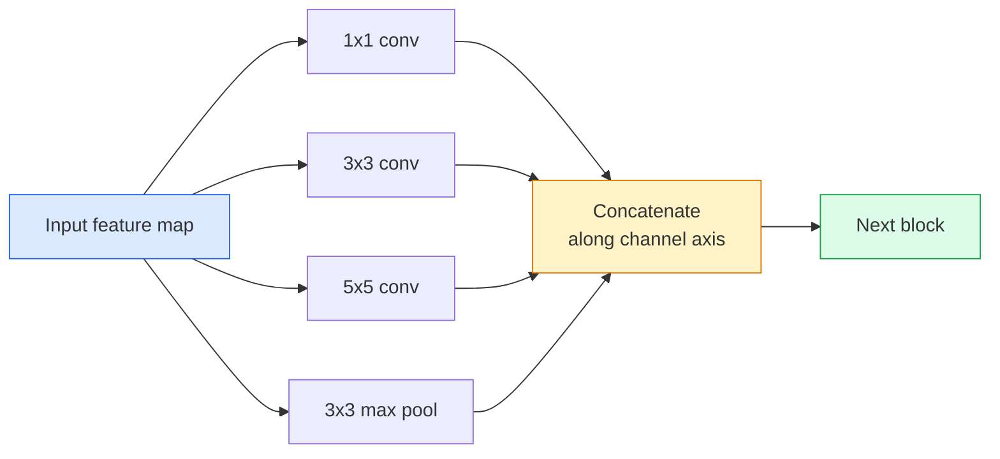
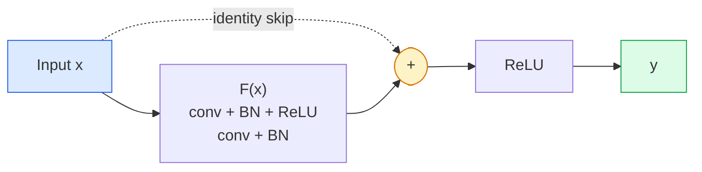

# CNN：从 LeNet 到 ResNet

> 过去三十年的主流 CNN 都是 conv、nonlinearity、downsample 配方，再加一个关键新想法。

**类型：** Vision  
**语言：** Python  
**前置知识：** Phase 0-3  
**时间：** 约 60-90 分钟

## 学习目标

- LeNet、AlexNet、VGG、Inception、ResNet 都围绕卷积特征层逐步演化。
- pooling 和 strided convolution 用于下采样空间尺寸。
- batch normalization 和 residual connections 让深层网络更容易训练。
- backbone 选择要匹配数据规模、延迟预算和部署环境。
- ResNet 的核心是让网络学习 residual，而不是完整映射。

## 问题

本课是 Phase 4 计算机视觉的一部分。目标是把图像、视频和三维场景都看成可以被模型处理的张量、序列或几何结构，并理解每个视觉系统从输入、预处理、模型、后处理到评估的完整链路。

学习时请始终追踪四件事：输入 shape 是什么，空间信息如何变化，模型输出如何解释，指标是否真的对应任务目标。

## 核心概念

1. LeNet、AlexNet、VGG、Inception、ResNet 都围绕卷积特征层逐步演化。
2. pooling 和 strided convolution 用于下采样空间尺寸。
3. batch normalization 和 residual connections 让深层网络更容易训练。
4. backbone 选择要匹配数据规模、延迟预算和部署环境。
5. ResNet 的核心是让网络学习 residual，而不是完整映射。

## 动手构建

按照本课 `code/` 目录运行示例。先用小图像、小 batch 或小 feature map 验证 shape，再扩展到真实数据。视觉模型的很多错误不是算法错，而是通道顺序、归一化、坐标系、mask 对齐、box 格式或后处理阈值错。

建议流程：

1. 打印输入 image/tensor 的 shape、dtype、value range 和 channel order。
2. 跟踪每个 stage 的空间尺寸变化。
3. 可视化中间结果，例如 feature map、box、mask、heatmap、depth 或 retrieval neighbors。
4. 使用任务对应指标评估，不只看 loss。
5. 做错误样本分析，确认失败来自数据、模型、后处理还是指标。

## 关键代码与公式片段

以下片段保留自英文原文，便于直接复制运行或对照数学符号。



```text
input (1, 32, 32)
  conv 5x5 -> (6, 28, 28)
  avg pool 2x2 -> (6, 14, 14)
  conv 5x5 -> (16, 10, 10)
  avg pool 2x2 -> (16, 5, 5)
  flatten -> 400
  dense -> 120
  dense -> 84
  dense -> 10
```

```text
stack:   conv 3x3 -> conv 3x3 -> pool 2x2
repeat:  16 or 19 conv layers
```



```text
Plain deep network:
  y = f_L( f_{L-1}( ... f_1(x) ... ) )

Gradient wrt early layer:
  dL/dW_1 = dL/dy * df_L/df_{L-1} * ... * df_2/df_1 * df_1/dW_1

Each multiplicative term has magnitude roughly (weight magnitude) * (activation gain).
Stack 100 of them with gains < 1 and the gradient is effectively zero.
```

```text
standard block:   y = F(x)
residual block:   y = F(x) + x
```



```python
import torch
import torch.nn as nn
import torch.nn.functional as F

class LeNet5(nn.Module):
    def __init__(self, num_classes=10):
        super().__init__()
        self.conv1 = nn.Conv2d(1, 6, kernel_size=5)
        self.conv2 = nn.Conv2d(6, 16, kernel_size=5)
        self.pool = nn.AvgPool2d(2)
        self.fc1 = nn.Linear(16 * 5 * 5, 120)
        self.fc2 = nn.Linear(120, 84)
        self.fc3 = nn.Linear(84, num_classes)

    def forward(self, x):
        x = self.pool(torch.tanh(self.conv1(x)))
        x = self.pool(torch.tanh(self.conv2(x)))
        x = torch.flatten(x, 1)
        x = torch.tanh(self.fc1(x))
        x = torch.tanh(self.fc2(x))
        return self.fc3(x)

net = LeNet5()
x = torch.randn(1, 1, 32, 32)
print(f"output: {net(x).shape}")
print(f"params: {sum(p.numel() for p in net.parameters()):,}")
```

```python
class VGGBlock(nn.Module):
    def __init__(self, in_c, out_c):
        super().__init__()
        self.conv1 = nn.Conv2d(in_c, out_c, kernel_size=3, padding=1)
        self.bn1 = nn.BatchNorm2d(out_c)
        self.conv2 = nn.Conv2d(out_c, out_c, kernel_size=3, padding=1)
        self.bn2 = nn.BatchNorm2d(out_c)
        self.pool = nn.MaxPool2d(2)

    def forward(self, x):
        x = F.relu(self.bn1(self.conv1(x)))
        x = F.relu(self.bn2(self.conv2(x)))
        return self.pool(x)

class MiniVGG(nn.Module):
    def __init__(self, num_classes=10):
        super().__init__()
        self.stack = nn.Sequential(
            VGGBlock(3, 32),
            VGGBlock(32, 64),
            VGGBlock(64, 128),
        )
        self.head = nn.Sequential(
            nn.AdaptiveAvgPool2d(1),
            nn.Flatten(),
            nn.Linear(128, num_classes),
        )

    def forward(self, x):
        return self.head(self.stack(x))

net = MiniVGG()
x = torch.randn(1, 3, 32, 32)
print(f"output: {net(x).shape}")
print(f"params: {sum(p.numel() for p in net.parameters()):,}")
```

```python
class BasicBlock(nn.Module):
    def __init__(self, in_c, out_c, stride=1):
        super().__init__()
        self.conv1 = nn.Conv2d(in_c, out_c, kernel_size=3, stride=stride, padding=1, bias=False)
        self.bn1 = nn.BatchNorm2d(out_c)
        self.conv2 = nn.Conv2d(out_c, out_c, kernel_size=3, stride=1, padding=1, bias=False)
        self.bn2 = nn.BatchNorm2d(out_c)
        if stride != 1 or in_c != out_c:
            self.shortcut = nn.Sequential(
                nn.Conv2d(in_c, out_c, kernel_size=1, stride=stride, bias=False),
                nn.BatchNorm2d(out_c),
            )
        else:
            self.shortcut = nn.Identity()

    def forward(self, x):
        out = F.relu(self.bn1(self.conv1(x)))
        out = self.bn2(self.conv2(out))
        out = out + self.shortcut(x)
        return F.relu(out)
```

> 英文原文还包含 4 个代码/公式块；中文正文保留关键片段，完整实现见本课 `code/` 目录。


## 使用它

完成本课后，你应该能把相关视觉算法放进真实 pipeline，并用 shape、可视化和指标定位问题。对于生产系统，还要同时考虑 latency、memory、数据漂移、标注质量和后处理稳定性。

## 练习

1. 用一张小图或一个小 tensor 复现本课核心运算。
2. 打印并解释每个中间结果的 shape。
3. 可视化至少一个模型输出或中间表示。
4. 完成 `quiz.zh-CN.json` 中的测验，并回到英文原文核对术语。

## 关键术语

| 术语 | 中文理解 | 视觉任务中的作用 |
|------|----------|------------------|
| pixel | 像素 | 图像的基本采样单位 |
| channel | 通道 | RGB、mask、depth 或 feature map 的维度 |
| feature map | 特征图 | CNN/ViT 中间空间表示 |
| annotation | 标注 | 类别、box、mask、keypoint 或 depth ground truth |
| postprocessing | 后处理 | NMS、threshold、decode、resize、tracking 等输出整理步骤 |
| metric | 指标 | 衡量分类、检测、分割、检索或生成质量 |
