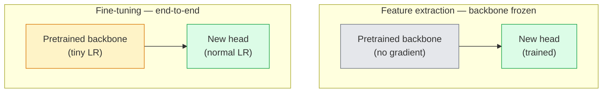

# 迁移学习与微调

> 别人已经花了大量 GPU 时间教网络识别边缘、纹理和部件。先借用这些特征。

**类型：** Vision  
**语言：** Python  
**前置知识：** Phase 0-3  
**时间：** 约 60-90 分钟

## 学习目标

- 迁移学习复用预训练模型已经学到的视觉特征。
- freeze backbone 可以减少训练成本和过拟合风险。
- fine-tuning 需要小学习率和谨慎的 layer 解冻策略。
- domain shift 决定是否需要更深层微调。
- LoRA、linear probe 和 full fine-tune 适合不同数据规模。

## 问题

本课是 Phase 4 计算机视觉的一部分。目标是把图像、视频和三维场景都看成可以被模型处理的张量、序列或几何结构，并理解每个视觉系统从输入、预处理、模型、后处理到评估的完整链路。

学习时请始终追踪四件事：输入 shape 是什么，空间信息如何变化，模型输出如何解释，指标是否真的对应任务目标。

## 核心概念

1. 迁移学习复用预训练模型已经学到的视觉特征。
2. freeze backbone 可以减少训练成本和过拟合风险。
3. fine-tuning 需要小学习率和谨慎的 layer 解冻策略。
4. domain shift 决定是否需要更深层微调。
5. LoRA、linear probe 和 full fine-tune 适合不同数据规模。

## 动手构建

按照本课 `code/` 目录运行示例。先用小图像、小 batch 或小 feature map 验证 shape，再扩展到真实数据。视觉模型的很多错误不是算法错，而是通道顺序、归一化、坐标系、mask 对齐、box 格式或后处理阈值错。

建议流程：

1. 打印输入 image/tensor 的 shape、dtype、value range 和 channel order。
2. 跟踪每个 stage 的空间尺寸变化。
3. 可视化中间结果，例如 feature map、box、mask、heatmap、depth 或 retrieval neighbors。
4. 使用任务对应指标评估，不只看 loss。
5. 做错误样本分析，确认失败来自数据、模型、后处理还是指标。

## 关键代码与公式片段

以下片段保留自英文原文，便于直接复制运行或对照数学符号。



```text
Typical recipe:

  stage 0 (stem + first group): lr = base_lr / 100    (mostly fixed)
  stage 1:                       lr = base_lr / 10
  stage 2:                       lr = base_lr / 3
  stage 3 (last backbone group): lr = base_lr
  head:                          lr = base_lr  (or slightly higher)
```

```text
backbone.fc = nn.Linear(backbone.fc.in_features, num_classes)          # ResNet
backbone.classifier[1] = nn.Linear(..., num_classes)                    # EfficientNet, MobileNet
backbone.heads.head = nn.Linear(..., num_classes)                       # torchvision ViT
```

```text
lr_layer_k = base_lr * decay^(L - k)
```

```python
import torch
import torch.nn as nn
from torchvision.models import resnet18, ResNet18_Weights

backbone = resnet18(weights=ResNet18_Weights.IMAGENET1K_V1)
print(backbone)
print()
print("classifier head:", backbone.fc)
print("feature dim:", backbone.fc.in_features)
```

```python
def make_feature_extractor(num_classes=10):
    model = resnet18(weights=ResNet18_Weights.IMAGENET1K_V1)
    for p in model.parameters():
        p.requires_grad = False
    model.fc = nn.Linear(model.fc.in_features, num_classes)
    return model

model = make_feature_extractor(num_classes=10)
trainable = sum(p.numel() for p in model.parameters() if p.requires_grad)
frozen = sum(p.numel() for p in model.parameters() if not p.requires_grad)
print(f"trainable: {trainable:>10,}")
print(f"frozen:    {frozen:>10,}")
```

```python
def discriminative_param_groups(model, base_lr=1e-3, decay=0.3):
    stages = [
        ["conv1", "bn1"],
        ["layer1"],
        ["layer2"],
        ["layer3"],
        ["layer4"],
        ["fc"],
    ]
    groups = []
    for i, names in enumerate(stages):
        lr = base_lr * (decay ** (len(stages) - 1 - i))
        params = [p for n, p in model.named_parameters()
                  if any(n.startswith(k) for k in names)]
        if params:
            groups.append({"params": params, "lr": lr, "name": "_".join(names)})
    return groups

model = resnet18(weights=ResNet18_Weights.IMAGENET1K_V1)
model.fc = nn.Linear(model.fc.in_features, 10)
for p in model.parameters():
    p.requires_grad = True

groups = discriminative_param_groups(model)
for g in groups:
    print(f"{g['name']:>10s}  lr={g['lr']:.2e}  params={sum(p.numel() for p in g['params']):>8,}")
```

```python
def freeze_bn_stats(model):
    for m in model.modules():
        if isinstance(m, (nn.BatchNorm1d, nn.BatchNorm2d, nn.BatchNorm3d)):
            m.eval()
            for p in m.parameters():
                p.requires_grad = False
    return model
```

```python
from torch.optim import SGD
from torch.utils.data import DataLoader
from torch.optim.lr_scheduler import CosineAnnealingLR
import torch.nn.functional as F

def fine_tune(model, train_loader, val_loader, device, epochs=5, base_lr=1e-3, freeze_bn=False):
    model = model.to(device)
    groups = discriminative_param_groups(model, base_lr=base_lr)
    optimizer = SGD(groups, momentum=0.9, weight_decay=1e-4, nesterov=True)
    scheduler = CosineAnnealingLR(optimizer, T_max=epochs)

    for epoch in range(epochs):
        model.train()
        if freeze_bn:
            freeze_bn_stats(model)
        tr_loss, tr_correct, tr_total = 0.0, 0, 0
        for x, y in train_loader:
            x, y = x.to(device), y.to(device)
            logits = model(x)
            loss = F.cross_entropy(logits, y, label_smoothing=0.1)
            optimizer.zero_grad()
            loss.backward()
            optimizer.step()
            tr_loss += loss.item() * x.size(0)
            tr_total += x.size(0)
            tr_correct += (logits.argmax(-1) == y).sum().item()
        scheduler.step()

        model.eval()
        va_total, va_correct = 0, 0
        with torch.no_grad():
            for x, y in val_loader:
                x, y = x.to(device), y.to(device)
                pred = model(x).argmax(-1)
                va_total += x.size(0)
                va_correct += (pred == y).sum().item()
        print(f"epoch {epoch}  train {tr_loss/tr_total:.3f}/{tr_correct/tr_total:.3f}  "
              f"val {va_correct/va_total:.3f}")
    return model
```

```python
def progressive_unfreeze_schedule(model):
    stages = ["layer4", "layer3", "layer2", "layer1"]
    yielded = set()

    def start():
        for p in model.parameters():
            p.requires_grad = False
        for p in model.fc.parameters():
            p.requires_grad = True

    def unfreeze(epoch):
        if epoch < len(stages):
            name = stages[epoch]
            yielded.add(name)
            for n, p in model.named_parameters():
                if n.startswith(name):
                    p.requires_grad = True
            return name
        return None

    return start, unfreeze
```

> 英文原文还包含 1 个代码/公式块；中文正文保留关键片段，完整实现见本课 `code/` 目录。


## 使用它

完成本课后，你应该能把相关视觉算法放进真实 pipeline，并用 shape、可视化和指标定位问题。对于生产系统，还要同时考虑 latency、memory、数据漂移、标注质量和后处理稳定性。

## 练习

1. 用一张小图或一个小 tensor 复现本课核心运算。
2. 打印并解释每个中间结果的 shape。
3. 可视化至少一个模型输出或中间表示。
4. 完成 `quiz.zh-CN.json` 中的测验，并回到英文原文核对术语。

## 关键术语

| 术语 | 中文理解 | 视觉任务中的作用 |
|------|----------|------------------|
| pixel | 像素 | 图像的基本采样单位 |
| channel | 通道 | RGB、mask、depth 或 feature map 的维度 |
| feature map | 特征图 | CNN/ViT 中间空间表示 |
| annotation | 标注 | 类别、box、mask、keypoint 或 depth ground truth |
| postprocessing | 后处理 | NMS、threshold、decode、resize、tracking 等输出整理步骤 |
| metric | 指标 | 衡量分类、检测、分割、检索或生成质量 |
