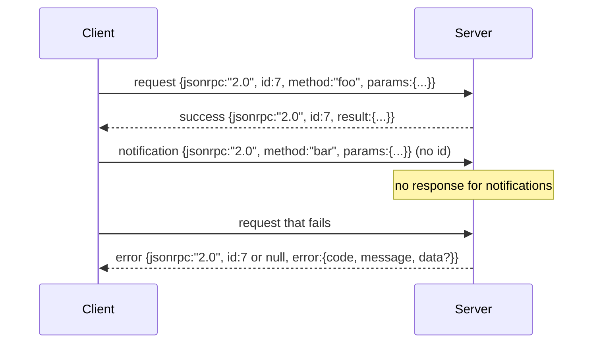

# JSON-RPC 2.0 Over Newline-Delimited Stdio

> The transport between a model client与a tool server is JSON-RPC over stdio. Hand-rolling it once teaches you what every framing layer is paying for.

**类型：** 构建
**语言：** Python
**前置知识：** Phase 13 lessons 01-07, Phase 14 lesson 01
**时间：** 约 90 minutes

## 学习目标
- Speak JSON-RPC 2.0 framed as newline-delimited JSON over stdin与stdout.
- Map the five standard error codes (-32700, -32600, -32601, -32602, -32603)与surface them with the right semantics.
- Distinguish requests, responses, notifications,与batches without inventing new envelope keys.
- Handle one parse error per line without poisoning the rest of the stream.
- Build a self-terminating demo using io.BytesIO so the lesson runs without spawning a child process.

## 中文导读

本课是 Phase 19「毕业项目」的第 22 课。学习时建议先读这一份中文导读，确认本课要解决的问题、关键术语和可运行产物，再回到英文原文核对细节。

阅读时请重点关注三件事：概念为什么成立，代码如何验证这个概念，以及课程产物如何复用到真实工作流。遇到公式、命令、路径、API 名称或模型名时，保持英文原写法，避免和源码脱节。

## 学习建议

1. 先通读“学习目标”和“中文导读”，建立本课的任务边界。
2. 对照英文原文阅读关键段落，代码、命令和数学符号保持原样。
3. 运行 `code/` 里的示例，并用 `quiz.zh-CN.json` 检查自己是否理解。
4. 如果本课包含 `outputs/*.zh-CN.md`，把它当作可复用的 prompt、skill 或操作清单。

## 英文原文

下面保留英文原文，方便和上游同步，也方便你在需要时查看精确术语、代码片段和引用来源。

# JSON-RPC 2.0 Over Newline-Delimited Stdio

> The transport between a model client and a tool server is JSON-RPC over stdio. Hand-rolling it once teaches you what every framing layer is paying for.

**Type:** Build
**Languages:** Python
**Prerequisites:** Phase 13 lessons 01-07, Phase 14 lesson 01
**Time:** ~90 minutes

## Learning Objectives
- Speak JSON-RPC 2.0 framed as newline-delimited JSON over stdin and stdout.
- Map the five standard error codes (-32700, -32600, -32601, -32602, -32603) and surface them with the right semantics.
- Distinguish requests, responses, notifications, and batches without inventing new envelope keys.
- Handle one parse error per line without poisoning the rest of the stream.
- Build a self-terminating demo using io.BytesIO so the lesson runs without spawning a child process.

## Why JSON-RPC stays the lingua franca

A coding agent in 2026 talks to maybe twelve tool servers in a single session. Each server is a separate process or a remote endpoint. The wire format has been the same since 2013. JSON-RPC 2.0 is two-page spec. It survives because the alternatives (gRPC, HTTP per call, custom binary) all impose a tradeoff JSON-RPC does not: they pick either streaming or batching or transport-coupling. JSON-RPC is symmetric across stdio, sockets, websockets, and HTTP, and a client can drive a server it has never seen if both honor the spec.

This lesson builds the stdio variant. Newline-delimited JSON. Each request is one line. Each response is one line. The transport boundary is `\n`.

## The wire shape

Four envelope shapes exist. Two are spoken by the client. Two are spoken by the server.



A notification has no `id`. The server must not respond to it. If a server returns a response to a notification, the client has no way to attach it to a call site. That single rule keeps the framing math simple.

A batch is a JSON array of requests or notifications. The server replies with an array of responses, in any order, one per non-notification entry. If every entry in the batch is a notification, the server sends nothing back.

## The five error codes

```text
-32700  Parse error      JSON could not be parsed
-32600  Invalid Request  Envelope shape is wrong
-32601  Method not found
-32602  Invalid params
-32603  Internal error
```

The codes between -32000 and -32099 are reserved for server-defined errors. Everything else is application-defined. The lesson sticks to the five. If your handler raises, the transport wraps it as -32603 with the exception class name in `data.exception`.

A parse error has a special rule. The `id` in the response is `null`, because the request never parsed enough to extract an id.

## Newline framing and the BytesIO demo

The transport reads one line at a time. A line is bytes up to and including `\n`. If a line cannot be parsed, the transport writes a -32700 response with `id: null` and continues. The stream is not poisoned. The next line gets parsed fresh.

For the lesson we wrap an `io.BytesIO` pair as stdin and stdout. The server reads requests until EOF, writes responses for each, and returns. The client reads the responses back. No process spawn. No timeouts. The transport behavior is identical to a real subprocess pipe because Python's `io` interface presents the same `.readline()` and `.write()` contract.

## Method dispatch

The transport does not know which methods exist. It hands off to a callable `handler(method, params)` that the harness supplies. The handler returns a result or raises. Three exception classes surface specific codes.

```text
MethodNotFound -> -32601
InvalidParams  -> -32602
Anything else  -> -32603 with exception name in data
```

The transport never sees a tool registry. The registry sits behind the handler. This is the layering we want. The transport speaks JSON-RPC. The registry speaks tool shapes. The dispatcher (lesson twenty-three) stitches them together.

## Stream behavior on errors

```text
client writes              server reads             server writes
---------------            -----------              -------------
{...valid request...}      parses ok                {...response, id matches...}
{...broken json...         parse fails              {id:null, error: -32700}
{...valid request...}      parses ok                {...response, id matches...}
{...missing method...}     invalid envelope         {id:X, error: -32600}
```

A broken JSON line does not stop the loop. A missing `method` field does not stop the loop. A handler exception does not stop the loop. The transport keeps reading until EOF.

## Notifications and asymmetric flows

A notification is fire-and-forget. The harness uses notifications for progress events, cancellation signals, and log lines. Notifications are how a long-running tool can stream status updates without round-tripping for each one.

The lesson implements one outbound notification helper, `write_notification`. The server uses it to emit progress while a request is in flight. The demo shows the pattern: a request comes in, the handler emits two progress notifications, then writes the final response.

## How to read the code

`code/main.py` defines `StdioTransport`, the parse helper (`parse_request`), the three write helpers (`write_response`, `write_error`, `write_notification`), and the dispatch loop `serve`. The error code constants live at module scope.

`code/tests/test_transport.py` covers the five error codes, notifications (no response written), batches (array in, array out, notifications skipped), broken JSON (parse error then continue), and the asymmetric flow where a handler writes a notification mid-call.

## Going further

This transport is enough for the lessons that follow. Production transports add three things. A correlation id field that survives forwarding (your `id` is already this, but in a mesh you need an outer trace id too). A cancellation channel (a notification like `$/cancelRequest` with the id of the in-flight call). And a content-type negotiation handshake so the same socket can speak JSON-RPC and Streamable HTTP. None of those change the wire. They add metadata.
