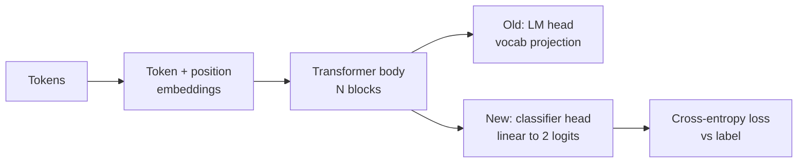
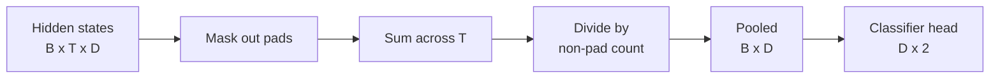
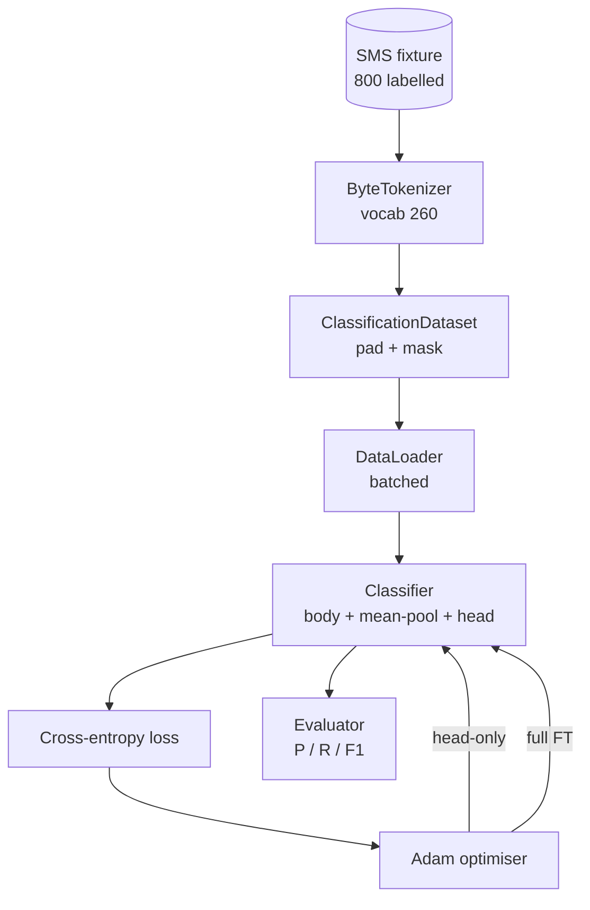

# 毕业项目 Lesson 38：分类器 微调 by Head Swap

> Track B's first capstone. A pretrained language model is a stack of self-attention blocks ending in a token-prediction head. When you want spam vs ham, the head is wrong but the body is mostly right. This lesson rips the head off, glues a two-class linear layer onto the pooled representation,与trains the classifier two different ways：final-layer only,与full fine-tuning. The eval is precision, recall,与F1 on a held-out split. You learn what each strategy buys you与what it costs.

**类型：** 构建
**语言：** Python (torch, numpy)
**前置知识：** Phase 19 lessons 30-37 (NLP LLM track：tokenizer, embedding table, attention block, transformer body, pre-training loop, checkpointing, generation, perplexity)
**时间：** 约 90 minutes

## 学习目标
- Replace a language-model head with a classification head without re-initialising the body.
- Implement two training regimes：frozen body (head-only)与full fine-tuning, sharing one training loop.
- Build a tokeniser-aware data pipeline that pads, masks padding,与pools attention output.
- Compute precision, recall, F1,与a confusion matrix from raw logits.
- Reason about the trade-off between parameter count, training time,与head-room.

## 中文导读

本课是 Phase 19「毕业项目」的第 38 课。学习时建议先读这一份中文导读，确认本课要解决的问题、关键术语和可运行产物，再回到英文原文核对细节。

阅读时请重点关注三件事：概念为什么成立，代码如何验证这个概念，以及课程产物如何复用到真实工作流。遇到公式、命令、路径、API 名称或模型名时，保持英文原写法，避免和源码脱节。

## 学习建议

1. 先通读“学习目标”和“中文导读”，建立本课的任务边界。
2. 对照英文原文阅读关键段落，代码、命令和数学符号保持原样。
3. 运行 `code/` 里的示例，并用 `quiz.zh-CN.json` 检查自己是否理解。
4. 如果本课包含 `outputs/*.zh-CN.md`，把它当作可复用的 prompt、skill 或操作清单。

## 英文原文

下面保留英文原文，方便和上游同步，也方便你在需要时查看精确术语、代码片段和引用来源。

# Capstone Lesson 38: Classifier Fine-Tuning by Head Swap

> Track B's first capstone. A pretrained language model is a stack of self-attention blocks ending in a token-prediction head. When you want spam vs ham, the head is wrong but the body is mostly right. This lesson rips the head off, glues a two-class linear layer onto the pooled representation, and trains the classifier two different ways: final-layer only, and full fine-tuning. The eval is precision, recall, and F1 on a held-out split. You learn what each strategy buys you and what it costs.

**Type:** Build
**Languages:** Python (torch, numpy)
**Prerequisites:** Phase 19 lessons 30-37 (NLP LLM track: tokenizer, embedding table, attention block, transformer body, pre-training loop, checkpointing, generation, perplexity)
**Time:** ~90 minutes

## Learning Objectives

- Replace a language-model head with a classification head without re-initialising the body.
- Implement two training regimes: frozen body (head-only) and full fine-tuning, sharing one training loop.
- Build a tokeniser-aware data pipeline that pads, masks padding, and pools attention output.
- Compute precision, recall, F1, and a confusion matrix from raw logits.
- Reason about the trade-off between parameter count, training time, and head-room.

## The Problem

You pre-trained a small transformer on a generic corpus. The output head projects the last hidden state to a 1000-token vocabulary. You now have 800 SMS messages labelled spam or ham and you want a binary classifier. Three options exist.

The wrong option is to train a fresh classifier from scratch on 800 examples. The body of the pretrained model already encodes useful structure: word identity, position, simple co-occurrence. Throwing it away wastes the compute that built it.

The two right options are head swap with the body frozen, and head swap with the body trainable. Head-only training is fast, almost free in memory, and rarely overfits with this little data. Full fine-tuning is slower, can overfit on small data, but reaches higher accuracy when the downstream domain drifts from the pretraining corpus.

This lesson builds both, so you can compare them on the same fixture.

## The Concept

The model is a function `f_theta(tokens) -> hidden_states`. The head is a function `g_phi(hidden) -> logits`. Swapping heads means keeping `theta` and replacing `g_phi`. The body's parameters are the expensive part. The head is a single linear layer.

Two trainable parameter sets matter:

- `theta` (the body): tens of thousands of weights per attention block.
- `phi` (the head): `hidden_dim * num_classes` weights plus a bias.

In head-only training you compute gradients against `phi` and zero them against `theta`. PyTorch lets you do this by setting `requires_grad=False` on body parameters. The optimiser then sees only the head and the body stays frozen.

In full fine-tuning you let gradients flow back through the whole stack. The body's weights drift to fit the classification objective. The risk is catastrophic forgetting on small data: the body's pretraining gets washed out by overfitting noise.

## The Pooling Question

A classifier needs one vector per sequence, not one vector per token. Three common choices:

- **Mean pool**: average the hidden states across the sequence, weighted by the attention mask.
- **CLS pool**: prepend a special token and use only its output. This is what BERT does.
- **Last-token pool**: use the last non-padding token. This is what GPT-class classifiers do.

This lesson uses mean pooling with explicit attention-mask weighting. It is the simplest, gives a stable signal across sequence lengths, and does not require pretraining a CLS token.

## The Data

Eight hundred SMS messages, balanced 400 spam and 400 ham, are generated deterministically in `code/main.py`. The generator uses a fixed seed, picks templates and substitutes slot fillers, and emits messages between 5 and 25 tokens long. Real datasets have noise this fixture does not. The point of the fixture is reproducibility.

The data splits 80/20: 640 train, 160 test. Splits are stratified so the test set keeps the 50/50 balance. A held-out set with a known balance lets precision and recall be read as honest numbers.

## The Metrics

Binary classification with class 1 as the positive class (spam). Counts are:

- `TP`: predicted spam, was spam.
- `FP`: predicted spam, was ham.
- `FN`: predicted ham, was spam.
- `TN`: predicted ham, was ham.

The three headline metrics:

- `precision = TP / (TP + FP)`. Of the messages flagged spam, what fraction actually are?
- `recall = TP / (TP + FN)`. Of the actual spam, what fraction did the model flag?
- `F1 = 2 * P * R / (P + R)`. The harmonic mean of the two.

A confusion matrix prints the four counts as a 2x2 grid. The demo writes this to stdout for both training regimes.

## Architecture

The body is a deliberately tiny transformer: vocab 260, hidden 64, 4 heads, 2 blocks, max sequence 32. It is small enough to train both regimes to convergence inside ninety seconds on CPU. It is not pretrained in the lesson; instead, the `pretrain_quick` helper does five epochs of LM training on the same fixture's text to give the body a non-trivial starting point. This keeps the lesson self-contained.

## What you will build

The implementation is one `main.py` plus one test module (`code/tests/test_main.py`).

1. `ByteTokenizer`: maps bytes to ids, reserves a pad id.
2. `Block`: a transformer block with multi-head attention and a feed-forward layer. Pre-norm.
3. `LMBody`: token + position embeddings plus a stack of blocks. Returns hidden states.
4. `MeanPool`: mask-weighted average over the sequence axis.
5. `Classifier`: body, pool, linear head. The body is the same instance across regimes.
6. `freeze_body` and `unfreeze_body`: toggle `requires_grad` on body parameters.
7. `train_classifier`: one shared loop. Accepts the model and an optimiser configured for whichever parameter group is trainable.
8. `evaluate`: runs the test set and returns `Metrics(precision, recall, f1, confusion)`.
9. `run_demo`: pretrains the body briefly, then trains and evaluates head-only, then full, prints both reports, and exits zero.

## Why the comparison matters

The head-only regime usually trains faster and underfits more gracefully. On this fixture you typically see precision near 0.9 and recall near 0.85 after twenty epochs of head-only training. Full fine-tuning takes about three times longer and lands within a couple of points either way, depending on the random seed.

The lesson does not pick a winner. It teaches you to read the numbers and the cost. On 800 examples and a tiny body, head-only is the right call. On 80,000 examples and a bigger body, full fine-tuning starts to pay off. The contract you take from this lesson is the API: the same `train_classifier` function handles both, and the toggle is one call.

## Stretch goals

- Add a third regime that unfreezes only the last block. This is sometimes called partial fine-tuning. It costs less than full FT and learns more than head-only.
- Add a learning-rate scheduler. A cosine schedule on the head plus a smaller constant rate on the body is a common production setup.
- Replace mean pooling with a learned attention pool: a small attention layer with one learned query. This often beats mean pool on longer sequences.

The implementation gives you the hooks. The tests pin the contract. The numbers are yours to push.
