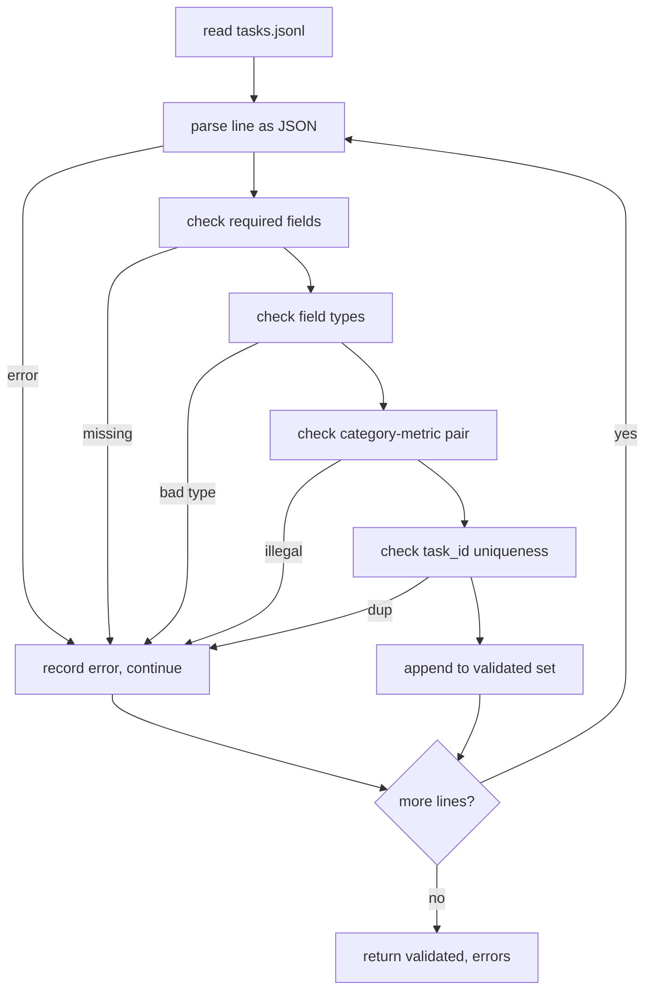

# Task Spec Format

> An eval harness is only as good as the contract its tasks honour. Freeze the JSONL shape与the metric vocabulary before you write a single scoring function.

**类型：** 构建
**语言：** Python
**前置知识：** Phase 19 Track B foundations
**时间：** 约 90 min

## 学习目标
- 理解 Task Spec Format 在本阶段课程中的作用。
- 把核心概念映射到可运行代码、测验和课程产物。
- 保留英文术语、命令、路径和 API 名称，方便和原文对照。

## 中文导读

本课是 Phase 19「毕业项目」的第 70 课。学习时建议先读这一份中文导读，确认本课要解决的问题、关键术语和可运行产物，再回到英文原文核对细节。

阅读时请重点关注三件事：概念为什么成立，代码如何验证这个概念，以及课程产物如何复用到真实工作流。遇到公式、命令、路径、API 名称或模型名时，保持英文原写法，避免和源码脱节。

## 学习建议

1. 先通读“学习目标”和“中文导读”，建立本课的任务边界。
2. 对照英文原文阅读关键段落，代码、命令和数学符号保持原样。
3. 运行 `code/` 里的示例，并用 `quiz.zh-CN.json` 检查自己是否理解。
4. 如果本课包含 `outputs/*.zh-CN.md`，把它当作可复用的 prompt、skill 或操作清单。

## 英文原文

下面保留英文原文，方便和上游同步，也方便你在需要时查看精确术语、代码片段和引用来源。

# Task Spec Format

> An eval harness is only as good as the contract its tasks honour. Freeze the JSONL shape and the metric vocabulary before you write a single scoring function.

**Type:** Build
**Languages:** Python
**Prerequisites:** Phase 19 Track B foundations
**Time:** ~90 min

## Learning objectives

- Define a JSONL task record schema that covers arithmetic, multiple-choice, code execution, classification, and free-text summarisation in one shape.
- Pin a closed vocabulary of metric names so downstream lessons (71-73) can dispatch on a single field.
- Specify few-shot examples and post-processing rules as part of the task, not the runner, so the same prompt produces the same target across models.
- Implement a strict validator that rejects malformed records before they reach the runner.
- Ship a 10-task fixture set that exercises every branch of the spec so the validator has something real to chew on.

## Why a frozen spec

A research codebase will accumulate eval scripts faster than it accumulates tests. Six months in, every notebook has its own JSON shape, every metric is reimplemented twice, and nothing can be compared across runs. The fix is boring. Pick a schema. Write a validator. Reject everything else. That is what this lesson does.

The shape borrows ideas from BIG-bench, HELM, and lm-eval style harnesses, but the field names are ours. Every field has a single owner. The runner reads the task. The metric reads the targets. The post-process step normalises the generation. No field is mutable mid-pipeline.

## The record shape

A task is a JSON object on a single line. The harness reads `tasks.jsonl` and validates each line independently. A bad line aborts that record, not the run.

```json
{
  "task_id": "arith_001",
  "category": "arithmetic",
  "prompt": "Compute the result. Question: 17 + 24\nAnswer:",
  "targets": ["41"],
  "metric_name": "exact_match",
  "few_shot_examples": [
    {"prompt": "Question: 2 + 2\nAnswer:", "completion": "4"}
  ],
  "post_process": "strip_whitespace",
  "metadata": {"difficulty": "easy"}
}
```

The required fields are `task_id`, `category`, `prompt`, `targets`, `metric_name`, `post_process`. `few_shot_examples` and `metadata` are optional. Unknown top-level fields fail validation.

## Field rules

`task_id` is a string with no whitespace. The validator enforces uniqueness across the file.

`category` is one of `arithmetic`, `mcq`, `code_exec`, `classification`, `summary`. The category constrains which metric and post-process pair is legal. A `code_exec` task must use `metric_name = code_exec` and a `mcq` task must use `metric_name = exact_match` against a single-letter target.

`prompt` is a non-empty string. The validator forbids trailing whitespace and rejects records that already contain a few-shot block in the prompt body. Few-shot rendering happens in the runner, not the author.

`targets` is a non-empty list of strings. For `exact_match`, any element matching counts. For `f1` and `rouge_l`, the highest-scoring target wins. For `mcq`, the list holds exactly one element.

`metric_name` is one of `exact_match`, `f1`, `bleu_4`, `rouge_l`, `accuracy`, `code_exec`. The vocabulary is closed. A new metric requires a new lesson and a new entry here.

`few_shot_examples` is a list of `{prompt, completion}` pairs. The validator caps the list at eight entries to keep prompts bounded.

`post_process` is one of `none`, `strip_whitespace`, `lower`, `extract_letter`, `extract_code_block`, `extract_first_line`. Each rule has a single deterministic behaviour. The validator forbids combining rules.

## Validator behaviour



The validator returns two lists: validated records and error records with the offending line, the violated rule, and the field at fault. The runner refuses to start if the error list is non-empty unless an explicit `--allow-bad-tasks` flag is set.

## Few-shot rendering

The runner concatenates few-shot examples in front of the prompt with a blank line separator. The same code path runs for every model, so the only source of variance is the model itself. Authors write examples once, not once per provider.

```python
def render(task):
    parts = []
    for ex in task.get("few_shot_examples", []):
        parts.append(ex["prompt"] + " " + ex["completion"])
    parts.append(task["prompt"])
    return "\n\n".join(parts)
```

## Post-process rules

The post-process step runs after generation, before the metric. It is deterministic and stateless.

- `none` returns the string unchanged.
- `strip_whitespace` strips leading and trailing whitespace.
- `lower` lowercases the string.
- `extract_letter` returns the first character that matches `[A-E]`, used for MCQ.
- `extract_code_block` returns the body of the first triple-backtick fenced block, used for code-exec.
- `extract_first_line` returns the first non-empty line, used for summary classification.

A task that needs a rule outside this list belongs in a new lesson.

## What this lesson does not do

It does not score. It does not call a model. It does not run code. Those come in lessons 71, 72, and 75. This lesson freezes the contract that all of them honour.

The 10-task fixture covers two arithmetic items, two MCQ items, two code-exec items, two classification items, and two summarisation items. The validator passes on all 10. A separate fixture (`tasks_bad.jsonl`) trips every rule and the validator returns exactly that many errors.

## How to read the code

`main.py` defines `TaskSpec`, `validate_task`, `validate_file`, and a CLI entry point. The fixture loader is `load_fixtures`. The render and post-process helpers live next to validation so the runner in lesson 75 imports a single module.

Read `main.py` top to bottom. Then read `code/tests/test_spec.py`. The tests pin every validation rule and every post-process behaviour. The demo at the bottom of `main.py` validates the bundled fixture and prints a summary.

## Going further

Real eval suites grow categories the way schemas grow columns. The sober move is to refuse to add a category without also adding a metric, a post-process rule, and at least one fixture task. Treat the spec like a database migration. Every change is reviewed, versioned, and accompanied by tests. The validator in this lesson is the gate.
