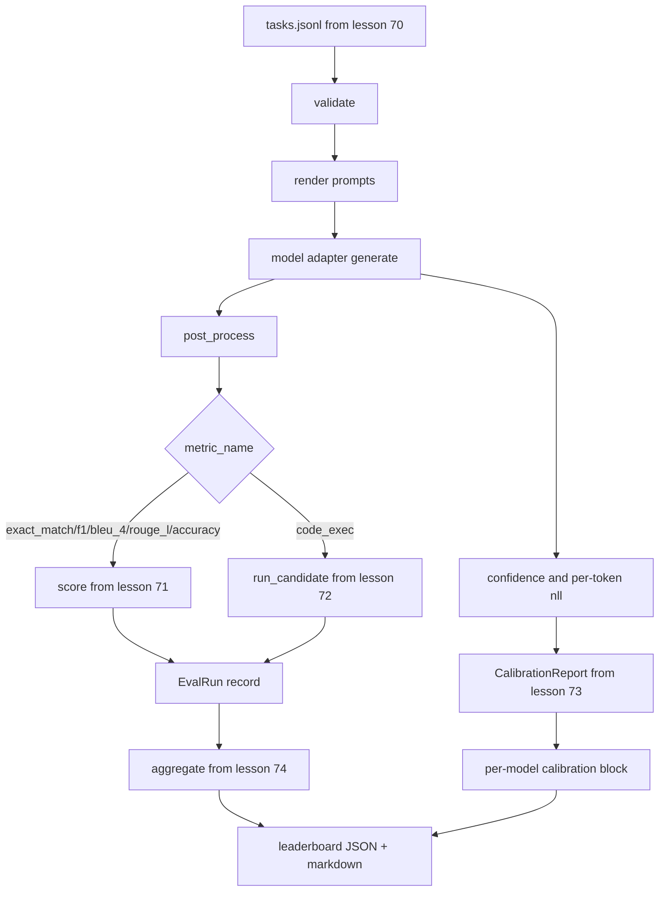

# End-to-End 评估 Runner

> Five lessons of plumbing, one lesson to glue them. The runner reads the task spec from lesson 70, calls a model through an adapter, scores with lessons 71与72, attaches the calibration report from lesson 73,与emits the leaderboard from lesson 74. Demo self-terminates.

**类型：** 构建
**语言：** Python
**前置知识：** Phase 19 Track B foundations, lessons 70 through 74
**时间：** 约 90 min

## 学习目标
- 理解 End-to-End 评估 Runner 在本阶段课程中的作用。
- 把核心概念映射到可运行代码、测验和课程产物。
- 保留英文术语、命令、路径和 API 名称，方便和原文对照。

## 中文导读

本课是 Phase 19「毕业项目」的第 75 课。学习时建议先读这一份中文导读，确认本课要解决的问题、关键术语和可运行产物，再回到英文原文核对细节。

阅读时请重点关注三件事：概念为什么成立，代码如何验证这个概念，以及课程产物如何复用到真实工作流。遇到公式、命令、路径、API 名称或模型名时，保持英文原写法，避免和源码脱节。

## 学习建议

1. 先通读“学习目标”和“中文导读”，建立本课的任务边界。
2. 对照英文原文阅读关键段落，代码、命令和数学符号保持原样。
3. 运行 `code/` 里的示例，并用 `quiz.zh-CN.json` 检查自己是否理解。
4. 如果本课包含 `outputs/*.zh-CN.md`，把它当作可复用的 prompt、skill 或操作清单。

## 英文原文

下面保留英文原文，方便和上游同步，也方便你在需要时查看精确术语、代码片段和引用来源。

# End-to-End Eval Runner

> Five lessons of plumbing, one lesson to glue them. The runner reads the task spec from lesson 70, calls a model through an adapter, scores with lessons 71 and 72, attaches the calibration report from lesson 73, and emits the leaderboard from lesson 74. Demo self-terminates.

**Type:** Build
**Languages:** Python
**Prerequisites:** Phase 19 Track B foundations, lessons 70 through 74
**Time:** ~90 min

## Learning objectives

- Define a `ModelAdapter` interface that any model (mock, local, API) can satisfy with a small method surface.
- Run the eval over a fixture JSONL file with parallel task execution across a worker pool.
- Compose the metric layer (exact_match, F1, BLEU-4, ROUGE-L, code_exec) with the calibration layer in one pass.
- Emit per-model `EvalRun` records and feed them straight into the leaderboard aggregator.
- Output both a JSON report and a markdown table; self-terminate with exit zero on a clean run, non-zero on validation or runtime failure.

## The pipeline



The runner is the integration point. Each lesson 70 through 74 owns one module that the runner composes. The runner does not duplicate any logic from those modules: it imports them.

## The adapter interface

The adapter is the seam between the runner and any model. The interface is intentionally small.

```python
class ModelAdapter:
    model_id: str

    def generate(self, prompt: str, task: TaskSpec) -> Generation: ...
```

`Generation` is a dataclass with:

- `text`: the model's free-form output
- `confidence`: a float in `[0, 1]` representing the model's self-reported probability for the answer
- `token_nll`: optional sum of negative log-likelihoods over the generated tokens
- `token_count`: optional number of generated tokens

Mock adapters in the runner provide three flavours: `RuleBasedAdapter` (deterministic, near-perfect), `NoisyAdapter` (overconfident, often wrong), and `BiasedAdapter` (good at one category, terrible at another). The demo runs all three over the lesson 70 fixture.

## Parallel execution

The runner uses `concurrent.futures.ThreadPoolExecutor` to run tasks in parallel per model. The worker count defaults to the smaller of eight and the task count. Threads are sufficient because the bottleneck for real model calls is network I/O. The code-exec path spawns its own subprocess inside the task and the executor only schedules the wait.

For deterministic tests, the runner exposes `run_eval(adapters, tasks, parallel=False)` so tests can pin the execution order.

## The single-pass scoring loop

For each task:

1. Render the prompt (few-shot prefix plus the prompt body).
2. Call the adapter and time the call.
3. Post-process the generation per the task's rule.
4. Dispatch to the metric layer.
5. Build an `EvalRun` record with the score and metric metadata.
6. Append the `(confidence, correct)` pair to the calibration buffer.

The `correct` signal is `score >= 1.0` for exact_match-style metrics (`exact_match`, `accuracy`, `code_exec`) and `score >= 0.5` for graded metrics. The threshold lives in `_correct_from_score` and the runner does not expose a public override.

## Aggregation

After every task has a result, the runner calls `aggregate` and `pairwise_diffs` from lesson 74 and `CalibrationReport.from_predictions` from lesson 73. The output is a single JSON envelope:

```json
{
  "leaderboard": [...],
  "pairwise": [...],
  "calibration": {
    "model_id_a": {"ece": 0.04, "brier": 0.10, "populated_bins": 8, ...},
    ...
  },
  "summary": {
    "tasks": 10,
    "models": 3,
    "wall_seconds": 1.2
  }
}
```

The runner also writes a markdown table to stdout so the user can paste the result into a PR review.

## Self-terminating demo

The demo runs three mock adapters over the ten fixture tasks from lesson 70. Wall time should sit under ten seconds. The exit code is zero on a clean run.

The clean-run criteria are:

- Every task validated under lesson 70.
- Every task scored under lessons 71 and 72.
- The calibration report aggregated under lesson 73 without errors.
- The leaderboard ranked the rule-based adapter strictly above the random adapter.

If any of those break, the runner exits non-zero with a structured error in the JSON envelope.

## What this lesson does not do

It does not call a real model. It does not implement an API key flow or rate-limit handling. It does not implement streaming or partial generation; the adapter returns one generation per call. It does not do retries or caching. Those concerns live at the adapter layer; the runner is metric-agnostic and provider-agnostic.

## How to read the code

`main.py` is the integration. It imports from the other five lesson modules through a small `_load_sibling` helper that resolves them by relative path. The dataclasses `Generation`, `EvalReport`, and `ModelAdapter` are defined locally. The mock adapters are at the bottom of the file.

Read `main.py` top to bottom. Skim the imports, then look at `run_eval`, then `_score_one`, then the adapters. The demo at the end is the entry point.

The tests in `code/tests/test_runner.py` pin the adapter interface, the single-pass loop, the parallel-vs-sequential equivalence, the calibration buffer, and the JSON envelope shape.

## Going further

This runner is the floor. A production eval system adds: a results cache keyed by `(task_id, model_id, model_version)`, a cost ledger that tracks dollars and tokens per run, a retry layer that backs off on rate limits, a sampling policy for pass-at-k tasks, and a streaming output format for long suites. Each of those is a single concern that wraps the runner without changing the metric or aggregation layers. That separation is the point of the contract.

Add an adapter for a real provider after you have the mocks working. Pick one with a free tier, write thirty lines of glue, watch the leaderboard light up. Then add the second provider and let the harness do the work.
